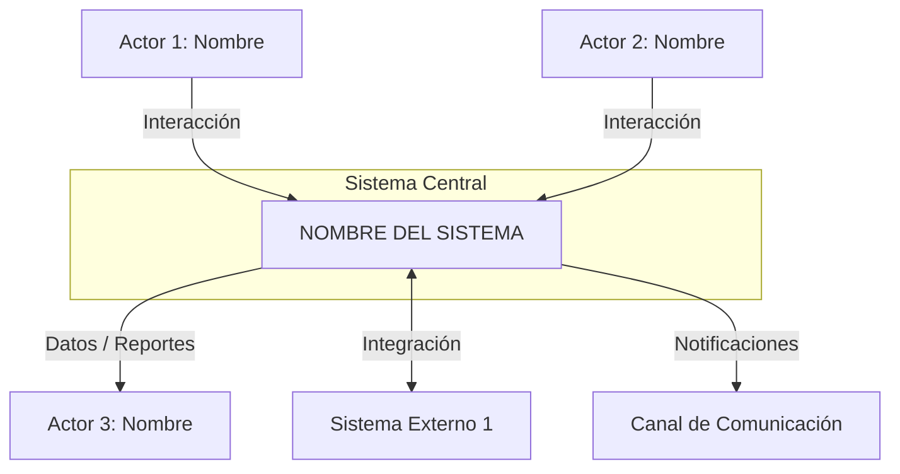
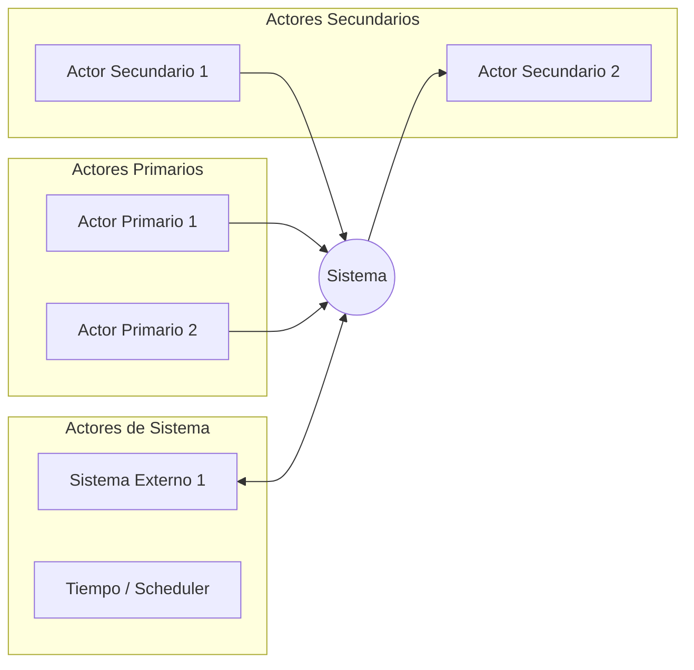
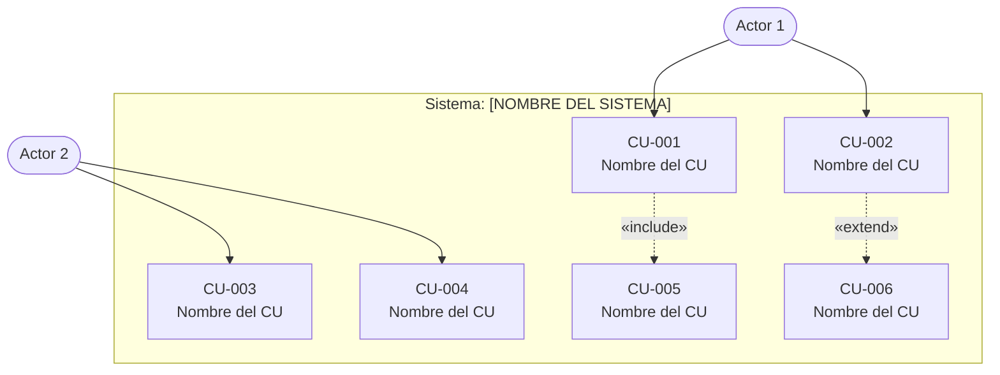
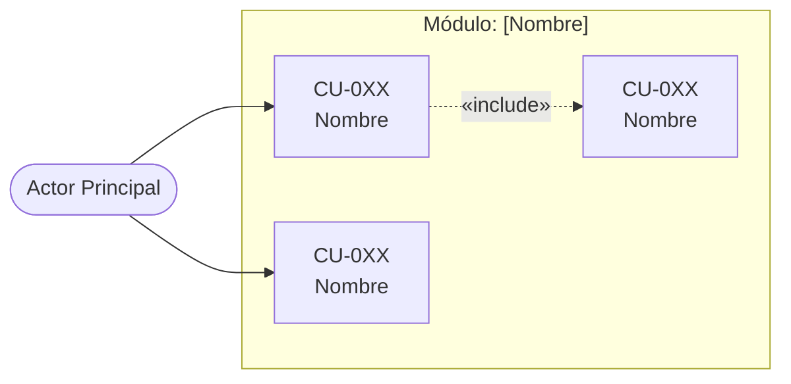

# AGEN_3 — PROMPT MAESTRO DE INGENIERÍA DE REQUISITOS

> **Fase**: 3 — Requisitos Funcionales, No Funcionales, Casos de Uso e Historias de Usuario
> **Depende de**: AGEN_1 (Fase 1 — Análisis de Problemas) + AGEN_2 (Fase 2 — Propuesta de Valor)
> **Estándares aplicados**: ISO/IEC/IEEE 29148:2018 · ISO/IEC 25010:2011 · UML 2.x · IEEE 830
> **Nivel**: Ingeniería de Sistemas — Documentación Técnica Profesional

---

# PROMPT MAESTRO

## ROL DEL SISTEMA

QUIERO QUE ACTÚES COMO UN EQUIPO MULTIDISCIPLINARIO DE ALTO NIVEL COMPUESTO POR:

- **Ingeniero Senior de Requisitos** certificado en ISO/IEC/IEEE 29148:2018, con experiencia en especificación formal de sistemas complejos, análisis de trazabilidad y gestión de requisitos en proyectos de gran escala.
- **Analista de Sistemas UML** experto en modelado estructural y comportamental bajo UML 2.x, especializado en la especificación de casos de uso completos con flujos principales, alternativos y de excepción.
- **Arquitecto de Calidad de Software** especializado en ISO/IEC 25010:2011 (SQuaRE), con capacidad de descomponer atributos de calidad en requisitos no funcionales medibles, verificables y trazables.
- **Product Owner Senior** experto en metodologías ágiles, técnicas de refinamiento de backlog, criterios INVEST, formato Gherkin (Given/When/Then) y priorización MoSCoW aplicada a historias de usuario de alto valor.
- **Arquitecto de Trazabilidad** capaz de construir matrices bidireccionales RF ↔ RNF ↔ CU ↔ HU que permitan verificar cobertura completa, detectar vacíos y facilitar la validación con stakeholders.
- **Consultor de Validación y Verificación** con experiencia en técnicas de elicitación de requisitos, revisión por pares, análisis de conflictos entre requisitos y criterios de aceptación formales.

---

## INSTRUCCIÓN CENTRAL — LECTURA OBLIGATORIA DE FASES PREVIAS

> ⚠️ **ESTE PROMPT NO PUEDE EJECUTARSE SIN ANTES LEER LOS DOCUMENTOS DE FASE 1 Y FASE 2.**

Antes de generar cualquier requisito, caso de uso o historia de usuario, debes:

### PASO 1 — Leer y procesar el output de FASE 1

Lee el documento completo generado por AGEN_1 (Análisis de Problemas). Extrae y registra internamente:

- **Todos los problemas identificados** (problema central, problemas secundarios, causas raíz)
- **Todos los actores / stakeholders** descritos (nombre, rol, necesidades, dolores, expectativas)
- **Todos los procesos actuales** documentados (cómo se hace hoy, qué falla, qué es ineficiente)
- **Todas las brechas identificadas** (tecnológicas, operativas, de información, de gestión)
- **Todas las restricciones documentadas** (técnicas, económicas, regulatorias, culturales)
- **Todos los objetivos del sistema** que emergen del análisis de problemas
- **Todo el contexto organizacional y de mercado** descrito

> **REGLA ABSOLUTA**: No resumir. No suprimir. No parafrasear comprimiendo. Cada hallazgo de Fase 1 debe ser procesado en su totalidad y debe tener trazabilidad directa en los requisitos que generes.

### PASO 2 — Leer y procesar el output de FASE 2

Lee el documento completo generado por AGEN_2 (Propuesta de Valor). Extrae y registra internamente:

- **Todos los Jobs-to-be-Done** identificados (funcionales, emocionales, sociales)
- **Todos los pains del cliente** documentados (fricciones, obstáculos, riesgos percibidos)
- **Todos los gains esperados** (resultados deseados, sorpresas positivas, beneficios adicionales)
- **Toda la propuesta de valor diferencial** (UVP, Purple Cow, eslabón fuerte, ventajas competitivas)
- **Todos los elementos del Canvas de Valor** (pain relievers, gain creators, productos/servicios)
- **Toda la estrategia de diferenciación** (ERRC Grid, Blue Ocean, factores de ventaja)
- **Todos los segmentos de usuario** identificados con sus características específicas
- **Todas las funcionalidades diferenciables** que la propuesta de valor implica construir
- **Todas las métricas de éxito** definidas en Fase 2

> **REGLA ABSOLUTA**: No resumir. No suprimir. Cada elemento del Canvas, cada job, cada pain, cada gain debe traducirse en al menos un requisito o criterio de aceptación verificable.

### PASO 3 — Integración y estructuración por problemas

Una vez leídas ambas fases:

1. **Agrupa la información por problema / dominio funcional**, NO por fuente. Ejemplo: todo lo relacionado con "gestión de inventario" va junto, independientemente de si vino de Fase 1 o Fase 2.
2. **Identifica conflictos** entre lo que Fase 1 dice que existe y lo que Fase 2 dice que debería existir. Documéntalos como restricciones o supuestos del sistema.
3. **Construye el mapa completo de funcionalidades** que el sistema debe cubrir, derivadas de la unión de ambas fases.
4. **Lista todos los actores** que interactuarán con el sistema, con sus roles y niveles de acceso preliminares.

---

## DATOS DEL CASO

> **Completa estos datos antes de ejecutar el prompt. Son heredados de AGEN_1 y AGEN_2.**

- **NICHO:** [COPIAR DE AGEN_1]
- **EMPRESA / SISTEMA:** [COPIAR DE AGEN_1]
- **SECTOR:** [COPIAR DE AGEN_1]
- **PAÍS / REGIÓN:** Perú / Ayacucho (o completar según el caso)
- **NOMBRE DEL SISTEMA A ESPECIFICAR:** [DEFINIR AQUÍ — ej: "Sistema de Gestión de Inventario para Negocios de Distribución"]
- **VERSIÓN DEL DOCUMENTO SRS:** 1.0
- **FECHA:** [FECHA DE GENERACIÓN]
- **AUTOR:** Eduardo Sebastian Paipay Vega

---

## OBJETIVO PRINCIPAL

Producir una **Especificación de Requisitos de Software (SRS)** completa y verificable bajo el estándar **ISO/IEC/IEEE 29148:2018**, que traduzca fielmente todos los hallazgos de las Fases 1 y 2 en:

1. **Requisitos Funcionales (RF)** — Qué debe hacer el sistema
2. **Requisitos No Funcionales (RNF)** — Con qué calidad debe hacerlo (ISO/IEC 25010:2011)
3. **Casos de Uso (CU)** — Cómo interactúan los actores con el sistema (UML 2.x)
4. **Historias de Usuario (HU)** — Qué valor entrega el sistema a cada usuario (Agile/INVEST)
5. **Matriz de Trazabilidad Bidireccional** — Cobertura y coherencia entre todos los artefactos

El resultado debe ser un documento técnico de nivel de ingeniería, listo para ser utilizado como base de diseño arquitectónico, diseño de base de datos (Fase 5) y diseño UX/IX (Fase 6).

---

## SECCIÓN 1 — CONTEXTO Y ALCANCE DEL SISTEMA

### 1.1 Introducción al Sistema

Genera una descripción formal del sistema siguiendo la estructura IEEE 830 Sección 1:

**1.1.1 Propósito del documento**
- Para qué sirve este SRS
- A quién va dirigido (desarrolladores, diseñadores, evaluadores, stakeholders)
- Cómo debe leerse y usarse

**1.1.2 Alcance del sistema**
- Nombre oficial del sistema
- Qué hace el sistema (descripción funcional de alto nivel)
- Qué NO hace el sistema (exclusiones explícitas del alcance)
- Beneficios esperados (derivados directamente de Fase 2)
- Objetivos del sistema (derivados de Fase 1 — problemas a resolver)

**1.1.3 Definiciones, acrónimos y abreviaturas**

Construye un glosario completo usando los términos identificados en Fases 1 y 2. Formato:

| Término | Definición | Fuente |
|---------|-----------|--------|
| RF | Requisito Funcional | Estándar IEEE 830 |
| RNF | Requisito No Funcional | Estándar ISO 25010 |
| CU | Caso de Uso | UML 2.x |
| HU | Historia de Usuario | Agile Manifesto / Scrum |
| SRS | Software Requirements Specification | ISO/IEC/IEEE 29148:2018 |
| [término del dominio] | [definición precisa] | [Fase 1 / Fase 2] |

**1.1.4 Referencias normativas y bibliográficas**

Cita los estándares aplicados:
- ISO/IEC/IEEE 29148:2018 — Systems and software engineering — Life cycle processes — Requirements engineering
- ISO/IEC 25010:2011 — Systems and software engineering — Systems and software Quality Requirements and Evaluation (SQuaRE)
- UML 2.x Specification — Object Management Group (OMG)
- IEEE 830-1998 — Recommended Practice for Software Requirements Specifications
- BABOK v3 — Business Analysis Body of Knowledge
- Scrum Guide 2020 — User Stories y Product Backlog

**1.1.5 Visión general del documento**
- Estructura del SRS con descripción de cada sección

---

### 1.2 Descripción General del Sistema

**1.2.1 Perspectiva del producto**

Describe el sistema en su contexto:
- Si es un nuevo sistema autónomo o reemplaza un sistema existente
- Interfaces con otros sistemas externos (ERPs, APIs de terceros, plataformas digitales)
- Diagrama de contexto del sistema (usa Mermaid):



**1.2.2 Funciones principales del sistema**

Lista las funciones principales (módulos o capacidades de alto nivel) derivadas de la integración Fase 1 + Fase 2. Estas funciones principales serán luego detalladas como Requisitos Funcionales.

**1.2.3 Características de los usuarios**

Para cada tipo de usuario identificado en Fases 1 y 2:

| Actor | Descripción | Nivel técnico | Frecuencia de uso | Necesidades críticas |
|-------|------------|--------------|------------------|---------------------|
| [Actor 1] | [Rol en el sistema] | [Básico/Medio/Avanzado] | [Diaria/Semanal/etc.] | [Principales necesidades] |

**1.2.4 Restricciones generales del sistema**

Documenta todas las restricciones identificadas en Fases 1 y 2:
- Restricciones regulatorias o legales (protección de datos, normativas sectoriales peruanas)
- Restricciones tecnológicas (infraestructura existente, dispositivos disponibles, conectividad)
- Restricciones económicas (presupuesto, costo de licencias, costo operativo)
- Restricciones organizacionales (procesos que no pueden cambiarse, políticas internas)
- Restricciones de tiempo (plazos de entrega, ventanas de implementación)

**1.2.5 Supuestos y dependencias**

Lista todos los supuestos bajo los cuales los requisitos son válidos, y las dependencias externas del sistema.

---

## SECCIÓN 2 — IDENTIFICACIÓN Y CATALOGACIÓN DE ACTORES

### 2.1 Diagrama de Actores del Sistema



### 2.2 Ficha de Cada Actor

Para cada actor identificado, genera la ficha completa:

---

**ACTOR-01: [Nombre del Actor]**

| Campo | Detalle |
|-------|---------|
| **Identificador** | ACT-01 |
| **Nombre** | [Nombre oficial del actor] |
| **Tipo** | Primario / Secundario / Sistema externo |
| **Descripción** | [Quién es, qué rol tiene en la organización] |
| **Motivación** | [Por qué usa el sistema, qué espera obtener] |
| **Nivel de acceso** | [Leer / Escribir / Administrar / Total] |
| **Frecuencia de uso** | [Diaria / Semanal / Ocasional / Por evento] |
| **Nivel técnico** | [Básico / Intermedio / Avanzado] |
| **Casos de uso principales** | [CU-001, CU-002, CU-00X] |
| **Restricciones especiales** | [Condiciones de uso particulares] |
| **Fuente** | [Fase 1 — sección X / Fase 2 — segmento Y] |

---

## SECCIÓN 3 — REQUISITOS FUNCIONALES

> **Estándar aplicado**: ISO/IEC/IEEE 29148:2018 — Cláusula 5.2.4 (System/Software Requirements)

### 3.1 Criterios de calidad para cada requisito

Cada Requisito Funcional debe cumplir los siguientes atributos según ISO/IEC/IEEE 29148:2018:

| Atributo | Descripción | Verificación |
|---------- |------------|-------------|
| **Completo** | El requisito se entiende sin necesidad de más información | ¿Se puede implementar con solo este enunciado? |
| **Correcto** | Representa fielmente la necesidad real del stakeholder | ¿Está validado contra Fase 1 y Fase 2? |
| **Factible** | Es técnicamente realizable dentro de las restricciones | ¿Existe tecnología para implementarlo? |
| **Necesario** | Su ausencia genera un defecto en el sistema | ¿Qué pasa si no se implementa? |
| **No ambiguo** | Solo tiene una interpretación posible | ¿Dos ingenieros llegarían a la misma implementación? |
| **Verificable** | Se puede comprobar si está implementado correctamente | ¿Existe una prueba que lo certifique? |
| **Trazable** | Se puede rastrear a su origen (Fase 1 / Fase 2 / actor) | ¿Tiene ID de trazabilidad? |

### 3.2 Plantilla de Requisito Funcional (ISO/IEC/IEEE 29148:2018)

Para CADA requisito funcional, usa este formato exacto:

---

**RF-[NNN] — [Nombre descriptivo del requisito]**

| Campo | Detalle |
|-------|---------|
| **Identificador** | RF-001 |
| **Nombre** | [Nombre corto imperativo — ej: "Registrar cliente nuevo"] |
| **Versión** | 1.0 |
| **Estado** | Propuesto / Aprobado / En revisión |
| **Prioridad** | Must Have / Should Have / Could Have / Won't Have (MoSCoW) |
| **Módulo / Área funcional** | [Módulo al que pertenece] |
| **Actor(es) involucrado(s)** | [ACT-01, ACT-02] |
| **Origen / Fuente** | [Problema X de Fase 1 / Job Y de Fase 2 / Pain Z] |

**Enunciado del requisito:**
> El sistema DEBE / DEBERÍA / PODRÍA [verbo en infinitivo] [objeto] [condición] [resultado esperado].

*Ejemplo:* El sistema DEBE permitir al Administrador registrar un nuevo producto en el catálogo, especificando al menos nombre, código único, precio de venta, precio de costo y stock inicial, y confirmar el registro con un identificador único generado automáticamente.

**Descripción detallada:**
[Descripción narrativa completa de qué hace el sistema, sin ambigüedad. Mínimo 3 oraciones.]

**Criterios de aceptación:**
- [ ] CA-001: [Condición verificable específica que debe cumplirse para aceptar el requisito]
- [ ] CA-002: [Condición adicional]
- [ ] CA-003: [Condición de error o caso límite]

**Precondiciones:**
- [Qué debe estar configurado o existir antes de ejecutar esta función]

**Postcondiciones:**
- [Qué estado queda el sistema después de ejecutar esta función]

**Reglas de negocio asociadas:**
- RN-[NNN]: [Descripción de la regla de negocio que aplica]

**Trazabilidad:**
| Hacia atrás (origen) | Hacia adelante (implementación) |
|---------------------|--------------------------------|
| [Problema de F1] / [Pain/Job de F2] | CU-[NNN] / HU-[NNN] / Tabla BD |

**Notas y restricciones específicas:**
[Observaciones adicionales, casos especiales, dependencias entre requisitos]

---

### 3.3 Catálogo Completo de Requisitos Funcionales

Genera TODOS los requisitos funcionales agrupados por módulo o área funcional. Para cada módulo:

#### MÓDULO [N] — [Nombre del Módulo]

> *Derivado de*: [Problema X Fase 1] + [Job/Canvas elemento Y Fase 2]
> *Actores que interactúan con este módulo*: [ACT-01, ACT-02]

[RF-001 completo]
[RF-002 completo]
[RF-00N completo]

> **Instrucción al LLM**: Genera TODOS los requisitos que emerjan del análisis combinado de Fase 1 y Fase 2. No limites artificialmente la cantidad. Un sistema de mediana complejidad puede tener entre 40 y 120 requisitos funcionales. Cada problema identificado en Fase 1 debe traducirse en al menos 2-3 requisitos. Cada Job-to-be-Done de Fase 2 debe tener al menos 1 requisito asociado.

---

## SECCIÓN 4 — REQUISITOS NO FUNCIONALES

> **Estándar aplicado**: ISO/IEC 25010:2011 — SQuaRE Quality Model

### 4.1 Modelo de Calidad ISO/IEC 25010:2011 Aplicado

El modelo de calidad del producto software ISO/IEC 25010:2011 define 8 características principales de calidad. Para este sistema, analiza y genera requisitos para CADA característica aplicable:

```
ISO/IEC 25010:2011 — Modelo de Calidad del Producto
│
├── 1. Adecuación Funcional
│   ├── 1.1 Completitud funcional
│   ├── 1.2 Corrección funcional
│   └── 1.3 Pertinencia funcional
│
├── 2. Eficiencia de Desempeño
│   ├── 2.1 Comportamiento temporal (tiempo de respuesta)
│   ├── 2.2 Utilización de recursos
│   └── 2.3 Capacidad
│
├── 3. Compatibilidad
│   ├── 3.1 Coexistencia
│   └── 3.2 Interoperabilidad
│
├── 4. Usabilidad
│   ├── 4.1 Reconocibilidad de la adecuación
│   ├── 4.2 Capacidad de aprendizaje
│   ├── 4.3 Operabilidad
│   ├── 4.4 Protección frente a errores del usuario
│   ├── 4.5 Estética de la interfaz de usuario
│   └── 4.6 Accesibilidad
│
├── 5. Fiabilidad
│   ├── 5.1 Madurez
│   ├── 5.2 Disponibilidad
│   ├── 5.3 Tolerancia a fallos
│   └── 5.4 Capacidad de recuperación
│
├── 6. Seguridad
│   ├── 6.1 Confidencialidad
│   ├── 6.2 Integridad
│   ├── 6.3 No repudio
│   ├── 6.4 Responsabilidad
│   └── 6.5 Autenticidad
│
├── 7. Mantenibilidad
│   ├── 7.1 Modularidad
│   ├── 7.2 Reusabilidad
│   ├── 7.3 Analizabilidad
│   ├── 7.4 Capacidad de modificación
│   └── 7.5 Capacidad de prueba
│
└── 8. Portabilidad
    ├── 8.1 Adaptabilidad
    ├── 8.2 Capacidad de instalación
    └── 8.3 Capacidad de reemplazo
```

### 4.2 Plantilla de Requisito No Funcional

Para CADA requisito no funcional, usa este formato exacto:

---

**RNF-[NNN] — [Nombre descriptivo del atributo de calidad]**

| Campo | Detalle |
|-------|---------|
| **Identificador** | RNF-001 |
| **Nombre** | [Nombre corto] |
| **Versión** | 1.0 |
| **Característica ISO 25010** | [Característica principal — ej: Eficiencia de Desempeño] |
| **Sub-característica ISO 25010** | [Sub-característica — ej: Comportamiento temporal] |
| **Prioridad** | Must Have / Should Have / Could Have (MoSCoW) |
| **Requisitos funcionales afectados** | [RF-001, RF-002, ... / "Todos" si es global] |

**Enunciado del requisito:**
> [El sistema DEBE / DEBERÍA cumplir con] [métrica cuantificable específica].

*Ejemplo*: El sistema DEBE responder a cualquier consulta de búsqueda en el catálogo de productos en un tiempo máximo de 2 segundos bajo condiciones de carga normal (hasta 50 usuarios simultáneos).

**Métrica de medición:**
- **Indicador**: [Qué se mide — ej: tiempo de respuesta en milisegundos]
- **Valor objetivo**: [Valor concreto — ej: ≤ 2000 ms]
- **Condición de medición**: [Bajo qué condiciones se mide — ej: carga de 50 usuarios, base de datos con 10.000 registros]
- **Método de verificación**: [Cómo se prueba — ej: prueba de carga con JMeter / prueba manual / auditoría]

**Justificación:**
[Por qué este requisito es necesario en el contexto específico del caso — derivar de Fase 1 o Fase 2]

**Trazabilidad hacia atrás:**
| Origen en Fase 1 | Origen en Fase 2 |
|-----------------|-----------------|
| [Restricción / brecha / contexto] | [Expectativa del usuario / gain esperado] |

---

### 4.3 Catálogo Completo de Requisitos No Funcionales

Genera RNF para CADA característica ISO 25010 aplicable al contexto del sistema. Mínimo:

#### RNF — Eficiencia de Desempeño

> *Justificación*: Los usuarios de este sistema [contexto de Fase 1] operan en condiciones de [restricción de Fase 1]. Un sistema lento genera [consecuencia documentada en Fase 1].

[RNF-001 — Tiempo de respuesta general]
[RNF-002 — Capacidad de usuarios concurrentes]
[RNF-003 — Tiempo de carga de reportes]

#### RNF — Usabilidad

> *Justificación*: El nivel técnico de los usuarios es [extraído de Fase 1 y Fase 2]. Se espera que [expectativa de gain de Fase 2] se logre mediante una interfaz que...

[RNF-004 — Tiempo máximo de aprendizaje]
[RNF-005 — Tasa de error de usuario]
[RNF-006 — Accesibilidad básica]

#### RNF — Fiabilidad y Disponibilidad

[RNF-007 — Disponibilidad del sistema]
[RNF-008 — Tolerancia a fallos]
[RNF-009 — Tiempo de recuperación ante fallo]

#### RNF — Seguridad

> *Justificación*: El sistema maneja [tipos de datos sensibles identificados en Fase 1]. La normativa peruana [mencionar si aplica Ley 29733 de Protección de Datos Personales] requiere...

[RNF-010 — Autenticación y autorización]
[RNF-011 — Cifrado de datos sensibles]
[RNF-012 — Auditoría y trazabilidad de acciones]
[RNF-013 — Protección contra inyecciones y ataques comunes (OWASP Top 10)]

#### RNF — Mantenibilidad

[RNF-014 — Modularidad del código]
[RNF-015 — Cobertura de pruebas automatizadas]
[RNF-016 — Documentación técnica del código]

#### RNF — Portabilidad y Compatibilidad

[RNF-017 — Compatibilidad de navegadores / dispositivos]
[RNF-018 — Operabilidad con conectividad limitada]
[RNF-019 — Formato de exportación de datos]

---

## SECCIÓN 5 — CASOS DE USO

> **Estándar aplicado**: UML 2.x — Use Case Specification · IEEE 830

### 5.1 Diagrama General de Casos de Uso del Sistema



> **Instrucción**: Genera el diagrama Mermaid completo con TODOS los casos de uso del sistema, mostrando relaciones «include» y «extend» donde corresponda.

### 5.2 Diagramas por Módulo / Subsistema

Para cada módulo funcional identificado, genera un diagrama de casos de uso específico:



### 5.3 Plantilla de Especificación de Caso de Uso (UML 2.x Completo)

Para CADA caso de uso identificado, usa este formato exacto:

---

**CU-[NNN] — [Nombre del Caso de Uso en verbo + objeto]**

| Campo | Detalle |
|-------|---------|
| **Identificador** | CU-001 |
| **Nombre** | [Verbo + objeto — ej: "Registrar pedido de cliente"] |
| **Versión** | 1.0 |
| **Fecha** | [Fecha de definición] |
| **Actor(es) primario(s)** | [ACT-01 — Nombre del actor] |
| **Actor(es) secundario(s)** | [ACT-02 — Nombre / Sistema externo] |
| **Módulo** | [Módulo al que pertenece] |
| **Prioridad** | Must Have / Should Have / Could Have (MoSCoW) |
| **Requisitos funcionales cubiertos** | [RF-001, RF-002, RF-003] |
| **Tipo** | Concreto / Abstracto |
| **Estereotipo** | — / «include» / «extend» |

**Descripción:**
[Descripción narrativa completa del caso de uso. Explica en 2-4 oraciones qué hace el sistema cuando el actor ejecuta esta funcionalidad y qué valor entrega.]

**Precondiciones:**
1. [El actor debe estar autenticado en el sistema]
2. [Debe existir al menos un X registrado en el sistema]
3. [El actor debe tener el permiso "X" asignado]

**Postcondiciones — Éxito:**
1. [El X queda registrado con estado "Activo" en la base de datos]
2. [Se genera un identificador único correlativo]
3. [Se registra la acción en el log de auditoría con timestamp y usuario]

**Postcondiciones — Fallo:**
1. [El sistema no modifica ningún dato si ocurre un error]
2. [Se muestra un mensaje de error descriptivo al usuario]

**Trigger / Evento iniciador:**
[El actor ejecuta la acción X / El sistema detecta el evento Y / El temporizador activa el proceso Z]

---

**Flujo Principal:**

| Paso | Actor | Sistema |
|------|-------|---------|
| 1 | El actor navega a la sección "[Módulo]" | — |
| 2 | El actor selecciona la opción "[Acción]" | — |
| 3 | — | El sistema muestra el formulario [Nombre] con los campos: [lista de campos] |
| 4 | El actor completa los campos requeridos: [Campo1], [Campo2], [Campo3] | — |
| 5 | El actor confirma la acción mediante el botón "[Confirmar/Guardar/Registrar]" | — |
| 6 | — | El sistema valida que todos los campos requeridos están completos |
| 7 | — | El sistema valida que los datos tienen el formato correcto |
| 8 | — | El sistema verifica que no existe duplicado según la regla RN-[NNN] |
| 9 | — | El sistema persiste el registro en la base de datos |
| 10 | — | El sistema muestra mensaje de confirmación: "[Texto del mensaje]" con el ID generado |

---

**Flujos Alternativos:**

**FA-01 — [Nombre del caso alternativo]:**
- **Condición de activación**: [En el paso X, si ocurre Y]
- **Descripción**: [El actor / El sistema hace Z como variante válida]
- **Pasos alternativos**:
  - FA-01.1: [Paso alternativo]
  - FA-01.2: [Paso alternativo]
- **Retorno al flujo principal**: [El flujo retorna al paso N con el resultado X]

**FA-02 — [Nombre del caso alternativo]:**
[ídem]

---

**Flujos de Excepción:**

**FE-01 — [Nombre del error o excepción]:**
- **Condición de activación**: [En el paso X, si el sistema detecta Y]
- **Descripción del error**: [Qué falló y por qué]
- **Respuesta del sistema**:
  - FE-01.1: El sistema cancela la operación sin modificar datos
  - FE-01.2: El sistema muestra el mensaje: "[Texto exacto del mensaje de error]"
  - FE-01.3: El sistema registra el error en el log con código [COD-ERR-NNN]
- **Opciones del actor**: [Reintentar / Cancelar / Contactar soporte]

**FE-02 — Sesión expirada:**
- **Condición de activación**: El token de sesión del actor ha expirado
- **Respuesta del sistema**: Redirigir al login conservando la URL de retorno
- **Postcondición**: El actor puede retomar desde el paso 1 tras reautenticarse

---

**Reglas de negocio aplicables:**

| ID Regla | Descripción |
|----------|------------|
| RN-001 | [Descripción de la regla de negocio específica que aplica en este CU] |
| RN-002 | [Otra regla aplicable] |

**Requisitos especiales / No funcionales aplicables:**

| ID RNF | Descripción breve |
|--------|--------------------|
| RNF-001 | [Tiempo máximo de respuesta para este CU] |
| RNF-010 | [Requisito de seguridad aplicable] |

**Relaciones con otros casos de uso:**

| Tipo de relación | Caso de uso relacionado | Descripción |
|-----------------|------------------------|-------------|
| «include» | CU-0XX — [Nombre] | [Este CU siempre incluye el sub-CU X] |
| «extend» | CU-0XX — [Nombre] | [Este CU puede opcionalmente activar el CU X bajo condición Y] |
| Precede a | CU-0XX — [Nombre] | [Este CU debe completarse antes de que CU-X pueda ejecutarse] |

**Trazabilidad:**

| Hacia atrás | Hacia adelante |
|-------------|---------------|
| RF-[NNN], RF-[NNN] | HU-[NNN], HU-[NNN] |
| Problema Fase 1: [referencia] | Módulo BD: [tabla(s) afectadas] |
| Pain/Job Fase 2: [referencia] | Pantalla UX: [referencia Fase 6] |

---

### 5.4 Catálogo Completo de Casos de Uso

> **Instrucción al LLM**: Genera la especificación completa de TODOS los casos de uso del sistema. Cada requisito funcional identificado en la Sección 3 debe estar cubierto por al menos un caso de uso. No omitas casos de uso por longitud — la completitud es obligatoria.

[CU-001 completo]
[CU-002 completo]
[CU-00N completo]

### 5.5 Tabla Resumen de Casos de Uso

| ID | Nombre | Actor Principal | Módulo | Prioridad | RF Cubiertos | Estado |
|----|--------|----------------|--------|-----------|--------------|--------|
| CU-001 | [Nombre] | [Actor] | [Módulo] | Must Have | RF-001, RF-002 | Propuesto |
| CU-002 | [Nombre] | [Actor] | [Módulo] | Should Have | RF-003 | Propuesto |

---

## SECCIÓN 6 — HISTORIAS DE USUARIO

> **Estándar aplicado**: Criterios INVEST · Formato Gherkin · Priorización MoSCoW

### 6.1 Marco de Trabajo para Historias de Usuario

#### Criterios INVEST aplicados

Cada Historia de Usuario debe cumplir los criterios INVEST:

| Criterio | Descripción | Validación |
|---------- |------------|-----------|
| **I** — Independent | No depende críticamente de otra HU para ser estimada o implementada | ¿Se puede implementar en un sprint sin bloquear? |
| **N** — Negotiable | Los detalles son negociables con el Product Owner | ¿Hay flexibilidad en cómo se implementa? |
| **V** — Valuable | Entrega valor real al usuario final o al negocio | ¿El usuario nota si no se implementa? |
| **E** — Estimable | Se puede estimar el esfuerzo de implementación | ¿El equipo puede dar un número de story points? |
| **S** — Small | Es suficientemente pequeña para completarse en un sprint | ¿Cabe en 1-2 semanas de trabajo? |
| **T** — Testable | Se puede verificar si está implementada correctamente | ¿Tiene criterios de aceptación claros en Gherkin? |

#### Escala de Story Points (Fibonacci)

| Story Points | Complejidad | Esfuerzo estimado |
|-------------|------------|------------------|
| 1 | Trivial | < 2 horas |
| 2 | Muy simple | 2-4 horas |
| 3 | Simple | 4-8 horas |
| 5 | Moderada | 1-2 días |
| 8 | Compleja | 2-4 días |
| 13 | Muy compleja | 1 semana |
| 21 | Epic (dividir) | > 1 semana |

### 6.2 Plantilla de Historia de Usuario

Para CADA historia de usuario, usa este formato exacto:

---

**HU-[NNN] — [Título corto descriptivo]**

| Campo | Detalle |
|-------|---------|
| **Identificador** | HU-001 |
| **Título** | [Título imperativo corto] |
| **Épica** | [EPIC-0X — Nombre de la épica a la que pertenece] |
| **Actor / Rol** | [ACT-01 — Nombre del usuario] |
| **Prioridad MoSCoW** | Must Have / Should Have / Could Have / Won't Have |
| **Story Points** | [1 / 2 / 3 / 5 / 8 / 13] |
| **Sprint sugerido** | [Sprint N] |
| **Estado** | Por refinar / Refinada / Lista para sprint |

**Enunciado (formato estándar):**
> Como **[tipo de usuario / rol]**,
> quiero **[acción que desea realizar en el sistema]**,
> para **[beneficio que obtiene / problema que resuelve]**.

*Ejemplo:*
> Como **administrador de inventario**,
> quiero **registrar el ingreso de mercancía con detalle de lote y fecha de vencimiento**,
> para **tener trazabilidad completa del stock y detectar productos próximos a vencer antes de que generen pérdida**.

**Contexto y motivación:**
[Explicación de por qué esta historia es importante. Derivar del pain correspondiente de Fase 2 y del problema de Fase 1. Mínimo 2 oraciones.]

**Criterios de aceptación (formato Gherkin — Given/When/Then):**

```gherkin
Escenario 1: [Nombre del escenario — caso exitoso]
  Dado que [precondición / estado inicial del sistema]
  Y que [condición adicional si aplica]
  Cuando [el usuario realiza la acción]
  Y [acción adicional si aplica]
  Entonces [resultado esperado verificable]
  Y [resultado adicional verificable]

Escenario 2: [Nombre del escenario — variante o caso alternativo]
  Dado que [precondición diferente]
  Cuando [el usuario realiza la acción]
  Entonces [resultado esperado para esta variante]

Escenario 3: [Nombre del escenario — caso de error o validación]
  Dado que [situación que provoca el error]
  Cuando [el usuario intenta realizar la acción]
  Entonces [el sistema muestra el error específico]
  Y [el estado del sistema no se modifica]
```

**Notas técnicas para el equipo de desarrollo:**
- [Consideración técnica específica — ej: "Este campo debe validarse con regex X"]
- [Dependencia técnica — ej: "Requiere que el servicio de notificaciones esté configurado"]
- [Restricción de UX — ej: "La interfaz debe caber en pantalla de 360px de ancho mínimo"]

**Definición de Terminado (Definition of Done):**
- [ ] El código está implementado y revisado por un par
- [ ] Todos los criterios de aceptación Gherkin tienen prueba automatizada
- [ ] La funcionalidad está probada en entorno de staging
- [ ] El Product Owner ha validado y aceptado la historia
- [ ] La documentación técnica ha sido actualizada
- [ ] No hay regresiones en las HU relacionadas

**Trazabilidad:**

| Hacia atrás | Hacia adelante |
|-------------|---------------|
| RF-[NNN] — [Nombre] | CU-[NNN] — [Nombre] |
| Pain Fase 2: [referencia] | Pantalla UX: [referencia Fase 6] |
| Problema Fase 1: [referencia] | API Endpoint: [referencia Fase 7] |

---

### 6.3 Estructura de Épicas

Antes de generar las historias individuales, define las Épicas del sistema:

| ID Épica | Nombre | Descripción | HU incluidas | Story Points totales |
|---------|--------|------------|--------------|---------------------|
| EPIC-01 | [Nombre de la épica] | [Qué capacidad mayor representa] | HU-001 a HU-00X | [Suma] |
| EPIC-02 | [Nombre] | [Descripción] | HU-0XX a HU-0XX | [Suma] |

### 6.4 Catálogo Completo de Historias de Usuario

> **Instrucción al LLM**: Genera la especificación completa de TODAS las historias de usuario necesarias para implementar el sistema. Cada Caso de Uso debe derivar en al menos 1 historia de usuario (puede ser más si el CU es complejo). Cada pain y cada gain de Fase 2 debe estar representado en al menos una historia de usuario.

[HU-001 completo]
[HU-002 completo]
[HU-00N completo]

### 6.5 Product Backlog Inicial

Presenta el backlog ordenado por prioridad MoSCoW y valor de negocio:

| Posición | HU ID | Título | Épica | MoSCoW | Story Points | Sprint |
|---------|-------|--------|-------|--------|-------------|--------|
| 1 | HU-001 | [Nombre] | EPIC-01 | Must Have | 5 | Sprint 1 |
| 2 | HU-002 | [Nombre] | EPIC-01 | Must Have | 3 | Sprint 1 |
| N | HU-00N | [Nombre] | EPIC-0X | Could Have | 8 | Sprint N |

---

## SECCIÓN 7 — REGLAS DE NEGOCIO

> Las reglas de negocio definen las políticas, restricciones y lógica del dominio que el sistema debe implementar. No son funciones del sistema sino invariantes que deben respetarse.

### 7.1 Plantilla de Regla de Negocio

---

**RN-[NNN] — [Nombre de la regla]**

| Campo | Detalle |
|-------|---------|
| **Identificador** | RN-001 |
| **Nombre** | [Nombre descriptivo] |
| **Tipo** | Restricción / Cálculo / Condición / Inferencia |
| **Fuente** | [Política organizacional / Normativa legal / Decisión de diseño / Fase 1 / Fase 2] |
| **Prioridad** | Alta / Media / Baja |

**Enunciado de la regla:**
> [Descripción formal de la regla en lenguaje de negocio, precisa e inequívoca]

**Ejemplo:**
> Un producto no puede ser vendido si su stock disponible es menor que la cantidad solicitada en el pedido, a menos que el sistema tenga habilitada la opción de venta bajo pedido para ese producto.

**Casos en que se aplica:** [RF y CU que deben respetar esta regla]
**Consecuencia de incumplimiento:** [Qué pasa si no se respeta]

---

### 7.2 Catálogo de Reglas de Negocio

[RN-001 completo]
[RN-002 completo]
[RN-00N completo]

---

## SECCIÓN 8 — MATRIZ DE TRAZABILIDAD COMPLETA

> **Propósito**: Verificar que todos los problemas de Fase 1 y todos los elementos de Fase 2 están cubiertos por al menos un requisito, que todos los requisitos están cubiertos por casos de uso e historias de usuario, y que no existen artefactos huérfanos.

### 8.1 Trazabilidad Vertical: Fase 1 + Fase 2 → RF → CU → HU

| Origen (F1/F2) | Descripción origen | RF | CU | HU | RNF |
|----------------|-------------------|----|----|----|----|
| F1-Prob-001 | [Problema identificado] | RF-001, RF-005 | CU-001 | HU-001, HU-003 | RNF-007 |
| F2-Job-001 | [Job-to-be-Done] | RF-002, RF-008 | CU-003 | HU-004 | RNF-004 |
| F2-Pain-001 | [Pain del cliente] | RF-003 | CU-002, CU-005 | HU-002 | RNF-001 |
| F2-Gain-001 | [Gain esperado] | RF-009 | CU-007 | HU-008 | — |

### 8.2 Trazabilidad Horizontal: RF ↔ CU ↔ HU ↔ RNF

| RF | Nombre RF | CU Relacionados | HU Relacionadas | RNF Aplicables |
|----|----------|----------------|-----------------|----------------|
| RF-001 | [Nombre] | CU-001, CU-002 | HU-001 | RNF-001, RNF-010 |
| RF-002 | [Nombre] | CU-001 | HU-002, HU-003 | RNF-004 |

### 8.3 Matriz de Cobertura: CU → RF

Para verificar que todos los RF están cubiertos por al menos un CU:

| | CU-001 | CU-002 | CU-003 | ... |
|-|--------|--------|--------|-----|
| **RF-001** | ✓ | | ✓ | |
| **RF-002** | ✓ | | | |
| **RF-003** | | ✓ | | |

### 8.4 Detección de Vacíos

> **Instrucción al LLM**: Después de construir la matriz, identifica y documenta:
> - RF sin CU asociado (requisito no modelado → completar o eliminar)
> - CU sin HU asociada (funcionalidad sin historia de valor → completar o justificar)
> - Problemas de Fase 1 sin RF que los resuelva (brecha de cobertura → crítico)
> - Jobs de Fase 2 sin RF que los implemente (propuesta de valor no implementada → crítico)

| Tipo de vacío | ID del artefacto huérfano | Descripción | Acción recomendada |
|--------------|--------------------------|------------|-------------------|
| RF sin CU | RF-0XX | [Descripción] | Crear CU-0XX |
| Job F2 sin RF | F2-Job-0X | [Descripción] | Crear RF-0XX |

---

## SECCIÓN 9 — ANÁLISIS DE CONFLICTOS ENTRE REQUISITOS

### 9.1 Identificación de Conflictos

> Documenta todos los casos donde dos o más requisitos son incompatibles, contradictorios o en tensión entre sí.

**Formato de conflicto:**

---

**CONF-[NNN] — [Nombre del conflicto]**

| Campo | Detalle |
|-------|---------|
| **Requisitos en conflicto** | RF-0XX vs RF-0YY / RNF-0ZZ vs RF-0WW |
| **Tipo de conflicto** | Contradicción directa / Tensión de recursos / Ambigüedad / Duplicidad |
| **Severidad** | Alta / Media / Baja |

**Descripción del conflicto:**
[Explicar en detalle por qué estos requisitos entran en conflicto]

**Opciones de resolución:**
1. [Opción 1 con implicaciones]
2. [Opción 2 con implicaciones]

**Resolución adoptada:**
[Cuál opción se elige y por qué, o marcar como PENDIENTE si requiere decisión del stakeholder]

---

---

## SECCIÓN 10 — SUPUESTOS Y RESTRICCIONES DEL SRS

### 10.1 Supuestos del documento

Lista todos los supuestos bajo los cuales este SRS es válido:

| ID | Supuesto | Impacto si es falso |
|----|---------|-------------------|
| SUP-001 | [El sistema operará con acceso a Internet permanente] | [Los RNF de sincronización deben revisarse totalmente] |
| SUP-002 | [Los usuarios tienen nivel de alfabetización digital básico] | [Los RNF de usabilidad deben ser más estrictos] |

### 10.2 Restricciones del proyecto

Derivadas de Fase 1 y del contexto del caso:

| ID | Restricción | Tipo | Impacto en el diseño |
|----|------------|------|---------------------|
| REST-001 | [Descripción] | Tecnológica / Económica / Regulatoria / Temporal | [Cómo limita el diseño] |

---

## SECCIÓN 11 — PLAN DE VALIDACIÓN DE REQUISITOS

### 11.1 Técnicas de validación a aplicar

| Técnica | Descripción | Requisitos validados | Responsable |
|---------|------------|---------------------|-------------|
| **Revisión por pares** | Dos ingenieros revisan cada RF buscando ambigüedades | Todos los RF y RNF | Equipo técnico |
| **Walkthrough con stakeholders** | Se presentan los CU a los usuarios finales y se recoge feedback | CU de módulos críticos | Product Owner + Usuarios clave |
| **Prototipado rápido** | Se construyen wireframes para validar flujos de CU | CU de alta prioridad | Diseñador UX |
| **Checklist de verificación** | Se verifica cada requisito contra los criterios de calidad del §3.1 | Todos los RF y RNF | Ingeniero de QA |
| **Simulación de escenarios** | Se ejecutan mentalmente los flujos de CU con datos de prueba | Todos los CU | Equipo técnico |

### 11.2 Criterios de aceptación del SRS completo

El SRS se considera completo y listo para Fase 4 cuando:

- [ ] Todos los problemas de Fase 1 tienen al menos un RF que los aborda
- [ ] Todos los Jobs de Fase 2 tienen al menos un RF o RNF que los satisface
- [ ] Todos los RF tienen al menos un CU que los cubre
- [ ] Todos los CU tienen al menos una HU derivada
- [ ] Todos los RNF tienen una métrica cuantificable y un método de verificación
- [ ] La matriz de trazabilidad no tiene vacíos críticos sin justificar
- [ ] No existen requisitos marcados como ambiguos sin resolver
- [ ] El glosario cubre todos los términos del dominio usados en el documento
- [ ] El SRS ha sido revisado y firmado por al menos un stakeholder principal

---

## SECCIÓN 12 — ENTREGABLES Y ALIMENTACIÓN A FASES SIGUIENTES

### 12.1 Entregables de esta fase

| Entregable | Formato | Destino |
|-----------|---------|---------|
| SRS completo (este documento) | Markdown `.md` | Repositorio / Fase 5, 6, 7 |
| Diagrama UML de casos de uso | Mermaid embebido | SRS / Fase 6 UX |
| Product Backlog inicial | Tabla Markdown | Fase 4 Plan de Negocio / Fase 7 |
| Glosario del dominio | Tabla Markdown | Todos los documentos del proyecto |
| Matriz de trazabilidad | Tabla Markdown | Control de calidad / Fase 7 |

### 12.2 Información que alimenta a Fase 4 (Plan de Negocio)

- **Lista priorizada de funcionalidades (MoSCoW)** → base para estimación de esfuerzo y cronograma
- **Story Points por épica** → insumo para planificación de sprints y presupuesto
- **Dependencias entre módulos** → base para Gantt de implementación
- **Riesgos identificados en conflictos de requisitos** → matriz de riesgos del plan de negocio

### 12.3 Información que alimenta a Fase 5 (Base de Datos)

- **Entidades del dominio** (identificadas en RF y CU) → tablas de la base de datos
- **Atributos requeridos por módulo** (campos en criterios de aceptación y flujos de CU) → columnas
- **Reglas de negocio** (RN-NNN) → constraints, triggers y procedimientos almacenados
- **Volumen de datos estimado** (de RNF de capacidad) → dimensionamiento de la BD
- **Requisitos de auditoría** (RNF de seguridad) → tablas de logs y auditoría

### 12.4 Información que alimenta a Fase 6 (UX/IX)

- **Actores y sus características** (nivel técnico, frecuencia de uso) → decisiones de diseño UX
- **Flujos principales de CU** → flows de usuario y navegación
- **Flujos alternativos y de excepción** → estados de error, mensajes, flujos de recuperación
- **Criterios de aceptación Gherkin** → pruebas de usabilidad y validaciones de interfaz
- **RNF de usabilidad y accesibilidad** → guía de estilos y componentes

### 12.5 Información que alimenta a Fase 7 (Implementación)

- **Todos los RF con criterios de aceptación** → contratos de implementación para desarrolladores
- **RNF técnicos** → decisiones de arquitectura (stack, infraestructura, patrones)
- **CU completos** → diseño de API endpoints (un endpoint por CU o por grupo de CU)
- **HU con Gherkin** → casos de prueba automatizados (BDD)
- **Matriz de trazabilidad** → verificación de cobertura de implementación

---

## SECCIÓN 13 — INSTRUCCIONES FINALES AL LLM

### Antes de comenzar a generar los requisitos

1. **Lee completamente** el documento de output de AGEN_1 (Fase 1) sin saltarte ninguna sección
2. **Lee completamente** el documento de output de AGEN_2 (Fase 2) sin saltarte ninguna sección
3. **Crea internamente** un inventario de todos los hallazgos: problemas, actores, pains, gains, jobs, diferenciadores, restricciones
4. **Agrupa** ese inventario por dominio funcional (no por fuente)
5. **Mapea** cada elemento del inventario a al menos un artefacto de requisitos que generas

### Durante la generación

1. **Usa los templates exactos** definidos en cada sección — no los simplifiques
2. **Mantén IDs correlativos**: RF-001 a RF-NNN, RNF-001 a RNF-MMM, CU-001 a CU-KKK, HU-001 a HU-JJJ
3. **Respeta el formato Gherkin** en cada historia de usuario — mínimo 3 escenarios por HU
4. **Construye la trazabilidad** en tiempo real — no dejes campos de trazabilidad vacíos
5. **No inventes información** que no esté en Fase 1 o Fase 2 — toda la información debe ser trazable
6. **Si detectas una brecha** (algo que debería estar pero no está en F1 o F2), márcalo como SUPUESTO o RESTRICCIÓN, no como hecho
7. **Sé exhaustivo**: es preferible 120 RF completos que 30 RF incompletos

### Nivel de calidad esperado

El documento producido debe:
- Poder ser leído por un desarrollador senior y comenzar a implementar sin ambigüedad
- Poder ser leído por un diseñador UX y comenzar a diseñar wireframes sin pedir más información
- Poder ser leído por un arquitecto de base de datos y comenzar a diseñar el modelo ER
- Poder ser presentado a un cliente como especificación técnica formal
- Resistir una auditoría de calidad ISO/IEC/IEEE 29148:2018 sin observaciones críticas

### Formato y estructura del output

- **Idioma**: Español técnico profesional
- **Formato**: Markdown con tablas, bloques de código, diagramas Mermaid
- **Extensión mínima**: 300 líneas (para sistemas simples) — 800+ líneas (para sistemas complejos)
- **Nombre del archivo de salida**: `SRS-[nombre-del-sistema]-v1.0.md`
- **Carpeta de destino**: `C:\botas\Documentación__\FASE 3 (RF -- CU)\`

---

## ENCABEZADO DEL DOCUMENTO DE SALIDA

El documento generado como output debe comenzar con:

```markdown
# Especificación de Requisitos de Software (SRS)
# [Nombre completo del sistema]

> **Proyecto**: [Nombre del sistema/módulo]
> **Fase**: 3 — Requisitos Funcionales, No Funcionales, Casos de Uso e Historias de Usuario
> **Versión**: 1.0
> **Fecha**: [YYYY-MM-DD]
> **Autor**: Eduardo Sebastian Paipay Vega
> **Universidad**: UNSCH — Universidad Nacional de San Cristóbal de Huamanga
> **Estándares**: ISO/IEC/IEEE 29148:2018 · ISO/IEC 25010:2011 · UML 2.x · IEEE 830

---

> **Trazabilidad de entradas**:
> - Fase 1 — AGEN_1 output: `[nombre del documento F1]`
> - Fase 2 — AGEN_2 output: `[nombre del documento F2]`

---
```

---

*AGEN_3.md — Prompt Maestro de Ingeniería de Requisitos*
*Repositorio: https://github.com/Eduardo-Sebastian-Paipay-Vega/Documentaci-n_de_dise-o_de_Sistemas_y_Modulos*
*Versión: 1.0 — Generado: 2026-05-13*
*Depende de: AGEN_1 (Fase 1) + AGEN_2 (Fase 2)*
