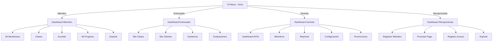

# FASE 6: DISEÑO UX/UI

> **Proyecto**: GYMsos  
> **Fase**: 6 - Diseño UX/UI  
> **Versión**: 2.0 (13 INNOVACIONES)  
> **Fecha**: 2026-05-15  
> **Nuevas Pantallas**: +7 (Avatar 3D, Battle Pass, Leaderboards, Marketplace, Churn Alert, Corporate, Smart Mirror)

---

## 🎯 PRINCIPIOS DE DISEÑO UX

1. **Simplicidad**: Interfaz limpia, sin fricción, intuitiva
2. **Accesibilidad**: Colores contrastados, textos legibles, navegación clara
3. **Rapidez**: Carga <2 segundos, operaciones rápidas
4. **Consistencia**: Mismo patrón en toda la app
5. **Feedback**: Confirmaciones claras, errores explicados
6. **Personalización**: Adaptado al rol del usuario
7. **Offline-ready**: Funcionalidad básica sin internet

---

## 🗺️ ARQUITECTURA DE INFORMACIÓN



---

## 📱 WIREFRAMES PRINCIPALES

### **Pantalla 1: Login/Registro Miembro (Web + Mobile)**

```
┌──────────────────────────┐
│         GYMSOS           │
│      Logo + Branding     │
│──────────────────────────│
│                          │
│  Email:  [_____________] │
│                          │
│  Contraseña: [__________] │
│                          │
│  [ ] Recordarme          │
│                          │
│  ┌────────────────────┐  │
│  │    INGRESAR        │  │
│  └────────────────────┘  │
│                          │
│  ¿No tienes cuenta?      │
│  [ REGISTRARSE ]         │
│                          │
│  ──────O──────           │
│                          │
│  [ Google ] [ Facebook ] │
│                          │
└──────────────────────────┘
```

---

### **Pantalla 2: Dashboard Miembro (Mobile)**

```
┌──────────────────────────────┐
│ ☰   GYMSOS      ⟳   👤       │
├──────────────────────────────┤
│                              │
│  Hola, Juan                  │
│  Tu membresía vence en 15 d  │
│                              │
├──────────────────────────────┤
│                              │
│  ┌──────────────┐            │
│  │  Mi          │            │
│  │ Membresía    │            │
│  │              │            │
│  │  ACTIVA      │            │
│  │              │            │
│  │ Hasta 28/06  │            │
│  └──────────────┘            │
│                              │
├──────────────────────────────┤
│  ACCESO RÁPIDO               │
│                              │
│  [QR] [Clases] [Progreso]    │
│                              │
├──────────────────────────────┤
│  PRÓXIMAS CLASES             │
│                              │
│  Hoy - 18:00                 │
│  Zumba con María             │
│  [ CONFIRMAR ASISTENCIA ]    │
│                              │
│  Mañana - 06:30              │
│  CrossFit con Carlos         │
│  [ VER DETALLES ]            │
│                              │
├──────────────────────────────┤
│ Inicio  Clases  Perfil  Más  │
└──────────────────────────────┘
```

---

### **Pantalla 3: Generar QR de Acceso**

```
┌──────────────────────────────┐
│  < ACCESO AL GIMNASIO        │
├──────────────────────────────┤
│                              │
│         Muestra este QR      │
│      en la entrada del       │
│         gimnasio             │
│                              │
│     ┌─────────────────┐      │
│     │                 │      │
│     │  ┌───┐┌───┐    │      │
│     │  │███││███│    │      │
│     │  ├───┼───┤    │      │
│     │  │███││███│    │      │
│     │  └───┘└───┘    │      │
│     │  [QR CODE]     │      │
│     │                 │      │
│     │  ID: JDO-2024  │      │
│     │  Válido hoy    │      │
│     │                 │      │
│     └─────────────────┘      │
│                              │
│  [ ACTUALIZAR QR ]           │
│                              │
│  Horario de acceso:          │
│  6:00 AM - 10:00 PM          │
│                              │
└──────────────────────────────┘
```

---

### **Pantalla 4: Clases Disponibles (Web)**

```
┌──────────────────────────────────────────────┐
│ ☰  GYMSOS                           👤 ⚙️   │
├──────────────────────────────────────────────┤
│                                              │
│  TODAS LAS CLASES                            │
│                                              │
│  🔍 Buscar clase o entrenador...             │
│                                              │
│  Filtros: [ Hoy ▼ ] [ Todas ▼ ]             │
│                                              │
├──────────────────────────────────────────────┤
│                                              │
│  ┌────────────────────────┐                  │
│  │ 06:30 - 07:30         │                  │
│  │ CROSSFIT               │                  │
│  │ Con Carlos             │                  │
│  │ Sala 1                 │                  │
│  │ 12/15 inscritos        │                  │
│  │ [ INSCRIBIRSE ]        │                  │
│  └────────────────────────┘                  │
│                                              │
│  ┌────────────────────────┐                  │
│  │ 09:00 - 10:00         │                  │
│  │ YOGA                   │                  │
│  │ Con Ana                │                  │
│  │ Sala 2                 │                  │
│  │ 8/20 inscritos         │                  │
│  │ [ INSCRIBIRSE ]        │                  │
│  └────────────────────────┘                  │
│                                              │
│  ┌────────────────────────┐                  │
│  │ 18:00 - 19:00         │                  │
│  │ ZUMBA                  │                  │
│  │ Con María              │                  │
│  │ Sala 3                 │                  │
│  │ 25/25 inscritos        │                  │
│  │ [ LISTA DE ESPERA ]    │                  │
│  └────────────────────────┘                  │
│                                              │
└──────────────────────────────────────────────┘
```

---

### **Pantalla 5: Dashboard Gerente (Web)**

```
┌────────────────────────────────────────────────────────────┐
│ ☰  GYMSOS - DASHBOARD GERENCIAL                 👤  ⚙️    │
├────────────────────────────────────────────────────────────┤
│                                                            │
│  Bienvenido, Gerente Pedro                               │
│  Gimnasio: FitCenter Medellín                            │
│                                                            │
├────────────────────────────────────────────────────────────┤
│                                                            │
│  KPIs PRINCIPALES                                        │
│                                                            │
│  ┌──────────┐  ┌──────────┐  ┌──────────┐  ┌──────────┐ │
│  │ Miembros │  │ Ingresos │  │ Churn    │  │ NPS      │ │
│  │          │  │          │  │          │  │          │ │
│  │   1,250  │  │ $45,000  │  │   2.1%   │  │   52     │ │
│  │  + 12%   │  │  + 8%    │  │  - 0.5%  │  │  + 3pts  │ │
│  └──────────┘  └──────────┘  └──────────┘  └──────────┘ │
│                                                            │
├────────────────────────────────────────────────────────────┤
│                                                            │
│  GRÁFICOS                          ALERTAS                │
│                                                            │
│  ┌─────────────────────────┐  ┌──────────────────┐       │
│  │ Ingresos últimos 12 mes │  │ ⚠️  5 miembros   │       │
│  │                         │  │ en riesgo de     │       │
│  │   ▂▄▆█▅▃▄▆▇            │  │ cancelación       │       │
│  │                         │  │ (sin asistencia) │       │
│  │ Ene  Mar  May  Jul Sep  │  │                  │       │
│  │                         │  │ [ VER DETALLES ] │       │
│  └─────────────────────────┘  └──────────────────┘       │
│                                                            │
├────────────────────────────────────────────────────────────┤
│  OPCIONES RÁPIDAS                                        │
│                                                            │
│  [ Reportes ] [ Miembros ] [ Clases ] [ Promociones ]   │
│  [ Pagos ]    [ Accesos ]  [ Staff ]  [ Configuración ] │
│                                                            │
└────────────────────────────────────────────────────────────┘
```

---

## 🚀 NUEVAS PANTALLAS (13 INNOVACIONES)

### **Pantalla 7: Avatar 3D + Digital Twin (Mobile)**

```
┌─────────────────────────────────┐
│ < Mi Progreso (Digital Twin)   │
├─────────────────────────────────┤
│                                 │
│        [3D Avatar Model]        │
│      Juan - Nivel 25           │
│    12 sesiones esta semana     │
│                                 │
│ ┌──────────────────────────┐   │
│ │ Predicción 12 semanas:  │   │
│ │ "Verás abdominales     │   │
│ │  definidos"            │   │
│ │ [VER SIMULACIÓN]       │   │
│ └──────────────────────────┘   │
│                                 │
│  Transformación:               │
│  Mes 1:   [=====----] 56%     │
│  Mes 3:   [========-] 88%     │
│  Mes 6:   [=========] 100%    │
│                                 │
│  Peso: 85kg → 78kg             │
│  Grasa: 25% → 15%              │
│                                 │
│ [COMPARAR ANTES/DESPUÉS]       │
│                                 │
└─────────────────────────────────┘
```

---

### **Pantalla 8: Battle Pass Premium (Mobile)**

```
┌─────────────────────────────────┐
│ ⭐ Battle Pass Season 3         │
├─────────────────────────────────┤
│                                 │
│ Progreso: [=======----] 70%    │
│ Tier 35/50                      │
│                                 │
│ ┌──────────────────────────┐   │
│ │ TIER 35                  │   │
│ │ 🏆 Insignia Oro         │   │
│ │ + 500 XP Bonus          │   │
│ │                          │   │
│ │ DESBLOQUEA EN:          │   │
│ │ 250 XP                  │   │
│ │ [====---------] 33%    │   │
│ └──────────────────────────┘   │
│                                 │
│ ¿Quieres acelerar?             │
│ [COMPRAR BOOST +1000 XP]       │
│ $9.99                          │
│                                 │
│ [GRATIS] [PREMIUM ✓]          │
│                                 │
└─────────────────────────────────┘
```

---

### **Pantalla 9: Leaderboard Global + Clanes (Mobile)**

```
┌──────────────────────────────────┐
│ 🏆 Leaderboard (Semana)         │
├──────────────────────────────────┤
│                                  │
│ Tú: #47 (1,250 XP)             │
│                                  │
│ 1. 👑 Carlos      2,850 XP    │
│    Dragon Clan                 │
│                                  │
│ 2. 🥈 María       2,620 XP    │
│    Phoenix Squad               │
│                                  │
│ 3. 🥉 Roberto     2,450 XP    │
│    Titan Force                 │
│                                  │
│ 47. 👤 Tú         1,250 XP    │
│     Dragon Clan                │
│     Sube 3 posiciones!        │
│                                  │
│ ┌──────────────────────────┐   │
│ │ Tu Clan: Dragon          │   │
│ │ Miembros: 15/20          │   │
│ │ XP Clan: 18,500          │   │
│ │ Ranking: #4              │   │
│ │                          │   │
│ │ [CHAT CLAN] [INVITAR]   │   │
│ └──────────────────────────┘   │
│                                  │
└──────────────────────────────────┘
```

---

### **Pantalla 10: Marketplace (Mobile)**

```
┌──────────────────────────────────┐
│ 🛍️  Marketplace                  │
├──────────────────────────────────┤
│                                  │
│ [Trainers] [Nutricionistas]     │
│ [Suplementos] [Wearables]       │
│ [Merchandise]                   │
│                                  │
│ ─── TRAINERS DESTACADOS ──      │
│                                  │
│ 👤 Luis - Especialista CrossFit │
│    ⭐⭐⭐⭐⭐ (145 reviews)       │
│    $50/sesión online            │
│    [RESERVAR SESIÓN]            │
│                                  │
│ 👤 Sofia - Coach Nutri          │
│    ⭐⭐⭐⭐⭐ (89 reviews)        │
│    Plan personalizado: $30/mes  │
│    [CONTRATAR]                  │
│                                  │
│ ─── SUPLEMENTOS RECOMENDADOS ── │
│                                  │
│ 💊 Whey Protein MyProtein      │
│    Descuento para miembros     │
│    [VER EN AMAZON]             │
│    GYMsos gana: $2.99 comisión │
│                                  │
└──────────────────────────────────┘
```

---

### **Pantalla 11: Churn Alert + Intervención (Mobile)**

```
┌──────────────────────────────────┐
│ ⚠️ Alerta Importante             │
├──────────────────────────────────┤
│                                  │
│ "Te notamos que has bajado      │
│  tu actividad últimas 2 semanas"│
│                                  │
│ Probabilidad de abandonar: 72%  │
│                                  │
│ 💚 Queremos ayudarte:           │
│                                  │
│ Opción 1:                       │
│ [✓] 1 mes GRATIS               │
│     (Válido solo hoy)           │
│                                  │
│ Opción 2:                       │
│ [✓] Sesión gratis con trainer  │
│     Planificar nueva rutina    │
│     [AGENDAR]                   │
│                                  │
│ Opción 3:                       │
│ [✓] Únete al reto "Vuelta al  │
│     Gym" en tu clan            │
│     Termina en 7 días          │
│     [UNIRSE]                    │
│                                  │
│ [RECHAZAR AYUDA]               │
│                                  │
└──────────────────────────────────┘
```

---

### **Pantalla 12: Corporate Dashboard (Web - Admin HR)**

```
┌──────────────────────────────────────────────────────┐
│ HR Dashboard - Acme Corp (500 empleados)            │
├──────────────────────────────────────────────────────┤
│                                                      │
│ 📊 KPIs WELLNESS                                    │
│                                                      │
│ Empleados Activos: 340/500 (68%)                   │
│ Sesiones Promedio/Mes: 8.2                         │
│ ROI Estimado: 15% reducción ausentismo             │
│                                                      │
│ ┌─────────────────────────────────────────┐        │
│ │ 🏆 Leaderboard Departamental            │        │
│ │                                         │        │
│ │ 1. IT - 4,200 XP 👑                    │        │
│ │ 2. Finanzas - 3,800 XP                 │        │
│ │ 3. RH - 3,200 XP                       │        │
│ │ 4. Ventas - 2,900 XP                   │        │
│ │                                         │        │
│ │ Próximo reto: "Leg Day Challenge"     │        │
│ │ Comienza: Lunes 5/20                  │        │
│ │ Ganador obtiene: Almuerzo para dept    │        │
│ │ [VER DETALLES]                         │        │
│ └─────────────────────────────────────────┘        │
│                                                      │
│ 📈 Gráfico: Actividad últimas 4 semanas             │
│                                                      │
│ [Gestionar Membresías] [Reportes] [Facturación]    │
│                                                      │
└──────────────────────────────────────────────────────┘
```

---

### **Pantalla 13: Smart Mirror Interface (Display Físico)**

```
┌──────────────────────────────────────┐
│  GYMsos Smart Mirror - Yoga Session  │
├──────────────────────────────────────┤
│                                      │
│  ┌─────────────────────────────┐   │
│  │                             │   │
│  │   [LIVE VIDEO DE TI]        │   │
│  │                             │   │
│  │  ✓ Postura: CORRECTA       │   │
│  │    Cuello alineado con hom │   │
│  │    Rodillas suave          │   │
│  │                             │   │
│  └─────────────────────────────┘   │
│                                      │
│  Comparativa (vs. postura ideal):   │
│                                      │
│  Tu posición:  [Línea amarilla]    │
│  Ideal:        [Línea verde]       │
│                                      │
│  ⏱️ Duración: 2:35 / 5:00          │
│  🔥 Calorías Est.: 45 kcal         │
│                                      │
│  [← Anterior] Pose 1/12 [Siguiente]│
│                                      │
└──────────────────────────────────────┘
```

---

## 🎨 GUÍA DE ESTILOS

### **Paleta de Colores**

| Elemento | Color | Código Hex | Uso |
|----------|-------|-----------|-----|
| Primario | Verde dinamita | #00D084 | Botones principales, acciones |
| Secundario | Azul marino | #1F2937 | Fondo, textos principales |
| Acentos | Naranja | #FF6B35 | Alertas, llamadas a acción |
| Éxito | Verde claro | #10B981 | Estados positivos |
| Error | Rojo | #EF4444 | Estados críticos |
| Neutro | Gris | #6B7280 | Textos secundarios, deshabilitados |

---

### **Tipografía**

- **Familia**: Inter, Roboto (sans-serif, asegura legibilidad)
- **Heading 1**: 32px, peso 700 (bold)
- **Heading 2**: 24px, peso 600 (semibold)
- **Heading 3**: 20px, peso 600 (semibold)
- **Body**: 16px, peso 400 (regular)
- **Small**: 14px, peso 400 (regular)
- **Tiny**: 12px, peso 500 (medium)

---

### **Espaciado (Sistema 8px)**

- **xs**: 4px (pequeños detalles)
- **sm**: 8px (espacios dentro de componentes)
- **md**: 16px (espacios entre elementos)
- **lg**: 24px (espacios entre secciones)
- **xl**: 32px (espacios principales)

---

## 🔄 FLUJOS DE USUARIO PRINCIPALES

### **Flujo 1: Miembro Accede al Gimnasio**

```
1. Miembro abre app
   ↓
2. Ve botón "ACCEDER AHORA"
   ↓
3. Click en botón
   ↓
4. Se genera QR único
   ↓
5. Miembro muestra QR en lector
   ↓
6. Sistema valida
   ↓
7. Torniquete se abre
   ↓
8. Confirmación "¡Bienvenido!" en app
   ↓
9. Dashboard muestra "Dentro del gimnasio"
```

---

### **Flujo 2: Miembro se Inscribe en Clase**

```
1. Miembro en app → Sección "Clases"
   ↓
2. Ve listado de clases próximas
   ↓
3. Selecciona clase (ej: Zumba 18:00)
   ↓
4. Ve detalles: entrenador, duración, cupo
   ↓
5. Click en "INSCRIBIRSE"
   ↓
6. Confirmación: "¡Inscrito en Zumba!"
   ↓
7. Recordatorios automáticos:
   - 24 horas antes: "Tu clase es mañana"
   - 1 hora antes: "Tu clase comienza en 1 hora"
   ↓
8. 10 minutos después de clase:
   - "¡Excelente sesión! ¿Cómo estuvo?"
   - Rating 1-5 estrellas
```

---

### **Flujo 3: Gerente Genera Reporte**

```
1. Gerente en dashboard
   ↓
2. Click en "Reportes"
   ↓
3. Menú: [Ingresos] [Asistencia] [Churn] [Clases]
   ↓
4. Selecciona tipo: "Ingresos Mensuales"
   ↓
5. Selecciona período: "Últimos 12 meses"
   ↓
6. Sistema genera gráficos y tablas
   ↓
7. Opciones:
   - Ver en pantalla
   - Descargar PDF
   - Enviar por email
   ↓
8. Reporte generado con visualizaciones
```

---

## 📱 COMPONENTES REUTILIZABLES

### **Button (Botón)**
```
Estados:
- Default: Fondo verde, texto blanco, cursor pointer
- Hover: Sombra sutil, fondo verde más oscuro
- Disabled: Gris, cursor not-allowed
- Loading: Spinner animado

Tamaños:
- Small: 8px padding, 14px texto
- Medium: 12px padding, 16px texto
- Large: 16px padding, 18px texto
```

---

### **Card (Tarjeta)**
```
- Fondo: Blanco
- Borde: 1px gris claro
- Sombra: Sutil (4px, 8% opacidad)
- Radio: 8px
- Padding: 16px
- Hover: Sombra aumenta, cursor pointer
```

---

### **Form Input (Campo de entrada)**
```
- Ancho: 100% del contenedor (máx 500px)
- Alto: 44px (touch-friendly)
- Borde: 1px gris
- Focus: Borde azul, sombra azul
- Error: Borde rojo, texto rojo
- Placeholder: Gris 50%
- Padding: 12px
```

---

### **Modal (Ventana emergente)**
```
- Fondo oscuro 70% opacidad
- Contenedor blanco, radio 12px
- Ancho: 90% mobile, 500px desktop
- Botones al pie: [Cancelar] [Confirmar]
- Cierre: Click fuera O botón X
```

---

## 🌐 RESPONSIVE DESIGN

### **Breakpoints**

| Dispositivo | Ancho | Adaptaciones |
|-----------|-------|--------------|
| **Mobile** | 320-480px | Una columna, full-width |
| **Tablet** | 481-768px | Una-dos columnas |
| **Desktop** | 769-1920px | Dos-tres columnas |
| **Wide** | 1921+px | Cuatro+ columnas |

### **Ejemplos de Adaptación**

**Dashboard en Mobile:**
```
- Ocultar cards no críticas
- Mostrar KPIs en horizontal scroll
- Gráficos pequeños
- Navegación: menú hamburguesa
```

**Dashboard en Desktop:**
```
- Todos los KPIs visibles
- 3 columnas: métricas, gráficos, alertas
- Navegación lateral permanente
```

---

## ♿ ACCESIBILIDAD (WCAG 2.1 Nivel AA)

### **Contraste**
- Texto principal: Ratio 4.5:1 (AA)
- Textos grandes: Ratio 3:1 (AA)
- Colores no son única forma de información

### **Navegación**
- Teclado: Tab, Enter, Escape funcionales
- Focus visible: Borde azul 2px
- Orden lógico de tab

### **Textos alternativos**
```

```

### **Etiquetas formularios**
```
<label for="email">Email</label>
<input id="email" type="email" />
```

---

## 🎯 CRITERIOS DE ÉXITO UX

| Métrica | Meta | Cómo medir |
|---------|------|-----------|
| **Tiempo de carga** | <2s | Google Lighthouse |
| **Task completion** | >95% | Pruebas de usabilidad |
| **Error rate** | <3% | Analytics |
| **NPS** | >50 | Encuesta post-interacción |
| **Accessibility score** | >90 | Axe DevTools |

---

## 🔮 Próximas Iteraciones

**v1.1** (Mes 2):
- Dark mode
- Notificaciones push mejoradas
- Gamification (badges, leaderboard)

**v1.2** (Mes 4):
- Integración social (compartir logros)
- AI recomendaciones de clases
- Video on-demand entrenamiento

---

*FASE_6_DISEÑO_UX_UI.md — Especificación completa de interfaz v1.0*
