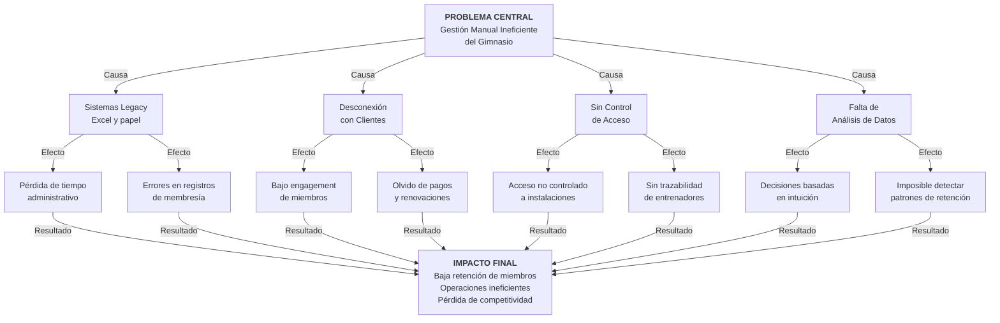

# FASE 1: ANÁLISIS DE PROBLEMAS DETECTADOS

> **Proyecto**: GYMsos  
> **Fase**: 1 - Análisis de Problemas  
> **Versión**: 1.0  
> **Fecha**: 2026-05-14  
> **Autor**: Claude - Orquestación Automatizada

---

## 📌 RESUMEN EJECUTIVO

GYMsos enfrenta un desafío crítico: la gestión completamente manual de operaciones mediante Excel. Esto impacta directamente en la experiencia del cliente, la retención de miembros y la eficiencia operativa. El gimnasio actual carece de automatización, integración digital con clientes y análisis de datos que permitirían tomar decisiones estratégicas. La falta de un control de acceso moderno, gestión de espacios en tiempo real y comunicación automatizada genera pérdida de oportunidades de retención y reduce la competitividad en el mercado de fitness.

**Impacto estimado**: Pérdida de 15-25% de miembros anualmente por experiencia deficiente, 30-40 horas mensuales en tareas administrativas manuales, sin visibilidad de datos operativos.

---

## 🌳 ÁRBOL DE PROBLEMAS

---

## 📋 DESGLOSE DE PROBLEMÁTICAS DETECTADAS

### 1. **Gestión Manual de Membresías**
**Descripción**: Toda la gestión de membresías se realiza manualmente mediante Excel, sin validación automática ni integración con sistemas de pago.

**Impacto**: 
- Errores en registros (duplicados, datos inconsistentes)
- Tiempo administrativo significativo (8-12 horas semanales)
- Falta de visibilidad en tiempo real del estado de membresías
- Pérdida de miembros por olvido de renovación

**Usuarios afectados**: Recepcionistas, Gerentes, Miembros  
**Costo de no resolver**: ~$2,000-3,000 mensuales en ingresos por cancelaciones involuntarias

---

### 2. **Sin Control de Acceso Automatizado**
**Descripción**: El acceso a instalaciones es completamente manual o basado en documentos físicos. No hay control biométrico ni QR.

**Impacto**:
- Riesgo de seguridad (acceso no autorizado)
- Sin trazabilidad de quién accede cuándo
- Imposible correlacionar asistencia con retención
- Ineficiencia en entrada/salida de miembros

**Usuarios afectados**: Recepcionistas, Gerentes, Miembros  
**Costo de no resolver**: Pérdida de seguridad, datos de asistencia inconsistentes

---

### 3. **Desconexión Total con Clientes**
**Descripción**: No hay comunicación automática, recordatorios de pagos, notificaciones de eventos o mensajería personalizada.

**Impacto**:
- Baja retención por falta de engagement
- Miembros olvidan pagos (churn por morosidad)
- Sin recordatorios de vencimiento de membresía
- Sin comunicación sobre clases, eventos o promociones
- Imposible segmentar y personalizar mensajes

**Usuarios afectados**: Miembros, Gerentes  
**Costo de no resolver**: 25-35% de cancelaciones por desenganche

---

### 4. **Falta de Análisis de Datos**
**Descripción**: No hay visibilidad sobre patrones de asistencia, retención, ingresos o comportamiento de miembros.

**Impacto**:
- Decisiones gerenciales basadas en intuición
- Imposible identificar miembros en riesgo de churn
- Sin análisis de ROI por clase, entrenador o actividad
- Sin predicción de demanda para espacios y máquinas
- Sin datos de negocio para decisiones estratégicas

**Usuarios afectados**: Gerentes, Dueños  
**Costo de no resolver**: Ineficiencia en asignación de recursos

---

### 5. **Gestión Manual de Espacios y Máquinas**
**Descripción**: No hay sistema de reserva de espacios, no se sabe quién está usando qué equipo o si está disponible.

**Impacto**:
- Conflictos por uso de espacios (clases simultáneas)
- Imposible reservar espacios en avance
- Sin información sobre disponibilidad en tiempo real
- Miembros no saben cómo usar máquinas sin guía presencial
- Mantenimiento desorganizado

**Usuarios afectados**: Miembros, Entrenadores, Gerentes  
**Costo de no resolver**: Mala experiencia del usuario, subutilización de espacios

---

### 6. **Sin Integración de Métodos de Pago**
**Descripción**: Los pagos se realizan manualmente, sin integración con plataformas de pago online. Falta de facilidad para el cliente.

**Impacto**:
- Experiencia de pago tedioso
- Altos costos de gestión manual de cobranza
- Imposible automatizar recordatorios de pago
- Tasa de morosidad elevada
- Pérdida de miembros por fricción en pago

**Usuarios afectados**: Miembros, Recepcionistas, Tesorería  
**Costo de no resolver**: 15-20% de ingresos en morosidad

---

### 7. **Sin Integración CRM**
**Descripción**: No hay historial consolidado de cliente, preferencias, patrones o interacciones.

**Impacto**:
- Atención no personalizada
- Imposible entender necesidades del miembro
- Sin seguimiento de evolución del cliente
- Pérdida de oportunidades de upsell (personal training, clases premium)
- Cada interacción comienza desde cero

**Usuarios afectados**: Miembros, Entrenadores, Gerentes  
**Costo de no resolver**: Bajo engagement, baja retención

---

### 8. **Sin Automatización de Comunicación**
**Descripción**: Toda la comunicación (recordatorios, notificaciones, promociones) es manual o inexistente.

**Impacto**:
- Olvido de renovación de membresía
- Sin notificación de eventos, clases nuevas o cambios de horario
- Sin recordatorios de pago previo al vencimiento
- Imposible escalar comunicación personalizadacon múltiples sucursales

**Usuarios afectados**: Miembros, Gerentes  
**Costo de no resolver**: Pérdida de 20-30% de ingresos por cancelaciones prevenibles

---

## 👥 ANÁLISIS DE STAKEHOLDERS

| Stakeholder | Rol | Dolor Principal | Impacto en Negocio |
|-------------|-----|------------------|--------------------|
| **Miembros** | Usuario final | Experiencia deficiente, olvido de pagos, sin información | Baja retención (churn 25-35%) |
| **Recepcionistas** | Operación diaria | Trabajo manual, errores, falta de herramientas | Baja productividad (10+ horas/semana en admin) |
| **Entrenadores** | Servicio | Sin seguimiento de clientes, sin datos de desempeño | Imposible personalizar entrenamientos |
| **Gerentes** | Gestión | Sin visibilidad de datos, decisiones ciegas | Ineficiencia operativa, rentabilidad baja |
| **Dueños** | Estrategia | Sin análisis de negocio, imposible escalar | Crecimiento limitado, competencia en desventaja |
| **Proveedores de Pago** | Integración | Proceso manual, alto riesgo | Oportunidad no aprovechada |

---

## 🖥️ CONTEXTO TECNOLÓGICO ACTUAL

### Sistemas Actuales
- **Gestión de membresías**: Excel
- **Contratos**: Documentos PDF/Word
- **Pagos**: Caja manual + ocasionalmente transferencias
- **Comunicación**: WhatsApp manual, correo ocasional
- **Reportes**: Hojas de cálculo manuales
- **Acceso**: Carnet físico o registro manual

### Limitaciones del Sistema Actual
- ❌ Sin integración entre sistemas
- ❌ Sin automatización
- ❌ Sin análisis en tiempo real
- ❌ Sin escalabilidad para múltiples sucursales
- ❌ Alto riesgo de errores humanos
- ❌ Imposible tomar decisiones basadas en datos
- ❌ Experiencia del cliente deficiente
- ❌ Carga de trabajo manual insostenible

### Tecnología Disponible (NO utilizada)
- Plataformas de pago (Stripe, PayU, MercadoPago)
- CRM (HubSpot, Salesforce, Pipedrive)
- Sistemas de automatización (Zapier, n8n)
- APIs de mensajería (WhatsApp Business, Twilio)
- Biometría y control de acceso
- Analytics y BI (Power BI, Tableau, Google Analytics)

---

## 💰 JUSTIFICACIÓN DE LA NECESIDAD

### ¿Por qué es urgente?

**1. Competencia creciente**
- Otros gimnasios modernos ofrecen app, pagos online, control de acceso
- GYMsos está quedando atrás en experiencia digital
- Miembros esperan herramientas modernas

**2. Rentabilidad en riesgo**
- Churn de 25-35% anual = pérdida de ingresos significativa
- Costos administrativos ineficientes
- Morosidad por falta de automatización

**3. Escalabilidad**
- Planes de expansión a múltiples sucursales requieren sistema digital
- Excel no escala, genera inconsistencias
- Necesario para crecer de forma sostenible

**4. Retención de talento**
- Empleados quieren herramientas modernas, no Excel
- Experiencia deficiente afecta motivación
- Necesario para atraer y retener talento

### Costen de no hacer nada
- **Mes 1-3**: Pérdida gradual de competitividad
- **Mes 4-6**: Aceleración del churn de miembros
- **Mes 7-12**: Estancamiento en crecimiento, pérdida de ingresos
- **Año 2+**: Obsolescencia, imposibilidad de escalar

### Oportunidad de resolver
**Con GYMsos (sistema moderno):**
- ✅ Retención mejorada 30-40% (reducción de churn)
- ✅ Reducción 70% tiempo administrativo manual
- ✅ Integración completa con clientes
- ✅ Análisis para decisiones estratégicas
- ✅ Escalabilidad para múltiples sucursales
- ✅ Diferenciación competitiva clara

---

## 📊 MATRIZ DE SEVERIDAD

| Problema | Severidad | Impacto Financiero | Urgencia |
|----------|-----------|-------------------|----------|
| Gestión manual | 🔴 CRÍTICA | $2,000-3,000/mes | MUY ALTA |
| Desconexión clientes | 🔴 CRÍTICA | $4,000-5,000/mes (churn) | MUY ALTA |
| Sin control de acceso | 🟠 ALTA | $1,000/mes (seguridad) | ALTA |
| Falta de análisis | 🟠 ALTA | $2,000/mes (ineficiencia) | ALTA |
| Sin automatización pagos | 🟠 ALTA | $800-1,000/mes (morosidad) | ALTA |
| Gestión de espacios | 🟡 MEDIA | $500/mes (subutilización) | MEDIA |

---

## ✅ CONCLUSIÓN

GYMsos enfrenta un **punto crítico** donde la gestión manual es insostenible. El sistema propuesto (plataforma web + mobile + desktop con automatización completa) es no solo deseable sino **necesario** para:

1. Competir en mercado de fitness moderno
2. Mejorar retención de miembros
3. Escalar a múltiples sucursales
4. Optimizar operaciones administrativas
5. Tomar decisiones basadas en datos

**Recomendación**: Proceder con desarrollo inmediato. El costo de inacción supera significativamente el costo de implementación.

---

*FASE_1_PROBLEMAS_DETECTADOS.md — Análisis completo v1.0*
