# FASE 3: REQUISITOS FUNCIONALES Y CASOS DE USO

> **Proyecto**: GYMsos  
> **Fase**: 3 - Requisitos Funcionales y Casos de Uso  
> **Versión**: 1.0  
> **Fecha**: 2026-05-14

---

## 📋 REQUISITOS FUNCIONALES (RF)

### **RF-001: Gestión de Membresías**
El sistema debe permitir registrar, actualizar, renovar y cancelar membresías de miembros.

**Detalle**:
- Registro de miembro (nombre, email, teléfono, fecha de nacimiento, documento)
- Selección de plan (mensual, trimestral, anual)
- Renovación automática o manual
- Suspensión temporal de membresía
- Cancelación de membresía con motivo
- Historial de membresías por miembro

---

### **RF-002: Integración de Pagos Online**
El sistema debe procesar pagos mediante múltiples plataformas (Stripe, PayU, MercadoPago).

**Detalle**:
- Guardar métodos de pago (tarjeta, cuenta bancaria)
- Cobros automáticos en fecha de renovación
- Pagos manuales (ad-hoc)
- Reintentos automáticos en caso de fallo
- Registro de transacciones completo
- Generación de recibos digitales

---

### **RF-003: Control de Acceso por QR y Biometría**
El sistema debe permitir ingreso a instalaciones mediante QR o biometría.

**Detalle**:
- Generación de código QR único por miembro
- Lectura de QR en entrada (registro de acceso)
- Integración con sistema biométrico (huella, facial)
- Registro de horario de entrada/salida
- Alertas si miembro no tiene membresía activa
- Historial de accesos por miembro

---

### **RF-004: Gestión de Espacios y Máquinas**
El sistema debe permitir reservar espacios y rastrear disponibilidad.

**Detalle**:
- Registro de espacios (salas de clases, áreas de pesas, yoga, etc.)
- Disponibilidad en tiempo real
- Reserva de espacios por miembros o entrenadores
- Límite de capacidad por espacio
- Registro de máquinas con mantenimiento preventivo
- Estado de máquinas (operativa, en mantenimiento, dañada)

---

### **RF-005: Programación de Clases**
El sistema debe permitir crear, programar y gestionar clases grupales.

**Detalle**:
- Crear clase (nombre, descripción, capacidad, entrenador)
- Programar horarios fijos o recurrentes
- Inscripción de miembros en clases
- Lista de asistencia automática (por acceso)
- Notificación de clases próximas
- Cancelación de clases con aviso

---

### **RF-006: Asistencia y Estadísticas de Asistencia**
El sistema debe registrar automáticamente asistencia y generar reportes.

**Detalle**:
- Registro automático de asistencia (por acceso QR)
- Cálculo de frecuencia de asistencia
- Identificación de miembros inactivos (en riesgo de churn)
- Reportes de asistencia por miembro, clase, entrenador
- Análisis de patrones de asistencia

---

### **RF-007: Automatización de Recordatorios (WhatsApp, Email, App)**
El sistema debe enviar recordatorios automáticos personalizados.

**Detalle**:
- Recordatorio de vencimiento de membresía (7 días antes)
- Recordatorio de pago (2 días antes de fecha)
- Notificación de clases próximas
- Recordatorio de inactividad (14 días sin asistir)
- Oferta personalizada de clases/entrenamiento
- Confirmación de entrada al gimnasio
- Mensaje de bienevenida a nuevos miembros

---

### **RF-008: Asistente Virtual (Chatbot)**
El sistema debe tener asistente virtual disponible 24/7.

**Detalle**:
- Responder preguntas frecuentes (horarios, tarifas, clases)
- Proporcionar información de miembros (saldo, próxima renovación)
- Reserva de clases por chat
- Reporte de problemas de equipos
- Escalamiento a atención humana cuando sea necesario

---

### **RF-009: Gestión de Entrenadores y Asignaciones**
El sistema debe permitir asignar entrenadores y rastrear actividad.

**Detalle**:
- Registro de entrenadores
- Asignación de entrenador a clases
- Historial de clientes por entrenador
- Evaluación de desempeño (asistencia, retención)
- Disponibilidad de entrenadores
- Sesiones de entrenamiento personal

---

### **RF-010: Dashboard de Análisis para Gerentes**
El sistema debe proporcionar visibilidad en tiempo real de KPIs.

**Detalle**:
- Ingresos mensuales (real vs. proyectado)
- Número de miembros activos
- Tasa de churn y causas
- Ocupación de espacios
- Performance de clases (asistencia, rating)
- Performance de entrenadores
- Alertas de miembros en riesgo

---

### **RF-011: Reportes Automáticos**
El sistema debe generar reportes periódicos automáticos.

**Detalle**:
- Reporte diario de asistencia
- Reporte semanal de ingresos
- Reporte mensual de KPIs
- Reporte de morosidad
- Exportación a Excel/PDF
- Programación de reportes automáticos

---

### **RF-012: Gestión de Planes y Precios**
El sistema debe permitir configurar y gestionar planes de membresía.

**Detalle**:
- Crear planes (mensual, trimestral, anual)
- Definir precio por plan
- Descuentos y promociones
- Planes con acceso restringido a horarios
- Planes con clases ilimitadas o limitadas
- Planes promocionales temporales

---

### **RF-013: Integración CRM**
El sistema debe mantener perfil completo de cliente.

**Detalle**:
- Datos de contacto actualizados
- Historial de compras y accesos
- Preferencias de clases y entrenamientos
- Feedback y evaluaciones
- Historial de comunicaciones
- Segmentación automática por comportamiento

---

### **RF-014: QR Educativo en Máquinas**
El sistema debe proporcionar guías mediante código QR.

**Detalle**:
- Código QR en cada máquina
- Video tutorial de cómo usarla
- Advertencias de seguridad
- Recomendaciones de peso/reps
- Acceso rápido para solicitar ayuda
- Registro de máquina para mantenimiento

---

### **RF-015: Multi-sucursal Centralizado**
El sistema debe soportar gestión de múltiples gimnasios.

**Detalle**:
- Crear y gestionar múltiples sedes
- Membresía válida en todas las sucursales (opcional)
- Control de acceso por sucursal
- Reportes consolidados por sucursal
- Transferencia de miembro entre sucursales
- Configuración independiente por sucursal

---

### **RF-016: Seguridad y Privacidad**
El sistema debe proteger datos de miembros.

**Detalle**:
- Autenticación segura (contraseña + 2FA)
- Encriptación de datos sensibles
- Cumplimiento GDPR/CCPA
- Auditoría de accesos
- Eliminación segura de datos
- Copias de seguridad automáticas

---

### **RF-017: Integración con Sistema de Torniquete**
El sistema debe comunicarse con hardware de acceso.

**Detalle**:
- API para leer QR en torniquete
- Validación instantánea de membresía
- Apertura/cierre de torniquete
- Registro de intento fallido
- Sincronización en tiempo real

---

### **RF-018: Gestión de Promociones y Ofertas**
El sistema debe permitir crear y rastrear promociones.

**Detalle**:
- Crear código de promoción (descuento porcentaje, monto fijo)
- Límite de uso por código
- Validez temporal
- Aplicación automática en pago
- Reporte de uso de promociones
- Segmentación: ofertas específicas por grupo

---

## 🚀 NUEVOS REQUISITOS (13 DISRUPTIVAS INNOVACIONES)

### **RF-019: Detección Predictiva de Churn (Churn AI)**
El sistema debe predecir abandono de miembros con 30 días de anticipación.

**Detalle**:
- Análisis de patrón de asistencia (tendencia decreciente)
- Cálculo de probabilidad abandono (0-100%)
- Alertas automáticas a staff: "Miembro X abandonará en 15 días"
- Score de riesgo visible en dashboard
- Historial de predicciones vs. realidad (validación del modelo)
- Integración con recordatorios automáticos para intervención

---

### **RF-020: Intervención Automática Anti-Churn**
El sistema debe ejecutar automáticamente acciones de retención cuando se detecta riesgo.

**Detalle**:
- Oferta personalizada automática (descuento, clase gratis)
- Asignación de sesión de coaching gratuita
- Invitación a reto especial
- Mensajes motivacionales personalizados
- Tracking de conversión de intervención
- A/B testing de mensajes (cual es más efectivo)

---

### **RF-021: Gamificación - Sistema de XP**
El sistema debe otorgar puntos XP por todas las actividades de fitness.

**Detalle**:
- Asignación de XP por acción: sesión = 100 XP, nueva PR = 500 XP, clase asistida = 75 XP
- Acumulación de XP por miembro
- Progresión de level (0-100 levels)
- Visualización de progreso en tiempo real
- Leaderboard global de XP
- Recompensas por milestones (level 10, 25, 50, etc.)

---

### **RF-022: Gamificación - Battle Pass Premium**
El sistema debe ofrecer pase de batalla con recompensas premium.

**Detalle**:
- Dos tracks: Free (obligatorio) y Premium ($9.99/mes, opcional)
- 50 tiers de progresión (seasonal, cada 3 meses)
- Recompensas desbloqueables: insignias, avatares, descuentos
- Sistema de "boost" para acelerar progresión (opcional, pago)
- Resumen semanal: progreso, recompensas disponibles
- Cosmetics exclusivas por tier premium

---

### **RF-023: Gamificación - Clanes y Rivalidad Social**
El sistema debe permitir formar grupos competitivos.

**Detalle**:
- Creación de clanes (máximo 20 miembros)
- Invitación a amigos/miembros
- Leaderboard de clanes (suma XP miembros)
- Desafíos inter-clan (quien hace más pullups, cardio, etc.)
- Recompensas de clan (si ganan reto)
- Chat privado de clan
- Ranking semanal/mensual de clanes

---

### **RF-024: Gamificación - Torneos Semanales**
El sistema debe organizar competencias temáticas semanales.

**Detalle**:
- Torneos automáticos cada semana (ej: "Leg Day Challenge", "Cardio Kings")
- Categorías: por género, edad, nivel de experiencia
- Métrica del torneo: volumen levantado, tiempo, reps máximas
- Premios: insignias, XP bonus, descuentos en merchandise
- Historial de victorias
- Participación automática (todos están inscritos a menos que opten)

---

### **RF-025: Digital Twin - Avatar 3D Personalizado**
El sistema debe crear gemelo digital de cada miembro simulando transformación.

**Detalle**:
- Generación de avatar 3D basado en datos biométricos (altura, peso, composición estimada)
- Evolución visual en tiempo real según progreso
- Predicción visual: "En 12 semanas verás esto si mantienes rutina"
- Comparativa antes/después (avatar mes 1 vs. actual)
- Celebración automática de hitos (pierda 5kg, XP llega a 1000)
- Opciones de customización (color, estilo)

---

### **RF-026: Netflix Fitness - Rutinas Personalizadas Dinámicas**
El sistema debe generar y adaptar rutinas de ejercicio personalizadas.

**Detalle**:
- Análisis de máquinas usadas históricamente por miembro
- Análisis de clases asistidas (preferencias por tipo)
- Generación de rutina semanal personalizada
- Adaptación automática cada semana según progreso
- Sugerencia de rutinas "nuevas para ti" basadas en preferencias
- Duración flexible (30min, 45min, 60min)

---

### **RF-027: Spotify Recommendations - Playlist de Entrenamientos**
El sistema debe recomendar entrenamientos como Spotify recomienda canciones.

**Detalle**:
- "Discover Weekly": 5 entrenamientos nuevos cada lunes
- "Release Radar": Nuevas clases disponibles que coinciden con gustos
- "Mood-based": "Cardio para desestresarte", "Pesas para potencia"
- "Progression albums": Rutinas que construyen sobre las previas
- Collaborative playlists: Comparte rutinas con amigos
- Historial: "Lo que escuchaste esta semana"

---

### **RF-028: Smart Gym OS - Integración IoT de Máquinas**
El sistema debe capturar datos de máquinas inteligentes.

**Detalle**:
- Sensores en máquinas capturan: peso levantado, reps, ROM (rango movimiento)
- Sincronización automática con dashboard del miembro
- Validación de forma (IA detecta movimiento incorrecto)
- Alertas de seguridad si forma es pobre
- Recomendación de weight próximo basado en capacidad
- Datos fluyen automáticamente a análisis/dashboard

---

### **RF-029: Smart Gym OS - Smart Mirror con IA**
El sistema debe operar espejos inteligentes que corrigen forma en tiempo real.

**Detalle**:
- Cámara analiza postura/movimiento en yoga, pilates, funcional
- IA sugiere correcciones: "Caderas más bajas", "Alinea rodilla con tobillo"
- Video replay para revisar forma
- Comparativa con forma "correcta" (referencia de entrenador)
- Grabación opcional para revisión posterior
- Conecta con datos de máquinas para recomendaciones

---

### **RF-030: Smart Gym OS - Integración Wearables**
El sistema debe sincronizar datos de dispositivos wearables.

**Detalle**:
- Sincronización automática: Apple Watch, Garmin, Whoop, Fitbit
- Importación de: pasos, calorías, ritmo cardíaco, sueño
- Dashboard holístico: actividad + sueño + nutrición + estrés
- Alertas si ritmo cardíaco fuera de rango
- Integración con recomendaciones de intensidad (no hacer HIIT si mala calidad sueño)
- Datos de wearables alimentan modelo de Churn AI

---

### **RF-031: Marketplace - Integración de Trainers Independientes**
El sistema debe conectar trainers freelance para coaching online.

**Detalle**:
- Registro de trainers (especialidades, certificaciones, tarifa)
- Perfil público con ratings y reviews
- Booking de sesiones online (video call)
- Sistema de pagos: GYMsos toma 30% comisión
- Calendario de disponibilidad del trainer
- Historial de sesiones completadas
- Feedback post-sesión

---

### **RF-032: Marketplace - Integración de Nutritionistas**
El sistema debe conectar nutricionistas para plans personalizados.

**Detalle**:
- Registro de nutricionistas (especialidades, tarifa por plan)
- Creación de planes de nutrición personalizados
- Integración con MyFitnessPal (sincronización automática datos)
- Seguimiento de cumplimiento de plan
- Coaching automático: "Cumpliste 80% del plan esta semana"
- Pagos: GYMsos toma 30% comisión

---

### **RF-033: Marketplace - Tienda de Suplementos y Merchandise**
El sistema debe vender productos de terceros con comisión.

**Detalle**:
- Catálogo de suplementos (marcas integradas: Optimum, MyProtein, etc.)
- Tienda de merchandise del gimnasio (ropa con logo)
- Inventario en tiempo real
- Carrito de compra integrado
- Pagos seguros (Stripe)
- Envío/retiro en gimnasio
- GYMsos comisión: 30% suplementos, 20% merchandise

---

### **RF-034: Marketplace - Integración Wearables Store**
El sistema debe vender wearables recomendados.

**Detalle**:
- Tienda de Apple Watch, Garmin, Whoop, Fitbit
- Integración con Amazon/distribuidores
- Recomendación automática: "Notamos que haces cardio, Garmin te podría ayudar"
- Links de afiliado a tiendas (comisión por venta)
- Sincronización automática una vez comprado
- Descuentos exclusivos para miembros

---

### **RF-035: B2B2C Corporate Wellness - Dashboard Empresarial**
El sistema debe gestionar beneficios de wellness corporativo.

**Detalle**:
- Panel de administración para HR
- Visualización: % empleados activos, promedio sesiones/mes
- Reportes de ROI: "Redujimos ausentismo 15%"
- Desafíos corporativos: "Equipo IT vs. Finanzas"
- Leaderboard corporativo (por departamento)
- Gestión de presupuesto (cuántos membresías, costo total)

---

### **RF-036: B2B2C Corporate - Leaderboard Departamental**
El sistema debe competencia entre departamentos.

**Detalle**:
- Agregación automática de XP por departamento
- Ranking visible en pantalla corporativa
- Desafíos inter-departamentales (mensual)
- Premios: bonificaciones, días libres, regalo
- Comunicación automática: "Finanzas está ganando, IT debe reaccionar"
- Integración con calendarios corporativos para recordatorios

---

### **RF-037: Preventive Health - Integración Apple/Google Health**
El sistema debe sincronizar datos de salud holística.

**Detalle**:
- Sincronización: Apple Health, Google Health
- Importación de: sueño, ritmo cardíaco en reposo, pasos, estrés, menstruación
- Dashboard: actividad + nutrición + sueño + estrés = salud integral
- Alertas: "Ritmo cardíaco elevado, consulta médico"
- Alertas: "Duermes poco, reduce intensidad hoy"
- Datos alimentan modelo de Churn (salud holística > retención)

---

### **RF-038: Preventive Health - Health Alerts Automáticas**
El sistema debe generar alertas de salud.

**Detalle**:
- "Tu ritmo cardíaco está 20% más alto que normal"
- "Duermes menos de 6 horas, energía baja"
- "Presión arterial elevada, consulta médico"
- Alertas enviadas por app + email
- Recomendación: "Prueba yoga para relaxación"
- Logs de alertas para historial médico

---

### **RF-039: Preventive Health - Doctor Integration**
El sistema debe permitir compartir datos con médicos.

**Detalle**:
- Opción para dar acceso a médico personal
- Generación de reportes descargables (PDF)
- Métricas: actividad semanal, patrones de sueño, ritmo cardíaco
- Historial de alertas generadas
- Firma de consentimiento digital (GDPR)
- Datos nunca compartidos sin consentimiento explícito

---

### **RF-040: AI Copilot para Trainers - Generador de Rutinas**
El sistema asiste a trainers para servir más clientes.

**Detalle**:
- IA genera rutina personalizada basada en cliente
- Trainer revisa y ajusta (puede editar)
- Generación automática de variaciones (para próxima semana)
- Sugerencias de progresión: "Próxima semana, sube 5kg"
- Exportación a PDF para cliente
- Integración con Smart Mirror para demo

---

### **RF-041: AI Copilot - Form Correction en Tiempo Real**
La IA corrige forma de ejercicio automáticamente.

**Detalle**:
- Cámara analiza movimiento del cliente
- IA da feedback: "Rodillas adelante del tobillo, corrección"
- Video replay para review post-sesión
- Histórico de correcciones (mejora en forma)
- Integración con Smart Mirror
- Reportes de progreso: "Forma mejoró 35% en 4 semanas"

---

### **RF-042: AI Copilot - Client Scheduling Optimizer**
La IA sugiere mejores horarios para sesiones de trainer.

**Detalle**:
- Análisis de disponibilidad del cliente (histórico)
- Análisis de disponibilidad del trainer
- Recomendación: "Mejor hora es 7am martes"
- Integración con Google Calendar del trainer
- Notificaciones de confirmación automáticas
- Seguimiento de asistencia (si cliente falta, busca nuevo horario)

---

### **RF-043: Tesla Moment - Autonomous Growth Optimization**
El sistema toma decisiones autónomas de crecimiento sin intervención humana.

**Detalle**:
- Monitoreo constante de 10,000+ datapoints/miembro
- Machine learning identifica patrones (churn, upsell, cross-sell oportunidades)
- Acciones automáticas:
  - "Este miembro necesita avance, ofrecerle class premium gratis"
  - "Este clan está ganando inercia, amplificar su visibilidad"
  - "Esta zona tiene 40% churn, reducir automáticamente precio"
  - "Este trainer sobre-reservado, recomendar aumento tarifa"
- Resultados: +25% eficiencia sin intervención humana

---

### **RF-044: Tesla Moment - Dynamic Pricing Engine**
El sistema ajusta precios dinámicamente según demanda.

**Detalle**:
- Análisis de demanda por zona/hora/temporada
- Cálculo de precio óptimo para membresía
- Precios más bajos en zonas con churn alto
- Precios premium en zonas con demanda alta
- Segmentación: ofertas diferentes por cohorte (new, churn-risk, VIP)
- Cambios automáticos cada 7 días basados en datos

---

### **RF-045: Tesla Moment - Autonomous Upsell/Cross-sell**
El sistema identifica e implementa automáticamente oportunidades de ingresos.

**Detalle**:
- "Cliente hace cardio, sugerir clase de HIIT premium"
- "Cliente compró suplementos, recomendar nutricionista"
- "Cliente churn-risk, ofrecerle personal training descuento"
- "Nuevo cliente, invitar a clan"
- Automatización: Sistema ejecuta ofertas sin intervención humana
- Tracking: Medición de conversión, ajuste de modelo

---

## 📊 REQUISITOS NO FUNCIONALES (RNF)

### **RNF-001: Performance**
El sistema debe responder en menos de 2 segundos en operaciones críticas (acceso, pago, consulta).

### **RNF-002: Disponibilidad**
El sistema debe tener 99.5% de disponibilidad (máximo 3.6 horas downtime/mes).

### **RNF-003: Escalabilidad**
El sistema debe soportar 5000+ miembros simultáneos sin degradación.

### **RNF-004: Seguridad**
Todos los datos en tránsito deben estar encriptados (TLS 1.3). Datos en reposo encriptados (AES-256).

### **RNF-005: Compatibilidad**
El sistema debe funcionar en:
- Web: Chrome, Firefox, Safari, Edge
- Mobile: iOS 12+, Android 9+
- Desktop: Windows 10+, macOS 10.15+, Linux

### **RNF-006: Usabilidad**
Interfaz intuitiva con tiempo de aprendizaje <30 minutos para usuarios no técnicos.

### **RNF-007: Integrabilidad**
API REST para integración con sistemas externos (Stripe, WhatsApp, CRM).

### **RNF-008: Respaldo y Recuperación**
Copias de seguridad cada 24 horas, recovery time objective <2 horas.

### **RNF-009: Machine Learning y Predicción**
El sistema debe ejecutar modelos ML con latencia <500ms para predicciones en tiempo real (Churn AI, recomendaciones).

### **RNF-010: Procesamiento en Tiempo Real**
Leaderboards, XP progression, notificaciones deben actualizarse en <2 segundos desde evento.

### **RNF-011: Procesamiento de Datos Masivos**
El sistema debe analizar 10,000+ datapoints por miembro/mes sin impacto en performance.

### **RNF-012: Integración de Visión Computacional**
Smart Mirror y form correction deben analizar video a 30 FPS con latencia <500ms.

### **RNF-013: Multitenencia (Corporativo)**
Sistema debe soportar aislamiento de datos corporativo (empresa A no ve datos de empresa B).

### **RNF-014: Análisis Tiempo Real**
Dashboards deben mostrar datos actualizados en <5 segundos, soportar 100+ queries simultáneas.

---

## 🎭 DIAGRAMA DE CASOS DE USO (VERSIÓN 2.0 — 13 INNOVACIONES)

```mermaid
graph TB
    subgraph "Miembro"
        M["👤 Miembro del Gimnasio"]
    end
    
    subgraph "Entrenador"
        E["💪 Entrenador"]
    end
    
    subgraph "Gerente"
        G["📊 Gerente"]
    end
    
    subgraph "Admin HR"
        H["🏢 Admin HR (Corporate)"]
    end
    
    subgraph "Sistema IA"
        AI["🤖 Tesla Moment AI"]
    end
    
    subgraph "MiembroCasos"
        CU1["Registrarse"]
        CU2["Ver Membresía"]
        CU3["Hacer Pago"]
        CU4["Entrar (QR/Bio)"]
        CU5["Inscribirse Clase"]
        CU6["Ver Avatar 3D"]
        CU7["Completar Rutina"]
        CU8["Ver Leaderboard"]
        CU9["Unirse Clan"]
        CU10["Hacer Reto Clan"]
        CU11["Comprar Battle Pass"]
        CU12["Ver Marketplace"]
        CU13["Recibir Churn Alert"]
        CU14["Aceptar Oferta Retención"]
    end
    
    subgraph "EntrenadorCasos"
        CU15["Ver Clientes IA"]
        CU16["Generar Rutina (IA)"]
        CU17["Usar Smart Mirror"]
        CU18["Ver Form Feedback"]
        CU19["Schedule Optimizado (IA)"]
        CU20["Ofrecer Coaching Online"]
        CU21["Trackear Progreso Clientes"]
    end
    
    subgraph "GerenteCasos"
        CU22["Ver Dashboard Analytics"]
        CU23["Ver Predictions Churn"]
        CU24["Ejecutar Intervención"]
        CU25["Ver Leaderboards"]
        CU26["Gestionar Torneos"]
        CU27["Ver ROI Marketplace"]
        CU28["Configurar Dynamic Pricing"]
        CU29["Analizar Cohorts"]
        CU30["Ver Alertas Tesla"]
    end
    
    subgraph "CorporateCasos"
        CU31["Ver Dashboard Corporativo"]
        CU32["Lanzar Desafío Deptos"]
        CU33["Ver ROI Wellness"]
        CU34["Gestionar Presupuesto"]
    end
    
    subgraph "SistemaCasos"
        CU35["Predecir Churn (ML)"]
        CU36["Ejecutar Intervención Auto"]
        CU37["Actualizar Leaderboards"]
        CU38["Generar Recomendaciones"]
        CU39["Ajustar Pricing Dinámico"]
        CU40["Ejecutar Upsells Auto"]
    end
    
    M -->|Usa| CU1
    M -->|Usa| CU2
    M -->|Usa| CU3
    M -->|Usa| CU4
    M -->|Usa| CU5
    M -->|Usa| CU6
    M -->|Usa| CU7
    M -->|Usa| CU8
    M -->|Usa| CU9
    M -->|Usa| CU10
    M -->|Usa| CU11
    M -->|Usa| CU12
    M -->|Recibe| CU13
    M -->|Acepta| CU14
    
    E -->|Usa| CU15
    E -->|Usa| CU16
    E -->|Usa| CU17
    E -->|Usa| CU18
    E -->|Usa| CU19
    E -->|Usa| CU20
    E -->|Usa| CU21
    
    G -->|Usa| CU22
    G -->|Ve| CU23
    G -->|Ejecuta| CU24
    G -->|Usa| CU25
    G -->|Configura| CU26
    G -->|Analiza| CU27
    G -->|Configura| CU28
    G -->|Analiza| CU29
    G -->|Recibe| CU30
    
    H -->|Usa| CU31
    H -->|Lanza| CU32
    H -->|Ve| CU33
    H -->|Gestiona| CU34
    
    AI -->|Ejecuta| CU35
    AI -->|Ejecuta| CU36
    AI -->|Mantiene| CU37
    AI -->|Genera| CU38
    AI -->|Ajusta| CU39
    AI -->|Ejecuta| CU40
    
    CU35 -.->|Informa| G
    CU36 -.->|Notifica| M
    CU37 -.->|Actualiza| CU8
    CU38 -.->|Sugiere| CU7
    CU39 -.->|Afecta| CU3
    CU40 -.->|Ofrece| M
```

---

### **Descripción de Nuevos Actores**

| Actor | Rol | Casos de Uso Principales |
|-------|-----|------------------------|
| **Miembro 2.0** | Usuario con gamificación + AI | Avatar 3D, Leaderboards, Clanes, Churn alerts, Recomendaciones |
| **Entrenador 2.0** | Empoderado por IA Copilot | Rutinas IA, Smart Mirror, Form correction, Scheduling IA |
| **Gerente 2.0** | Decisiones automáticas por Tesla | Predictions, Interventions auto, Dynamic pricing, Alerts IA |
| **Admin HR (NEW)** | Gestión corporate wellness | Dashboards corporativos, Desafíos departamentales, ROI tracking |
| **Tesla Moment AI (NEW)** | Sistema autónomo que ejecuta decisiones | Churn prediction, Intervenciones, Upsells, Pricing dinámico, Recomendaciones |

---

## 🔄 CASOS DE USO DETALLADOS

### **CU-001: Registro e Ingreso de Miembro**

**Actor**: Miembro del gimnasio  
**Precondiciones**: Miembro no registrado O miembro registrado con credenciales válidas  
**Flujo normal**:
1. Miembro abre app GYMsos
2. Si no registrado: Click "Registrarse"
3. Ingresa email, contraseña, datos personales
4. Sistema valida datos únicos (email no existe)
5. Sistema crea cuenta
6. Miembro recibe email de confirmación
7. Si registrado: Click "Ingresar"
8. Ingresa email y contraseña
9. Sistema valida credenciales
10. Sistema inicia sesión
11. Miembro ve dashboard personal

**Flujos alternativos**:
- Email ya existe: Sistema muestra error, sugiere recuperación de contraseña
- Contraseña incorrecta: Sistema muestra error, ofrece recuperación
- OAuth (Google, Facebook): Miembro puede registrarse con red social

**Postcondiciones**: Miembro autenticado, sesión iniciada

---

### **CU-002: Visualizar Membresía Activa**

**Actor**: Miembro  
**Precondiciones**: Miembro autenticado, tiene membresía activa  
**Flujo normal**:
1. Miembro abre app
2. Click en "Mi Membresía"
3. Sistema muestra:
   - Tipo de plan (ej: "Mensual")
   - Fecha de vencimiento
   - Estado (Activa, Próxima a vencer, Vencida)
   - Beneficios incluidos
   - Botón "Renovar"
4. Miembro ve información completa

**Flujos alternativos**:
- Membresía próxima a vencer (<7 días): Sistema muestra alerta
- Sin membresía: Sistema muestra planes disponibles

**Postcondiciones**: Miembro informado del estado de membresía

---

### **CU-003: Hacer Pago de Membresía**

**Actor**: Miembro  
**Precondiciones**: Miembro autenticado, membresía próxima a vencer  
**Flujo normal**:
1. Miembro click en "Renovar" o "Pagar"
2. Sistema muestra opciones de pago (tarjeta, transferencia)
3. Miembro selecciona método
4. Sistema redirige a plataforma de pago (Stripe, PayU)
5. Miembro ingresa datos de pago
6. Plataforma valida pago
7. Sistema recibe confirmación
8. Membresía se renueva automáticamente
9. Miembro recibe confirmación y recibo digital
10. Email de confirmación enviado

**Flujos alternativos**:
- Pago rechazado: Sistema muestra error, ofrece reintentar
- Pago cancelado: Sistema vuelve al carrito

**Postcondiciones**: Pago registrado, membresía renovada

---

### **CU-004: Ingresar al Gimnasio (QR)**

**Actor**: Miembro + Sistema de Acceso  
**Precondiciones**: Miembro con membresía activa, QR generado  
**Flujo normal**:
1. Miembro llega al torniquete
2. Abre app GYMsos
3. Muestra código QR personal
4. Lector QR escanea código
5. Sistema valida:
   - QR válido
   - Membresía activa
   - No hay restricciones
6. Sistema envía señal al torniquete
7. Torniquete se abre
8. Sistema registra acceso (hora, sucursal)
9. Miembro ingresa

**Flujos alternativos**:
- Membresía vencida: Torniquete permanece cerrado, notificación en app
- QR no reconocido: Notificación a recepcionista para escaneo manual
- Múltiples intentos fallidos: Alerta de seguridad

**Postcondiciones**: Acceso registrado, miembro dentro del gimnasio

---

### **CU-005: Inscribirse en Clase**

**Actor**: Miembro  
**Precondiciones**: Miembro autenticado, clases disponibles  
**Flujo normal**:
1. Miembro abre app
2. Click en "Clases"
3. Sistema muestra catálogo de clases (nombre, horario, entrenador, capacidad)
4. Miembro selecciona clase
5. Click en "Inscribirse"
6. Sistema valida cupo disponible
7. Miembro inscrito
8. Confirmación en app
9. Recordatorio automático 24 horas antes
10. Otro recordatorio 1 hora antes

**Flujos alternativos**:
- Clase llena: Sistema muestra "Cupo lleno", ofrece lista de espera
- Conflicto de horario: Sistema alerta de otra clase en mismo horario

**Postcondiciones**: Miembro inscrito, recordatorios programados

---

### **CU-006: Ver Estadísticas Personales**

**Actor**: Miembro  
**Precondiciones**: Miembro autenticado, tiene historial de asistencia  
**Flujo normal**:
1. Miembro click en "Mi Progreso"
2. Sistema muestra:
   - Asistencias este mes
   - Clases más frecuentes
   - Entrenador más frecuente
   - Gráfico de tendencia de asistencia
   - Logros/badges (ej: "100 asistencias")
3. Miembro ve evolución personal

**Postcondiciones**: Miembro motivado, ver progreso

---

### **CU-007: Recibir Reminder Automático**

**Actor**: Sistema automático  
**Precondiciones**: Evento próximo a ocurrir (vencimiento, clase, pago)  
**Flujo normal**:
1. Sistema detecta evento próximo (ej: vencimiento en 7 días)
2. Sistema prepara mensaje personalizado
3. Envía por canales configurados:
   - Notificación push en app
   - Email
   - Mensaje WhatsApp
4. Miembro recibe mensaje
5. Miembro puede actuar (renovar, asistir, etc.)

**Frecuencias**:
- Vencimiento: 7 días antes
- Clase próxima: 24 horas y 1 hora antes
- Inactividad: 14 días sin asistir

**Postcondiciones**: Miembro recordado, reducción de olvidos

---

### **CU-008: Generar Reporte de Gerente**

**Actor**: Gerente  
**Precondiciones**: Gerente autenticado, tiene permiso de reportes  
**Flujo normal**:
1. Gerente abre dashboard
2. Click en "Reportes"
3. Selecciona tipo: Ingresos, Asistencia, Churn, KPIs
4. Selecciona período: Diario, semanal, mensual, personalizado
5. Sistema genera reporte
6. Muestra visualizaciones (gráficos, tablas)
7. Opción exportar a PDF/Excel
8. Reporte enviado por email automáticamente

**Postcondiciones**: Gerente informado, decisiones basadas en datos

---

## 📊 MATRIZ DE TRAZABILIDAD (RF ↔ CU)

| RF | CU-001 | CU-002 | CU-003 | CU-004 | CU-005 | CU-006 | CU-007 | CU-008 |
|----|--------|--------|--------|--------|--------|--------|--------|--------|
| RF-001 (Membresías) | ✓ | ✓ | ✓ | ✓ | | | | |
| RF-002 (Pagos) | | | ✓ | | | | ✓ | |
| RF-003 (Acceso QR) | | | | ✓ | | | | |
| RF-005 (Clases) | | | | | ✓ | | ✓ | |
| RF-006 (Asistencia) | | ✓ | | ✓ | ✓ | ✓ | | ✓ |
| RF-007 (Recordatorios) | | | | | | | ✓ | |
| RF-010 (Dashboard) | | | | | | ✓ | | ✓ |
| RF-011 (Reportes) | | | | | | | | ✓ |

---

## 🎯 ACTORES DEL SISTEMA

| Actor | Rol | Acceso | Permisos |
|-------|-----|--------|----------|
| **Miembro** | Usuario final | App + Web | Leer propio perfil, ver clases, pagar, acceder |
| **Recepcionista** | Operación | Desktop + Tablet | Registrar, gestionar acceso, ver estadísticas básicas |
| **Entrenador** | Servicio | Mobile + Web | Ver clientes, programar clases, registrar asistencia |
| **Gerente** | Gestión | Web + Desktop | Ver reportes, KPIs, promociones, análisis |
| **Admin Sistema** | Soporte técnico | Backend | Acceso completo, configuración, auditoría |

---

## 📱 MÓDULOS PRINCIPALES

1. **Módulo de Autenticación**: Login, registro, recuperación contraseña
2. **Módulo de Membresías**: Crear, renovar, cancelar, historial
3. **Módulo de Pagos**: Integración con plataformas, registro transacciones
4. **Módulo de Acceso**: QR, biometría, registro de asistencia
5. **Módulo de Clases**: Programación, inscripción, asistencia
6. **Módulo de Análisis**: Dashboards, reportes, KPIs
7. **Módulo de Automatización**: Recordatorios, asistente virtual
8. **Módulo de CRM**: Perfiles, historial, segmentación
9. **Módulo Multi-sucursal**: Gestión centralizada de múltiples sedes

---

*FASE_3_REQUISITOS_CASOS_USO.md — Especificación técnica completa v1.0*
