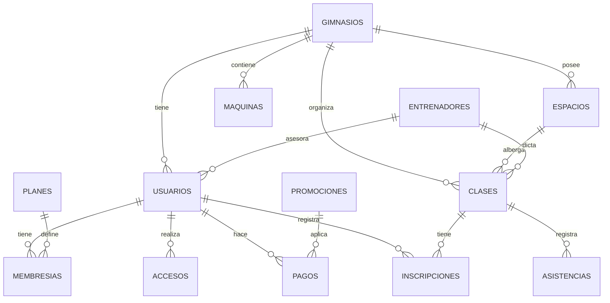

# FASE 5: BASE DE DATOS

> **Proyecto**: GYMsos  
> **Fase**: 5 - Diseño de Base de Datos  
> **Versión**: 2.0 (13 INNOVACIONES)  
> **Fecha**: 2026-05-15  
> **Tablas**: 14 → 29 (+15 nuevas)

---

## 📊 DIAGRAMA ENTIDAD-RELACIÓN (ER)



---

## 📋 DICCIONARIO DE DATOS

### **Tabla: usuarios**
| Campo | Tipo | Restricción | Descripción |
|-------|------|-------------|-------------|
| id_usuario | UUID | PK | ID único del usuario |
| email | VARCHAR(255) | UNIQUE, NOT NULL | Email único |
| contraseña_hash | VARCHAR(255) | NOT NULL | Contraseña encriptada (bcrypt) |
| nombre | VARCHAR(100) | NOT NULL | Nombre completo |
| telefono | VARCHAR(20) | | Teléfono contacto |
| fecha_nacimiento | DATE | | Fecha de nacimiento |
| documento | VARCHAR(20) | UNIQUE | Cédula/DNI |
| genero | ENUM | | M, F, Otro |
| id_gimnasio | UUID | FK | Gimnasio asociado |
| rol | ENUM | NOT NULL | miembro, entrenador, recepcionista, gerente |
| estado | ENUM | NOT NULL | activo, inactivo, suspendido |
| created_at | TIMESTAMP | NOT NULL | Fecha de registro |
| updated_at | TIMESTAMP | | Última actualización |

### **Tabla: gimnasios**
| Campo | Tipo | Restricción | Descripción |
|-------|------|-------------|-------------|
| id_gimnasio | UUID | PK | ID único |
| nombre | VARCHAR(150) | NOT NULL | Nombre del gimnasio |
| direccion | VARCHAR(255) | | Dirección física |
| ciudad | VARCHAR(100) | | Ciudad |
| pais | VARCHAR(100) | | País |
| telefono | VARCHAR(20) | | Teléfono principal |
| email | VARCHAR(255) | | Email contacto |
| plan_suscripcion | ENUM | NOT NULL | pequeño, mediano, grande, enterprise |
| fecha_inicio_suscripcion | DATE | NOT NULL | Cuando inició su suscripción |
| fecha_renovacion | DATE | | Próxima fecha de renovación |
| estado | ENUM | NOT NULL | activo, pausado, cancelado |
| created_at | TIMESTAMP | NOT NULL | Fecha de registro |

### **Tabla: membresias**
| Campo | Tipo | Restricción | Descripción |
|-------|------|-------------|-------------|
| id_membresia | UUID | PK | ID único |
| id_usuario | UUID | FK | Usuario que posee membresía |
| id_plan | UUID | FK | Plan contratado |
| fecha_inicio | DATE | NOT NULL | Fecha de activación |
| fecha_vencimiento | DATE | NOT NULL | Fecha de vencimiento |
| estado | ENUM | NOT NULL | activa, vencida, cancelada, suspendida |
| motivo_cancelacion | VARCHAR(255) | | Razón de cancelación |
| created_at | TIMESTAMP | NOT NULL | Fecha de registro |

### **Tabla: planes**
| Campo | Tipo | Restricción | Descripción |
|-------|------|-------------|-------------|
| id_plan | UUID | PK | ID único |
| nombre | VARCHAR(100) | NOT NULL | Nombre del plan |
| precio_mensual | DECIMAL(10,2) | NOT NULL | Precio por mes |
| precio_trimestral | DECIMAL(10,2) | | Precio por 3 meses (con descuento) |
| precio_anual | DECIMAL(10,2) | | Precio por año (con descuento) |
| duracion_dias | INT | NOT NULL | Duración en días (30, 90, 365) |
| clases_incluidas | INT | | Número de clases por semana (-1 = ilimitadas) |
| horarios_acceso | VARCHAR(100) | | Restricción horaria (ej: "6-22") |
| sucursales_incluidas | ENUM | NOT NULL | una, todas |
| descripcion | TEXT | | Descripción del plan |
| activo | BOOLEAN | NOT NULL | Si el plan está disponible |

### **Tabla: pagos**
| Campo | Tipo | Restricción | Descripción |
|-------|------|-------------|-------------|
| id_pago | UUID | PK | ID único |
| id_usuario | UUID | FK | Usuario que pagó |
| id_membresia | UUID | FK | Membresía asociada |
| monto | DECIMAL(10,2) | NOT NULL | Cantidad pagada |
| moneda | VARCHAR(3) | NOT NULL | Moneda (USD, COP, PEN) |
| metodo_pago | ENUM | NOT NULL | tarjeta, transferencia, efectivo |
| id_transaccion_stripe | VARCHAR(100) | | ID de transacción en plataforma |
| estado | ENUM | NOT NULL | pendiente, completado, fallido, reembolsado |
| fecha_pago | TIMESTAMP | NOT NULL | Cuándo se procesó |
| proxima_renovacion | DATE | | Próxima fecha de cobro automático |
| created_at | TIMESTAMP | NOT NULL | Fecha de registro |

### **Tabla: accesos**
| Campo | Tipo | Restricción | Descripción |
|-------|------|-------------|-------------|
| id_acceso | UUID | PK | ID único |
| id_usuario | UUID | FK | Usuario que accede |
| id_gimnasio | UUID | FK | Gimnasio al que accede |
| fecha_hora_entrada | TIMESTAMP | NOT NULL | Cuándo entró |
| fecha_hora_salida | TIMESTAMP | | Cuándo salió |
| tipo_acceso | ENUM | NOT NULL | qr, biometria, manual |
| estado_acceso | ENUM | NOT NULL | permitido, denegado |
| razon_denegacion | VARCHAR(255) | | Razón si fue denegado |
| created_at | TIMESTAMP | NOT NULL | Fecha de registro |

### **Tabla: espacios**
| Campo | Tipo | Restricción | Descripción |
|-------|------|-------------|-------------|
| id_espacio | UUID | PK | ID único |
| id_gimnasio | UUID | FK | Gimnasio propietario |
| nombre | VARCHAR(100) | NOT NULL | Nombre (ej: Sala 1, Pesas, Yoga) |
| tipo | ENUM | NOT NULL | salon, area_pesas, cardio, yoga, otros |
| capacidad_maxima | INT | NOT NULL | Máximo de personas simultáneas |
| tiene_aire_acondicionado | BOOLEAN | | Si cuenta con AC |
| horario_disponibilidad | VARCHAR(100) | | Horario disponible (ej: "6-23") |
| estado | ENUM | NOT NULL | disponible, en_uso, en_mantenimiento |

### **Tabla: maquinas**
| Campo | Tipo | Restricción | Descripción |
|-------|------|-------------|-------------|
| id_maquina | UUID | PK | ID único |
| id_espacio | UUID | FK | Espacio donde se encuentra |
| codigo_qr | VARCHAR(100) | UNIQUE | Código QR para acceso a tutorial |
| nombre | VARCHAR(100) | NOT NULL | Nombre de la máquina |
| marca | VARCHAR(100) | | Marca/Fabricante |
| modelo | VARCHAR(100) | | Modelo |
| fecha_compra | DATE | | Fecha de adquisición |
| fecha_mantenimiento_ultimo | DATE | | Último mantenimiento |
| fecha_mantenimiento_proximo | DATE | | Próximo mantenimiento programado |
| estado | ENUM | NOT NULL | operativa, en_mantenimiento, dañada, fuera_de_servicio |
| url_video_tutorial | VARCHAR(255) | | URL del video en YouTube |
| notas_seguridad | TEXT | | Advertencias de seguridad |

### **Tabla: clases**
| Campo | Tipo | Restricción | Descripción |
|-------|------|-------------|-------------|
| id_clase | UUID | PK | ID único |
| id_gimnasio | UUID | FK | Gimnasio que dicta la clase |
| id_entrenador | UUID | FK | Entrenador que la dicta |
| id_espacio | UUID | FK | Espacio donde se realiza |
| nombre | VARCHAR(100) | NOT NULL | Nombre de la clase (ej: Zumba, CrossFit) |
| descripcion | TEXT | | Descripción e instrucciones |
| capacidad_maxima | INT | NOT NULL | Máx participantes |
| nivel | ENUM | | principiante, intermedio, avanzado |
| fecha_hora_inicio | TIMESTAMP | NOT NULL | Cuándo comienza |
| duracion_minutos | INT | NOT NULL | Duración en minutos |
| recurrencia | ENUM | | unica, diaria, semanal, mensual |
| dias_semana | VARCHAR(50) | | Si recurrente: "lun,mie,vie" |
| estado | ENUM | NOT NULL | programada, en_curso, finalizada, cancelada |
| created_at | TIMESTAMP | NOT NULL | Fecha de creación |

### **Tabla: inscripciones**
| Campo | Tipo | Restricción | Descripción |
|-------|------|-------------|-------------|
| id_inscripcion | UUID | PK | ID único |
| id_usuario | UUID | FK | Usuario inscrito |
| id_clase | UUID | FK | Clase en que se inscribe |
| fecha_inscripcion | TIMESTAMP | NOT NULL | Cuándo se inscribió |
| estado | ENUM | NOT NULL | inscrito, asistio, ausente, cancelado |
| notificacion_enviada | BOOLEAN | | Si se envió recordatorio |
| created_at | TIMESTAMP | NOT NULL | Fecha de registro |

### **Tabla: asistencias**
| Campo | Tipo | Restricción | Descripción |
|-------|------|-------------|-------------|
| id_asistencia | UUID | PK | ID único |
| id_usuario | UUID | FK | Usuario que asistió |
| id_clase | UUID | FK | Clase a la que asistió |
| fecha_asistencia | TIMESTAMP | NOT NULL | Fecha/hora de asistencia |
| estado_asistencia | ENUM | NOT NULL | presente, ausente, llegada_tarde |
| minutos_asistidos | INT | | Minutos que estuvo presente |
| created_at | TIMESTAMP | NOT NULL | Fecha de registro |

### **Tabla: entrenadores**
| Campo | Tipo | Restricción | Descripción |
|-------|------|-------------|-------------|
| id_entrenador | UUID | PK | ID único |
| id_usuario | UUID | FK | Usuario asociado |
| especialidades | VARCHAR(255) | | Áreas de expertise (ej: "CrossFit, Pilates") |
| certificaciones | TEXT | | Certificaciones profesionales |
| biografia | TEXT | | Descripción profesional |
| rating_promedio | DECIMAL(3,2) | | Puntuación (1-5) |
| total_clientes_activos | INT | | Número de clientes activos |
| total_clases_dictadas | INT | | Histórico de clases |

### **Tabla: promociones**
| Campo | Tipo | Restricción | Descripción |
|-------|------|-------------|-------------|
| id_promocion | UUID | PK | ID único |
| id_gimnasio | UUID | FK | Gimnasio que ofrece |
| codigo | VARCHAR(50) | UNIQUE | Código de promoción |
| tipo_descuento | ENUM | NOT NULL | porcentaje, monto_fijo |
| valor_descuento | DECIMAL(10,2) | NOT NULL | Porcentaje o cantidad |
| descripcion | VARCHAR(255) | | Descripción de la oferta |
| fecha_inicio | DATE | NOT NULL | Cuándo inicia |
| fecha_fin | DATE | NOT NULL | Cuándo termina |
| limite_uso | INT | | Usos máximos permitidos |
| usos_realizados | INT | DEFAULT 0 | Usos realizados hasta ahora |
| estado | ENUM | NOT NULL | activa, pausada, finalizada |

---

## 🚀 NUEVAS TABLAS (13 INNOVACIONES)

### **Tabla: churn_predictions**
| Campo | Tipo | Restricción | Descripción |
|-------|------|-------------|-------------|
| id_prediction | UUID | PK | ID única de predicción |
| id_usuario | UUID | FK | Usuario analizado |
| probability_churn | DECIMAL(3,2) | NOT NULL | Probabilidad abandono (0-1) |
| score_riesgo | INT | NOT NULL | Score 0-100 |
| dias_para_abandono | INT | | Días estimados hasta abandono |
| razon_principal | VARCHAR(255) | | Motivo estimado (inactividad, precio, etc.) |
| ultima_sesion | DATE | | Última vez que entró |
| fecha_prediccion | TIMESTAMP | NOT NULL | Cuándo se generó predicción |
| accion_ejecutada | VARCHAR(255) | | Intervención aplicada (descuento, clase gratis) |
| resultado | ENUM | | resultado: abandono, retenido, desconocido |

---

### **Tabla: gamification_xp**
| Campo | Tipo | Restricción | Descripción |
|-------|------|-------------|-------------|
| id_xp | UUID | PK | ID único |
| id_usuario | UUID | FK | Usuario que gana XP |
| tipo_evento | VARCHAR(50) | NOT NULL | sesion, nueva_pr, clase_asistida, reto_clan, achievement |
| cantidad_xp | INT | NOT NULL | XP otorgados |
| descripcion | VARCHAR(255) | | "Completaste sesión de pesas (+100 XP)" |
| id_referencia | UUID | | Referencia a sesión/clase/reto |
| fecha_evento | TIMESTAMP | NOT NULL | Cuándo ocurrió |

---

### **Tabla: gamification_levels**
| Campo | Tipo | Restricción | Descripción |
|-------|------|-------------|-------------|
| id_usuario | UUID | FK, PK | Usuario |
| xp_total | INT | NOT NULL | XP acumulado |
| nivel_actual | INT | NOT NULL | 0-100 |
| xp_proxim_nivel | INT | NOT NULL | XP faltante para próximo nivel |
| fecha_ultimo_nivel | TIMESTAMP | | Cuándo alcanzó último nivel |
| fecha_actualizacion | TIMESTAMP | NOT NULL | Última actualización |

---

### **Tabla: battle_pass_progression**
| Campo | Tipo | Restricción | Descripción |
|-------|------|-------------|-------------|
| id_progression | UUID | PK | ID única |
| id_usuario | UUID | FK | Usuario |
| temporada | VARCHAR(20) | NOT NULL | "S1", "S2", etc. |
| tipo | ENUM | NOT NULL | free, premium |
| progreso_porcentaje | INT | NOT NULL | 0-100 |
| tier_actual | INT | NOT NULL | 1-50 |
| recompensas_desbloqueadas | INT | NOT NULL | Cantidad de recompensas obtenidas |
| fecha_inicio | DATE | NOT NULL | Inicio de temporada |
| fecha_fin | DATE | NOT NULL | Fin de temporada |

---

### **Tabla: clanes**
| Campo | Tipo | Restricción | Descripción |
|-------|------|-------------|-------------|
| id_clan | UUID | PK | ID único |
| nombre | VARCHAR(100) | NOT NULL | Nombre del clan |
| id_lider | UUID | FK | Líder del clan |
| descripcion | TEXT | | Descripción del clan |
| capacidad_maxima | INT | NOT NULL | Máximo 20 miembros |
| xp_clan | INT | NOT NULL | XP acumulado grupo |
| ranking | INT | | Posición en leaderboard |
| fecha_creacion | TIMESTAMP | NOT NULL | Cuándo se creó |

---

### **Tabla: clan_miembros**
| Campo | Tipo | Restricción | Descripción |
|-------|------|-------------|-------------|
| id_clan | UUID | FK, PK | Clan |
| id_usuario | UUID | FK, PK | Miembro |
| rol_clan | ENUM | | lider, oficial, miembro |
| fecha_union | TIMESTAMP | NOT NULL | Cuándo se unió |
| contribucion_xp | INT | | XP que aportó al clan |

---

### **Tabla: torneos_semanales**
| Campo | Tipo | Restricción | Descripción |
|-------|------|-------------|-------------|
| id_torneo | UUID | PK | ID única |
| id_gimnasio | UUID | FK | Gimnasio que organiza |
| nombre | VARCHAR(100) | NOT NULL | "Leg Day Challenge", "Cardio Kings" |
| tipo_metrica | VARCHAR(50) | NOT NULL | volumen, tiempo, reps_maximas |
| descripcion | TEXT | | Detalles del torneo |
| fecha_inicio | TIMESTAMP | NOT NULL | Cuándo inicia |
| fecha_fin | TIMESTAMP | NOT NULL | Cuándo termina |
| premios_texto | VARCHAR(255) | | "Insignia Gold, 500 XP, descuento merchandise" |

---

### **Tabla: digital_twin**
| Campo | Tipo | Restricción | Descripción |
|-------|------|-------------|-------------|
| id_usuario | UUID | FK, PK | Usuario |
| altura_cm | INT | | Altura en cm (para avatar) |
| peso_kg | DECIMAL(5,2) | | Peso en kg actual |
| peso_kg_inicial | DECIMAL(5,2) | | Peso al registrarse |
| porcentaje_grasa | DECIMAL(5,2) | | Body fat % estimado |
| configuracion_avatar | JSON | | {color, estilo, ropa} |
| prediccion_12w | TEXT | | Descripción de predicción |
| fecha_actualizacion | TIMESTAMP | NOT NULL | Última actualización de datos |

---

### **Tabla: marketplace_vendors**
| Campo | Tipo | Restricción | Descripción |
|-------|------|-------------|-------------|
| id_vendor | UUID | PK | ID único |
| tipo | ENUM | NOT NULL | trainer, nutritionist, supplement_brand, wearable, merchandise |
| nombre | VARCHAR(255) | NOT NULL | Nombre profesional/marca |
| email | VARCHAR(255) | UNIQUE | Contacto |
| descripcion | TEXT | | Bio profesional |
| certificaciones | TEXT | | Listado de certificaciones |
| tarifa | DECIMAL(10,2) | | Precio por servicio |
| rating_promedio | DECIMAL(3,2) | | Calificación 1-5 |
| total_clientes | INT | | Número de clientes servidos |
| estado | ENUM | NOT NULL | activo, pausado, inactivo |
| created_at | TIMESTAMP | NOT NULL | Fecha de registro |

---

### **Tabla: marketplace_transactions**
| Campo | Tipo | Restricción | Descripción |
|-------|------|-------------|-------------|
| id_transaccion | UUID | PK | ID única |
| id_usuario | UUID | FK | Comprador/cliente |
| id_vendor | UUID | FK | Vendedor |
| tipo | VARCHAR(50) | NOT NULL | coaching_session, nutrition_plan, supplement, merchandise |
| monto | DECIMAL(10,2) | NOT NULL | Monto transacción |
| comision_gymsos | DECIMAL(10,2) | NOT NULL | 30% del monto |
| estado | ENUM | NOT NULL | pendiente, completada, cancelada |
| fecha_transaccion | TIMESTAMP | NOT NULL | Cuándo ocurrió |

---

### **Tabla: corporate_clients**
| Campo | Tipo | Restricción | Descripción |
|-------|------|-------------|-------------|
| id_corporativo | UUID | PK | ID único |
| nombre_empresa | VARCHAR(255) | NOT NULL | Nombre de empresa |
| contacto_hr | VARCHAR(100) | NOT NULL | Nombre de contacto |
| email_hr | VARCHAR(255) | | Email de contacto HR |
| cantidad_empleados | INT | NOT NULL | Cuántos empleados |
| cantidad_membresías | INT | NOT NULL | Membresías compradas |
| precio_por_empleado | DECIMAL(5,2) | NOT NULL | Precio negociado |
| fecha_inicio_contrato | DATE | NOT NULL | Cuándo inició |
| fecha_renovacion | DATE | | Próxima renovación |
| estado | ENUM | NOT NULL | activa, pausada, cancelada |

---

### **Tabla: corporate_leaderboards**
| Campo | Tipo | Restricción | Descripción |
|-------|------|-------------|-------------|
| id_leaderboard | UUID | PK | ID única |
| id_corporativo | UUID | FK | Empresa |
| departamento | VARCHAR(100) | NOT NULL | "IT", "Finanzas", etc. |
| xp_acumulado | INT | NOT NULL | XP suma de miembros |
| ranking | INT | | Posición entre departamentos |
| fecha_actualizacion | TIMESTAMP | NOT NULL | Última actualización |

---

### **Tabla: churn_interventions**
| Campo | Tipo | Restricción | Descripción |
|-------|------|-------------|-------------|
| id_intervencion | UUID | PK | ID única |
| id_usuario | UUID | FK | Usuario objetivo |
| id_prediction | UUID | FK | Predicción asociada |
| tipo_intervencion | VARCHAR(50) | NOT NULL | descuento, clase_gratis, coaching, reto_especial |
| oferta_valor | VARCHAR(255) | | Detalles de la oferta |
| fecha_oferta | TIMESTAMP | NOT NULL | Cuándo se ofreció |
| resultado | ENUM | | aceptada, rechazada, sin_respuesta |
| fecha_respuesta | TIMESTAMP | | Cuándo respondió |

---

### **Tabla: wearable_sync**
| Campo | Tipo | Restricción | Descripción |
|-------|------|-------------|-------------|
| id_sync | UUID | PK | ID única |
| id_usuario | UUID | FK | Usuario |
| tipo_wearable | VARCHAR(50) | NOT NULL | apple_watch, garmin, whoop, fitbit |
| token_autenticacion | VARCHAR(255) | ENCRYPTED | Token para acceso a API |
| ultima_sincronizacion | TIMESTAMP | | Última vez que sincronizó |
| datos_salud_json | JSON | | {pasos, calorias, ritmo_cardiaco, sueno, estres} |
| fecha_actualizacion | TIMESTAMP | NOT NULL | Última actualización |

---

### **Tabla: health_alerts**
| Campo | Tipo | Restricción | Descripción |
|-------|------|-------------|-------------|
| id_alerta | UUID | PK | ID única |
| id_usuario | UUID | FK | Usuario |
| tipo_alerta | VARCHAR(50) | NOT NULL | ritmo_cardiaco_alto, sueno_bajo, presion_alta |
| descripcion | VARCHAR(255) | NOT NULL | "Ritmo cardíaco 20% más alto que normal" |
| severidad | ENUM | NOT NULL | baja, media, alta |
| fecha_alerta | TIMESTAMP | NOT NULL | Cuándo se generó |
| leida | BOOLEAN | DEFAULT false | Si usuario la vio |
| accion_recomendada | VARCHAR(255) | | "Consulta médico", "Prueba yoga" |

---

### **Tabla: ai_recommendations**
| Campo | Tipo | Restricción | Descripción |
|-------|------|-------------|-------------|
| id_recomendacion | UUID | PK | ID única |
| id_usuario | UUID | FK | Usuario |
| tipo | VARCHAR(50) | NOT NULL | rutina, clase, upsell, descuento, reto |
| contenido_json | JSON | NOT NULL | {rutina details / clase details / oferta} |
| score_relevancia | DECIMAL(3,2) | | 0-1, confianza del modelo |
| mostrada | BOOLEAN | DEFAULT false | Si fue mostrada al usuario |
| aceptada | BOOLEAN | | Si usuario la aceptó |
| fecha_generacion | TIMESTAMP | NOT NULL | Cuándo se generó |

---

### **Tabla: dynamic_pricing_log**
| Campo | Tipo | Restricción | Descripción |
|-------|------|-------------|-------------|
| id_pricing | UUID | PK | ID única |
| id_gimnasio | UUID | FK | Gimnasio |
| zona_geografica | VARCHAR(100) | | Ciudad/región |
| precio_anterior | DECIMAL(10,2) | | Precio antes |
| precio_nuevo | DECIMAL(10,2) | | Precio aplicado |
| razon | VARCHAR(255) | | "Churn alto en zona", "Demanda alta" |
| fecha_cambio | TIMESTAMP | NOT NULL | Cuándo cambió |
| actividad | ENUM | | aplicada, revertida |

---

## 🗄️ MODELO RELACIONAL NORMALIZADO

**Normalización**:
- ✅ **1FN**: Sin repetición de grupos, valores atómicos
- ✅ **2FN**: Sin dependencias parciales, todas las claves primarias
- ✅ **3FN**: Sin dependencias transitivas

**Ejemplo de 3FN en tabla `usuarios`**:
- `id_usuario` → `nombre`, `email`, `telefono` (Dependencia directa)
- NO hay `id_usuario` → `nombre_gimnasio` (Eso va en tabla `gimnasios`)

---

## 🔑 ÍNDICES Y OPTIMIZACIONES

### **Índices Principales**
```sql
-- Búsqueda por email
CREATE INDEX idx_usuarios_email ON usuarios(email);

-- Búsqueda de membresías activas
CREATE INDEX idx_membresias_usuario_estado ON membresias(id_usuario, estado);

-- Búsqueda de accesos por fecha
CREATE INDEX idx_accesos_fecha ON accesos(fecha_hora_entrada);

-- Búsqueda de clases próximas
CREATE INDEX idx_clases_fecha_hora ON clases(fecha_hora_inicio);

-- Búsqueda de pagos pendientes
CREATE INDEX idx_pagos_estado ON pagos(id_usuario, estado);

-- Búsqueda de asistencia
CREATE INDEX idx_asistencias_usuario_fecha ON asistencias(id_usuario, fecha_asistencia);
```

### **Optimizaciones**
- Particionamiento por fecha en tabla `accesos` (12 meses)
- Vistas materializadas para dashboards (actualizar cada 1 hora)
- Caché Redis para sesiones de usuario

---

## 🔐 POLÍTICAS DE SEGURIDAD E INTEGRIDAD

### **Constraints**
```sql
-- FK: membresía usuario válido
ALTER TABLE membresias 
ADD CONSTRAINT fk_membresia_usuario 
FOREIGN KEY (id_usuario) REFERENCES usuarios(id_usuario);

-- CHECK: fecha vencimiento > fecha inicio
ALTER TABLE membresias 
ADD CONSTRAINT chk_fecha_membresia 
CHECK (fecha_vencimiento > fecha_inicio);

-- CHECK: monto de pago > 0
ALTER TABLE pagos 
ADD CONSTRAINT chk_monto_positivo 
CHECK (monto > 0);
```

### **Triggers de Auditoría**
```sql
-- Auditar cambios en membresías
CREATE TRIGGER audit_cambio_membresia
AFTER UPDATE ON membresias
FOR EACH ROW
BEGIN
  INSERT INTO audit_log (tabla, accion, usuario, fecha, cambio)
  VALUES ('membresias', 'UPDATE', CURRENT_USER, NOW(), 
          CONCAT('Estado: ', OLD.estado, ' → ', NEW.estado));
END;
```

---

## 📊 VOLUMEN DE DATOS ESTIMADO

| Tabla | Registros (5000 miembros) | Tamaño |
|-------|--------------------------|--------|
| usuarios | 6,000 (5000 + staff) | ~2 MB |
| membresias | 5,000 | ~1 MB |
| accesos | 1,250,000 (5 accesos/semana) | ~150 MB |
| pagos | 60,000 (12 meses) | ~10 MB |
| clases | 5,000 (10 clases/día) | ~2 MB |
| inscripciones | 500,000 | ~50 MB |
| asistencias | 450,000 | ~45 MB |
| **TOTAL** | | **~260 MB** |

Crecimiento anual proyectado: 3-4x (año 1 a año 3)

---

## 🔄 ESTRATEGIA DE BACKUP Y RECUPERACIÓN

### **Backup**
- **Diario**: Backup completo a las 2 AM UTC
- **Hora a hora**: Snapshots incrementales
- **Almacenamiento**: AWS S3 + Google Cloud (redundancia geográfica)
- **Retención**: 30 días backups completos, 6 meses archivados

### **Recovery**
- **RTO** (Recovery Time Objective): 2 horas máximo
- **RPO** (Recovery Point Objective): 1 hora máximo
- **Testing**: Recuperación de prueba cada mes

---

## 🔐 MIGRACIÓN Y VERSIONADO

### **Migraciones Iniciales**
```
v1.0 (2026-05): Schema inicial
├── usuarios, gimnasios, membresias, planes
├── pagos, accesos, espacios, maquinas
└── clases, inscripciones, asistencias

v1.1 (2026-06): Agregaciones analíticas
├── tabla: dashboard_cache
└── vistas: asistencia_mensual, ingresos_diarios

v1.2 (2026-07): Multi-sucursal
├── alter table: agregar id_gimnasio multi
└── indices: optimizar búsquedas por sucursal
```

### **Estrategia de Cambios Futuros**
- Migraciones versionadas (numeradas: 001, 002, etc.)
- Testing automático en staging
- Rollback automático en caso de fallo

---

*FASE_5_BASE_DATOS.md — Diseño técnico de base de datos v1.0*
