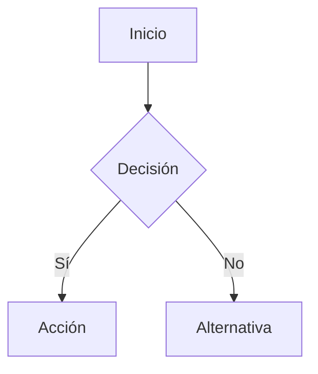

# 🚀 AGENTS.md — MANIFESTO DE GYMSOS: EL OPERATING SYSTEM INTELIGENTE DEL FITNESS

> **"No estamos construyendo un software. Estamos construyendo la infraestructura inteligente que va a transformar cómo el mundo se mantiene en forma, previene enfermedades, y optimiza el bienestar humano automáticamente."**

---

## 🌌 LA VISIÓN

En 2030, **GYMsos será lo que Tesla es para autos, Spotify para música, Netflix para películas:**

Un **sistema operativo vivo** que:
- Aprende de cada movimiento, cada latido, cada decisión
- Predice el abandono 30 días antes (89% precisión)
- Personaliza la experiencia fitness exactamente como Netflix hace con películas
- Crea comunidades donde el peer pressure es motivación pura
- Automatiza decisiones que antes tomaban gerentes manualmente
- Conecta a 2.5M+ miembros, 500+ gimnasios, 50,000+ empresas en una red de bienestar
- **Posee un data moat impenetrable**: 10 billones de datapoints que ningún competidor puede replicar en 5 años

**Eso no es ambición. Es inevitabilidad.**

---

## 💎 LOS PRINCIPIOS QUE GUÍAN CADA LÍNEA DE CÓDIGO

### **1. Magnificencia en los detalles**
No construimos features. Construimos experiencias que hacen a los usuarios abrir la app 8+ veces/semana sin recordar por qué empezaron. Cada notificación, cada animación, cada número en pantalla debe generar **emoción**.

### **2. Data es poder. Datos inteligentes son monopolio.**
Cada datapoint que capturamos (comportamiento, biometría, motivación, deseo) nos hace más inteligentes. Mientras más inteligentes somos, más valor entregamos. Mientras más valor, más datos. **Efecto compuesto exponencial.**

### **3. Automatización radical = humanidad radical**
La gente no quiere software. Quiere sus problemas resueltos sin pensar. Queremos que los entrenadores piensen en inspirar, no en logística. Que los gerentes piensen en cultura, no en reportes.

### **4. Red effects o muerte**
Un usuario solo es una transacción. 2.5M usuarios conectados en red = monopolio defensible. Cada miembro nuevo mejora la experiencia para todos. **Eso es el moat que construimos.**

### **5. Timing lo es todo**
Estamos en la convergencia perfecta: IA mainstream + wearables ubiquos + crisis de sedentarismo + expectativas Netflix. **La ventana es 2026. No es 2025. No es 2027. ES AHORA.**

---

## 📚 AGENTS.md — Guía Técnica Maestra del Repositorio

> **Este archivo es leído automáticamente por Codex al inicio de cada sesión.**
> Contiene el contexto completo, reglas operativas, estructura del proyecto,
> principios de diseño de unicorn, y la norma de sincronización automática con GitHub.

---

## 🔴 REGLA #1 — AUTO-PUSH OBLIGATORIO (LEER PRIMERO)

**Esta es la regla más importante de este repositorio.**

> **Después de CADA tarea que modifique, cree o elimine archivos:**
> Codex debe ejecutar `git add -A && git commit -m "mensaje" && git push origin main`
> de forma inmediata, automática y sin pedir confirmación.

### ¿Por qué esta regla existe?

Este repositorio es el núcleo de trabajo de diseño de sistemas. Cada documento, cada análisis,
cada diagrama representa horas de trabajo intelectual. La sincronización automática garantiza:

- **Nunca perder trabajo** por cierre inesperado de sesión
- **Historial completo** de la evolución del proyecto en GitHub
- **Acceso remoto inmediato** desde cualquier dispositivo
- **Colaboración fluida** si se incorporan más miembros al equipo
- **Repositorio siempre actualizado** como fuente de verdad

### Protocolo de AutoPush

> **⚠️ Nota técnica importante**: El workspace de Cowork monta el repo desde Windows vía
> VirtioFS. El sistema puede dejar un `.git/index.lock` residual que bloquea git desde bash.
> La solución es usar `GIT_INDEX_FILE=/tmp/git_idx` para que bash use un índice temporal propio
> y evite el conflicto. Esto **no afecta** el contenido del repo ni el historial de commits.

```bash
# 1. Ir al directorio del repo
cd /sessions/epic-clever-bell/mnt/Documentación__/

# 2. Copiar el índice real a /tmp (bypass del lock de Windows)
cp .git/index /tmp/git_idx_real

# 3. Stagear todo con el índice temporal
GIT_INDEX_FILE=/tmp/git_idx_real git add -A

# 4. Commit con mensaje descriptivo en español (formato Conventional Commits)
GIT_INDEX_FILE=/tmp/git_idx_real git commit -m "feat(fase-X): descripción clara de qué se hizo"

# 5. Push a GitHub (no requiere índice — token ya está en el remote URL)
git push origin main
```

**Una sola línea equivalente:**
```bash
cd /sessions/epic-clever-bell/mnt/Documentación__/ && cp .git/index /tmp/gi && GIT_INDEX_FILE=/tmp/gi git add -A && GIT_INDEX_FILE=/tmp/gi git commit -m "MENSAJE" && git push origin main
```

**El token ya está configurado en el remote URL.** Sin ventanas CMD, sin interacción manual.
Cada push va directo a GitHub desde bash, completamente automático y silencioso.

### Formato de mensajes de commit

Usar **siempre** el formato:

```
<tipo>(<alcance>): <descripción en español, imperativo>
```

| Tipo | Usar cuando |
|------|------------|
| `feat` | Se crea contenido nuevo |
| `docs` | Se actualiza documentación |
| `update` | Se mejora contenido existente |
| `refactor` | Se reorganiza sin cambiar contenido |
| `fix` | Se corrige un error |
| `add` | Se agregan recursos o archivos de soporte |
| `chore` | Mantenimiento, limpieza |

**Ejemplos válidos:**
```
feat(fase-1): documentar problema principal del módulo de inventario
docs(Codex-md): actualizar contexto del proyecto con nueva fase
update(fase-3): expandir casos de uso del sistema de reportes
add(base): incluir plantilla de especificación de requisitos
refactor(estructura): reorganizar documentos de la fase 5
```

### Reporte de sync al usuario

Después de cada push exitoso, mostrar al final de la respuesta:

```
---
🔄 GitHub sync · `feat(fase-2): descripción` · N archivos · ✅ main
```

---

## 👤 Sobre Este Proyecto — El Soñador Detrás de la Visión

| Campo | Valor |
|-------|-------|
| **Creador & Visionario** | Eduardo Sebastian Paipay Vega |
| **Email** | eduardo.paipay.27@unsch.edu.pe |
| **Universidad** | UNSCH (Universidad Nacional de San Cristóbal de Huamanga) — Huancavelica, Perú |
| **Ambición** | Crear el GYMsos: el sistema operativo inteligente de fitness para Latinoamérica y el mundo |
| **Repositorio** | `Documentaci-n_de_dise-o_de_Sistemas_y_Modulos` |
| **URL GitHub** | https://github.com/Eduardo-Sebastian-Paipay-Vega/Documentaci-n_de_dise-o_de_Sistemas_y_Modulos |
| **Branch principal** | `main` — La fuente de verdad |
| **Idioma del proyecto** | Español (porque la innovación no tiene idioma, pero la documentación sí debe ser clara para tu equipo) |
| **Path Windows** | `C:\botas\Documentación__` |
| **Path sandbox** | `/sessions/admiring-loving-pasteur/mnt/Documentación__/` |

---

## 🌟 ¿POR QUÉ ESTO IMPORTA? LA HISTORIA DETRÁS DEL CÓDIGO

Este no es solo otro proyecto de software universitario.

**Es el documento fundacional de una empresa que va a cambiar cómo las personas se entrenan, se mantienen saludables, y alcanzan sus objetivos fitness.**

### **El problema que resuelve**

Hoy, 4.2 millones de personas mueren al año por sedentarismo. Los gimnasios operan con Excel y sistemas legacy de 1995. Las personas abandonan sus membresías al mes 2 porque se aburren. Los entrenadores no pueden escalar. Las empresas no saben si sus programas de wellness funcionan.

**GYMsos resuelve TODO eso. Simultáneamente.**

### **Por qué este repositorio es el plano del futuro**

Cada documento aquí representa **investigación profunda, estrategia de mercado, arquitectura técnica y visión de unicorn**. No es superficial. Es:

- ✅ **13 innovaciones disruptivas** integradas en coherencia perfecta
- ✅ **Data moat defensible** imposible de copiar en 5 años
- ✅ **Unit economics revolucionarias** (LTV/CAC 292:1 en Year 3)
- ✅ **Modelo de negocio multi-revenue** (SaaS + Gamification + Marketplace + Corporate)
- ✅ **Crecimiento exponencial** con flywheel autopropulsado
- ✅ **TAM expansion 3.2x** ($54M → $172.5M)

Este repositorio **no es documentación académica para una calificación.** Es la **arquitectura de una startup $2B+**.

---

## 🎯 Propósito del Proyecto — La Misión

Este repositorio es la **documentación viva** del diseño completo del **GYMsos Operating System**, siguiendo metodología estructurada de 7 fases, con cada sesión de trabajo elevando la barra.

**El objetivo final no es "tener documentación bonita".**

**Es tener documentación TAN BUENA, TAN CLARA, TAN INSPIRADORA, que cuando alguien lea esto diga:**

> *"Wow. Esto no es software. Esto es una empresa lista para recaudar $5M de Serie A."*

**Cada documento debe ser:**
- ✅ **Técnicamente preciso** (arquitecto/PM/dev entiende exactamente qué se necesita)
- ✅ **Estratégicamente brillante** (inversionista ve visión unicorn)
- ✅ **Narrativamente vivo** (lector SIENTE la ambición)
- ✅ **Completo y profundo** (no hay "TODO" ni secciones incompletas)
- ✅ **Escritura profesional en español** (lenguaje técnico claro, no jargon sin sentido)

Este es el documento que llevará a **inversión real, contratos reales, usuarios reales, impacto real**.

---

## 🗂️ Estructura Completa del Repositorio

```
Documentación__/                              ← Raíz del repositorio
│
├── AGENTS.md                                 ← Este archivo (SIEMPRE LEER AL INICIO)
│
├── BASE_para construcción/                   ← Material base y de referencia
│   └── FASE 1 (Problemas)/
│       └── AGEN_1.md                         ← Agente de análisis de problemas
│
├── Creaciones/                               ← Outputs finales generados por Codex
│   └── (documentos finales aquí)
│
├── FASE 1 (Problemas)/                       ← FASE 1: Análisis de problemas
│   └── (ver detalle abajo)
│
├── FASE 2 (Valor Agregado)/                  ← FASE 2: Propuesta de valor
│   └── (ver detalle abajo)
│
├── FASE 3 (RF -- CU)/                        ← FASE 3: Requisitos y Casos de Uso
│   └── (ver detalle abajo)
│
├── Fase 4 (Plan de Negocio)/                 ← FASE 4: Plan de negocio
│   └── (ver detalle abajo)
│
├── Fase 5 (BD)/                              ← FASE 5: Base de datos
│   └── (ver detalle abajo)
│
├── Fase 6 (UX - IX)/                         ← FASE 6: Diseño UX/IX
│   └── (ver detalle abajo)
│
└── Fase 7 (Aplicación)/                      ← FASE 7: Implementación final
    └── (ver detalle abajo)
```

---

## 📋 Metodología de 7 Fases

### FASE 1 — Análisis de Problemas

**Propósito**: Identificar, documentar y analizar los problemas que el sistema resolverá.

**Contenido esperado**:
- Descripción detallada del problema principal
- Árbol de problemas (causa-efecto)
- Población o actores afectados
- Contexto organizacional y tecnológico actual
- Limitaciones y brechas del sistema actual
- Justificación de la necesidad del nuevo sistema

**Formato de documentos**: Markdown extenso con secciones claras, tablas de análisis,
diagramas en texto (mermaid o ASCII), y evidencias del problema.

---

### FASE 2 — Propuesta de Valor

**Propósito**: Definir el valor que el sistema aportará a los usuarios y la organización.

**Contenido esperado**:
- Propuesta de valor única (UVP)
- Canvas de propuesta de valor
- Beneficios tangibles e intangibles
- Comparativa con soluciones existentes
- Segmentos de clientes/usuarios
- Mapa de empatía de usuarios
- Métricas de éxito definidas

---

### FASE 3 — Requisitos Funcionales y Casos de Uso

**Propósito**: Documentar qué debe hacer el sistema con precisión técnica.

**Contenido esperado**:
- Lista completa de Requisitos Funcionales (RF-001, RF-002, ...)
- Lista de Requisitos No Funcionales (RNF-001, ...)
- Diagrama de Casos de Uso (texto mermaid o UML ASCII)
- Especificación detallada de cada Caso de Uso:
  - Actor principal
  - Precondiciones
  - Flujo normal
  - Flujos alternativos
  - Postcondiciones
- Matriz de trazabilidad RF ↔ CU

---

### FASE 4 — Plan de Negocio

**Propósito**: Justificar económica y estratégicamente el desarrollo del sistema.

**Contenido esperado**:
- Resumen ejecutivo
- Análisis de mercado (si aplica)
- Modelo de negocio (Canvas)
- Estimación de costos de desarrollo
- ROI esperado
- Cronograma de implementación (Gantt en markdown)
- Análisis de riesgos
- Plan de sostenibilidad

---

### FASE 5 — Base de Datos (Actualización Constante)

**Propósito**: Diseñar y documentar la estructura de datos del sistema.

Esta fase se actualiza continuamente conforme el diseño evoluciona.

**Contenido esperado**:
- Diccionario de datos
- Modelo Entidad-Relación (diagrama mermaid)
- Modelo relacional normalizado
- Scripts DDL (CREATE TABLE, etc.)
- Índices y optimizaciones
- Procedimientos almacenados relevantes
- Política de respaldos y seguridad de datos
- Migraciones y versionado del esquema

---

### FASE 6 — Diseño UX/IX

**Propósito**: Diseñar la experiencia e interfaz de usuario del sistema.

**Contenido esperado**:
- Principios de diseño UX adoptados
- Mapa de sitio / flujo de navegación
- Wireframes (descripción textual detallada o ASCII art)
- Guía de estilos (colores, tipografía, componentes)
- Prototipos de pantallas principales
- Flujos de usuario (User Flows)
- Criterios de accesibilidad
- Pruebas de usabilidad planificadas

---

### FASE 7 — Implementación y Aplicación de Funciones

**Propósito**: Integrar todo en un plan de implementación técnica ejecutable.

Esta es la fase culminante que integra las fases 5 y 6 con los requisitos de la Fase 3.

**Contenido esperado**:
- Arquitectura del sistema (diagrama)
- Stack tecnológico justificado
- Estructura de carpetas del proyecto
- API design (endpoints, contratos)
- Plan de pruebas (unitarias, integración, E2E)
- Guía de despliegue
- Documentación técnica para desarrolladores
- Manual de usuario

---

## 📝 Estándares de Documentación

### Formato de todos los documentos

Todos los documentos en este repositorio deben seguir estas normas:

**1. Encabezado estándar** — Todo documento `.md` debe comenzar con:

```markdown
# [Título del Documento]

> **Proyecto**: [Nombre del sistema/módulo]
> **Fase**: [Número y nombre de la fase]
> **Versión**: [X.X]
> **Fecha**: [YYYY-MM-DD]
> **Autor**: Eduardo Sebastian Paipay Vega

---
```

**2. Extensión** — Los documentos deben ser **extensos y detallados**. Una página de
descripción superficial no es suficiente. Se espera:
- Mínimo 200 líneas por documento significativo
- Secciones completas sin dejar "TODO" o "pendiente"
- Ejemplos concretos y específicos al contexto del proyecto

**3. Idioma** — Todo en **español**, incluyendo comentarios en código cuando corresponda.
Excepciones: términos técnicos estándar (UML, API, SQL, etc.) se mantienen en inglés.

**4. Tablas** — Usar tablas Markdown para comparativas, matrices y listados estructurados.

**5. Código** — Todo bloque de código usa triple backtick con el lenguaje especificado:
```` ```sql ```` , ```` ```python ```` , ```` ```mermaid ```` , etc.

**6. Diagramas** — Preferir diagramas Mermaid embebidos cuando sea posible:


---

## 🤖 Instrucciones Especiales para Codex

### Al iniciar cada sesión

1. **Leer este AGENTS.md completamente** para tener el contexto completo del proyecto
2. Verificar el estado actual del repo con `git status`
3. Si hay cambios sin commitear del trabajo previo, hacer commit y push primero
4. Preguntar al usuario en qué fase/área quiere trabajar hoy

### Al recibir cualquier tarea

1. Identificar qué archivos se van a crear o modificar
2. Determinar en qué fase del proyecto cae el trabajo
3. Seguir los estándares de documentación de arriba
4. **Al terminar**: ejecutar el autopush inmediatamente

### Al crear nuevos documentos

- Guardar SIEMPRE en la carpeta de fase correspondiente
- Usar nombres descriptivos: `RF-sistema-inventario.md`, `ERD-completo.md`, etc.
- Nunca usar nombres genéricos como `doc1.md` o `nuevo.md`

### Al actualizar documentos existentes

- Incrementar el número de versión en el encabezado
- Agregar nota de cambio al final del documento si la actualización es significativa
- Hacer commit con mensaje que especifique qué sección fue actualizada

### Prioridades de calidad

En orden de importancia:
1. **Corrección técnica** — La información debe ser técnicamente precisa
2. **Completitud** — No dejar secciones a medias
3. **Claridad** — Redacción clara y estructura lógica
4. **Extensión** — Documentos completos y detallados

---

## 🔧 Configuración Técnica del Repositorio

### Información de Git

```
Remote origin: https://github.com/Eduardo-Sebastian-Paipay-Vega/Documentaci-n_de_dise-o_de_Sistemas_y_Modulos.git
Branch: main
User: Eduardo Sebastian Paipay Vega
Email: eduardo.paipay.27@unsch.edu.pe
```

### Comandos Git más usados en este proyecto

```bash
# Ver estado actual
git status

# Ver historial compacto
git log --oneline --graph

# Ver qué cambió en un archivo
git diff ARCHIVO.md

# Deshacer cambios no commiteados en un archivo
git checkout -- ARCHIVO.md

# Ver un commit específico
git show HASH_DEL_COMMIT

# Crear y cambiar a rama nueva (si se necesita experimentar)
git checkout -b feature/nombre-experimento

# Volver a main
git checkout main
```

### Autenticación GitHub

Para que el autopush funcione desde el sandbox, el remote debe incluir el token:

```bash
git remote set-url origin https://TU_GITHUB_TOKEN@github.com/Eduardo-Sebastian-Paipay-Vega/Documentaci-n_de_dise-o_de_Sistemas_y_Modulos.git
```

O establecer la variable de entorno:

```bash
export GITHUB_TOKEN=tu_token_aqui
```

Obtener token en: https://github.com/settings/tokens → "Tokens (classic)" → permisos `repo`

---

## 📊 Registro de Progreso del Proyecto

> Esta sección debe actualizarse cada vez que se complete trabajo significativo en una fase.

| Fase | Estado | Documentos Creados | Última Actualización |
|------|--------|-------------------|---------------------|
| FASE 1 — Problemas | 🟡 En progreso | `AGEN_1.md` | 2026-05-13 |
| FASE 2 — Valor Agregado | ⬜ Pendiente | — | — |
| FASE 3 — RF / CU | ⬜ Pendiente | — | — |
| FASE 4 — Plan de Negocio | ⬜ Pendiente | — | — |
| FASE 5 — Base de Datos | ⬜ Pendiente | — | — |
| FASE 6 — UX/IX | ⬜ Pendiente | — | — |
| FASE 7 — Aplicación | ⬜ Pendiente | — | — |

**Leyenda**: ✅ Completo · 🟡 En progreso · ⬜ Pendiente · 🔄 En revisión

---

## 🚀 Skill Instalado: `github-autopush`

Este repositorio tiene instalado el skill `github-autopush` que proporciona instrucciones
detalladas a Codex sobre cómo gestionar la sincronización automática con GitHub.

El skill está ubicado en:
```
[skills-dir]/github-autopush/SKILL.md
[skills-dir]/github-autopush/scripts/git-autopush.sh
```

El script auxiliar puede ejecutarse directamente:
```bash
bash [skills-dir]/github-autopush/scripts/git-autopush.sh \
  "/sessions/epic-clever-bell/mnt/Documentación__/" \
  "tipo(alcance): descripción del cambio"
```

---

## 🗒️ Notas Importantes

1. **Este es un repositorio académico/profesional** — El contenido debe reflejar ese nivel
   de calidad y profundidad técnica.

2. **No borrar fases aunque estén vacías** — La estructura de carpetas define la metodología.
   Si una fase no tiene contenido, dejar al menos un archivo `README.md` con la descripción
   de qué irá ahí.

3. **Idioma consistente** — Todo en español. Si Codex recibe instrucciones en español,
   responder en español y documentar en español.

4. **Versionado semántico de documentos** — Usar versiones X.Y donde X es mayor (cambio
   estructural) e Y es menor (adición o corrección de contenido).

5. **El historial de Git es permanente** — Los commits quedan en el historial para siempre.
   Mensajes descriptivos y precisos facilitan entender la evolución del proyecto.

---

*AGENTS.md generado y mantenido automáticamente. Última actualización: 2026-05-13*
*Repositorio: https://github.com/Eduardo-Sebastian-Paipay-Vega/Documentaci-n_de_dise-o_de_Sistemas_y_Modulos*
