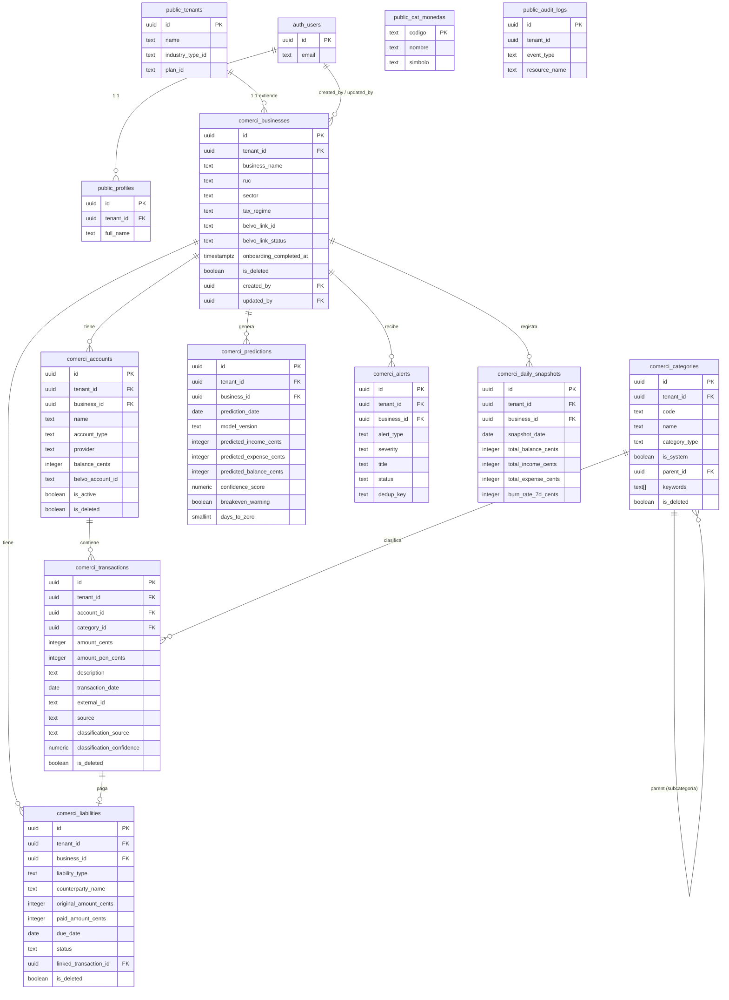

# FASE 5 — Diseño de Base de Datos

> **Proyecto**: Comerci — Sistema Inteligente de Gestión Financiera para MYPEs LATAM
> **Fase**: 5 — Base de Datos
> **Versión**: 3.0
> **Fecha**: 2026-05-18
> **Autor**: Eduardo Sebastian Paipay Vega

---

## TABLA DE CONTENIDOS

1. [Posicionamiento Arquitectónico](#1-posicionamiento-arquitectónico)
2. [Convenciones Globales de la BD Maestra](#2-convenciones-globales-de-la-bd-maestra)
3. [Decisiones de Integración](#3-decisiones-de-integración)
4. [Registro del Módulo Comerci](#4-registro-del-módulo-comerci)
5. [Diccionario de Datos — Schema `comerci`](#5-diccionario-de-datos--schema-comerci)
6. [Script DDL Completo](#6-script-ddl-completo)
7. [Row-Level Security (RLS)](#7-row-level-security-rls)
8. [Índices y Optimizaciones](#8-índices-y-optimizaciones)
9. [Funciones y Procedimientos Almacenados](#9-funciones-y-procedimientos-almacenados)
10. [Datos Semilla (Seed Data)](#10-datos-semilla-seed-data)
11. [Cifrado de Tokens Bancarios](#11-cifrado-de-tokens-bancarios)
12. [Pipeline ML — Tablas de Soporte](#12-pipeline-ml--tablas-de-soporte)
13. [Política de Respaldos](#13-política-de-respaldos)
14. [Diagrama Entidad-Relación](#14-diagrama-entidad-relación)
15. [Trazabilidad RF ↔ Tablas](#15-trazabilidad-rf--tablas)

---

## 1. POSICIONAMIENTO ARQUITECTÓNICO

### 1.1 Comerci no es un sistema aislado

**Comerci se implementa como un módulo de la BD Maestra (Democra ONG Platform)**, no como una base de datos independiente. Esto significa que Comerci no reinventa la autenticación, el multi-tenancy, el billing ni el sistema de permisos — todo eso ya existe en el schema `public` de la BD Maestra.

La arquitectura es la siguiente:

```
PostgreSQL 16 (Supabase)
│
├── public.*          ← IAM, multi-tenancy, billing, auditoría, ACE
│   ├── auth.users    ← Supabase Auth (identidad global)
│   ├── profiles      ← Datos maestros de usuario por tenant
│   ├── tenants       ← Organizaciones cliente (MYPEs = tenants de Comerci)
│   ├── roles         ← Roles configurables por tenant
│   ├── subscriptions ← Contratos y billing de Comerci
│   ├── audit_logs    ← Bitácora forense inmutable
│   └── system_modules← Registro de módulos activos
│
└── comerci.*         ← ESTE MÓDULO — lógica específica de Comerci
    ├── businesses     ← Empresa MYPE del tenant (perfil financiero extendido)
    ├── accounts       ← Cuentas bancarias / efectivo / Yape (Belvo)
    ├── categories     ← Categorías de gastos e ingresos
    ├── transactions   ← Movimientos financieros clasificados
    ├── liabilities    ← Deudas por cobrar / pagar
    ├── predictions    ← Proyecciones de flujo de caja (ML)
    ├── alerts         ← Alertas inteligentes generadas
    └── daily_snapshots← Snapshot diario del estado financiero
```

### 1.2 Principio de responsabilidad única

| Responsabilidad | Resuelto en | NO duplicar en |
|----------------|------------|----------------|
| Autenticación (JWT, OAuth) | `auth.users` (Supabase) | `comerci.*` |
| Perfil de usuario | `public.profiles` | `comerci.*` |
| Aislamiento multi-tenant | `public.tenants` + RLS | `comerci.*` |
| Control de acceso / roles | `public.roles`, `public.user_roles_sedes` | `comerci.*` |
| Suscripciones y billing | `public.subscription_contracts` | `comerci.*` |
| Sesiones, dispositivos | `public.sessions`, `public.devices` | `comerci.*` |
| Bitácora de auditoría | `public.audit_logs` | `comerci.*` |
| Membresías contextuales | `public.memberships` (ACE) | `comerci.*` |

---

## 2. CONVENCIONES GLOBALES DE LA BD MAESTRA

Todas las tablas de `comerci.*` siguen **exactamente** las mismas convenciones que el resto de la BD Maestra:

### 2.1 Columnas obligatorias en toda tabla de datos

```sql
-- Identificador primario
id              uuid        NOT NULL DEFAULT gen_random_uuid() PRIMARY KEY,

-- Multi-tenancy (SIEMPRE presente, SIEMPRE NOT NULL)
tenant_id       uuid        NOT NULL REFERENCES public.tenants(id) ON DELETE CASCADE,

-- Timestamps gestionados automáticamente
created_at      timestamptz NOT NULL DEFAULT now(),
updated_at      timestamptz NOT NULL DEFAULT now(),

-- Trazabilidad de usuario
created_by      uuid        REFERENCES auth.users(id) ON DELETE SET NULL,
updated_by      uuid        REFERENCES auth.users(id) ON DELETE SET NULL,

-- Soft-delete (en tablas donde aplica)
is_deleted      boolean     NOT NULL DEFAULT false,
deleted_at      timestamptz,
deleted_by      uuid        REFERENCES auth.users(id) ON DELETE SET NULL
```

### 2.2 Funciones globales disponibles (ya definidas en public)

| Función | Propósito |
|---------|-----------|
| `fn_set_updated_at()` | Trigger que actualiza `updated_at = now()` en cada UPDATE |
| `fn_current_tenant_id()` | Retorna el `tenant_id` del usuario autenticado actual (para RLS) |
| `fn_trigger_audit_universal()` | Trigger que inserta en `public.audit_logs` automáticamente |
| `fn_has_permission(perm text)` | Verifica si el usuario actual tiene un permiso específico |
| `fn_is_tenant_admin()` | Retorna true si el usuario tiene jerarquía admin en su tenant |

### 2.3 Trigger de updated_at (se aplica a todas las tablas comerci)

```sql
-- Para cada tabla del schema comerci, crear este trigger:
CREATE TRIGGER tr_set_updated_at_<tabla>
  BEFORE UPDATE ON comerci.<tabla>
  FOR EACH ROW EXECUTE FUNCTION fn_set_updated_at();
```

### 2.4 Valores monetarios

Todos los montos en `comerci.*` se almacenan como **`INTEGER` en céntimos de PEN** (soles peruanos × 100). Esto elimina errores de punto flotante.

- S/ 1.50 → 150 (cents)
- S/ 100.00 → 10000 (cents)
- S/ -250.75 → -25075 (cents, negativo = egreso)

Para monedas extranjeras se almacena el monto original + el tipo de cambio al momento del registro.

---

## 3. DECISIONES DE INTEGRACIÓN

### 3.1 Qué eliminamos vs. la versión v2.0 standalone

La versión anterior (v2.0) de esta Fase 5 fue diseñada como schema independiente. Al integrarse con la BD Maestra, se elimina todo lo que ya existe en `public.*`:

| Tabla eliminada (v2.0) | Reemplazada por |
|------------------------|----------------|
| `users` | `public.profiles` + `auth.users` |
| `business_members` | `public.memberships` (ACE) + `public.user_roles_sedes` |
| `subscriptions` | `public.subscription_contracts` + `public.entitlements` |
| `audit_log` | `public.audit_logs` |

### 3.2 Relación tenant ↔ business

En Comerci, **un tenant = una MYPE**. Cuando una empresa se registra en Comerci:

1. Se crea un registro en `public.tenants` (con `industry_type_id = 'retail'`)
2. La función `fn_bootstrap_tenant()` crea el tenant, sede principal y rol Owner
3. Se crea un registro en `comerci.businesses` que extiende el tenant con datos financieros específicos (sector, régimen tributario, datos Belvo)

La relación es `1:1` entre `public.tenants.id` y `comerci.businesses.tenant_id` (UNIQUE en `tenant_id`).

### 3.3 Roles de Comerci dentro de la BD Maestra

Los roles de Comerci se registran vía `public.roles` (isomórficos con el sistema de roles de la plataforma):

| Rol | hierarchy_level | Descripción |
|-----|----------------|-------------|
| `Propietario` | 0 | Acceso completo, puede invitar miembros |
| `Contador` | 50 | Lectura completa + puede clasificar transacciones |
| `Empleado` | 80 | Solo lectura del dashboard y alertas |

Los permisos específicos de Comerci se registran en `public.cat_permissions` con módulo `comerci`.

---

## 4. REGISTRO DEL MÓDULO COMERCI

### 4.1 Inserción en system_modules

```sql
-- Registrar Comerci como módulo de la plataforma
INSERT INTO public.system_modules (codigo, nombre, schema_name, current_version, is_core, is_transversal)
VALUES (
  'comerci',
  'Comerci — Gestión Financiera para MYPEs',
  'comerci',
  '1.0.0',
  false,
  false
);
```

### 4.2 Tipo de industria Comerci

```sql
-- Asegurar que el tipo de industria 'retail' existe (aplica a MYPEs comerciales)
INSERT INTO public.cat_industry_types (id, description, created_at)
VALUES ('retail', 'Comercio y Retail (MYPEs)', now())
ON CONFLICT (id) DO NOTHING;

-- Agregar tipo específico para emprendedores informales
INSERT INTO public.cat_industry_types (id, description, created_at)
VALUES ('mype', 'Micro y Pequeña Empresa (MYPE)', now())
ON CONFLICT (id) DO NOTHING;
```

### 4.3 Permisos específicos de Comerci en cat_permissions

```sql
INSERT INTO public.cat_permissions (id, description, module) VALUES
  -- Cuentas
  ('comerci.accounts.read',       'Ver cuentas bancarias y saldos',              'comerci'),
  ('comerci.accounts.manage',     'Conectar/desconectar cuentas (Belvo)',         'comerci'),
  -- Transacciones
  ('comerci.transactions.read',   'Ver movimientos financieros',                 'comerci'),
  ('comerci.transactions.classify','Reclasificar categoría de transacciones',    'comerci'),
  ('comerci.transactions.write',  'Ingresar movimientos manuales',               'comerci'),
  -- Análisis
  ('comerci.predictions.read',    'Ver predicciones de flujo de caja',           'comerci'),
  ('comerci.reports.read',        'Generar y ver reportes financieros',          'comerci'),
  -- Alertas
  ('comerci.alerts.read',         'Ver alertas activas',                         'comerci'),
  ('comerci.alerts.manage',       'Marcar alertas como leídas / snooze',         'comerci'),
  -- Deudas
  ('comerci.liabilities.read',    'Ver cuentas por cobrar/pagar',               'comerci'),
  ('comerci.liabilities.manage',  'Crear y gestionar deudas',                   'comerci'),
  -- Administración
  ('comerci.settings.manage',     'Configurar datos del negocio',               'comerci'),
  ('comerci.members.manage',      'Invitar y gestionar miembros del equipo',    'comerci')
ON CONFLICT (id) DO NOTHING;
```

---

## 5. DICCIONARIO DE DATOS — Schema `comerci`

### 5.1 `comerci.businesses` — Perfil financiero de la MYPE

Extiende `public.tenants` con datos específicos del negocio MYPE. Relación 1:1 con el tenant.

| Columna | Tipo | Default | Constraints | Descripción |
|---------|------|---------|-------------|-------------|
| `id` | `uuid` | `gen_random_uuid()` | PK | Identificador único |
| `tenant_id` | `uuid` | — | NOT NULL, FK `public.tenants`, UNIQUE | 1:1 con el tenant |
| `business_name` | `text` | — | NOT NULL | Nombre comercial del negocio |
| `ruc` | `text` | NULL | UNIQUE (cuando no es NULL) | RUC peruano (11 dígitos) |
| `sector` | `text` | NULL | CHECK lista | Sector económico: `retail`, `food`, `services`, `manufacturing`, `agriculture`, `other` |
| `tax_regime` | `text` | NULL | CHECK lista | Régimen tributario: `RUS`, `RER`, `MYPE_TRIBUTARIO`, `GENERAL`, `INFORMAL` |
| `currency_code` | `text` | `'PEN'` | NOT NULL, FK `public.cat_monedas` | Moneda principal de operación |
| `monthly_revenue_avg_cents` | `integer` | NULL | — | Promedio mensual de ingresos en céntimos (para personalización ML) |
| `employee_count` | `smallint` | NULL | CHECK (≥0) | Número aproximado de empleados |
| `belvo_link_id` | `text` | NULL | — | ID del link de Belvo (referencia externa cifrada) |
| `belvo_link_status` | `text` | `'disconnected'` | NOT NULL, CHECK lista | Estado: `disconnected`, `connected`, `token_expired`, `error` |
| `belvo_last_sync_at` | `timestamptz` | NULL | — | Última sincronización exitosa con Belvo |
| `onboarding_completed_at` | `timestamptz` | NULL | — | Fecha en que el usuario completó el onboarding (4 pasos) |
| `is_deleted` | `boolean` | `false` | NOT NULL | Soft-delete |
| `deleted_at` | `timestamptz` | NULL | — | — |
| `deleted_by` | `uuid` | NULL | FK `auth.users` | — |
| `created_at` | `timestamptz` | `now()` | NOT NULL | — |
| `updated_at` | `timestamptz` | `now()` | NOT NULL, trigger | — |
| `created_by` | `uuid` | NULL | FK `auth.users` | — |
| `updated_by` | `uuid` | NULL | FK `auth.users` | — |

> **Nota de seguridad:** `belvo_link_id` se almacena cifrado con AES-256-GCM a nivel de aplicación antes de persistir en la base de datos. Ver §11.

---

### 5.2 `comerci.accounts` — Cuentas financieras

Una empresa puede tener múltiples cuentas: bancarias (via Belvo), efectivo, Yape/Plin (vía BCP en Belvo).

| Columna | Tipo | Default | Constraints | Descripción |
|---------|------|---------|-------------|-------------|
| `id` | `uuid` | `gen_random_uuid()` | PK | — |
| `tenant_id` | `uuid` | — | NOT NULL, FK `public.tenants` | Aislamiento multi-tenant |
| `business_id` | `uuid` | — | NOT NULL, FK `comerci.businesses` | Negocio propietario |
| `name` | `text` | — | NOT NULL | Nombre descriptivo: "BCP Ahorros", "Efectivo Caja", "Yape Ventas" |
| `account_type` | `text` | — | NOT NULL, CHECK lista | `bank`, `cash`, `digital_wallet`, `credit_card` |
| `provider` | `text` | NULL | — | `bcp`, `bbva`, `interbank`, `scotiabank`, `yape`, `plin`, `cash`, `other` |
| `currency_code` | `text` | `'PEN'` | NOT NULL, FK `public.cat_monedas` | Moneda de la cuenta |
| `balance_cents` | `integer` | `0` | NOT NULL | Saldo actual en céntimos (calculado, no fuente de verdad) |
| `balance_updated_at` | `timestamptz` | NULL | — | Última vez que se recalculó el saldo |
| `belvo_account_id` | `text` | NULL | — | ID de cuenta en Belvo (cifrado en app layer) |
| `is_active` | `boolean` | `true` | NOT NULL | La cuenta está activa y se usa en cálculos |
| `is_hidden` | `boolean` | `false` | NOT NULL | Oculta del dashboard pero sigue activa |
| `display_order` | `smallint` | `0` | NOT NULL | Orden visual en la UI |
| `is_deleted` | `boolean` | `false` | NOT NULL | Soft-delete |
| `deleted_at` | `timestamptz` | NULL | — | — |
| `deleted_by` | `uuid` | NULL | FK `auth.users` | — |
| `created_at` | `timestamptz` | `now()` | NOT NULL | — |
| `updated_at` | `timestamptz` | `now()` | NOT NULL, trigger | — |
| `created_by` | `uuid` | NULL | FK `auth.users` | — |
| `updated_by` | `uuid` | NULL | FK `auth.users` | — |

---

### 5.3 `comerci.categories` — Categorías de clasificación

Catálogo configurable por tenant para clasificar ingresos y egresos.

| Columna | Tipo | Default | Constraints | Descripción |
|---------|------|---------|-------------|-------------|
| `id` | `uuid` | `gen_random_uuid()` | PK | — |
| `tenant_id` | `uuid` | — | NOT NULL, FK `public.tenants` | Permite personalización por MYPE |
| `code` | `text` | — | NOT NULL, UNIQUE(tenant_id, code) | Código interno: `MERCH`, `PAYROLL`, `SALES`, etc. |
| `name` | `text` | — | NOT NULL | Nombre legible: "Mercadería", "Planilla", "Ventas" |
| `category_type` | `text` | — | NOT NULL, CHECK(`expense`, `income`, `transfer`) | Tipo de flujo |
| `icon` | `text` | NULL | — | Nombre del ícono en la librería del app |
| `color_hex` | `text` | NULL | CHECK(formato hex) | Color de UI (ej. `#EF4444`) |
| `is_system` | `boolean` | `false` | NOT NULL | Las categorías del sistema no se pueden eliminar |
| `parent_id` | `uuid` | NULL | FK `comerci.categories` (self-ref) | Para subcategorías (max 2 niveles) |
| `display_order` | `smallint` | `0` | NOT NULL | Orden en la UI |
| `keywords` | `text[]` | `{}` | — | Palabras clave para clasificación ML automática |
| `is_deleted` | `boolean` | `false` | NOT NULL | Soft-delete |
| `deleted_at` | `timestamptz` | NULL | — | — |
| `deleted_by` | `uuid` | NULL | FK `auth.users` | — |
| `created_at` | `timestamptz` | `now()` | NOT NULL | — |
| `updated_at` | `timestamptz` | `now()` | NOT NULL, trigger | — |
| `created_by` | `uuid` | NULL | FK `auth.users` | — |
| `updated_by` | `uuid` | NULL | FK `auth.users` | — |

> **Categorías del sistema (is_system=true):** Se insertan via seed en `fn_bootstrap_comerci_tenant()` y aplican a todos los tenants nuevos de Comerci. Ver §10.

---

### 5.4 `comerci.transactions` — Movimientos financieros

Tabla central del sistema. Contiene todos los movimientos financieros, ya sean sincronizados vía Belvo o ingresados manualmente.

| Columna | Tipo | Default | Constraints | Descripción |
|---------|------|---------|-------------|-------------|
| `id` | `uuid` | `gen_random_uuid()` | PK | — |
| `tenant_id` | `uuid` | — | NOT NULL, FK `public.tenants` | Aislamiento multi-tenant |
| `account_id` | `uuid` | — | NOT NULL, FK `comerci.accounts` | Cuenta origen del movimiento |
| `category_id` | `uuid` | NULL | FK `comerci.categories` | Categoría clasificada (NULL = sin clasificar) |
| `amount_cents` | `integer` | — | NOT NULL | Monto en céntimos. Positivo = ingreso, Negativo = egreso |
| `currency_code` | `text` | `'PEN'` | NOT NULL, FK `public.cat_monedas` | Moneda del movimiento |
| `exchange_rate` | `numeric(10,6)` | `1.000000` | NOT NULL, CHECK(>0) | Tipo de cambio a PEN al momento del registro |
| `amount_pen_cents` | `integer` | — | NOT NULL | Equivalente en soles (amount_cents × exchange_rate) |
| `description` | `text` | — | NOT NULL | Descripción del movimiento (texto libre o de Belvo) |
| `transaction_date` | `date` | — | NOT NULL | Fecha del movimiento (no del registro en sistema) |
| `value_date` | `date` | NULL | — | Fecha de valor bancaria (puede diferir de transaction_date) |
| `reference` | `text` | NULL | — | Referencia bancaria / número de operación |
| `external_id` | `text` | NULL | UNIQUE(account_id, external_id) | ID externo de Belvo — evita duplicados |
| `source` | `text` | `'manual'` | NOT NULL, CHECK lista | Origen: `manual`, `belvo_bank`, `belvo_wallet`, `csv_import` |
| `classification_source` | `text` | `'unclassified'` | NOT NULL, CHECK lista | `unclassified`, `rules_engine`, `ml_model`, `user_manual` |
| `classification_confidence` | `numeric(4,3)` | NULL | CHECK(0–1) | Confianza del clasificador (0.000–1.000) |
| `notes` | `text` | NULL | — | Notas adicionales del usuario |
| `attachments` | `jsonb` | `[]` | NOT NULL | URLs de comprobantes subidos a Storage: `[{url, filename, uploaded_at}]` |
| `is_reconciled` | `boolean` | `false` | NOT NULL | El movimiento fue conciliado manualmente |
| `is_excluded` | `boolean` | `false` | NOT NULL | Excluido de análisis (ej. transferencia entre propias cuentas) |
| `metadata` | `jsonb` | `{}` | NOT NULL | Datos extra de Belvo u otras fuentes |
| `is_deleted` | `boolean` | `false` | NOT NULL | Soft-delete |
| `deleted_at` | `timestamptz` | NULL | — | — |
| `deleted_by` | `uuid` | NULL | FK `auth.users` | — |
| `created_at` | `timestamptz` | `now()` | NOT NULL | — |
| `updated_at` | `timestamptz` | `now()` | NOT NULL, trigger | — |
| `created_by` | `uuid` | NULL | FK `auth.users` | — |
| `updated_by` | `uuid` | NULL | FK `auth.users` | — |

> **Constraint de deduplicación:** `UNIQUE(account_id, external_id)` garantiza que el mismo movimiento bancario de Belvo no se duplique, incluso si el worker de sincronización corre múltiples veces.

---

### 5.5 `comerci.liabilities` — Deudas por cobrar y pagar

Gestión de cuentas por cobrar (clientes) y cuentas por pagar (proveedores).

| Columna | Tipo | Default | Constraints | Descripción |
|---------|------|---------|-------------|-------------|
| `id` | `uuid` | `gen_random_uuid()` | PK | — |
| `tenant_id` | `uuid` | — | NOT NULL, FK `public.tenants` | — |
| `business_id` | `uuid` | — | NOT NULL, FK `comerci.businesses` | — |
| `liability_type` | `text` | — | NOT NULL, CHECK(`payable`, `receivable`) | Tipo: por pagar (deuda) o por cobrar (crédito a cliente) |
| `counterparty_name` | `text` | — | NOT NULL | Nombre del acreedor o deudor |
| `counterparty_ruc` | `text` | NULL | — | RUC del tercero (opcional) |
| `description` | `text` | — | NOT NULL | Descripción del concepto |
| `original_amount_cents` | `integer` | — | NOT NULL, CHECK(>0) | Monto original de la deuda en céntimos |
| `paid_amount_cents` | `integer` | `0` | NOT NULL, CHECK(≥0) | Monto ya pagado/cobrado en céntimos |
| `currency_code` | `text` | `'PEN'` | NOT NULL, FK `public.cat_monedas` | — |
| `due_date` | `date` | — | NOT NULL | Fecha de vencimiento |
| `status` | `text` | `'pending'` | NOT NULL, CHECK lista | `pending`, `partial`, `paid`, `overdue`, `cancelled` |
| `linked_transaction_id` | `uuid` | NULL | FK `comerci.transactions` ON DELETE SET NULL | Transacción asociada al pago |
| `notes` | `text` | NULL | — | — |
| `is_deleted` | `boolean` | `false` | NOT NULL | Soft-delete |
| `deleted_at` | `timestamptz` | NULL | — | — |
| `deleted_by` | `uuid` | NULL | FK `auth.users` | — |
| `created_at` | `timestamptz` | `now()` | NOT NULL | — |
| `updated_at` | `timestamptz` | `now()` | NOT NULL, trigger | — |
| `created_by` | `uuid` | NULL | FK `auth.users` | — |
| `updated_by` | `uuid` | NULL | FK `auth.users` | — |

---

### 5.6 `comerci.predictions` — Proyecciones de flujo de caja

Almacena las predicciones generadas por el motor ML (Holt-Winters + sklearn).

| Columna | Tipo | Default | Constraints | Descripción |
|---------|------|---------|-------------|-------------|
| `id` | `uuid` | `gen_random_uuid()` | PK | — |
| `tenant_id` | `uuid` | — | NOT NULL, FK `public.tenants` | — |
| `business_id` | `uuid` | — | NOT NULL, FK `comerci.businesses` | — |
| `prediction_date` | `date` | — | NOT NULL | Fecha para la que se proyecta el flujo |
| `generated_at` | `timestamptz` | `now()` | NOT NULL | Cuándo se generó esta predicción |
| `horizon_days` | `smallint` | — | NOT NULL, CHECK(1–90) | Horizonte de predicción: 14 o 30 días |
| `model_version` | `text` | — | NOT NULL | Versión del modelo: `rules_v1`, `sklearn_v1`, `holtwinters_v1` |
| `predicted_income_cents` | `integer` | — | NOT NULL | Ingreso proyectado en céntimos |
| `predicted_expense_cents` | `integer` | — | NOT NULL | Egreso proyectado (valor positivo, representa salida) |
| `predicted_balance_cents` | `integer` | — | NOT NULL | Saldo proyectado = balance actual + income - expense |
| `confidence_score` | `numeric(4,3)` | — | NOT NULL, CHECK(0–1) | Confianza del modelo |
| `lower_bound_cents` | `integer` | NULL | — | Límite inferior del intervalo de confianza al 80% |
| `upper_bound_cents` | `integer` | NULL | — | Límite superior del intervalo de confianza al 80% |
| `breakeven_warning` | `boolean` | `false` | NOT NULL | True si el balance proyectado cae por debajo de cero |
| `days_to_zero` | `smallint` | NULL | — | Días estimados hasta saldo cero (NULL si no aplica) |
| `metadata` | `jsonb` | `{}` | NOT NULL | Parámetros del modelo, features usados, etc. |
| `created_at` | `timestamptz` | `now()` | NOT NULL | — |
| `created_by` | `uuid` | NULL | FK `auth.users` | Usuario o worker que generó la predicción |

> **No se aplica soft-delete en esta tabla.** Las predicciones son registros históricos; se mantienen para análisis de accuracy del modelo. Se eliminan físicamente vía retención (DELETE WHERE generated_at < NOW() - INTERVAL '90 days').

---

### 5.7 `comerci.alerts` — Alertas inteligentes

Alertas generadas automáticamente por el motor de reglas (post-sincronización Belvo) o por el ML.

| Columna | Tipo | Default | Constraints | Descripción |
|---------|------|---------|-------------|-------------|
| `id` | `uuid` | `gen_random_uuid()` | PK | — |
| `tenant_id` | `uuid` | — | NOT NULL, FK `public.tenants` | — |
| `business_id` | `uuid` | — | NOT NULL, FK `comerci.businesses` | — |
| `alert_type` | `text` | — | NOT NULL, CHECK lista | `low_balance`, `high_burn_rate`, `unusual_expense`, `payment_due`, `cash_flow_risk`, `category_spike`, `ml_anomaly` |
| `severity` | `text` | — | NOT NULL, CHECK(`low`,`medium`,`high`,`critical`) | Nivel de urgencia |
| `title` | `text` | — | NOT NULL | Título corto para la UI (máx 80 chars) |
| `body` | `text` | — | NOT NULL | Descripción completa de la alerta |
| `action_label` | `text` | NULL | — | Texto del CTA (ej. "Ver transacciones") |
| `action_payload` | `jsonb` | NULL | — | Datos para el CTA (ej. `{screen: "transactions", filter: "expense"}`) |
| `related_transaction_id` | `uuid` | NULL | FK `comerci.transactions` ON DELETE SET NULL | Transacción que disparó la alerta |
| `related_liability_id` | `uuid` | NULL | FK `comerci.liabilities` ON DELETE SET NULL | Deuda relacionada |
| `status` | `text` | `'active'` | NOT NULL, CHECK lista | `active`, `read`, `snoozed`, `dismissed`, `expired` |
| `snoozed_until` | `timestamptz` | NULL | — | Fecha hasta la que está postergada |
| `read_at` | `timestamptz` | NULL | — | Cuándo fue marcada como leída |
| `dismissed_at` | `timestamptz` | NULL | — | Cuándo fue descartada |
| `expires_at` | `timestamptz` | NULL | — | Expiración automática (ej. alertas de saldo bajo se expiran cuando el saldo sube) |
| `dedup_key` | `text` | NULL | UNIQUE(business_id, dedup_key) | Evita alertas duplicadas por la misma causa |
| `created_at` | `timestamptz` | `now()` | NOT NULL | — |
| `updated_at` | `timestamptz` | `now()` | NOT NULL, trigger | — |

> **Deduplicación:** Antes de insertar una alerta, el alert-worker verifica si ya existe una alerta activa con el mismo `dedup_key`. Si existe, no inserta duplicado.

---

### 5.8 `comerci.daily_snapshots` — Snapshots diarios de estado financiero

Registros del estado financiero consolidado al cierre de cada día. Alimentan el motor ML y el análisis histórico de tendencias.

| Columna | Tipo | Default | Constraints | Descripción |
|---------|------|---------|-------------|-------------|
| `id` | `uuid` | `gen_random_uuid()` | PK | — |
| `tenant_id` | `uuid` | — | NOT NULL, FK `public.tenants` | — |
| `business_id` | `uuid` | — | NOT NULL, FK `comerci.businesses` | — |
| `snapshot_date` | `date` | — | NOT NULL, UNIQUE(business_id, snapshot_date) | Fecha del snapshot (un solo registro por día por negocio) |
| `total_balance_cents` | `integer` | — | NOT NULL | Suma de saldos de todas las cuentas activas en céntimos |
| `total_income_cents` | `integer` | `0` | NOT NULL | Total ingresos del día |
| `total_expense_cents` | `integer` | `0` | NOT NULL | Total egresos del día (valor positivo) |
| `net_flow_cents` | `integer` | — | NOT NULL | income - expense (puede ser negativo) |
| `account_count` | `smallint` | — | NOT NULL | Número de cuentas activas al momento del snapshot |
| `transaction_count` | `smallint` | `0` | NOT NULL | Transacciones procesadas ese día |
| `pending_liabilities_cents` | `integer` | `0` | NOT NULL | Total deudas pendientes (por pagar + por cobrar) |
| `burn_rate_7d_cents` | `integer` | NULL | — | Tasa de quema promedio últimos 7 días (en céntimos/día) |
| `metadata` | `jsonb` | `{}` | NOT NULL | Datos adicionales (breakdown por cuenta, por categoría) |
| `created_at` | `timestamptz` | `now()` | NOT NULL | — |
| `created_by` | `uuid` | NULL | FK `auth.users` | Worker que generó el snapshot |

---

## 6. SCRIPT DDL COMPLETO

```sql
-- =============================================================================
-- COMERCI — SCHEMA DDL v3.0
-- Módulo del SaaS Democra ONG Platform
-- Motor: PostgreSQL 16 (Supabase)
-- Autor: Eduardo Sebastian Paipay Vega
-- Fecha: 2026-05-18
-- =============================================================================

-- Crear schema
CREATE SCHEMA IF NOT EXISTS comerci;

-- Comentario del schema
COMMENT ON SCHEMA comerci IS
  'Módulo Comerci — Gestión financiera inteligente para MYPEs LATAM. '
  'Depende de: public.tenants, public.profiles, auth.users, public.cat_monedas. '
  'Versión 3.0 — Integrado con BD Maestra Democra Platform.';

-- =============================================================================
-- 1. TABLA: comerci.businesses
-- =============================================================================
CREATE TABLE comerci.businesses (
  id                          uuid        NOT NULL DEFAULT gen_random_uuid() PRIMARY KEY,
  tenant_id                   uuid        NOT NULL REFERENCES public.tenants(id) ON DELETE CASCADE,
  business_name               text        NOT NULL,
  ruc                         text,
  sector                      text        CHECK (sector IN ('retail','food','services','manufacturing','agriculture','other')),
  tax_regime                  text        CHECK (tax_regime IN ('RUS','RER','MYPE_TRIBUTARIO','GENERAL','INFORMAL')),
  currency_code               text        NOT NULL DEFAULT 'PEN' REFERENCES public.cat_monedas(codigo),
  monthly_revenue_avg_cents   integer,
  employee_count              smallint    CHECK (employee_count >= 0),
  belvo_link_id               text,
  belvo_link_status           text        NOT NULL DEFAULT 'disconnected'
                                          CHECK (belvo_link_status IN ('disconnected','connected','token_expired','error')),
  belvo_last_sync_at          timestamptz,
  onboarding_completed_at     timestamptz,
  -- Soft-delete
  is_deleted                  boolean     NOT NULL DEFAULT false,
  deleted_at                  timestamptz,
  deleted_by                  uuid        REFERENCES auth.users(id) ON DELETE SET NULL,
  -- Trazabilidad
  created_at                  timestamptz NOT NULL DEFAULT now(),
  updated_at                  timestamptz NOT NULL DEFAULT now(),
  created_by                  uuid        REFERENCES auth.users(id) ON DELETE SET NULL,
  updated_by                  uuid        REFERENCES auth.users(id) ON DELETE SET NULL,
  -- Constraints
  CONSTRAINT uq_businesses_tenant UNIQUE (tenant_id),
  CONSTRAINT uq_businesses_ruc    UNIQUE (ruc)
);

COMMENT ON TABLE comerci.businesses IS
  '1:1 con public.tenants. Extiende el tenant con datos financieros específicos de la MYPE.';

CREATE TRIGGER tr_set_updated_at_businesses
  BEFORE UPDATE ON comerci.businesses
  FOR EACH ROW EXECUTE FUNCTION fn_set_updated_at();

-- =============================================================================
-- 2. TABLA: comerci.accounts
-- =============================================================================
CREATE TABLE comerci.accounts (
  id                  uuid        NOT NULL DEFAULT gen_random_uuid() PRIMARY KEY,
  tenant_id           uuid        NOT NULL REFERENCES public.tenants(id) ON DELETE CASCADE,
  business_id         uuid        NOT NULL REFERENCES comerci.businesses(id) ON DELETE CASCADE,
  name                text        NOT NULL,
  account_type        text        NOT NULL
                      CHECK (account_type IN ('bank','cash','digital_wallet','credit_card')),
  provider            text,
  currency_code       text        NOT NULL DEFAULT 'PEN' REFERENCES public.cat_monedas(codigo),
  balance_cents       integer     NOT NULL DEFAULT 0,
  balance_updated_at  timestamptz,
  belvo_account_id    text,
  is_active           boolean     NOT NULL DEFAULT true,
  is_hidden           boolean     NOT NULL DEFAULT false,
  display_order       smallint    NOT NULL DEFAULT 0,
  -- Soft-delete
  is_deleted          boolean     NOT NULL DEFAULT false,
  deleted_at          timestamptz,
  deleted_by          uuid        REFERENCES auth.users(id) ON DELETE SET NULL,
  -- Trazabilidad
  created_at          timestamptz NOT NULL DEFAULT now(),
  updated_at          timestamptz NOT NULL DEFAULT now(),
  created_by          uuid        REFERENCES auth.users(id) ON DELETE SET NULL,
  updated_by          uuid        REFERENCES auth.users(id) ON DELETE SET NULL
);

COMMENT ON TABLE comerci.accounts IS
  'Cuentas bancarias, efectivo y billeteras digitales de la MYPE. '
  'Fuentes: manual, Belvo Open Banking, sincronización Yape/Plin vía BCP.';

CREATE TRIGGER tr_set_updated_at_accounts
  BEFORE UPDATE ON comerci.accounts
  FOR EACH ROW EXECUTE FUNCTION fn_set_updated_at();

-- =============================================================================
-- 3. TABLA: comerci.categories
-- =============================================================================
CREATE TABLE comerci.categories (
  id              uuid        NOT NULL DEFAULT gen_random_uuid() PRIMARY KEY,
  tenant_id       uuid        NOT NULL REFERENCES public.tenants(id) ON DELETE CASCADE,
  code            text        NOT NULL,
  name            text        NOT NULL,
  category_type   text        NOT NULL CHECK (category_type IN ('expense','income','transfer')),
  icon            text,
  color_hex       text        CHECK (color_hex ~ '^#[0-9A-Fa-f]{6}$'),
  is_system       boolean     NOT NULL DEFAULT false,
  parent_id       uuid        REFERENCES comerci.categories(id) ON DELETE SET NULL,
  display_order   smallint    NOT NULL DEFAULT 0,
  keywords        text[]      NOT NULL DEFAULT '{}',
  -- Soft-delete
  is_deleted      boolean     NOT NULL DEFAULT false,
  deleted_at      timestamptz,
  deleted_by      uuid        REFERENCES auth.users(id) ON DELETE SET NULL,
  -- Trazabilidad
  created_at      timestamptz NOT NULL DEFAULT now(),
  updated_at      timestamptz NOT NULL DEFAULT now(),
  created_by      uuid        REFERENCES auth.users(id) ON DELETE SET NULL,
  updated_by      uuid        REFERENCES auth.users(id) ON DELETE SET NULL,
  -- Constraints
  CONSTRAINT uq_categories_tenant_code UNIQUE (tenant_id, code),
  CONSTRAINT chk_categories_no_self_parent CHECK (parent_id IS DISTINCT FROM id)
);

COMMENT ON TABLE comerci.categories IS
  'Categorías de clasificación de transacciones. '
  'Las categorías is_system=true son globales y se crean en fn_bootstrap_comerci_tenant(). '
  'Cada tenant puede agregar sus propias categorías personalizadas.';

CREATE TRIGGER tr_set_updated_at_categories
  BEFORE UPDATE ON comerci.categories
  FOR EACH ROW EXECUTE FUNCTION fn_set_updated_at();

-- =============================================================================
-- 4. TABLA: comerci.transactions
-- =============================================================================
CREATE TABLE comerci.transactions (
  id                          uuid            NOT NULL DEFAULT gen_random_uuid() PRIMARY KEY,
  tenant_id                   uuid            NOT NULL REFERENCES public.tenants(id) ON DELETE CASCADE,
  account_id                  uuid            NOT NULL REFERENCES comerci.accounts(id) ON DELETE RESTRICT,
  category_id                 uuid            REFERENCES comerci.categories(id) ON DELETE SET NULL,
  amount_cents                integer         NOT NULL,
  currency_code               text            NOT NULL DEFAULT 'PEN' REFERENCES public.cat_monedas(codigo),
  exchange_rate               numeric(10,6)   NOT NULL DEFAULT 1.000000 CHECK (exchange_rate > 0),
  amount_pen_cents            integer         NOT NULL,
  description                 text            NOT NULL,
  transaction_date            date            NOT NULL,
  value_date                  date,
  reference                   text,
  external_id                 text,
  source                      text            NOT NULL DEFAULT 'manual'
                              CHECK (source IN ('manual','belvo_bank','belvo_wallet','csv_import')),
  classification_source       text            NOT NULL DEFAULT 'unclassified'
                              CHECK (classification_source IN
                                ('unclassified','rules_engine','ml_model','user_manual')),
  classification_confidence   numeric(4,3)    CHECK (classification_confidence BETWEEN 0 AND 1),
  notes                       text,
  attachments                 jsonb           NOT NULL DEFAULT '[]',
  is_reconciled               boolean         NOT NULL DEFAULT false,
  is_excluded                 boolean         NOT NULL DEFAULT false,
  metadata                    jsonb           NOT NULL DEFAULT '{}',
  -- Soft-delete
  is_deleted                  boolean         NOT NULL DEFAULT false,
  deleted_at                  timestamptz,
  deleted_by                  uuid            REFERENCES auth.users(id) ON DELETE SET NULL,
  -- Trazabilidad
  created_at                  timestamptz     NOT NULL DEFAULT now(),
  updated_at                  timestamptz     NOT NULL DEFAULT now(),
  created_by                  uuid            REFERENCES auth.users(id) ON DELETE SET NULL,
  updated_by                  uuid            REFERENCES auth.users(id) ON DELETE SET NULL,
  -- Deduplicación Belvo
  CONSTRAINT uq_transactions_external UNIQUE (account_id, external_id)
) PARTITION BY RANGE (transaction_date);

-- Particiones mensuales — crear mínimo 12 meses hacia adelante en CI/CD
CREATE TABLE comerci.transactions_2026_01
  PARTITION OF comerci.transactions
  FOR VALUES FROM ('2026-01-01') TO ('2026-02-01');

CREATE TABLE comerci.transactions_2026_02
  PARTITION OF comerci.transactions
  FOR VALUES FROM ('2026-02-01') TO ('2026-03-01');

CREATE TABLE comerci.transactions_2026_03
  PARTITION OF comerci.transactions
  FOR VALUES FROM ('2026-03-01') TO ('2026-04-01');

CREATE TABLE comerci.transactions_2026_04
  PARTITION OF comerci.transactions
  FOR VALUES FROM ('2026-04-01') TO ('2026-05-01');

CREATE TABLE comerci.transactions_2026_05
  PARTITION OF comerci.transactions
  FOR VALUES FROM ('2026-05-01') TO ('2026-06-01');

CREATE TABLE comerci.transactions_2026_06
  PARTITION OF comerci.transactions
  FOR VALUES FROM ('2026-06-01') TO ('2026-07-01');

CREATE TABLE comerci.transactions_2026_07
  PARTITION OF comerci.transactions
  FOR VALUES FROM ('2026-07-01') TO ('2026-08-01');

CREATE TABLE comerci.transactions_2026_08
  PARTITION OF comerci.transactions
  FOR VALUES FROM ('2026-08-01') TO ('2026-09-01');

CREATE TABLE comerci.transactions_2026_09
  PARTITION OF comerci.transactions
  FOR VALUES FROM ('2026-09-01') TO ('2026-10-01');

CREATE TABLE comerci.transactions_2026_10
  PARTITION OF comerci.transactions
  FOR VALUES FROM ('2026-10-01') TO ('2026-11-01');

CREATE TABLE comerci.transactions_2026_11
  PARTITION OF comerci.transactions
  FOR VALUES FROM ('2026-11-01') TO ('2026-12-01');

CREATE TABLE comerci.transactions_2026_12
  PARTITION OF comerci.transactions
  FOR VALUES FROM ('2026-12-01') TO ('2027-01-01');

CREATE TABLE comerci.transactions_2027
  PARTITION OF comerci.transactions
  FOR VALUES FROM ('2027-01-01') TO ('2028-01-01');

COMMENT ON TABLE comerci.transactions IS
  'Tabla central de Comerci. Particionada por transaction_date (mensual). '
  'external_id + account_id garantizan idempotencia en sincronización Belvo. '
  'amount_cents: positivo=ingreso, negativo=egreso. '
  'amount_pen_cents: equivalente en soles para análisis multi-moneda.';

CREATE TRIGGER tr_set_updated_at_transactions
  BEFORE UPDATE ON comerci.transactions
  FOR EACH ROW EXECUTE FUNCTION fn_set_updated_at();

-- =============================================================================
-- 5. TABLA: comerci.liabilities
-- =============================================================================
CREATE TABLE comerci.liabilities (
  id                      uuid        NOT NULL DEFAULT gen_random_uuid() PRIMARY KEY,
  tenant_id               uuid        NOT NULL REFERENCES public.tenants(id) ON DELETE CASCADE,
  business_id             uuid        NOT NULL REFERENCES comerci.businesses(id) ON DELETE CASCADE,
  liability_type          text        NOT NULL CHECK (liability_type IN ('payable','receivable')),
  counterparty_name       text        NOT NULL,
  counterparty_ruc        text,
  description             text        NOT NULL,
  original_amount_cents   integer     NOT NULL CHECK (original_amount_cents > 0),
  paid_amount_cents       integer     NOT NULL DEFAULT 0 CHECK (paid_amount_cents >= 0),
  currency_code           text        NOT NULL DEFAULT 'PEN' REFERENCES public.cat_monedas(codigo),
  due_date                date        NOT NULL,
  status                  text        NOT NULL DEFAULT 'pending'
                          CHECK (status IN ('pending','partial','paid','overdue','cancelled')),
  linked_transaction_id   uuid        REFERENCES comerci.transactions(id) ON DELETE SET NULL,
  notes                   text,
  -- Soft-delete
  is_deleted              boolean     NOT NULL DEFAULT false,
  deleted_at              timestamptz,
  deleted_by              uuid        REFERENCES auth.users(id) ON DELETE SET NULL,
  -- Trazabilidad
  created_at              timestamptz NOT NULL DEFAULT now(),
  updated_at              timestamptz NOT NULL DEFAULT now(),
  created_by              uuid        REFERENCES auth.users(id) ON DELETE SET NULL,
  updated_by              uuid        REFERENCES auth.users(id) ON DELETE SET NULL,
  -- Validación: el pago no puede exceder la deuda original
  CONSTRAINT chk_liabilities_paid_leq_original
    CHECK (paid_amount_cents <= original_amount_cents)
);

CREATE TRIGGER tr_set_updated_at_liabilities
  BEFORE UPDATE ON comerci.liabilities
  FOR EACH ROW EXECUTE FUNCTION fn_set_updated_at();

-- =============================================================================
-- 6. TABLA: comerci.predictions
-- =============================================================================
CREATE TABLE comerci.predictions (
  id                          uuid            NOT NULL DEFAULT gen_random_uuid() PRIMARY KEY,
  tenant_id                   uuid            NOT NULL REFERENCES public.tenants(id) ON DELETE CASCADE,
  business_id                 uuid            NOT NULL REFERENCES comerci.businesses(id) ON DELETE CASCADE,
  prediction_date             date            NOT NULL,
  generated_at                timestamptz     NOT NULL DEFAULT now(),
  horizon_days                smallint        NOT NULL CHECK (horizon_days BETWEEN 1 AND 90),
  model_version               text            NOT NULL,
  predicted_income_cents      integer         NOT NULL,
  predicted_expense_cents     integer         NOT NULL,
  predicted_balance_cents     integer         NOT NULL,
  confidence_score            numeric(4,3)    NOT NULL CHECK (confidence_score BETWEEN 0 AND 1),
  lower_bound_cents           integer,
  upper_bound_cents           integer,
  breakeven_warning           boolean         NOT NULL DEFAULT false,
  days_to_zero                smallint,
  metadata                    jsonb           NOT NULL DEFAULT '{}',
  created_at                  timestamptz     NOT NULL DEFAULT now(),
  created_by                  uuid            REFERENCES auth.users(id) ON DELETE SET NULL
);

-- =============================================================================
-- 7. TABLA: comerci.alerts
-- =============================================================================
CREATE TABLE comerci.alerts (
  id                      uuid        NOT NULL DEFAULT gen_random_uuid() PRIMARY KEY,
  tenant_id               uuid        NOT NULL REFERENCES public.tenants(id) ON DELETE CASCADE,
  business_id             uuid        NOT NULL REFERENCES comerci.businesses(id) ON DELETE CASCADE,
  alert_type              text        NOT NULL
                          CHECK (alert_type IN (
                            'low_balance','high_burn_rate','unusual_expense',
                            'payment_due','cash_flow_risk','category_spike','ml_anomaly'
                          )),
  severity                text        NOT NULL CHECK (severity IN ('low','medium','high','critical')),
  title                   text        NOT NULL,
  body                    text        NOT NULL,
  action_label            text,
  action_payload          jsonb,
  related_transaction_id  uuid        REFERENCES comerci.transactions(id) ON DELETE SET NULL,
  related_liability_id    uuid        REFERENCES comerci.liabilities(id) ON DELETE SET NULL,
  status                  text        NOT NULL DEFAULT 'active'
                          CHECK (status IN ('active','read','snoozed','dismissed','expired')),
  snoozed_until           timestamptz,
  read_at                 timestamptz,
  dismissed_at            timestamptz,
  expires_at              timestamptz,
  dedup_key               text,
  created_at              timestamptz NOT NULL DEFAULT now(),
  updated_at              timestamptz NOT NULL DEFAULT now(),
  -- Deduplicación
  CONSTRAINT uq_alerts_business_dedup UNIQUE (business_id, dedup_key)
);

CREATE TRIGGER tr_set_updated_at_alerts
  BEFORE UPDATE ON comerci.alerts
  FOR EACH ROW EXECUTE FUNCTION fn_set_updated_at();

-- =============================================================================
-- 8. TABLA: comerci.daily_snapshots
-- =============================================================================
CREATE TABLE comerci.daily_snapshots (
  id                          uuid        NOT NULL DEFAULT gen_random_uuid() PRIMARY KEY,
  tenant_id                   uuid        NOT NULL REFERENCES public.tenants(id) ON DELETE CASCADE,
  business_id                 uuid        NOT NULL REFERENCES comerci.businesses(id) ON DELETE CASCADE,
  snapshot_date               date        NOT NULL,
  total_balance_cents         integer     NOT NULL,
  total_income_cents          integer     NOT NULL DEFAULT 0,
  total_expense_cents         integer     NOT NULL DEFAULT 0,
  net_flow_cents              integer     NOT NULL,
  account_count               smallint    NOT NULL,
  transaction_count           smallint    NOT NULL DEFAULT 0,
  pending_liabilities_cents   integer     NOT NULL DEFAULT 0,
  burn_rate_7d_cents          integer,
  metadata                    jsonb       NOT NULL DEFAULT '{}',
  created_at                  timestamptz NOT NULL DEFAULT now(),
  created_by                  uuid        REFERENCES auth.users(id) ON DELETE SET NULL,
  -- Un solo snapshot por negocio por día
  CONSTRAINT uq_daily_snapshots_business_date UNIQUE (business_id, snapshot_date)
);
```

---

## 7. ROW-LEVEL SECURITY (RLS)

Todas las tablas del schema `comerci` usan **la misma función de la BD Maestra**: `fn_current_tenant_id()`. Esto garantiza aislamiento total entre MYPEs (tenants).

### 7.1 Activación de RLS

```sql
-- Habilitar RLS en todas las tablas Comerci
ALTER TABLE comerci.businesses        ENABLE ROW LEVEL SECURITY;
ALTER TABLE comerci.accounts          ENABLE ROW LEVEL SECURITY;
ALTER TABLE comerci.categories        ENABLE ROW LEVEL SECURITY;
ALTER TABLE comerci.transactions      ENABLE ROW LEVEL SECURITY;
ALTER TABLE comerci.liabilities       ENABLE ROW LEVEL SECURITY;
ALTER TABLE comerci.predictions       ENABLE ROW LEVEL SECURITY;
ALTER TABLE comerci.alerts            ENABLE ROW LEVEL SECURITY;
ALTER TABLE comerci.daily_snapshots   ENABLE ROW LEVEL SECURITY;
```

### 7.2 Políticas RLS

```sql
-- =============================================================================
-- POLÍTICA ESTÁNDAR: SELECT — El tenant solo ve sus propios datos
-- Se aplica igual a TODAS las tablas del schema comerci
-- =============================================================================

CREATE POLICY comerci_businesses_select ON comerci.businesses
  FOR SELECT USING (tenant_id = fn_current_tenant_id());

CREATE POLICY comerci_businesses_insert ON comerci.businesses
  FOR INSERT WITH CHECK (tenant_id = fn_current_tenant_id());

CREATE POLICY comerci_businesses_update ON comerci.businesses
  FOR UPDATE USING (tenant_id = fn_current_tenant_id())
  WITH CHECK (tenant_id = fn_current_tenant_id());

-- (Patrón idéntico para accounts, categories, transactions, liabilities,
--  predictions, alerts, daily_snapshots)

CREATE POLICY comerci_accounts_select ON comerci.accounts
  FOR SELECT USING (tenant_id = fn_current_tenant_id());

CREATE POLICY comerci_accounts_insert ON comerci.accounts
  FOR INSERT WITH CHECK (tenant_id = fn_current_tenant_id());

CREATE POLICY comerci_accounts_update ON comerci.accounts
  FOR UPDATE USING (tenant_id = fn_current_tenant_id())
  WITH CHECK (tenant_id = fn_current_tenant_id());

CREATE POLICY comerci_categories_select ON comerci.categories
  FOR SELECT USING (tenant_id = fn_current_tenant_id());

CREATE POLICY comerci_categories_insert ON comerci.categories
  FOR INSERT WITH CHECK (tenant_id = fn_current_tenant_id());

CREATE POLICY comerci_categories_update ON comerci.categories
  FOR UPDATE USING (tenant_id = fn_current_tenant_id())
  WITH CHECK (tenant_id = fn_current_tenant_id());

CREATE POLICY comerci_transactions_select ON comerci.transactions
  FOR SELECT USING (tenant_id = fn_current_tenant_id());

CREATE POLICY comerci_transactions_insert ON comerci.transactions
  FOR INSERT WITH CHECK (tenant_id = fn_current_tenant_id());

CREATE POLICY comerci_transactions_update ON comerci.transactions
  FOR UPDATE USING (tenant_id = fn_current_tenant_id())
  WITH CHECK (tenant_id = fn_current_tenant_id());

CREATE POLICY comerci_liabilities_select ON comerci.liabilities
  FOR SELECT USING (tenant_id = fn_current_tenant_id());

CREATE POLICY comerci_liabilities_insert ON comerci.liabilities
  FOR INSERT WITH CHECK (tenant_id = fn_current_tenant_id());

CREATE POLICY comerci_liabilities_update ON comerci.liabilities
  FOR UPDATE USING (tenant_id = fn_current_tenant_id())
  WITH CHECK (tenant_id = fn_current_tenant_id());

CREATE POLICY comerci_predictions_select ON comerci.predictions
  FOR SELECT USING (tenant_id = fn_current_tenant_id());

CREATE POLICY comerci_predictions_insert ON comerci.predictions
  FOR INSERT WITH CHECK (tenant_id = fn_current_tenant_id());

CREATE POLICY comerci_alerts_select ON comerci.alerts
  FOR SELECT USING (tenant_id = fn_current_tenant_id());

CREATE POLICY comerci_alerts_insert ON comerci.alerts
  FOR INSERT WITH CHECK (tenant_id = fn_current_tenant_id());

CREATE POLICY comerci_alerts_update ON comerci.alerts
  FOR UPDATE USING (tenant_id = fn_current_tenant_id())
  WITH CHECK (tenant_id = fn_current_tenant_id());

CREATE POLICY comerci_daily_snapshots_select ON comerci.daily_snapshots
  FOR SELECT USING (tenant_id = fn_current_tenant_id());

CREATE POLICY comerci_daily_snapshots_insert ON comerci.daily_snapshots
  FOR INSERT WITH CHECK (tenant_id = fn_current_tenant_id());
```

### 7.3 Grants de permisos

```sql
-- El rol authenticated puede operar sobre el schema comerci
GRANT USAGE ON SCHEMA comerci TO authenticated;
GRANT SELECT, INSERT, UPDATE ON ALL TABLES IN SCHEMA comerci TO authenticated;

-- El service_role (workers BullMQ, ML worker) tiene acceso completo
GRANT ALL PRIVILEGES ON ALL TABLES IN SCHEMA comerci TO service_role;
GRANT ALL PRIVILEGES ON ALL SEQUENCES IN SCHEMA comerci TO service_role;
```

---

## 8. ÍNDICES Y OPTIMIZACIONES

```sql
-- ===== comerci.businesses =====
CREATE INDEX idx_businesses_tenant ON comerci.businesses (tenant_id)
  WHERE is_deleted = false;

CREATE INDEX idx_businesses_belvo_status ON comerci.businesses (belvo_link_status)
  WHERE belvo_link_status IN ('token_expired', 'error') AND is_deleted = false;

-- ===== comerci.accounts =====
CREATE INDEX idx_accounts_business ON comerci.accounts (business_id)
  WHERE is_deleted = false AND is_active = true;

CREATE INDEX idx_accounts_tenant ON comerci.accounts (tenant_id)
  WHERE is_deleted = false;

-- ===== comerci.transactions =====
-- Índice principal de consulta de movimientos por cuenta y fecha
CREATE INDEX idx_transactions_account_date ON comerci.transactions (account_id, transaction_date DESC)
  WHERE is_deleted = false;

-- Para el clasificador ML: movimientos sin clasificar por tenant
CREATE INDEX idx_transactions_unclassified ON comerci.transactions (tenant_id, created_at DESC)
  WHERE classification_source = 'unclassified' AND is_deleted = false;

-- Para el daily snapshot worker: movimientos del día
CREATE INDEX idx_transactions_tenant_date ON comerci.transactions (tenant_id, transaction_date)
  WHERE is_deleted = false;

-- Para análisis por categoría
CREATE INDEX idx_transactions_category ON comerci.transactions (tenant_id, category_id, transaction_date DESC)
  WHERE is_deleted = false AND is_excluded = false;

-- ===== comerci.categories =====
CREATE INDEX idx_categories_tenant_type ON comerci.categories (tenant_id, category_type)
  WHERE is_deleted = false;

-- Para búsqueda por keywords (clasificador de reglas)
CREATE INDEX idx_categories_keywords ON comerci.categories USING GIN (keywords)
  WHERE is_deleted = false;

-- ===== comerci.liabilities =====
-- Deudas próximas a vencer (alerta de payment_due)
CREATE INDEX idx_liabilities_due_date ON comerci.liabilities (business_id, due_date)
  WHERE status IN ('pending','partial') AND is_deleted = false;

-- ===== comerci.predictions =====
-- Últimas predicciones por negocio
CREATE INDEX idx_predictions_business_date ON comerci.predictions
  (business_id, prediction_date DESC, generated_at DESC);

-- ===== comerci.alerts =====
-- Alertas activas por negocio (las más consultadas)
CREATE INDEX idx_alerts_business_active ON comerci.alerts (business_id, created_at DESC)
  WHERE status = 'active';

-- ===== comerci.daily_snapshots =====
-- Serie de tiempo por negocio (input del modelo ML)
CREATE INDEX idx_snapshots_business_date ON comerci.daily_snapshots
  (business_id, snapshot_date DESC);
```

---

## 9. FUNCIONES Y PROCEDIMIENTOS ALMACENADOS

### 9.1 `fn_bootstrap_comerci_tenant(tenant_id uuid)` — Inicializar MYPE nueva

Función llamada al completar el onboarding de una nueva MYPE. Crea el registro en `comerci.businesses` y las categorías del sistema.

```sql
CREATE OR REPLACE FUNCTION fn_bootstrap_comerci_tenant(
  p_tenant_id     uuid,
  p_business_name text,
  p_owner_id      uuid  -- auth.users.id del propietario
)
RETURNS uuid
LANGUAGE plpgsql
SECURITY DEFINER
AS $$
DECLARE
  v_business_id uuid;
BEGIN
  -- 1. Crear el registro del negocio
  INSERT INTO comerci.businesses (
    tenant_id, business_name, created_by, updated_by
  ) VALUES (
    p_tenant_id, p_business_name, p_owner_id, p_owner_id
  )
  RETURNING id INTO v_business_id;

  -- 2. Crear la cuenta de efectivo por defecto
  INSERT INTO comerci.accounts (
    tenant_id, business_id, name, account_type, provider, display_order, created_by
  ) VALUES (
    p_tenant_id, v_business_id, 'Efectivo en caja', 'cash', 'cash', 0, p_owner_id
  );

  -- 3. Crear categorías del sistema (is_system = true)
  INSERT INTO comerci.categories
    (tenant_id, code, name, category_type, icon, color_hex, is_system, display_order, keywords, created_by)
  VALUES
    -- EGRESOS
    (p_tenant_id,'MERCH',     'Mercadería / Inventario',  'expense','🛒','#EF4444', true,  1,  ARRAY['compra','mercadería','stock','inventario','producto','proveedor'],          p_owner_id),
    (p_tenant_id,'PAYROLL',   'Planilla / Sueldos',       'expense','👥','#F97316', true,  2,  ARRAY['sueldo','salario','planilla','trabajador','personal','remuneración'],       p_owner_id),
    (p_tenant_id,'UTILITIES', 'Servicios Básicos',        'expense','💡','#EAB308', true,  3,  ARRAY['luz','agua','internet','teléfono','gas','servicio','recibo'],               p_owner_id),
    (p_tenant_id,'TRANSPORT', 'Transporte y Logística',   'expense','🚚','#06B6D4', true,  4,  ARRAY['flete','transporte','delivery','combustible','gasolina','movilidad'],       p_owner_id),
    (p_tenant_id,'RENT',      'Alquiler y Local',         'expense','🏪','#8B5CF6', true,  5,  ARRAY['alquiler','local','tienda','oficina','arriendo'],                           p_owner_id),
    (p_tenant_id,'MARKETING', 'Marketing y Publicidad',   'expense','📣','#EC4899', true,  6,  ARRAY['publicidad','marketing','facebook','instagram','anuncio','promoción'],      p_owner_id),
    (p_tenant_id,'ADMIN',     'Gastos Administrativos',   'expense','📋','#6366F1', true,  7,  ARRAY['útiles','impresión','trámite','administrativo','material','papelería'],     p_owner_id),
    (p_tenant_id,'TAXES',     'Impuestos y Tributos',     'expense','🏛️','#F43F5E', true,  8,  ARRAY['igv','renta','sunat','impuesto','tributo','rus'],                          p_owner_id),
    (p_tenant_id,'FINANCE',   'Gastos Financieros',       'expense','🏦','#0EA5E9', true,  9,  ARRAY['interés','cuota','préstamo','comisión','banco','financiero'],               p_owner_id),
    (p_tenant_id,'OTHER_EXP', 'Otros Gastos',             'expense','📦','#9CA3AF', true, 10, ARRAY['otro','varios','misceláneo'],                                               p_owner_id),
    -- INGRESOS
    (p_tenant_id,'SALES',     'Ventas',                   'income', '💰','#1DB954', true, 11, ARRAY['venta','ingreso','cobro','pago cliente','efectivo','yape','plin'],          p_owner_id),
    (p_tenant_id,'CREDIT',    'Créditos y Préstamos',     'income', '💳','#22C55E', true, 12, ARRAY['préstamo','crédito','financiamiento','desembolso'],                         p_owner_id),
    (p_tenant_id,'OTHER_INC', 'Otros Ingresos',           'income', '➕','#86EFAC', true, 13, ARRAY['otro ingreso','varios'],                                                    p_owner_id);

  -- 4. Registrar módulo activo para este tenant
  INSERT INTO public.tenant_modules (tenant_id, module_code, status_code, activated_at, created_by)
  VALUES (p_tenant_id, 'comerci', 'active', now(), p_owner_id)
  ON CONFLICT (tenant_id, module_code) DO UPDATE SET status_code = 'active';

  -- 5. Registrar en audit_logs
  INSERT INTO public.audit_logs (
    tenant_id, actor_id, event_type, resource_name,
    result, criticality, payload_after
  ) VALUES (
    p_tenant_id, p_owner_id, 'INSERT', 'comerci.businesses',
    'success', 'low',
    jsonb_build_object('business_id', v_business_id, 'action', 'bootstrap_comerci_tenant')
  );

  RETURN v_business_id;
END;
$$;

COMMENT ON FUNCTION fn_bootstrap_comerci_tenant IS
  'Inicializa una MYPE nueva en Comerci: crea el negocio, cuenta de efectivo, '
  'categorías del sistema y activa el módulo para el tenant. '
  'Debe llamarse desde fn_bootstrap_tenant() o desde el onboarding API.';

GRANT EXECUTE ON FUNCTION fn_bootstrap_comerci_tenant TO service_role;
```

### 9.2 `fn_recalculate_account_balance(account_id uuid)` — Recalcular saldo

```sql
CREATE OR REPLACE FUNCTION fn_recalculate_account_balance(p_account_id uuid)
RETURNS integer
LANGUAGE plpgsql
SECURITY DEFINER
AS $$
DECLARE
  v_balance integer;
BEGIN
  SELECT COALESCE(SUM(amount_pen_cents), 0)
  INTO v_balance
  FROM comerci.transactions
  WHERE account_id = p_account_id
    AND is_deleted = false
    AND is_excluded = false;

  UPDATE comerci.accounts
  SET balance_cents = v_balance,
      balance_updated_at = now()
  WHERE id = p_account_id;

  RETURN v_balance;
END;
$$;

GRANT EXECUTE ON FUNCTION fn_recalculate_account_balance TO service_role, authenticated;
```

### 9.3 Vista: `v_comerci_business_summary` — Dashboard principal

```sql
CREATE OR REPLACE VIEW comerci.v_business_summary
WITH (security_invoker = true)
AS
SELECT
  b.id                      AS business_id,
  b.tenant_id,
  b.business_name,
  b.sector,
  b.belvo_link_status,
  b.onboarding_completed_at IS NOT NULL AS onboarding_done,
  -- Saldo consolidado de todas las cuentas activas
  COALESCE(
    (SELECT SUM(a.balance_cents)
     FROM comerci.accounts a
     WHERE a.business_id = b.id
       AND a.is_active = true
       AND a.is_deleted = false),
    0
  )                                     AS total_balance_cents,
  -- Gastos del mes actual
  COALESCE(
    (SELECT SUM(ABS(t.amount_pen_cents))
     FROM comerci.transactions t
     JOIN comerci.accounts a ON a.id = t.account_id
     WHERE a.business_id = b.id
       AND t.amount_pen_cents < 0
       AND t.transaction_date >= date_trunc('month', CURRENT_DATE)
       AND t.is_deleted = false
       AND t.is_excluded = false),
    0
  )                                     AS month_expense_cents,
  -- Ingresos del mes actual
  COALESCE(
    (SELECT SUM(t.amount_pen_cents)
     FROM comerci.transactions t
     JOIN comerci.accounts a ON a.id = t.account_id
     WHERE a.business_id = b.id
       AND t.amount_pen_cents > 0
       AND t.transaction_date >= date_trunc('month', CURRENT_DATE)
       AND t.is_deleted = false
       AND t.is_excluded = false),
    0
  )                                     AS month_income_cents,
  -- Alertas críticas activas
  COALESCE(
    (SELECT COUNT(*)
     FROM comerci.alerts al
     WHERE al.business_id = b.id
       AND al.status = 'active'
       AND al.severity IN ('high','critical')),
    0
  )                                     AS critical_alert_count,
  b.updated_at
FROM comerci.businesses b
WHERE b.is_deleted = false;

COMMENT ON VIEW comerci.v_business_summary IS
  'Vista del estado financiero consolidado por negocio. '
  'security_invoker=true: la RLS del usuario en ejecución aplica automáticamente. '
  'Usada por el endpoint GET /dashboard para retornar el estado en una sola query.';
```

### 9.4 Función: `fn_comerci_generate_daily_snapshot(business_id uuid)`

```sql
CREATE OR REPLACE FUNCTION fn_comerci_generate_daily_snapshot(
  p_business_id uuid,
  p_date        date DEFAULT CURRENT_DATE
)
RETURNS void
LANGUAGE plpgsql
SECURITY DEFINER
AS $$
DECLARE
  v_tenant_id             uuid;
  v_total_balance         integer;
  v_total_income          integer;
  v_total_expense         integer;
  v_net_flow              integer;
  v_account_count         smallint;
  v_transaction_count     smallint;
  v_pending_liabilities   integer;
  v_burn_rate_7d          integer;
BEGIN
  -- Obtener tenant_id
  SELECT tenant_id INTO v_tenant_id FROM comerci.businesses WHERE id = p_business_id;

  -- Saldo consolidado
  SELECT COALESCE(SUM(balance_cents), 0), COUNT(*)::smallint
  INTO v_total_balance, v_account_count
  FROM comerci.accounts
  WHERE business_id = p_business_id
    AND is_active = true AND is_deleted = false;

  -- Flujo del día
  SELECT
    COALESCE(SUM(CASE WHEN t.amount_pen_cents > 0 THEN t.amount_pen_cents ELSE 0 END), 0),
    COALESCE(SUM(CASE WHEN t.amount_pen_cents < 0 THEN ABS(t.amount_pen_cents) ELSE 0 END), 0),
    COUNT(*)::smallint
  INTO v_total_income, v_total_expense, v_transaction_count
  FROM comerci.transactions t
  JOIN comerci.accounts a ON a.id = t.account_id
  WHERE a.business_id = p_business_id
    AND t.transaction_date = p_date
    AND t.is_deleted = false AND t.is_excluded = false;

  v_net_flow := v_total_income - v_total_expense;

  -- Deudas pendientes
  SELECT COALESCE(SUM(original_amount_cents - paid_amount_cents), 0)
  INTO v_pending_liabilities
  FROM comerci.liabilities
  WHERE business_id = p_business_id
    AND status IN ('pending','partial')
    AND is_deleted = false;

  -- Burn rate 7 días (gasto diario promedio)
  SELECT COALESCE(
    (SUM(total_expense_cents) / NULLIF(COUNT(*), 0))::integer,
    NULL
  )
  INTO v_burn_rate_7d
  FROM comerci.daily_snapshots
  WHERE business_id = p_business_id
    AND snapshot_date BETWEEN p_date - INTERVAL '7 days' AND p_date - INTERVAL '1 day';

  -- Insertar o actualizar snapshot
  INSERT INTO comerci.daily_snapshots (
    tenant_id, business_id, snapshot_date,
    total_balance_cents, total_income_cents, total_expense_cents,
    net_flow_cents, account_count, transaction_count,
    pending_liabilities_cents, burn_rate_7d_cents
  ) VALUES (
    v_tenant_id, p_business_id, p_date,
    v_total_balance, v_total_income, v_total_expense,
    v_net_flow, v_account_count, v_transaction_count,
    v_pending_liabilities, v_burn_rate_7d
  )
  ON CONFLICT (business_id, snapshot_date) DO UPDATE SET
    total_balance_cents        = EXCLUDED.total_balance_cents,
    total_income_cents         = EXCLUDED.total_income_cents,
    total_expense_cents        = EXCLUDED.total_expense_cents,
    net_flow_cents             = EXCLUDED.net_flow_cents,
    account_count              = EXCLUDED.account_count,
    transaction_count          = EXCLUDED.transaction_count,
    pending_liabilities_cents  = EXCLUDED.pending_liabilities_cents,
    burn_rate_7d_cents         = EXCLUDED.burn_rate_7d_cents;
END;
$$;

GRANT EXECUTE ON FUNCTION fn_comerci_generate_daily_snapshot TO service_role;
```

---

## 10. DATOS SEMILLA (SEED DATA)

### 10.1 Seed de demostración (entorno de desarrollo)

```sql
-- ============================================================
-- TENANT DE DEMO: Bodega "Los Andes" (MYPE típica)
-- ============================================================

-- 1. Bootstrap del tenant en la BD Maestra
-- (normalmente se hace vía fn_bootstrap_tenant — aquí simulamos el resultado)
DO $$
DECLARE
  v_tenant_id   uuid := '11111111-0000-0000-0000-000000000001'::uuid;
  v_owner_id    uuid := '22222222-0000-0000-0000-000000000001'::uuid; -- auth.users.id
  v_biz_id      uuid;
  v_account_id  uuid;
BEGIN
  -- Insertar tenant demo (si no existe)
  INSERT INTO public.tenants (id, name, tax_id, industry_type_id, plan_id)
  VALUES (v_tenant_id, 'Bodega Los Andes', '20601234567', 'mype', 'basic')
  ON CONFLICT (id) DO NOTHING;

  -- Bootstrap del módulo Comerci para este tenant
  v_biz_id := fn_bootstrap_comerci_tenant(v_tenant_id, 'Bodega Los Andes', v_owner_id);

  -- Actualizar datos adicionales del negocio
  UPDATE comerci.businesses
  SET sector = 'retail', tax_regime = 'RUS',
      ruc = '20601234567', employee_count = 2,
      monthly_revenue_avg_cents = 1500000  -- S/ 15,000 promedio
  WHERE id = v_biz_id;

  -- Obtener la cuenta de efectivo creada por bootstrap
  SELECT id INTO v_account_id
  FROM comerci.accounts
  WHERE business_id = v_biz_id AND account_type = 'cash';

  -- Agregar cuenta Yape
  INSERT INTO comerci.accounts (
    tenant_id, business_id, name, account_type, provider,
    balance_cents, display_order, created_by
  ) VALUES (
    v_tenant_id, v_biz_id, 'Yape Negocio', 'digital_wallet', 'yape',
    280000, 1, v_owner_id  -- S/ 2,800.00
  );

  -- Insertar algunas transacciones de ejemplo
  INSERT INTO comerci.transactions
    (tenant_id, account_id, amount_cents, amount_pen_cents, currency_code,
     description, transaction_date, source, classification_source, created_by)
  SELECT
    v_tenant_id, v_account_id,
    amount, amount, 'PEN',
    descripcion, fecha, 'manual', 'user_manual', v_owner_id
  FROM (VALUES
    (-45000,  'Compra mercadería Mayorista Lima',    CURRENT_DATE - 5),
    ( 32000,  'Ventas del día - efectivo',           CURRENT_DATE - 4),
    (-15000,  'Pago luz del local',                  CURRENT_DATE - 3),
    ( 48000,  'Ventas del día - Yape',               CURRENT_DATE - 2),
    (-8000,   'Flete de mercadería',                 CURRENT_DATE - 1),
    ( 52000,  'Ventas del día - efectivo + Yape',    CURRENT_DATE)
  ) AS t(amount, descripcion, fecha);

END;
$$;
```

---

## 11. CIFRADO DE TOKENS BANCARIOS

Los tokens de Belvo (`belvo_link_id`, `belvo_account_id`) se cifran con **AES-256-GCM a nivel de aplicación** antes de persistir en la base de datos. La base de datos nunca ve el valor en claro.

### 11.1 Implementación Node.js (TypeScript)

```typescript
import { createCipheriv, createDecipheriv, randomBytes } from 'crypto';

const ALGORITHM = 'aes-256-gcm';
const KEY = Buffer.from(process.env.BELVO_ENCRYPTION_KEY!, 'hex'); // 64 hex chars = 32 bytes

/**
 * Cifra un token de Belvo para almacenamiento en BD.
 * Retorna string base64 con formato: iv(12b):authTag(16b):encrypted
 */
export function encryptBelvoToken(plaintext: string): string {
  const iv = randomBytes(12);                           // 96 bits para GCM
  const cipher = createCipheriv(ALGORITHM, KEY, iv);
  
  const encrypted = Buffer.concat([
    cipher.update(plaintext, 'utf8'),
    cipher.final()
  ]);
  const authTag = cipher.getAuthTag();                  // 128 bits de integridad
  
  return Buffer.concat([iv, authTag, encrypted]).toString('base64');
}

/**
 * Descifra un token de Belvo recuperado de la BD.
 */
export function decryptBelvoToken(ciphertext: string): string {
  const buf     = Buffer.from(ciphertext, 'base64');
  const iv      = buf.subarray(0, 12);
  const authTag = buf.subarray(12, 28);
  const data    = buf.subarray(28);
  
  const decipher = createDecipheriv(ALGORITHM, KEY, iv);
  decipher.setAuthTag(authTag);
  
  return decipher.update(data) + decipher.final('utf8');
}
```

### 11.2 Variables de entorno requeridas

```bash
# Clave AES-256-GCM: 64 caracteres hexadecimales (32 bytes)
# Generar con: openssl rand -hex 32
BELVO_ENCRYPTION_KEY=<clave_64_hex_chars>

# Credenciales Belvo (Open Banking LATAM)
BELVO_SECRET_ID=<belvo_secret_id>
BELVO_SECRET_PASSWORD=<belvo_secret_password>
BELVO_ENV=sandbox  # o production
```

---

## 12. PIPELINE ML — TABLAS DE SOPORTE

El motor de Machine Learning (clasificación + predicción) usa las siguientes tablas como input:

### 12.1 Flujo de datos para el clasificador de categorías

```
comerci.transactions
  (classification_source='unclassified')
  │
  ▼
[ml-worker: clasificar_transaccion]
  │
  ├── Días 0–30: classifyByRules()
  │     Input: description, amount_cents
  │     Output: category_id, confidence=0.85, source='rules_engine'
  │
  ├── Días 30+: sklearn Pipeline (TF-IDF + LogisticRegression)
  │     Input: description (tokenizado)
  │     Training: transactions WHERE classification_source='user_manual'
  │     Output: category_id, confidence=variable, source='ml_model'
  │
  └── UPDATE comerci.transactions SET
        category_id = :cat_id,
        classification_source = :source,
        classification_confidence = :confidence,
        updated_by = 'ml-worker-service-account-uuid'
```

### 12.2 Flujo de datos para el predictor de flujo de caja

```
comerci.daily_snapshots
  (últimos 30+ días)
  │
  ▼
[ml-worker: predecir_flujo]
  │
  ├── Días 0–30: Predictor de reglas
  │     avg(income_7d) → predicted_income
  │     avg(expense_7d) → predicted_expense
  │     model_version='rules_v1', confidence=0.65
  │
  └── Días 30+: ExponentialSmoothing (Holt-Winters)
        seasonal_periods=7 (ciclo semanal MYPE)
        trend='add', seasonal='add'
        model_version='holtwinters_v1', confidence=0.85
  │
  └── INSERT INTO comerci.predictions (...)
        con breakeven_warning y days_to_zero calculados
```

### 12.3 Labels de training (histórico de clasificaciones manuales)

```sql
-- Vista de training data para el clasificador ML
-- El ml-worker la consulta periodicamente para reentrenar
CREATE OR REPLACE VIEW comerci.v_ml_training_data
WITH (security_invoker = true)
AS
SELECT
  t.id,
  t.tenant_id,
  t.description,
  t.amount_pen_cents,
  t.category_id,
  c.code    AS category_code,
  c.name    AS category_name,
  c.category_type,
  t.transaction_date,
  t.classification_source
FROM comerci.transactions t
JOIN comerci.categories c ON c.id = t.category_id
WHERE t.classification_source = 'user_manual'  -- Solo los que el usuario confirmó
  AND t.is_deleted = false
  AND t.is_excluded = false;
```

---

## 13. POLÍTICA DE RESPALDOS

Al correr sobre Supabase (PostgreSQL 16 gestionado), la política de respaldos hereda la configuración de la BD Maestra:

| Tipo | Frecuencia | Retención | Almacenamiento |
|------|-----------|-----------|----------------|
| Snapshots automáticos | Diario (3:00 AM UTC) | 7 días (plan básico) / 30 días (plan pro) | Supabase S3 interno |
| WAL (Point-in-Time Recovery) | Continuo (cada 60 seg) | 24 horas | Supabase S3 interno |
| Snapshot manual pre-migración | Antes de cada migración DDL | Permanente | S3 bucket propio |
| Export CSV por tenant (para portabilidad) | Bajo demanda | Indefinido | S3 bucket propio |

**RPO (Recovery Point Objective):** < 60 segundos (WAL continuo).

**RTO (Recovery Time Objective):** < 4 horas (snapshot diario + WAL replay).

**Exportación de datos por tenant (GDPR/portabilidad):**

```sql
-- Exportar todos los datos financieros de un tenant como JSON
SELECT json_build_object(
  'business',      (SELECT row_to_json(b) FROM comerci.businesses b WHERE b.tenant_id = :tid),
  'accounts',      (SELECT json_agg(row_to_json(a)) FROM comerci.accounts a WHERE a.tenant_id = :tid AND a.is_deleted = false),
  'transactions',  (SELECT json_agg(row_to_json(t)) FROM comerci.transactions t WHERE t.tenant_id = :tid AND t.is_deleted = false),
  'categories',    (SELECT json_agg(row_to_json(c)) FROM comerci.categories c WHERE c.tenant_id = :tid AND c.is_deleted = false),
  'liabilities',   (SELECT json_agg(row_to_json(l)) FROM comerci.liabilities l WHERE l.tenant_id = :tid AND l.is_deleted = false),
  'exported_at',   now()
) AS tenant_export;
```

---

## 14. DIAGRAMA ENTIDAD-RELACIÓN



---

## 15. TRAZABILIDAD RF ↔ TABLAS

| Requisito Funcional | Tablas Involucradas |
|--------------------|---------------------|
| RF-01: Registro y autenticación de MYPEs | `public.tenants`, `auth.users`, `public.profiles` (BD Maestra) |
| RF-02: Conectar cuentas bancarias (Belvo) | `comerci.businesses.belvo_link_id`, `comerci.accounts.belvo_account_id` |
| RF-03: Sincronizar transacciones automáticamente | `comerci.transactions` (external_id, source='belvo_bank') |
| RF-04: Clasificar gastos e ingresos con IA | `comerci.transactions.category_id`, `comerci.categories` |
| RF-05: Dashboard de saldo consolidado | `comerci.v_business_summary`, `comerci.accounts.balance_cents` |
| RF-06: Predictor de flujo de caja (14/30 días) | `comerci.predictions`, `comerci.daily_snapshots` |
| RF-07: Simulador "¿puedo gastar esto?" | `comerci.predictions` (predicted_balance_cents) |
| RF-08: Alertas inteligentes | `comerci.alerts`, `comerci.daily_snapshots` |
| RF-09: Gestión de deudas por cobrar/pagar | `comerci.liabilities` |
| RF-10: Reportes financieros (PDF mensual) | `comerci.transactions`, `comerci.categories`, `comerci.daily_snapshots` |
| RF-11: Análisis por categoría | `comerci.transactions` + `comerci.categories` + índice category |
| RF-12: Ingreso manual de movimientos | `comerci.transactions` (source='manual') |
| RF-13: Invitar miembros (Contador, Empleado) | `public.roles`, `public.user_roles_sedes` (BD Maestra) |
| RF-14: Suscripción y billing | `public.subscription_contracts`, `public.entitlements` (BD Maestra) |
| RF-15: Auditoría de acciones críticas | `public.audit_logs` (BD Maestra) |

---

*Documento generado y mantenido por Claude Sonnet 4.6*
*Versión 3.0 — Integración completa con BD Maestra Democra Platform*
*Última actualización: 2026-05-18*
