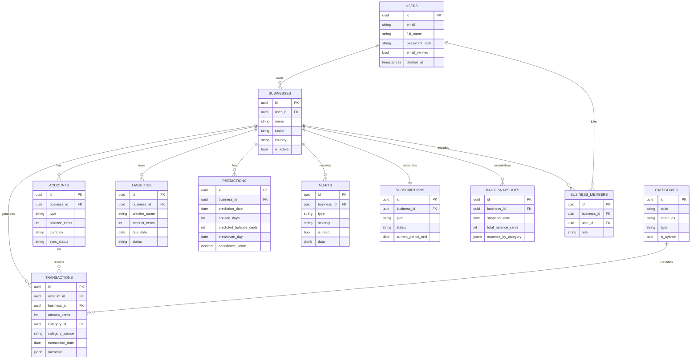

# FASE 5 — Diseño de Base de Datos

> **Proyecto**: Comerci — Sistema Inteligente de Gestión Financiera para MYPEs LATAM
> **Fase**: 5 — Base de Datos
> **Versión**: 2.0
> **Fecha**: 2026-05-18
> **Autor**: Eduardo Sebastian Paipay Vega

---

## 🎯 Propósito de Esta Fase

Definir la estructura completa de datos de Comerci: entidades, relaciones, tipos de campo, scripts DDL, índices de performance, estrategia de encriptación y política de backup. Este documento es la fuente de verdad que guía a los ingenieros backend desde el primer día de desarrollo.

---

## 1. MOTOR DE BASE DE DATOS Y JUSTIFICACIÓN

**Motor elegido: PostgreSQL 16**

| Criterio | PostgreSQL | MySQL | MongoDB |
|---------|-----------|-------|--------|
| Soporte JSONB (datos variables de bancos) | ✅ Nativo | ⚠️ Limitado | ✅ Nativo |
| Transacciones ACID para dinero | ✅ Completo | ✅ Completo | ⚠️ Parcial |
| Extensiones cifrado (pgcrypto) | ✅ | ❌ | ❌ |
| Adopción en fintechs LATAM (Nubank, Belvo) | ✅ Estándar | ⚠️ Menor | ❌ |
| Soporte de rangos de fechas (predicciones) | ✅ TSRANGE | ❌ | ❌ |
| Row-Level Security (multi-tenant) | ✅ Nativo | ❌ | ❌ |
| Full-text search en español | ✅ ts_vector | ⚠️ Limitado | ✅ |

**Bases de datos complementarias:**
- **Redis 7** — Caché de dashboards y sesiones activas (TTL 5 minutos para saldos)
- **TimescaleDB** (extensión de PostgreSQL) — Series temporales para predicciones ML
- **S3 / Cloudflare R2** — Almacenamiento de reportes PDF generados

---

## 2. DIAGRAMA ENTIDAD-RELACIÓN (ERD)

```
┌──────────────────┐       ┌──────────────────────┐
│      USERS       │       │     BUSINESSES        │
├──────────────────┤       ├──────────────────────┤
│ id (PK)          │──────▶│ id (PK)              │
│ email            │ 1   N │ user_id (FK)         │
│ phone            │       │ name                 │
│ full_name        │       │ ruc                  │
│ password_hash    │       │ sector               │
│ phone_verified   │       │ monthly_income_est   │
│ email_verified   │       │ employee_count       │
│ created_at       │       │ country              │
│ last_login_at    │       │ city                 │
│ deleted_at       │       │ created_at           │
└──────────────────┘       │ is_active            │
                           └──────────────────────┘
                                     │ 1
                                     │
                              ┌──────▼───────────────────────────────┐
                              │               ACCOUNTS                │
                              ├──────────────────────────────────────┤
                              │ id (PK)                               │
                              │ business_id (FK)                      │
                              │ type  [bank|yape|plin|cash|other]     │
                              │ name                                  │
                              │ balance_cents (INT, sin decimales)    │
                              │ currency [PEN|USD|COP|MXN]           │
                              │ integration_token_enc (AES-256)       │
                              │ provider_code                         │
                              │ last_synced_at                        │
                              │ sync_status [ok|error|pending]        │
                              │ is_active                             │
                              └──────────────────────────────────────┘
                                            │ 1
                                            │ N
                    ┌───────────────────────▼────────────────────────────┐
                    │                   TRANSACTIONS                      │
                    ├────────────────────────────────────────────────────┤
                    │ id (PK)                                             │
                    │ account_id (FK)                                     │
                    │ business_id (FK)  [desnormalizado para performance] │
                    │ external_id       [ID del banco/Yape para dedup]    │
                    │ amount_cents (INT) [positivo=ingreso, negativo=gasto]│
                    │ description_raw                                     │
                    │ description_clean                                   │
                    │ category_id (FK)                                    │
                    │ category_confidence (DECIMAL 0-1)                   │
                    │ category_source [auto|manual|corrected]             │
                    │ transaction_date (DATE)                             │
                    │ posted_at (TIMESTAMPTZ)                             │
                    │ metadata (JSONB)  [datos extra del banco]           │
                    └────────────────────────────────────────────────────┘
                                │                        │
                                │ N                      │ N
              ┌─────────────────▼──────┐    ┌───────────▼──────────────┐
              │       CATEGORIES       │    │        LIABILITIES        │
              ├────────────────────────┤    │      (Pasivos/Deudas)     │
              │ id (PK)                │    ├──────────────────────────┤
              │ code                   │    │ id (PK)                  │
              │ name_es                │    │ business_id (FK)         │
              │ name_pt                │    │ creditor_name            │
              │ icon                   │    │ amount_cents             │
              │ color_hex              │    │ currency                 │
              │ type [income|expense]  │    │ due_date                 │
              │ is_system (BOOL)       │    │ description              │
              └────────────────────────┘    │ status [active|paid]     │
                                            └──────────────────────────┘

┌─────────────────────────────────────────────────────────────────────┐
│                        PREDICTIONS                                   │
├─────────────────────────────────────────────────────────────────────┤
│ id (PK)                                                             │
│ business_id (FK)                                                    │
│ prediction_date (DATE)   [snapshot de referencia]                  │
│ horizon_days (INT)       [7, 14 o 30]                              │
│ predicted_balance_cents                                             │
│ predicted_income_cents                                              │
│ predicted_expense_cents                                             │
│ breakeven_day (DATE NULLABLE)                                       │
│ confidence_score (DECIMAL 0-1)                                      │
│ model_version                                                       │
└─────────────────────────────────────────────────────────────────────┘

┌─────────────────────────────────────────────────────────────────────┐
│                           ALERTS                                     │
├─────────────────────────────────────────────────────────────────────┤
│ id (PK)                                                             │
│ business_id (FK)                                                    │
│ type [breakeven|anomaly|payroll|recommendation|opportunity]         │
│ severity [info|warning|critical]                                    │
│ title, body                                                         │
│ data (JSONB)                                                        │
│ is_read, is_dismissed, action_taken                                 │
│ expires_at (NULLABLE)                                               │
└─────────────────────────────────────────────────────────────────────┘

┌─────────────────────────────────────────────────────────────────────┐
│                        SUBSCRIPTIONS                                 │
├─────────────────────────────────────────────────────────────────────┤
│ id (PK)                                                             │
│ business_id (FK) [UNIQUE — 1 sub por negocio]                      │
│ plan [free|basic|pro|enterprise]                                    │
│ status [active|cancelled|past_due|trialing]                         │
│ price_cents_monthly, currency                                       │
│ current_period_start, current_period_end                            │
│ payment_provider, payment_provider_id (encrypted)                  │
└─────────────────────────────────────────────────────────────────────┘

┌─────────────────────────────────────────────────────────────────────┐
│                      DAILY_SNAPSHOTS                                 │
│              (Materialización diaria para ML)                        │
├─────────────────────────────────────────────────────────────────────┤
│ id (PK)                                                             │
│ business_id (FK)                                                    │
│ snapshot_date (DATE)                                                │
│ total_balance_cents, total_income_cents, total_expense_cents        │
│ expense_by_category (JSONB) {"MERCH":50000, "PAYROLL":120000, ...} │
│ daily_burn_rate_cents, liabilities_total_cents                      │
│ UNIQUE(business_id, snapshot_date)                                  │
└─────────────────────────────────────────────────────────────────────┘

┌─────────────────────────────────────────────────────────────────────┐
│                      BUSINESS_MEMBERS                                │
├─────────────────────────────────────────────────────────────────────┤
│ id (PK)                                                             │
│ business_id (FK), user_id (FK)                                      │
│ role [owner|accountant|manager]                                     │
│ invited_at, accepted_at                                             │
│ UNIQUE(business_id, user_id)                                        │
└─────────────────────────────────────────────────────────────────────┘

┌─────────────────────────────────────────────────────────────────────┐
│                      AUDIT_LOG                                       │
│              (Cumplimiento — nunca se elimina)                       │
├─────────────────────────────────────────────────────────────────────┤
│ id (PK)                                                             │
│ user_id (FK, NULLABLE), business_id (FK, NULLABLE)                 │
│ action, entity_type, entity_id                                      │
│ ip_address (INET), user_agent                                       │
│ metadata (JSONB), created_at                                        │
│ PARTITION BY RANGE (created_at) — particionado mensual             │
└─────────────────────────────────────────────────────────────────────┘
```

---

## 3. DICCIONARIO DE DATOS

### Tabla: `users`

| Campo | Tipo | Nullable | Descripción |
|-------|------|----------|-------------|
| `id` | UUID | NO | PK — uuid_generate_v4() |
| `email` | CITEXT | NO | Email único, case-insensitive |
| `phone` | VARCHAR(20) | SÍ | Teléfono con prefijo de país (+51...) |
| `full_name` | VARCHAR(200) | NO | Nombre completo del dueño |
| `password_hash` | VARCHAR(255) | SÍ | bcrypt cost=12. NULL si usa OAuth |
| `phone_verified` | BOOLEAN | NO | Default FALSE |
| `email_verified` | BOOLEAN | NO | Default FALSE |
| `preferred_lang` | CHAR(2) | NO | 'es' o 'pt'. Default 'es' |
| `created_at` | TIMESTAMPTZ | NO | DEFAULT NOW() |
| `last_login_at` | TIMESTAMPTZ | SÍ | Timestamp del último acceso |
| `deleted_at` | TIMESTAMPTZ | SÍ | Soft delete. NULL = activo |

### Tabla: `businesses`

| Campo | Tipo | Nullable | Descripción |
|-------|------|----------|-------------|
| `id` | UUID | NO | PK |
| `user_id` | UUID | NO | FK → users.id |
| `name` | VARCHAR(200) | NO | Nombre del negocio |
| `ruc` | VARCHAR(20) | SÍ | RUC/RUT/RFC según país |
| `sector` | VARCHAR(50) | SÍ | retail, food, services, transport, other |
| `monthly_income_est` | INTEGER | SÍ | Estimado en centavos (onboarding) |
| `employee_count` | SMALLINT | SÍ | Cantidad aproximada de empleados |
| `country` | CHAR(2) | NO | ISO 3166-1: PE, CO, MX |
| `city` | VARCHAR(100) | SÍ | Ciudad del negocio |
| `timezone` | VARCHAR(50) | NO | Default 'America/Lima' |
| `is_active` | BOOLEAN | NO | Default TRUE |
| `created_at` | TIMESTAMPTZ | NO | DEFAULT NOW() |

### Tabla: `accounts`

| Campo | Tipo | Nullable | Descripción |
|-------|------|----------|-------------|
| `id` | UUID | NO | PK |
| `business_id` | UUID | NO | FK → businesses.id |
| `type` | VARCHAR(20) | NO | Enum: bank, yape, plin, cash, other |
| `name` | VARCHAR(100) | NO | Ej: "BCP Principal", "Yape Personal" |
| `balance_cents` | INTEGER | NO | Saldo en centavos. Evita problemas de punto flotante |
| `currency` | CHAR(3) | NO | ISO 4217: PEN, USD, COP, MXN |
| `integration_token_enc` | TEXT | SÍ | Token OAuth cifrado con AES-256-GCM |
| `provider_code` | VARCHAR(50) | SÍ | Ej: belvo_bcp, belvo_bbva, manual_cash |
| `last_synced_at` | TIMESTAMPTZ | SÍ | Última sincronización exitosa |
| `sync_status` | VARCHAR(20) | NO | Enum: ok, error, pending, disconnected |
| `sync_error_msg` | TEXT | SÍ | Mensaje de error si sync_status = error |
| `is_active` | BOOLEAN | NO | Default TRUE |
| `created_at` | TIMESTAMPTZ | NO | DEFAULT NOW() |

### Tabla: `transactions`

| Campo | Tipo | Nullable | Descripción |
|-------|------|----------|-------------|
| `id` | UUID | NO | PK |
| `account_id` | UUID | NO | FK → accounts.id |
| `business_id` | UUID | NO | FK desnormalizado para queries rápidos |
| `external_id` | VARCHAR(255) | SÍ | ID del proveedor bancario (deduplicación) |
| `amount_cents` | INTEGER | NO | Positivo = ingreso. Negativo = gasto |
| `description_raw` | TEXT | NO | Descripción original del banco/Yape |
| `description_clean` | TEXT | SÍ | Versión normalizada por NLP |
| `category_id` | UUID | SÍ | FK → categories.id |
| `category_confidence` | DECIMAL(4,3) | SÍ | 0.000 a 1.000 |
| `category_source` | VARCHAR(20) | NO | Enum: auto, manual, corrected |
| `transaction_date` | DATE | NO | Fecha contable |
| `posted_at` | TIMESTAMPTZ | SÍ | Confirmación del banco |
| `metadata` | JSONB | SÍ | Datos adicionales del proveedor |
| `is_excluded` | BOOLEAN | NO | Default FALSE. El usuario la excluye |
| `created_at` | TIMESTAMPTZ | NO | DEFAULT NOW() |

### Tabla: `categories`

| Campo | Tipo | Nullable | Descripción |
|-------|------|----------|-------------|
| `id` | UUID | NO | PK |
| `code` | VARCHAR(50) | NO | MERCH, PAYROLL, TRANSPORT, UTILITIES, MARKETING... |
| `name_es` | VARCHAR(100) | NO | Nombre en español |
| `name_pt` | VARCHAR(100) | SÍ | Nombre en portugués (expansión Brasil) |
| `icon` | VARCHAR(10) | SÍ | Emoji o código de ícono |
| `color_hex` | CHAR(7) | SÍ | Ej: #FF5733 |
| `type` | VARCHAR(10) | NO | Enum: income, expense |
| `is_system` | BOOLEAN | NO | TRUE = global. FALSE = custom del negocio |
| `business_id` | UUID | SÍ | NULL si is_system=TRUE |

### Tabla: `liabilities`

| Campo | Tipo | Nullable | Descripción |
|-------|------|----------|-------------|
| `id` | UUID | NO | PK |
| `business_id` | UUID | NO | FK → businesses.id |
| `creditor_name` | VARCHAR(200) | NO | Proveedor, banco o familiar acreedor |
| `amount_cents` | INTEGER | NO | Monto total adeudado en centavos |
| `currency` | CHAR(3) | NO | Moneda de la deuda |
| `due_date` | DATE | SÍ | Vencimiento. NULL = sin fecha |
| `description` | TEXT | SÍ | Detalle opcional |
| `status` | VARCHAR(20) | NO | Enum: active, partial, paid |
| `paid_at` | TIMESTAMPTZ | SÍ | Fecha de cancelación total |

### Tabla: `predictions`

| Campo | Tipo | Nullable | Descripción |
|-------|------|----------|-------------|
| `id` | UUID | NO | PK |
| `business_id` | UUID | NO | FK → businesses.id |
| `prediction_date` | DATE | NO | Fecha del snapshot base |
| `horizon_days` | SMALLINT | NO | 7, 14 o 30 días |
| `predicted_balance_cents` | INTEGER | NO | Saldo proyectado al final del horizonte |
| `predicted_income_cents` | INTEGER | NO | Ingresos esperados en el período |
| `predicted_expense_cents` | INTEGER | NO | Gastos esperados en el período |
| `breakeven_day` | DATE | SÍ | Día donde el balance llega a cero |
| `confidence_score` | DECIMAL(4,3) | NO | Confianza del modelo (0-1) |
| `model_version` | VARCHAR(20) | NO | Ej: 'v1.2.0-latam' |
| `generated_at` | TIMESTAMPTZ | NO | DEFAULT NOW() |

### Tabla: `daily_snapshots`

| Campo | Tipo | Nullable | Descripción |
|-------|------|----------|-------------|
| `id` | UUID | NO | PK |
| `business_id` | UUID | NO | FK → businesses.id |
| `snapshot_date` | DATE | NO | Fecha del snapshot |
| `total_balance_cents` | INTEGER | NO | Saldo neto total |
| `total_income_cents` | INTEGER | NO | Ingresos del día |
| `total_expense_cents` | INTEGER | NO | Gastos del día |
| `expense_by_category` | JSONB | NO | {"MERCH": 50000, "PAYROLL": 120000} |
| `daily_burn_rate_cents` | INTEGER | NO | Promedio móvil 7 días del gasto |
| `liabilities_total_cents` | INTEGER | NO | Total de deudas activas |
| `transactions_count` | SMALLINT | NO | Número de transacciones del día |

---

## 4. MODELO RELACIONAL — DIAGRAMA MERMAID



---

## 5. SCRIPTS DDL COMPLETOS

```sql
-- ============================================================
-- COMERCI — DDL v2.0
-- Motor: PostgreSQL 16
-- Extensiones: uuid-ossp, pgcrypto, citext
-- ============================================================

CREATE EXTENSION IF NOT EXISTS "uuid-ossp";
CREATE EXTENSION IF NOT EXISTS "pgcrypto";
CREATE EXTENSION IF NOT EXISTS "citext";

-- ============================================================
-- users
-- ============================================================
CREATE TABLE users (
    id              UUID PRIMARY KEY DEFAULT uuid_generate_v4(),
    email           CITEXT NOT NULL,
    phone           VARCHAR(20),
    full_name       VARCHAR(200) NOT NULL,
    password_hash   VARCHAR(255),
    phone_verified  BOOLEAN NOT NULL DEFAULT FALSE,
    email_verified  BOOLEAN NOT NULL DEFAULT FALSE,
    preferred_lang  CHAR(2) NOT NULL DEFAULT 'es',
    created_at      TIMESTAMPTZ NOT NULL DEFAULT NOW(),
    last_login_at   TIMESTAMPTZ,
    deleted_at      TIMESTAMPTZ,

    CONSTRAINT users_email_unique UNIQUE (email),
    CONSTRAINT users_lang_check CHECK (preferred_lang IN ('es','pt','en'))
);

-- ============================================================
-- businesses
-- ============================================================
CREATE TABLE businesses (
    id                  UUID PRIMARY KEY DEFAULT uuid_generate_v4(),
    user_id             UUID NOT NULL REFERENCES users(id) ON DELETE CASCADE,
    name                VARCHAR(200) NOT NULL,
    ruc                 VARCHAR(20),
    sector              VARCHAR(50) CHECK (sector IN ('retail','food','services','transport','agriculture','other')),
    monthly_income_est  INTEGER CHECK (monthly_income_est >= 0),
    employee_count      SMALLINT CHECK (employee_count >= 0),
    country             CHAR(2) NOT NULL DEFAULT 'PE',
    city                VARCHAR(100),
    timezone            VARCHAR(50) NOT NULL DEFAULT 'America/Lima',
    is_active           BOOLEAN NOT NULL DEFAULT TRUE,
    created_at          TIMESTAMPTZ NOT NULL DEFAULT NOW(),

    CONSTRAINT businesses_country_check CHECK (country IN ('PE','CO','MX','EC','BO','CL','AR'))
);

-- ============================================================
-- accounts
-- ============================================================
CREATE TABLE accounts (
    id                      UUID PRIMARY KEY DEFAULT uuid_generate_v4(),
    business_id             UUID NOT NULL REFERENCES businesses(id) ON DELETE CASCADE,
    type                    VARCHAR(20) NOT NULL CHECK (type IN ('bank','yape','plin','cash','other')),
    name                    VARCHAR(100) NOT NULL,
    balance_cents           INTEGER NOT NULL DEFAULT 0,
    currency                CHAR(3) NOT NULL DEFAULT 'PEN',
    integration_token_enc   TEXT,
    provider_code           VARCHAR(50),
    last_synced_at          TIMESTAMPTZ,
    sync_status             VARCHAR(20) NOT NULL DEFAULT 'pending'
                            CHECK (sync_status IN ('ok','error','pending','disconnected')),
    sync_error_msg          TEXT,
    is_active               BOOLEAN NOT NULL DEFAULT TRUE,
    created_at              TIMESTAMPTZ NOT NULL DEFAULT NOW()
);

-- ============================================================
-- categories (sistema + custom)
-- ============================================================
CREATE TABLE categories (
    id          UUID PRIMARY KEY DEFAULT uuid_generate_v4(),
    code        VARCHAR(50) NOT NULL,
    name_es     VARCHAR(100) NOT NULL,
    name_pt     VARCHAR(100),
    icon        VARCHAR(10),
    color_hex   CHAR(7),
    type        VARCHAR(10) NOT NULL CHECK (type IN ('income','expense')),
    is_system   BOOLEAN NOT NULL DEFAULT TRUE,
    business_id UUID REFERENCES businesses(id) ON DELETE CASCADE,
    created_at  TIMESTAMPTZ NOT NULL DEFAULT NOW(),

    CONSTRAINT categories_system_no_business CHECK (
        (is_system = TRUE AND business_id IS NULL) OR
        (is_system = FALSE AND business_id IS NOT NULL)
    )
);

-- Seed: categorías del sistema
INSERT INTO categories (code, name_es, icon, color_hex, type, is_system) VALUES
    ('MERCH',     'Compras de mercadería',     '🛒', '#FF6B6B', 'expense', TRUE),
    ('PAYROLL',   'Nómina y salarios',          '👥', '#4ECDC4', 'expense', TRUE),
    ('UTILITIES', 'Servicios (luz, agua, tel)', '⚡', '#45B7D1', 'expense', TRUE),
    ('TRANSPORT', 'Transporte y logística',     '🚗', '#96CEB4', 'expense', TRUE),
    ('RENT',      'Alquiler de local',          '🏪', '#FFEAA7', 'expense', TRUE),
    ('MARKETING', 'Marketing y publicidad',     '📣', '#DDA0DD', 'expense', TRUE),
    ('ADMIN',     'Gastos administrativos',     '💼', '#B0C4DE', 'expense', TRUE),
    ('TAXES',     'Impuestos y tasas',          '🧾', '#F0E68C', 'expense', TRUE),
    ('FINANCE',   'Gastos financieros',         '🏦', '#CD853F', 'expense', TRUE),
    ('OTHER_EXP', 'Otros gastos',               '❓', '#D3D3D3', 'expense', TRUE),
    ('SALES',     'Ventas y cobranzas',         '💰', '#32CD32', 'income',  TRUE),
    ('CREDIT',    'Préstamos recibidos',        '📥', '#87CEEB', 'income',  TRUE),
    ('OTHER_INC', 'Otros ingresos',             '➕', '#98FB98', 'income',  TRUE);

-- ============================================================
-- transactions
-- ============================================================
CREATE TABLE transactions (
    id                  UUID PRIMARY KEY DEFAULT uuid_generate_v4(),
    account_id          UUID NOT NULL REFERENCES accounts(id) ON DELETE CASCADE,
    business_id         UUID NOT NULL REFERENCES businesses(id) ON DELETE CASCADE,
    external_id         VARCHAR(255),
    amount_cents        INTEGER NOT NULL,
    description_raw     TEXT NOT NULL,
    description_clean   TEXT,
    category_id         UUID REFERENCES categories(id),
    category_confidence DECIMAL(4,3) CHECK (category_confidence BETWEEN 0 AND 1),
    category_source     VARCHAR(20) NOT NULL DEFAULT 'auto'
                        CHECK (category_source IN ('auto','manual','corrected')),
    transaction_date    DATE NOT NULL,
    posted_at           TIMESTAMPTZ,
    metadata            JSONB DEFAULT '{}',
    is_excluded         BOOLEAN NOT NULL DEFAULT FALSE,
    created_at          TIMESTAMPTZ NOT NULL DEFAULT NOW(),

    CONSTRAINT transactions_external_unique UNIQUE (account_id, external_id)
);

-- ============================================================
-- liabilities (pasivos / deudas)
-- ============================================================
CREATE TABLE liabilities (
    id              UUID PRIMARY KEY DEFAULT uuid_generate_v4(),
    business_id     UUID NOT NULL REFERENCES businesses(id) ON DELETE CASCADE,
    creditor_name   VARCHAR(200) NOT NULL,
    amount_cents    INTEGER NOT NULL CHECK (amount_cents > 0),
    currency        CHAR(3) NOT NULL DEFAULT 'PEN',
    due_date        DATE,
    description     TEXT,
    status          VARCHAR(20) NOT NULL DEFAULT 'active'
                    CHECK (status IN ('active','partial','paid')),
    paid_at         TIMESTAMPTZ,
    created_at      TIMESTAMPTZ NOT NULL DEFAULT NOW()
);

-- ============================================================
-- predictions
-- ============================================================
CREATE TABLE predictions (
    id                      UUID PRIMARY KEY DEFAULT uuid_generate_v4(),
    business_id             UUID NOT NULL REFERENCES businesses(id) ON DELETE CASCADE,
    prediction_date         DATE NOT NULL,
    horizon_days            SMALLINT NOT NULL CHECK (horizon_days IN (7,14,30)),
    predicted_balance_cents INTEGER NOT NULL,
    predicted_income_cents  INTEGER NOT NULL,
    predicted_expense_cents INTEGER NOT NULL,
    breakeven_day           DATE,
    confidence_score        DECIMAL(4,3) NOT NULL CHECK (confidence_score BETWEEN 0 AND 1),
    model_version           VARCHAR(20) NOT NULL DEFAULT 'v1.0.0',
    generated_at            TIMESTAMPTZ NOT NULL DEFAULT NOW(),

    CONSTRAINT predictions_unique UNIQUE (business_id, prediction_date, horizon_days)
);

-- ============================================================
-- alerts
-- ============================================================
CREATE TABLE alerts (
    id              UUID PRIMARY KEY DEFAULT uuid_generate_v4(),
    business_id     UUID NOT NULL REFERENCES businesses(id) ON DELETE CASCADE,
    type            VARCHAR(30) NOT NULL
                    CHECK (type IN ('breakeven','anomaly','payroll','recommendation','opportunity','sync_error')),
    severity        VARCHAR(10) NOT NULL CHECK (severity IN ('info','warning','critical')),
    title           VARCHAR(200) NOT NULL,
    body            TEXT NOT NULL,
    data            JSONB DEFAULT '{}',
    is_read         BOOLEAN NOT NULL DEFAULT FALSE,
    is_dismissed    BOOLEAN NOT NULL DEFAULT FALSE,
    action_taken    BOOLEAN NOT NULL DEFAULT FALSE,
    created_at      TIMESTAMPTZ NOT NULL DEFAULT NOW(),
    expires_at      TIMESTAMPTZ
);

-- ============================================================
-- subscriptions
-- ============================================================
CREATE TABLE subscriptions (
    id                      UUID PRIMARY KEY DEFAULT uuid_generate_v4(),
    business_id             UUID NOT NULL REFERENCES businesses(id) ON DELETE CASCADE,
    plan                    VARCHAR(20) NOT NULL DEFAULT 'free'
                            CHECK (plan IN ('free','basic','pro','enterprise')),
    status                  VARCHAR(20) NOT NULL DEFAULT 'trialing'
                            CHECK (status IN ('active','cancelled','past_due','trialing')),
    price_cents_monthly     INTEGER NOT NULL DEFAULT 0,
    currency                CHAR(3) NOT NULL DEFAULT 'PEN',
    current_period_start    DATE NOT NULL DEFAULT CURRENT_DATE,
    current_period_end      DATE NOT NULL DEFAULT CURRENT_DATE + INTERVAL '14 days',
    cancel_at_period_end    BOOLEAN NOT NULL DEFAULT FALSE,
    payment_provider        VARCHAR(20) CHECK (payment_provider IN ('stripe','culqi','izipay','manual')),
    payment_provider_id     TEXT,
    created_at              TIMESTAMPTZ NOT NULL DEFAULT NOW(),
    updated_at              TIMESTAMPTZ NOT NULL DEFAULT NOW(),

    CONSTRAINT subscriptions_one_per_business UNIQUE (business_id)
);

-- ============================================================
-- business_members
-- ============================================================
CREATE TABLE business_members (
    id          UUID PRIMARY KEY DEFAULT uuid_generate_v4(),
    business_id UUID NOT NULL REFERENCES businesses(id) ON DELETE CASCADE,
    user_id     UUID NOT NULL REFERENCES users(id) ON DELETE CASCADE,
    role        VARCHAR(20) NOT NULL DEFAULT 'manager'
                CHECK (role IN ('owner','accountant','manager')),
    invited_at  TIMESTAMPTZ NOT NULL DEFAULT NOW(),
    accepted_at TIMESTAMPTZ,
    created_at  TIMESTAMPTZ NOT NULL DEFAULT NOW(),

    CONSTRAINT business_members_unique UNIQUE (business_id, user_id)
);

-- ============================================================
-- daily_snapshots (materialización para ML)
-- ============================================================
CREATE TABLE daily_snapshots (
    id                      UUID PRIMARY KEY DEFAULT uuid_generate_v4(),
    business_id             UUID NOT NULL REFERENCES businesses(id) ON DELETE CASCADE,
    snapshot_date           DATE NOT NULL,
    total_balance_cents     INTEGER NOT NULL DEFAULT 0,
    total_income_cents      INTEGER NOT NULL DEFAULT 0,
    total_expense_cents     INTEGER NOT NULL DEFAULT 0,
    expense_by_category     JSONB NOT NULL DEFAULT '{}',
    active_accounts_count   SMALLINT NOT NULL DEFAULT 0,
    transactions_count      SMALLINT NOT NULL DEFAULT 0,
    daily_burn_rate_cents   INTEGER NOT NULL DEFAULT 0,
    liabilities_total_cents INTEGER NOT NULL DEFAULT 0,
    created_at              TIMESTAMPTZ NOT NULL DEFAULT NOW(),

    CONSTRAINT daily_snapshots_unique UNIQUE (business_id, snapshot_date)
);

-- ============================================================
-- audit_log (particionado mensual)
-- ============================================================
CREATE TABLE audit_log (
    id          UUID NOT NULL DEFAULT uuid_generate_v4(),
    user_id     UUID REFERENCES users(id) ON DELETE SET NULL,
    business_id UUID REFERENCES businesses(id) ON DELETE SET NULL,
    action      VARCHAR(100) NOT NULL,
    entity_type VARCHAR(50),
    entity_id   VARCHAR(255),
    ip_address  INET,
    user_agent  TEXT,
    metadata    JSONB DEFAULT '{}',
    created_at  TIMESTAMPTZ NOT NULL DEFAULT NOW()
) PARTITION BY RANGE (created_at);

CREATE TABLE audit_log_2026_05 PARTITION OF audit_log
    FOR VALUES FROM ('2026-05-01') TO ('2026-06-01');
CREATE TABLE audit_log_2026_06 PARTITION OF audit_log
    FOR VALUES FROM ('2026-06-01') TO ('2026-07-01');
CREATE TABLE audit_log_2026_07 PARTITION OF audit_log
    FOR VALUES FROM ('2026-07-01') TO ('2026-08-01');
```

---

## 6. ÍNDICES DE PERFORMANCE

```sql
-- Dashboard: cuentas activas de un negocio
CREATE INDEX idx_accounts_business_active
    ON accounts(business_id) WHERE is_active = TRUE;

-- Query más común: transacciones por negocio + fecha
CREATE INDEX idx_transactions_business_date
    ON transactions(business_id, transaction_date DESC);

-- Transacciones por cuenta (sync incremental)
CREATE INDEX idx_transactions_account_posted
    ON transactions(account_id, posted_at DESC);

-- Filtro de categoría + negocio (reportes)
CREATE INDEX idx_transactions_business_category
    ON transactions(business_id, category_id, transaction_date DESC);

-- Excluyendo transacciones marcadas como no contables
CREATE INDEX idx_transactions_not_excluded
    ON transactions(business_id, transaction_date DESC)
    WHERE is_excluded = FALSE;

-- Badge de alertas no leídas
CREATE INDEX idx_alerts_business_unread
    ON alerts(business_id, created_at DESC)
    WHERE is_read = FALSE AND is_dismissed = FALSE;

-- Alertas críticas (pantalla principal)
CREATE INDEX idx_alerts_critical_unread
    ON alerts(business_id, created_at DESC)
    WHERE severity = 'critical' AND is_read = FALSE;

-- Predicciones vigentes
CREATE INDEX idx_predictions_business_date
    ON predictions(business_id, prediction_date DESC);

-- Daily snapshots para ML (series temporales)
CREATE INDEX idx_snapshots_business_date
    ON daily_snapshots(business_id, snapshot_date DESC);

-- Deduplicación de transacciones bancarias
CREATE INDEX idx_transactions_external
    ON transactions(account_id, external_id)
    WHERE external_id IS NOT NULL;

-- Deudas activas con fecha de vencimiento
CREATE INDEX idx_liabilities_business_active
    ON liabilities(business_id, due_date ASC)
    WHERE status = 'active';

-- Login por email
CREATE INDEX idx_users_email ON users(email);

-- Audit log por usuario
CREATE INDEX idx_audit_user ON audit_log(user_id, created_at DESC);

-- Búsqueda JSONB en gastos por categoría
CREATE INDEX idx_snapshots_categories
    ON daily_snapshots USING GIN(expense_by_category);

-- Búsqueda JSONB en metadata de transacciones
CREATE INDEX idx_transactions_metadata
    ON transactions USING GIN(metadata);
```

---

## 7. VISTAS Y FUNCIONES UTILITARIAS

```sql
-- ============================================================
-- VISTA: balance consolidado por negocio
-- ============================================================
CREATE OR REPLACE VIEW v_business_balance AS
SELECT
    b.id                                            AS business_id,
    b.name                                          AS business_name,
    COALESCE(SUM(a.balance_cents), 0)               AS total_balance_cents,
    COALESCE(SUM(l.amount_cents), 0)                AS total_liabilities_cents,
    COALESCE(SUM(a.balance_cents), 0) -
        COALESCE(SUM(l.amount_cents), 0)            AS net_balance_cents,
    COUNT(DISTINCT a.id)                            AS active_accounts,
    MAX(a.last_synced_at)                           AS last_sync_at
FROM businesses b
LEFT JOIN accounts a ON a.business_id = b.id AND a.is_active = TRUE
LEFT JOIN LATERAL (
    SELECT SUM(amount_cents) AS amount_cents
    FROM liabilities li
    WHERE li.business_id = b.id AND li.status = 'active'
) l ON TRUE
WHERE b.is_active = TRUE
GROUP BY b.id, b.name;

-- ============================================================
-- FUNCIÓN: calcular burn rate diario
-- ============================================================
CREATE OR REPLACE FUNCTION calculate_burn_rate(
    p_business_id UUID,
    p_days        INT DEFAULT 30
)
RETURNS INTEGER AS $$
DECLARE v_burn INTEGER;
BEGIN
    SELECT COALESCE(ABS(AVG(daily_total))::INTEGER, 0)
    INTO v_burn
    FROM (
        SELECT transaction_date, SUM(amount_cents) AS daily_total
        FROM transactions
        WHERE
            business_id = p_business_id
            AND amount_cents < 0
            AND is_excluded = FALSE
            AND transaction_date >= CURRENT_DATE - (p_days || ' days')::INTERVAL
        GROUP BY transaction_date
    ) t;
    RETURN v_burn;
END;
$$ LANGUAGE plpgsql STABLE;

-- ============================================================
-- FUNCIÓN: días hasta quiebra
-- ============================================================
CREATE OR REPLACE FUNCTION days_until_breakeven(p_business_id UUID)
RETURNS INTEGER AS $$
DECLARE
    v_balance        INTEGER;
    v_burn_rate      INTEGER;
    v_daily_income   INTEGER;
    v_net_daily_burn INTEGER;
BEGIN
    SELECT net_balance_cents INTO v_balance
    FROM v_business_balance WHERE business_id = p_business_id;

    v_burn_rate := calculate_burn_rate(p_business_id, 30);

    SELECT COALESCE(AVG(daily_income), 0)::INTEGER INTO v_daily_income
    FROM (
        SELECT transaction_date, SUM(amount_cents) AS daily_income
        FROM transactions
        WHERE business_id = p_business_id
          AND amount_cents > 0
          AND is_excluded = FALSE
          AND transaction_date >= CURRENT_DATE - INTERVAL '30 days'
        GROUP BY transaction_date
    ) d;

    v_net_daily_burn := v_burn_rate - v_daily_income;

    IF v_net_daily_burn <= 0 OR v_balance <= 0 THEN
        RETURN NULL;  -- NULL = sin quiebra proyectada
    END IF;

    RETURN FLOOR(v_balance::NUMERIC / v_net_daily_burn);
END;
$$ LANGUAGE plpgsql STABLE;
```

---

## 8. ESTRATEGIA DE ENCRIPTACIÓN

| Campo | Sensibilidad | Estrategia |
|-------|-------------|-----------|
| `users.password_hash` | Alta | bcrypt cost=12. Nunca reversible |
| `accounts.integration_token_enc` | Crítica | AES-256-GCM en application layer |
| `subscriptions.payment_provider_id` | Alta | AES-256-GCM en application layer |
| `users.phone` | Media | Texto plano. Enmascarado en logs |
| `transactions.metadata` | Baja | Sin cifrar |
| `audit_log.*` | N/A | Sin cifrar. Es registro de auditoría |

**Ejemplo de implementación AES-256-GCM (Node.js):**

```javascript
const crypto = require('crypto');
const ALGORITHM = 'aes-256-gcm';
const KEY = Buffer.from(process.env.ENCRYPTION_KEY, 'hex'); // 32 bytes

function encrypt(plaintext) {
    const iv = crypto.randomBytes(16);
    const cipher = crypto.createCipheriv(ALGORITHM, KEY, iv);
    const encrypted = Buffer.concat([cipher.update(plaintext, 'utf8'), cipher.final()]);
    const tag = cipher.getAuthTag();
    // Formato: iv:tag:ciphertext (todo en base64)
    return `${iv.toString('base64')}:${tag.toString('base64')}:${encrypted.toString('base64')}`;
}

function decrypt(stored) {
    const [ivB64, tagB64, cipherB64] = stored.split(':');
    const decipher = crypto.createDecipheriv(ALGORITHM, KEY, Buffer.from(ivB64, 'base64'));
    decipher.setAuthTag(Buffer.from(tagB64, 'base64'));
    return Buffer.concat([
        decipher.update(Buffer.from(cipherB64, 'base64')),
        decipher.final()
    ]).toString('utf8');
}
```

---

## 9. ROW-LEVEL SECURITY (Aislamiento multi-tenant)

```sql
-- Habilitar RLS en todas las tablas sensibles
ALTER TABLE accounts     ENABLE ROW LEVEL SECURITY;
ALTER TABLE transactions ENABLE ROW LEVEL SECURITY;
ALTER TABLE alerts       ENABLE ROW LEVEL SECURITY;
ALTER TABLE predictions  ENABLE ROW LEVEL SECURITY;
ALTER TABLE liabilities  ENABLE ROW LEVEL SECURITY;

-- Política: usuario solo accede a datos de sus negocios
CREATE POLICY business_isolation ON transactions
    USING (business_id IN (
        SELECT b.id FROM businesses b
        WHERE b.user_id = current_setting('app.current_user_id')::UUID
        UNION
        SELECT bm.business_id FROM business_members bm
        WHERE bm.user_id = current_setting('app.current_user_id')::UUID
          AND bm.accepted_at IS NOT NULL
    ));

-- La API establece el contexto en cada request:
-- SET LOCAL app.current_user_id = 'uuid-del-usuario-autenticado';
```

---

## 10. ESTRATEGIA DE MIGRACIÓN DE ESQUEMA

El versionado se gestiona con **Flyway** o **node-pg-migrate**:

```
migrations/
  V1__initial_schema.sql          ← DDL base (este documento)
  V2__categories_seed.sql         ← Datos iniciales
  V3__sms_notifications.sql       ← Notificaciones SMS
  V4__payroll_tracking.sql        ← Módulo nómina (Fase 2)
  V5__credit_scoring.sql          ← Score crediticio (Fase 3)
```

**Regla de oro**: Nunca modificar una migración ya ejecutada en producción. Siempre crear una nueva.

---

## 11. POLÍTICA DE BACKUP Y RECUPERACIÓN

### Estrategia 3-2-1

| Tipo | Frecuencia | Retención | Herramienta |
|------|-----------|-----------|------------|
| Full backup | Diario 02:00 AM Lima | 30 días | pg_dump → S3 |
| WAL archiving | Continuo | 7 días | pgWAL → S3 |
| Snapshot instancia | Semanal | 12 semanas | AWS RDS Snapshot |
| Replica de lectura | Tiempo real | Permanente | PostgreSQL streaming |

| Métrica | Target |
|---------|--------|
| **RPO** (pérdida máxima de datos) | < 1 hora |
| **RTO** (tiempo máximo de restauración) | < 4 horas |

---

## 12. DATOS DE SEED PARA DESARROLLO

```sql
-- Usuario demo
INSERT INTO users (id, email, full_name, email_verified) VALUES
    ('11111111-1111-1111-1111-111111111111', 'demo@comerci.pe', 'José García Demo', TRUE);

-- Negocio demo
INSERT INTO businesses (id, user_id, name, sector, country, monthly_income_est, employee_count) VALUES
    ('22222222-2222-2222-2222-222222222222',
     '11111111-1111-1111-1111-111111111111',
     'Bodega Don José', 'retail', 'PE', 500000, 3);

-- Cuenta: caja
INSERT INTO accounts (id, business_id, type, name, balance_cents, currency) VALUES
    ('33333333-3333-3333-3333-333333333333',
     '22222222-2222-2222-2222-222222222222',
     'cash', 'Caja Principal', 125000, 'PEN');

-- Suscripción free (período de prueba 14 días)
INSERT INTO subscriptions (business_id, plan, status, current_period_end) VALUES
    ('22222222-2222-2222-2222-222222222222', 'free', 'trialing', CURRENT_DATE + 14);
```

---

## 13. CHECKLIST DE IMPLEMENTACIÓN

```
[✅] Motor: PostgreSQL 16 justificado
[✅] 11 tablas DDL con constraints y tipos correctos
[✅] 13 categorías del sistema (seed data)
[✅] 15 índices de performance definidos
[✅] Vista v_business_balance
[✅] Funciones: calculate_burn_rate, days_until_breakeven
[✅] Encriptación AES-256-GCM documentada e implementada
[✅] Row-Level Security multi-tenant
[✅] Política de backup 3-2-1 con RTO/RPO
[✅] Estrategia de migración con Flyway
[✅] Audit log con particionado mensual
[✅] Seed data para desarrollo
```

---

## 📚 Cambios de Versión

**v1.0** (2026-05-18): Plantilla vacía
**v2.0** (2026-05-18): Documento completo — ERD, 11 tablas DDL, diccionario de datos, índices, encriptación, RLS, backup, funciones utilitarias, seed data

---

*FASE 5 completada. Siguiente: FASE 6 — Diseño UX/UI.*
