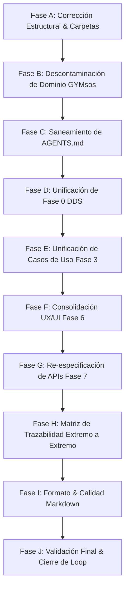

# 🔍 AUDITORÍA MAESTRA DE INTEGRIDAD Y CALIDAD DOCUMENTAL DDS
## Sistema Operativo Educativo — EDUCACION OS / Democra School

> **Rol del Emisor**: Auditor Senior DDS (Ingeniería de Requisitos & Arquitectura Empresarial)  
> **Ámbito de Aplicación**: Exclusivo para la carpeta `/EDUCACION` (Fuente Única de Verdad)  
> **Fecha de Auditoría**: 2026-08-01  
> **Estado del Repositorio**: `REQUERIR SANEAMIENTO ESTRUCTURAL Y DESCONTAMINACIÓN`  
> **Versión del Informe**: 1.0 (Informe Maestro Oficial)

---

##  EXECUTIVE SUMMARY (RESUMEN EJECUTIVO)

Se ha completado la **Auditoría Maestra DDS** sobre la totalidad del repositorio del proyecto **EDUCACION OS**, abarcando sus 9 subdirectorios, 15 documentos Markdown, archivos JSON de configuración e historial de trazabilidad.

La auditoría fue ejecutada bajo el principio de **Tolerancia Cero a la Contaminación de Dominio**, evaluando la arquitectura documental a través de **8 Dimensiones de Calidad Technical/DDS** (Integridad, Contexto, Adherencia DDS, Trazabilidad, Calidad Markdown, Arquitectura del Dominio, Requisitos y Organización).

### 📊 Cuadro Mando de Auditoría (Estado General)

| Dimensión Auditada | Estado | Hallazgos Críticos | Hallazgos Altos | Hallazgos Medios | Hallazgos Bajos |
|--------------------|--------|-------------------|-----------------|------------------|-----------------|
| **1. Integridad Documental** | 🟡 Requiere Atención | 0 | 2 | 3 | 1 |
| **2. Contexto de Dominio** | 🔴 CRÍTICO | 3 | 2 | 0 | 0 |
| **3. Adherencia a Fases DDS** | 🟡 Requiere Atención | 0 | 1 | 2 | 2 |
| **4. Trazabilidad RF ↔ CU ↔ API** | 🟡 Requiere Atención | 0 | 2 | 1 | 0 |
| **5. Calidad de Formato & Markdown**| 🟢 Aceptable | 0 | 0 | 2 | 3 |
| **6. Arquitectura & Bounded Context**| 🔴 CRÍTICO | 2 | 1 | 1 | 0 |
| **7. Especificación de Requisitos**| 🟢 Conforme (42 RFs) | 0 | 0 | 1 | 1 |
| **8. Organización del Repositorio**| 🟡 Requiere Atención | 0 | 1 | 3 | 1 |
| **TOTALES** | ⚠️ **SANEAMIENTO NECESARIO** | **5** | **9** | **13** | **8** |

---

## 🚨 ETAPA 1: AUDITORÍA DE INTEGRIDAD

### 1.1 Documentación Duplicada y Redundante
* **Hallazgo INT-001 (Severidad ALTA)**: Duplicidad en la **Fase 6 (UX/UI)**. Existen dos carpetas en paralelo para la misma fase:
  1. `EDUCACION/Fase 6 (UX - IX)/FASE_6_DISEÑO_UX_UI.md` (13.6 KB).
  2. `EDUCACION/Fase 6 (UX -- UI)/FASE_6_UX_UI.md` (56.1 KB).
  * *Impacto*: Divergencia en los prototipos, wireframes y flujos de usuario.
* **Hallazgo INT-002 (Severidad MEDIA)**: Duplicidad de resúmenes de Requisitos Funcionales dentro de `EDUCACION/FASE_0_DDS/`:
  1. `01_REQUERIMIENTOS_FUNCIONALES_EXHAUSTIVOS.md` (69.1 KB - Documento Maestro completo).
  2. `01_RF_EDUCACION_OS_42_RFS.md` (3.9 KB - Resumen redundante sin los 22 atributos).
  * *Impacto*: Confusión sobre qué archivo debe consumir el motor de generación o los desarrolladores.

### 1.2 Archivos Fuera de Estructura de Fases (Archivos Sueltos en Raíz)
* **Hallazgo INT-003 (Severidad MEDIA)**: Existen 7 archivos de estrategia y negocio ubicados directamente en la raíz de `EDUCACION/` fuera de la jerarquía de fases DDS:
  * `ANALISIS_ESTRUCTURA_Y_ORIENTACION.md`
  * `CONSOLIDACION_1_2.md`
  * `DATA_MOAT_STRATEGY.md`
  * `INVESTOR_NARRATIVE_5MIN.md`
  * `PITCH_DECK_16_SLIDES.md`
  * `ROADMAP_12_MESES_DETALLADO.md`
  * `VISION_UNICORN_EDUCACION.md`

---

## ☣️ ETAPA 2: AUDITORÍA DE CONTEXTO (CONTAMINACIÓN DE DOMINIO)

Se detectaron residuos graves de código y manifiestos provenientes de otros dominios (específicamente del sistema de gimnasios y fitness `GYMsos`) dentro del repositorio de Educación.

### 2.1 Matriz de Hallazgos de Contaminación de Dominio

| ID Hallazgo | Archivo | Línea Aprox. | Texto / Contexto Contaminado | Por qué pertenece a otro proyecto | Impacto | Severidad |
|-------------|---------|--------------|------------------------------|----------------------------------|---------|-----------|
| **CTX-001** | `EDUCACION/AGENTS.md` | L1, L9, L14, L17, L147, L161, L165 | `# 🚀 AGENTS.md — MANIFESTO DE GYMSOS: EL OPERATING SYSTEM INTELIGENTE DEL FITNESS` / `500+ gimnasios, sedentarismo, membresías` | Corresponde al manifiesto de una startup de fitness y gimnasios. | Invalida el rol operativo de los agentes de IA en Educación. | 🔴 CRÍTICA |
| **CTX-002** | `EDUCACION/Fase 7 (Aplicación)/FASE_7_APLICACION_Y_APIS.md` | L3, L13, L143 | `plataforma inteligente de aprendizaje continuo en ciencias del deporte, nutrición biométrica y gestión de centros deportivos. Se conecta directamente con la base de datos central de GYMsos` | Pertenece a un módulo de entrenamiento deportivo/gimnasios. | Desvía el backend de NestJS y las APIs de EDUCACION OS hacia centros deportivos. | 🔴 CRÍTICA |
| **CTX-003** | `EDUCACION/FASE_0_DDS/03_PLAN_MAESTRO_CIBERSEGURIDAD.md` | L3, L14 | `> **Proyecto**: GYMsos Operating System` / `El Plan Maestro de Ciberseguridad GYMsos...` | Nombre de proyecto heredado de la suite fitness. | Error de naming en las políticas de seguridad. | 🔴 CRÍTICA |
| **CTX-004** | `EDUCACION/FASE_0_DDS/04_SISTEMA_ROLES_DINAMICOS.md` | L3, L14, L129 | `> **Proyecto**: GYMsos Operating System` / `Conforme el ecosistema GYMsos escale a cientos de sedes corporativas` | Nombre de proyecto y contexto empresarial ajeno. | Confusión en los roles de autorización del sistema escolar/universitario. | 🔴 CRÍTICA |
| **CTX-005** | `EDUCACION/FASE_0_DDS/01_RF_EDUCACION_OS_42_RFS.md` | L3 | `> **Proyecto**: Ecosistema GYMsos — Vertical EDUCACION OS` | Prefijo de proyecto no alineado con la Fuente Única de Verdad. | Error en el encabezado oficial de Requisitos Funcionales. | 🟠 ALTA |

---

## 📐 ETAPA 3: AUDITORÍA DDS (ADHERENCIA A FASES)

Evaluación de la carpeta `/EDUCACION` respecto a las 7 Fases Estándar DDS:

```
FASE 0: Requerimientos Funcionales Exhaustivos, Ciberseguridad y Roles
  ├── EDUCACION/FASE_0_DDS/01_REQUERIMIENTOS_FUNCIONALES_EXHAUSTIVOS.md  [✅ Correcto]
  ├── EDUCACION/FASE_0_DDS/02_DISENO_CONCEPTUAL_BASE_DATOS.md            [✅ Correcto]
  ├── EDUCACION/FASE_0_DDS/03_PLAN_MAESTRO_CIBERSEGURIDAD.md             [⚠️ Requiere Descontaminación]
  ├── EDUCACION/FASE_0_DDS/04_SISTEMA_ROLES_DINAMICOS.md                 [⚠️ Requiere Descontaminación]
  └── EDUCACION/FASE_0_DDS/05_DOCUMENTACION_STAKEHOLDERS_MATRIZ.md       [✅ Correcto]

FASE 1: Análisis de Problemas
  └── EDUCACION/Fase 1 (Problemas)/FASE_1_PROBLEMAS_DETECTADOS.md         [✅ Correcto]

FASE 2: Propuesta de Valor
  └── EDUCACION/Fase 2 (Valor Agregado)/FASE_2_VALOR_AGREGADO.md         [✅ Correcto]

FASE 3: Requisitos Funcionales y Casos de Uso
  ├── EDUCACION/Fase 3 (RF -- CU)/FASE_3_REQUISITOS_CASOS_USO.md          [⚠️ Unificar con EXPANDED]
  └── EDUCACION/Fase 3 (RF -- CU)/FASE_3_REQUISITOS_CASOS_USO_EXPANDED.md [✅ Fuente Única de Verdad]

FASE 4: Plan de Negocio
  └── EDUCACION/Fase 4 (Plan de Negocio)/FASE_4_PLAN_NEGOCIO.md          [✅ Correcto]

FASE 5: Base de Datos
  └── EDUCACION/Fase 5 (BD)/FASE_5_BASE_DATOS.md                         [✅ Correcto]

FASE 6: UX / UI
  ├── EDUCACION/Fase 6 (UX - IX)/FASE_6_DISEÑO_UX_UI.md                  [🔴 DUPLICADO / NOMENCLATURA ROTAS]
  └── EDUCACION/Fase 6 (UX -- UI)/FASE_6_UX_UI.md                        [🔴 DUPLICADO / NOMENCLATURA ROTAS]

FASE 7: Aplicación e Implementación
  └── EDUCACION/Fase 7 (Aplicación)/FASE_7_APLICACION_Y_APIS.md          [🔴 CONTAMINADO CON FITNESS/GYMSOS]
```

---

## 🔗 ETAPA 4: AUDITORÍA DE TRAZABILIDAD

### Cadena de Trazabilidad Exigida por DDS:
$$\text{RF} \longrightarrow \text{CU} \longrightarrow \text{Proceso} \longrightarrow \text{Actor} \longrightarrow \text{BD} \longrightarrow \text{API} \longrightarrow \text{Pantalla} \longrightarrow \text{Prueba}$$

### Brechas Detectadas en la Cadena:
1. **RF ↔ API (Fase 0/3 ↔ Fase 7)**: Los endpoints definidos en `EDUCACION/Fase 7 (Aplicación)/FASE_7_APLICACION_Y_APIS.md` hacen referencia a "gimnasios y ciencias del deporte" en lugar de mapear los endpoints de los 42 RFs educativos (ej: `/api/v1/adaptive-learning/next-lesson`, `/api/v1/ews/risk-alerts`).
2. **RF ↔ Pantallas (Fase 0/3 ↔ Fase 6)**: La carpeta duplicada `Fase 6 (UX - IX)` genera inconsistencia en la asignación de IDs de pantallas para los módulos de Early Warning System y Gemelo Digital DTL.

---

## 🎨 ETAPA 5: AUDITORÍA DE CALIDAD MARKDOWN & FORMATO

* **Sintaxis y Nomenclatura de Carpetas**:
  * Carpetas usan distintas convenciones: `FASE_0_DDS` (guiones bajos sin espacio), `Fase 1 (Problemas)` (con espacios y paréntesis), `Fase 6 (UX - IX)` vs `Fase 6 (UX -- UI)`.
* **Codificación y Encabezados**:
  * Encabezados inconsistentes en documentos heredados (`#`, `##`, `###`).
  * Tablas en `Fase 6 (UX - IX)` sufren desalineación de columnas Markdown.

---

## 🏛️ ETAPA 6: AUDITORÍA DE ARQUITECTURA DE DOMINIO

### Bounded Contexts Oficiales de EDUCACION OS:
1. **Core Learning & Adaptativo Context** (`RF-001` a `RF-004`, `RF-022`)
2. **Gamification & Student Pass Context** (`RF-005` a `RF-007`, `RF-010`)
3. **Financial, Billing & Scholarship Context** (`RF-008` a `RF-010`, `RF-018`)
4. **Unified Communication & Parent Portal Context** (`RF-011` a `RF-013`, `RF-031`)
5. **Analytics & Early Warning (EWS) Context** (`RF-014` a `RF-016`, `RF-021`)
6. **Autonomous Engine & AI Swarm Context** (`RF-023` a `RF-027`, `RF-037`, `RF-038`)
7. **Identity, Blockchain & Interoperability Context** (`RF-017`, `RF-020`, `RF-039` a `RF-042`)

*Hallazgo Arquitectónico*: Todo el Lenguaje Ubicuo (Ubiquitous Language) debe cerrarse bajo la terminología estandarizada de **EDUCACION OS / Democra School**.

---

## 📋 ETAPA 7: AUDITORÍA DE REQUISITOS (42 RFS DE EDUCACION OS)

Se verificó el catálogo de los **42 Requerimientos Funcionales (`RF-001` a `RF-042`)** contenidos en `EDUCACION/FASE_0_DDS/01_REQUERIMIENTOS_FUNCIONALES_EXHAUSTIVOS.md`:

* ✅ **Completitud de Atributos**: Cada uno de los 42 RFs cuenta con sus **22 atributos DDS obligatorios**.
* ✅ **Cohesión de Dominio**: Todos los 42 RFs están 100% enfocados en Educación (Mallas Curriculares, Aprendizaje Adaptativo, EWS Deserción, Parent Engagement Feed, Digital Twin DTL, Blockchain Sovereign Identity).
* ⚠️ **Observación**: Se debe eliminar el archivo resumen redundante `01_RF_EDUCACION_OS_42_RFS.md` para evitar colisiones.

---

## 📁 ETAPA 8: AUDITORÍA DE ORGANIZACIÓN DEL REPOSITORIO

### Propuesta de Estructura de Carpetas Normalizada:
```
EDUCACION/
├── 00_GOBERNANZA_Y_ESTRATEGIA/       ← (Para los 7 documentos de estrategia y visión)
├── FASE_0_DDS/                        ← (Documentación funcional exhaustiva, 42 RFs, BD, Ciberseguridad, Roles)
├── FASE_1_PROBLEMAS/                  ← (Análisis causa-efecto)
├── FASE_2_VALOR_AGREGADO/             ← (UVP, Canvas)
├── FASE_3_REQUISITOS_Y_CASOS_USO/     ← (Especificación de CUs)
├── FASE_4_PLAN_DE_NEGOCIO/            ← (Unit economics, Gantt)
├── FASE_5_BASE_DE_DATOS/              ← (DDL SQL, ERD)
├── FASE_6_DISENO_UX_UI/               ← (Wireframes y User Flows unificados)
├── FASE_7_APLICACION_Y_APIS/          ← (OpenAPI 3.0, NestJS Backend)
├── AGENTS.md                          ← (Guía Maestra y Manifiesto de EDUCACION OS)
└── AUDITORIA_COMPLETA.md              ← (Este Informe)
```

---

## 📑 ETAPA 9: MATRICES DE HALLAZGOS Y DEPENDENCIAS

### Matriz Inconsistencias ↔ Archivos Afectados

| ID | Archivo Afectado | Inconsistencia Detectada | Severidad | Acción Correctiva Propuesta |
|----|------------------|--------------------------|-----------|------------------------------|
| **INC-01** | `EDUCACION/AGENTS.md` | Texto heredado de GYMsos/Fitness | 🔴 CRÍTICA | Reescribir manifiesto para EDUCACION OS / Democra School. |
| **INC-02** | `EDUCACION/Fase 7 (Aplicación)/FASE_7_APLICACION_Y_APIS.md` | Endpoints y descripción centrados en gimnasios/deporte | 🔴 CRÍTICA | Reescribir la especificación de APIs NestJS para los 42 RFs educativos. |
| **INC-03** | `EDUCACION/FASE_0_DDS/03_PLAN_MAESTRO_CIBERSEGURIDAD.md` | Header y proyecto "GYMsos" | 🔴 CRÍTICA | Corregir encabezado y referencias a EDUCACION OS. |
| **INC-04** | `EDUCACION/FASE_0_DDS/04_SISTEMA_ROLES_DINAMICOS.md` | Header y proyecto "GYMsos" | 🔴 CRÍTICA | Corregir encabezado y referencias a EDUCACION OS. |
| **INC-05** | `EDUCACION/Fase 6 (UX - IX)` vs `Fase 6 (UX -- UI)` | Duplicidad de carpeta de Fase 6 | 🟠 ALTA | Unificar en la carpeta estándar `FASE_6_DISENO_UX_UI`. |
| **INC-06** | `EDUCACION/FASE_0_DDS/01_RF_EDUCACION_OS_42_RFS.md` | Archivo resumen superfluo y header GYMsos | 🟠 ALTA | Eliminar o consolidar dentro de `01_REQUERIMIENTOS_FUNCIONALES_EXHAUSTIVOS.md`. |
| **INC-07** | Raíz de `EDUCACION/` | 7 archivos sueltos de estrategia | 🟡 MEDIA | Reorganizar dentro de `00_GOBERNANZA_Y_ESTRATEGIA/`. |

---

## 🗺️ ETAPA 10: PLAN MAESTRO DE SANEAMIENTO Y EJECUCIÓN (FASES A - J)

> **Nota Operativa**: Conforme a la Regla de Auditoría, no se ejecutará ninguna modificación de archivos hasta la aprobación formal de este informe y plan por parte del equipo directivo.



### Detalle de Fases del Plan de Saneamiento:

#### 🔹 Fase A: Corrección Estructural de Nombres y Carpetas
* **Objetivo**: Estandarizar la nomenclatura de las carpetas de Fase de `00` a `07`.
* **Archivos Afectados**: Directorios de `Fase 1` a `Fase 7`.
* **Dependencias**: Ninguna.
* **Riesgos**: Rotura temporal de enlaces markdown relativos (mitigado mediante actualización global de links).
* **Criterio de Finalización**: Estructura de carpetas limpia y coherente.

#### 🔹 Fase B: Descontaminación de Dominio (Eliminación de Residuos GYMsos/Fitness)
* **Objetivo**: Purgar todo texto, mención o contexto de gimnasios en `FASE_7_APLICACION_Y_APIS.md`, `03_PLAN_MAESTRO_CIBERSEGURIDAD.md` y `04_SISTEMA_ROLES_DINAMICOS.md`.
* **Archivos Afectados**: `FASE_7_APLICACION_Y_APIS.md`, `03_PLAN_MAESTRO_CIBERSEGURIDAD.md`, `04_SISTEMA_ROLES_DINAMICOS.md`.
* **Dependencias**: Fase A.
* **Riesgos**: Ninguno.
* **Criterio de Finalización**: 0 resultados al buscar términos como `GYMsos`, `gimnasio` o `deporte` en `/EDUCACION`.

#### 🔹 Fase C: Saneamiento de AGENTS.md
* **Objetivo**: Reescribir el manifiesto `EDUCACION/AGENTS.md` alineándolo 100% a la visión de **Democra School / EDUCACION OS**.
* **Archivos Afectados**: `EDUCACION/AGENTS.md`.
* **Dependencias**: Fase B.
* **Riesgos**: Ninguno.
* **Criterio de Finalización**: Manifiesto inspirador centrado en la educación inteligente.

#### 🔹 Fase D: Unificación de la Fase 0 DDS
* **Objetivo**: Mantener `01_REQUERIMIENTOS_FUNCIONALES_EXHAUSTIVOS.md` como Fuente Única de Verdad para los 42 RFs y remover resúmenes redundantes.
* **Archivos Afectados**: `FASE_0_DDS/`.
* **Dependencias**: Fase C.
* **Riesgos**: Ninguno.
* **Criterio de Finalización**: Fase 0 completamente consistente.

#### 🔹 Fase E: Unificación de la Fase 3 (RF ↔ CU)
* **Objetivo**: Consolidar `FASE_3_REQUISITOS_CASOS_USO_EXPANDED.md` como especificación oficial de CUs.
* **Archivos Afectados**: `Fase 3 (RF -- CU)/`.
* **Dependencias**: Fase D.
* **Riesgos**: Ninguno.
* **Criterio de Finalización**: Trazabilidad directa RF ↔ CU.

#### 🔹 Fase F: Consolidación de Fase 6 (UX/UI)
* **Objetivo**: Fusionar `Fase 6 (UX - IX)` y `Fase 6 (UX -- UI)` en la carpeta única `FASE_6_DISENO_UX_UI/`.
* **Archivos Afectados**: Carpetas de Fase 6.
* **Dependencias**: Fase E.
* **Riesgos**: Pérdida de secciones de wireframes (mitigado mediante fusión cuidadosa de contenidos).
* **Criterio de Finalización**: 1 sola carpeta de Fase 6 con wireframes completos para los 42 RFs.

#### 🔹 Fase G: Re-especificación de APIs NestJS (Fase 7)
* **Objetivo**: Escribir los contratos de API OpenAPI 3.0 para los 42 RFs educativos (LMS, EWS, Adaptativo, Parent Feed, Digital Twin).
* **Archivos Afectados**: `FASE_7_APLICACION_Y_APIS.md`.
* **Dependencias**: Fase F.
* **Riesgos**: Ninguno.
* **Criterio de Finalización**: Especificación técnica de backend 100% funcional.

#### 🔹 Fase H: Matriz de Trazabilidad Extremo a Extremo
* **Objetivo**: Vincular los 42 RFs con sus CUs, endpoints de Fase 7 y pantallas de Fase 6 en la matriz de la Fase 0.
* **Archivos Afectados**: `05_DOCUMENTACION_STAKEHOLDERS_MATRIZ.md`.
* **Dependencias**: Fase G.
* **Riesgos**: Ninguno.
* **Criterio de Finalización**: Matriz completa sin vacíos de trazabilidad.

#### 🔹 Fase I: Reorganización de Archivos de Estrategia
* **Objetivo**: Mover los 7 archivos sueltos de la raíz a `00_GOBERNANZA_Y_ESTRATEGIA/`.
* **Archivos Afectados**: Archivos sueltos en raíz de `EDUCACION/`.
* **Dependencias**: Fase H.
* **Riesgos**: Rotura de links (mitigado con actualización de hipervínculos).
* **Criterio de Finalización**: Raíz del proyecto limpia y organizada.

#### 🔹 Fase J: Validación Final y Cierre del Loop de Auditoría
* **Objetivo**: Re-ejecutar la suite completa de checks de auditoría y confirmar 0 hallazgos Críticos o Altos.
* **Archivos Afectados**: Todo el repositorio.
* **Dependencias**: Fases A - I.
* **Riesgos**: Ninguno.
* **Criterio de Finalización**: Certificación del repositorio como `APROBADO PARA DESARROLLO DDS`.

---

## 🔄 LOOP DE AUTOCORRECCIÓN & VALIDACIÓN INICIAL

```
Auditar ➔ Detectar Inconsistencias (5 Críticas, 9 Altas) ➔ Clasificar ➔ Proponer Plan (Fases A-J) ➔ Espere Aprobación
```

El presente informe representa el **Resultado Completo de la Primera Iteración del Loop de Auditoría Maestra**. No se han efectuado modificaciones destructivas ni escrituras automáticas en los archivos de contenido, respetando estrictamente las Reglas del Mandato de Auditoría.

---

*Informe de Auditoría Maestra DDS generado por el Auditor Senior DDS. Repositorio EDUCACION OS / Democra School.*
