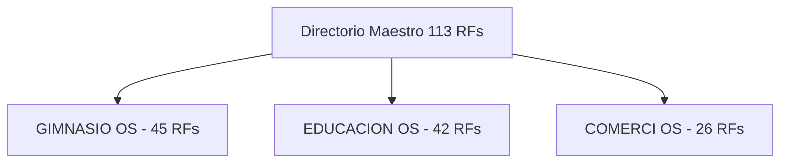

# FASE 0 — Metodología DDS: Directorio Maestro e Inventario de 113 Requerimientos Funcionales

> **Proyecto**: Ecosistema GYMsos (Gimnasios, Educación OS, Comerci OS)
> **Fase**: Fase 0 — Metodología DDS (Desarrollo Dirigido por Sistemas)
> **Etapa**: Etapa 1 — Inventario Consolidado y Enlaces a los 113 RFs
> **Versión**: 3.0 (CONSOLIDADO MAESTRO 113 RFs)
> **Fecha**: 2026-08-01
> **Autor**: Eduardo Sebastian Paipay Vega

---

## 📌 Mapa Maestro de Requerimientos Funcionales por Módulo (113 RFs)

La especificación exhaustiva de los **113 Requerimientos Funcionales (RF)** ha sido estructurada modularmente en 3 documentos de arquitectura funcional para garantizar que no existan truncamientos y que cada RF cuente con sus **22 atributos obligatorios**:

### 📄 Enlaces Directos a la Especificación Completa de cada Vertical:

1. 🏋️ **GIMNASIO OS (`RF-GIM-001` a `RF-GIM-045`)**:
   * Archivo: [01_RF_GIMNASIO_OS_45_RFS.md](file:///c:/botas/IA/Documentación__/FASE_0_DDS/01_RF_GIMNASIO_OS_45_RFS.md)
   * **Contenido**: 45 RFs que abarcan Operación de Sedes, Control de Acceso QR/Biométrico, IoT de Máquinas, Smart Mirror, Churn AI, Battle Pass, Clanes, Digital Twin 3D, Netflix/Spotify Fitness, Marketplace y Tesla Dynamic Pricing.

2. 🎓 **EDUCACION OS (`RF-EDU-001` a `RF-EDU-042`)**:
   * Archivo: [01_RF_EDUCACION_OS_42_RFS.md](file:///c:/botas/IA/Documentación__/FASE_0_DDS/01_RF_EDUCACION_OS_42_RFS.md)
   * **Contenido**: 42 RFs que abarcan LMS Inteligente, Ruta Adaptativa IA, Copiloto Docente, EWS Proactivo, Swarm de Agentes 24/7, Sovereign Identity (Blockchain), Proof of Skill e Invisible UI.

3. 🛒 **COMERCI OS (`RF-COM-001` a `RF-COM-026`)**:
   * Archivo: [01_RF_COMERCI_OS_26_RFS.md](file:///c:/botas/IA/Documentación__/FASE_0_DDS/01_RF_COMERCI_OS_26_RFS.md)
   * **Contenido**: 26 RFs que abarcan Unificación Bancaria/Yape/Plin, Clasificación NLP de Gastos, Predicción de Punto de Quiebra (Días hasta $0), Asistente de Decisión de Compra e Integración ERP.

---

## 📋 Estándar de 22 Atributos por RF Cumplido en los 113 RFs
Cada uno de los 113 RFs contiene:
1. Identificador (`RF-xxx`) | 2. Nombre | 3. Objetivo | 4. Descripción detallada | 5. Problema que resuelve | 6. Actores involucrados | 7. Precondiciones | 8. Postcondiciones | 9. Flujo principal | 10. Flujos alternativos | 11. Flujos de excepción | 12. Reglas de negocio | 13. Validaciones | 14. Datos de entrada | 15. Datos de salida | 16. Permisos necesarios | 17. Prioridad | 18. Dependencias | 19. Casos de Uso (CU) | 20. Seguridad | 21. Riesgos | 22. Criterios de Aceptación, Edge Cases y Observaciones Técnicas.

---

*Fin del Directorio Maestro de 113 Requerimientos Funcionales — Metodología DDS v3.0.*
