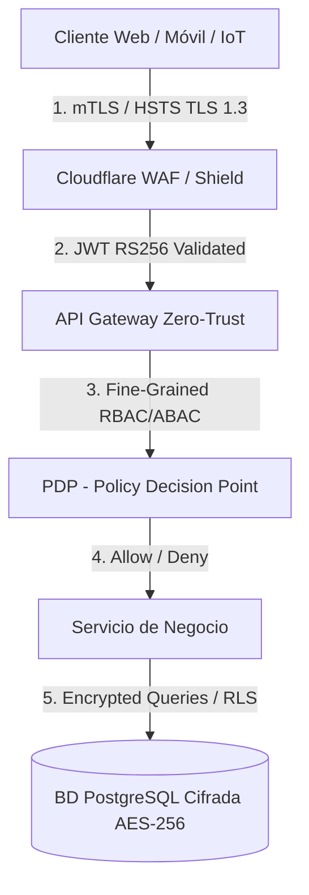
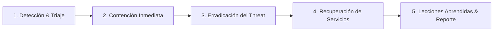

# FASE 0 — Metodología DDS: Etapa 3 — Plan Maestro de Ciberseguridad & Zero Trust

> **Proyecto**: GYMsos Operating System
> **Fase**: Fase 0 — Metodología DDS (Desarrollo Dirigido por Sistemas)
> **Etapa**: Etapa 3 — Plan Maestro de Ciberseguridad
> **Versión**: 1.0
> **Fecha**: 2026-08-01
> **Autor**: Eduardo Sebastian Paipay Vega

---

## 🛡️ 1. Arquitectura Zero Trust ("Nunca Confiar, Siempre Verificar")

El **Plan Maestro de Ciberseguridad GYMsos** establece una postura de seguridad proactiva integrada desde la fase de concepción de software (Security by Design). Ningún dispositivo, usuario, microservicio o conexión IoT dentro o fuera de la red corporativa se considera confiable implícitamente.

---

## ☣️ 2. Modelo de Amenazas (STRIDE) y Análisis de Riesgos

| Categoría STRIDE | Amenaza Identificada | Impacto | Control Preventivo / Detectivo Implementado |
|------------------|----------------------|---------|---------------------------------------------|
| **Spoofing** (Suplantación) | Intercepción de QR dinámico o suplantación de token IoT | ALTO | QR dinámico HMAC rotativo cada 15s; certificados mTLS para hardware IoT. |
| **Tampering** (Manipulación) | Alteración de registros de asistencia o facturación en tránsito | CRÍTICO | Firmas digitales en payloads, TLS 1.3 forzado y checksums inmutables. |
| **Repudiation** (Repudio) | Usuario niega haber eliminado un registro o procesado un cobro | MEDIO | AuditLogs inmutables (Append-only) cifrados con Hash Tree (Merkle Tree). |
| **Information Disclosure** | Exfiltración de datos biométricos de salud de los socios | CRÍTICO | Cifrado a nivel de columna (Column-Level Encryption) con claves envelope. |
| **Denial of Service (DoS)** | Inundación de solicitudes en la API o lectores de acceso IoT | ALTO | WAF Cloudflare + Rate Limiting en API Gateway (100 req/min por IP/Token). |
| **Elevation of Privilege** | Socio intenta acceder a endpoints administrativos de la sede | CRÍTICO | Evaluación continua de políticas ABAC/PBAC en el middleware de API Gateway. |

---

## 🛠️ 3. Clasificación de Controles de Seguridad

### 3.1 Controles Preventivos
* **Autenticación Fuerte de Doble Factor (MFA)**: Obligatorio para todos los roles administrativos (`TENANT_OWNER`, `GYM_ADMIN`, `SUPER_ADMIN`) mediante TOTP (Google Authenticator/Authy) o WebAuthn.
* **Gestión de Secretos con HashiCorp Vault / AWS Secrets Manager**: Cero contraseñas ni claves API en duro en el código fuente o variables de entorno simples.
* **Sanitización de Entradas y Consultas Parametrizadas**: Zod validation schemas y ORM con sentencias preparadas para eliminar inyección SQL y XSS.

### 3.2 Controles Detectivos
* **SIEM & Detección de Anomalías (Elastic SIEM / Wazuh)**: Monitoreo en tiempo real de picos inusuales de acceso o logins desde ubicaciones geográficas imposibles en menos de 2 horas.
* **Escaneo Automatizado de Vulnerabilidades (DevSecOps Pipeline)**:
  * Static Application Security Testing (SAST) con SonarQube y Semgrep.
  * Dependency Vulnerability Scanning con Snyk y Trivy en cada Pull Request.

### 3.3 Controles Correctivos
* **Revocación Instantánea de Sesiones (Token Blacklisting)**: Almacenamiento en Redis Cluster para invalidación inmediata de Refresh Tokens ante detección de compromiso.
* **Aislamiento Automático de Contenedores Compromedidos**: Scripts de orquestación Kubernetes que aíslan pods con comportamiento anómalo.

---

## 🔐 4. Cifrado, Gestión de Credenciales y Sesiones

### 4.1 Cifrado en Tránsito y Reposo
* **En Tránsito**: TLS 1.3 obligatorio en todas las conexiones HTTPS y WSS (WebSockets Secure), desactivando ciphers antiguos (TLS 1.0/1.1 y SSLv3).
* **En Reposo**: Cifrado completo de volúmenes de base de datos con AES-256-GCM. Datos biométricos cifrados individualmente con clave maestra en KMS.

### 4.2 Arquitectura de Sesiones de Usuario
* **Access Tokens (JWT)**: Vida útil de 15 minutos, firmados con algoritmo asimétrico **RS256**.
* **Refresh Tokens**: Vida útil de 7 días, almacenados en cookies estrictas `HttpOnly`, `Secure`, `SameSite=Strict`.

---

## 🚑 5. Continuidad del Negocio (BCP) y Recuperación ante Desastres (DRP)

### 5.1 Métricas Operativas de Recuperación
* **RPO (Recovery Point Objective)**: < 5 minutos (Replicación en tiempo real en zonas de disponibilidad cruzadas).
* **RTO (Recovery Time Objective)**: < 15 minutos (Failover automatizado de infraestructura y Kubernetes multi-cluster).

### 5.2 Estrategia de Copias de Seguridad (Backups)
1. **Backups Diarios Completos**: Copia completa cifrada almacenada en almacenamiento S3 multirregión.
2. **Point-in-Time Recovery (PITR)**: Registros WAL (Write-Ahead Logging) almacenados para permitir la restauración de la base de datos a cualquier segundo específico de los últimos 30 días.
3. **Pruebas Mensuales de Restauración**: Simulacro automatizado de restauración en entorno aislado de Staging para verificar la integridad de los datos.

---

## 🚨 6. Procedimiento de Respuesta ante Incidentes de Seguridad (IRP)

1. **Fase de Contención**: Revocación global de tokens del segmento afectado y cambio de claves maestras.
2. **Notificación Regulatoria**: Notificación a los usuarios y organismos de protección de datos en menos de 72 horas si se confirma exfiltración de PII (Personally Identifiable Information).

---

*Fin de la Etapa 3 — Plan Maestro de Ciberseguridad Metodología DDS v1.0.*
