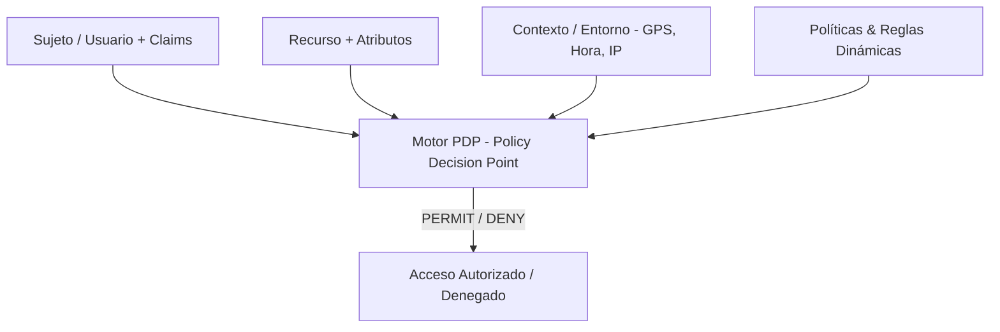
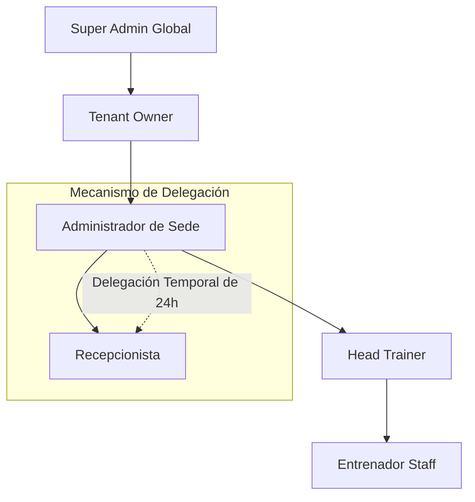

# FASE 0 — Metodología DDS: Etapa 4 — Sistema de Roles Dinámicos & Autorización Híbrida (RBAC + ABAC + PBAC)

> **Proyecto**: GYMsos Operating System
> **Fase**: Fase 0 — Metodología DDS (Desarrollo Dirigido por Sistemas)
> **Etapa**: Etapa 4 — Sistema de Roles Dinámicos
> **Versión**: 1.0
> **Fecha**: 2026-08-01
> **Autor**: Eduardo Sebastian Paipay Vega

---

## 🏛️ 1. Arquitectura de Autorización Híbrida Dinámica

El ecosistema **GYMsos** abandona el modelo rígido de roles estáticos para implementar un motor de autorización tridimensional que combina **RBAC** (Role-Based Access Control), **ABAC** (Attribute-Based Access Control) y **PBAC** (Policy-Based Access Control).



---

## 🧩 2. Componentes del Modelo de Autorización

### 2.1 Elementos del Dominio de Seguridad
1. **Sujeto ($S$)**: Usuario autenticado con atributos (ID, Tenant, Rol Base, Departamento, Antigüedad).
2. **Acción ($A$)**: Operación intentada (`read`, `write`, `delete`, `approve`, `override`, `export`).
3. **Recurso ($R$)**: Entidad destino con atributos (`member_profile`, `financial_report`, `iot_door`, `routine_template`).
4. **Contexto ($C$)**: Variables de entorno dinámicas (Ubicación GPS, Hora del día, IP de origen, Aforo actual, Estado de la membresía).
5. **Políticas ($P$)**: Reglas lógicas booleanas evaluadas dinámicamente en tiempo real:
   $$\text{Decision} = f(S, A, R, C)$$

---

## 📐 3. Especificación del Modelo Dinámico (Pseudocódigo & Reglas)

### 3.1 Estructura de Claims y Permisos Dinámicos

```json
{
  "sub": "usr_99812039",
  "tenant_id": "tnt_gym_elite",
  "base_roles": ["TRAINER", "POS_OPERATOR"],
  "dynamic_capabilities": [
    "workout:prescribe",
    "pos:checkout:limit_500",
    "member:read:assigned_only"
  ],
  "temporary_grants": [
    {
      "capability": "gym_branch:open_door",
      "valid_from": "2026-08-01T06:00:00Z",
      "valid_until": "2026-08-01T12:00:00Z",
      "granted_by": "usr_owner_01",
      "reason": "Cobertura de turno de recepción"
    }
  ]
}
```

---

### 3.2 Evaluación de Políticas ABAC / PBAC en Pseudocódigo

```pseudocode
FUNCION evaluar_acceso(sujeto, accion, recurso, contexto) -> BOOLEANO:
    
    // 1. Verificación de Aislamiento Tenant (Regla Inviolable)
    SI recurso.tenant_id != sujeto.tenant_id Y sujeto.global_role != 'SUPER_ADMIN':
        RETORNAR FALSO // Denegación inmediata por violación de Tenant

    // 2. Evaluador de Permisos Temporales Explicitos (Grant Temporal)
    PARA CADA permiso IN sujeto.temporary_grants:
        SI permiso.capability == accion.id Y 
           contexto.current_time >= permiso.valid_from Y 
           contexto.current_time <= permiso.valid_until:
            REGISTRAR_AUDITORIA("PERMISO_TEMPORAL_CONCEDIDO", sujeto, recurso)
            RETORNAR VERDADERO

    // 3. Evaluación de Política ABAC (Contexto y Atributos de Recurso)
    SI accion.id == "member:view_medical_history":
        SI sujeto.has_role("TRAINER") Y recurso.assigned_trainer_id == sujeto.id:
            RETORNAR VERDADERO
        SINO:
            RETORNAR FALSO // Un entrenador no puede ver historial médico de otros clientes

    // 4. Regla Restrictiva por Contexto Geográfico (Geofencing)
    SI accion.is_sensitive_financial_operation:
        SI NO contexto.ip_address.is_in_subnet(sujeto.allowed_office_ips) O 
           contexto.geo_distance_km(recurso.branch_location) > 0.5:
            REGISTRAR_ALERTA_SEGURIDAD("ACCESO_FINANCIERO_FUERA_DE_RANGO", sujeto)
            RETORNAR FALSO

    // 5. Fallback a RBAC Convencional
    RETORNAR sujeto.has_capability_for_action(accion)
FIN FUNCION
```

---

## 🔀 4. Herencia, Jerarquía y Delegación de Permisos



### 4.1 Reglas de Delegación Temporal
* Un usuario con capacidad de gestión puede delegar temporalmente un subconjunto de sus capacidades a un subordinado.
* Toda delegación requiere una estampa de expiración obligatoria (máximo 72 horas) y justificación registrada en auditoría.
* Revocación automática e instantánea al expirar el temporizador en Redis.

---

## 📈 5. Escalabilidad del Sistema para Cientos de Roles y Miles de Permisos

Conforme el ecosistema GYMsos escale a cientos de sedes corporativas y miles de atributos de permisos, la evaluación de permisos se optimiza mediante:

1. **Compilación de Políticas OPA (Open Policy Agent)**: Las reglas de acceso escritas en lenguaje **Rego** se compilan a **WebAssembly (WASM)** y se ejecutan en el microsegundo directamente en el API Gateway.
2. **Caché Bitmask de Permisos en Redis**: Los miles de permisos posibles se convierten en un vector de bits binarios (*Bitmask*). La comprobación de pertenencia se realiza con operaciones a nivel de bit (`AND` / `OR`) en tiempo $O(1)$.

---

*Fin de la Etapa 4 — Sistema de Roles Dinámicos Metodología DDS v1.0.*
