# 🔴 FASE 1 — Análisis de Problemas Detectados

> **Proyecto**: Sistema de Gestión Educativa Integral  
> **Fase**: 1 — Problemas  
> **Versión**: 1.0  
> **Fecha**: 2026-05-15  
> **Autor**: Eduardo Sebastian Paipay Vega — Orquestación Automática

---

## 📋 Resumen Ejecutivo

El sector educativo actual enfrenta una **crisis de fragmentación tecnológica y desorganización operacional**. Las instituciones educativas (colegios, academias, escuelas) operan con múltiples herramientas desconectadas (LMS básicos, hojas de cálculo, libretasde papel, correo), generando:
- Ineficiencias operacionales graves
- Abandono estudiantil del 40-50% en el segundo mes
- Procesos administrativos manuales que consumen 15-20 horas semanales por coordinador
- **Caos total en gestión de matrícula** (inscripción manual, conflictos de horarios, deudas desorganizadas)
- Pérdida de ingresos por desorganización (~$20K-$50K/año)
- Absoluta falta de personalización con IA para adaptación del aprendizaje

**Datos de impacto**:
- 4.2M muertes anuales por sedentarismo (ligado a desenganche educativo)
- 60-70% de estudiantes usan 3-4 aplicaciones diferentes sin sincronización
- Promedio de **350 horas anuales** en procesos administrativos manuales por institución
- **40-60 horas/mes** dedicadas solo a gestión de matrícula y deudas (sin automatización)
- **Cero automatización** en pagos, firmas digitales, matrícula y exportación de datos
- Errores de inscripción: **8-12% de estudiantes** cada semestre
- Brecha de competencia con plataformas globales (Moodle, Canvas) en personalización IA

---

## 🌳 Árbol de Problemas (Perspectiva Sistémica de Unicornio)

```mermaid
graph TD
    %% PROBLEMA CENTRAL (EL TRONCO)
    A["🔴 PROBLEMA CENTRAL: Inexistencia de una infraestructura unificada operativa, financiera y de datos (Sistema Operativo) en la educación, que destruye la sostenibilidad institucional y fragmenta el desarrollo del talento humano."]

    %% CAUSAS RAÍZ (LAS RAÍCES - NIVEL 1)
    A --> B1["1. Fricción Financiera y Descapitalización (Fintech Bloqueado)"]
    A --> B2["2. Ineficiencia Crítica en la Gestión de Capacidad e Infraestructura"]
    A --> B3["3. Amnesia de Datos e Identidad Estudiantil Aislada (Falta de Interoperabilidad)"]
    A --> B4["4. Experiencia Académica Rígida y Destrucción del Engagement (LTV Drop)"]
    A --> B5["5. Ecosistema Cerrado con Altas Barreras para la Innovación de Terceros"]

    %% SUB-CAUSAS (LAS RAÍCES - NIVEL 2)
    B1 --> C1["Escuelas operan como prestamistas de alto riesgo (morosidad del 8%) sin scoring ni liquidez"]
    B1 --> C2["Procesamiento de pagos fragmentado, manual y desconectado del flujo contable"]
    B1 --> C3["Imposibilidad de ofrecer financiamiento o líneas de crédito a padres"]
    
    B2 --> C4["Inscripción y asignación de horarios manual, generando subutilización de la capacidad instalada"]
    B2 --> C5["Carga administrativa cognitiva pesada (350h/año) que desplaza la gestión estratégica"]
    
    B3 --> C6["Historial médico, cognitivo y psicopedagógico muere cuando el alumno cambia de institución"]
    B3 --> C7["Almacenamiento vulnerable de datos de menores sin arquitectura de cumplimiento (GDPR/FERPA)"]
    B3 --> C8["Cero interoperabilidad entre instituciones educativas en la red"]
    
    B4 --> C9["Modelos educativos estáticos sin agentes de IA para la hiper-personalización del ritmo"]
    B4 --> C10["Interfaces heredadas de los 90s carentes de dinámicas de incentivos y gamificación nativa"]
    B4 --> C11["Desconexión desde el primer mes genera abandono del 40-50%"]
    
    B5 --> C12["Distribución bloqueada: Alto CAC para que editoriales o EdTechs integren soluciones al aula"]
    B5 --> C13["Sin marketplace educativo que monetize la innovación de terceros"]

    %% EFECTOS DIRECTOS E INDIRECTOS (LAS RAMAS)
    C1 --> D1["Crisis crónica de flujo de caja e imposibilidad de expansión institucional"]
    C2 --> D1
    C3 --> D1
    C4 --> D2["Pérdida de eficiencia operativa, conflictos de horarios recurrentes (8-12%) y aulas vacías"]
    C5 --> D2
    
    C6 --> D3["Pérdida de la trazabilidad del talento y necesidad de re-diagnósticos costosos"]
    C7 --> D4["Vulnerabilidad legal crítica y riesgo de multas catastróficas (hasta 4% de ingresos)"]
    C8 --> D3
    
    C9 --> D5["Deserción escolar masiva (40-50% en mes 2) por desconexión y aburrimiento"]
    C10 --> D5
    C11 --> D5
    
    C12 --> D6["Costo de adquisición de clientes EdTech insostenible (CAC = 50%+ de LTV)"]
    C13 --> D6
    
    D1 --> E1["⚠️ EFECTO GLOBAL FINANCIERO: Pérdida sistémica de valor ($500K+/año por institución) y destrucción del Margen Neto"]
    D2 --> E1
    
    D3 --> E2["⚠️ EFECTO GLOBAL ACADÉMICO: Destrucción del Valor de Vida del Estudiante (LTV) y obsolescencia del ecosistema educativo regional"]
    D4 --> E2
    D5 --> E2
    
    D6 --> E3["⚠️ EFECTO GLOBAL DE MERCADO: Monopolio de plataformas legacy, estancamiento de innovación, educación deficiente a escala"]
    
    E1 --> F["🔴 RESULTADO FINAL: Educación insostenible, ineficiente y no resiliente. Brecha de oportunidad para Unicornio."]
    E2 --> F
    E3 --> F
```



### 📋 Desglose de los Pilares Críticos del Árbol

**1. Las Raíces (Causas Estructurales)**

* **El Modelo de "Banco Informal"**: Las escuelas en Latinoamérica no sufren por "falta de un software de cobranza", sufren porque actúan como entidades de crédito para los padres de familia sin tener la tecnología ni el respaldo financiero para mitigar el riesgo de impago.

* **El Efecto Isla de los Datos**: El software educativo tradicional sufre de amnesia. La falta de un protocolo único de identidad estudiantil provoca que el perfil de aprendizaje de un alumno no sea portable, obligando a cada institución a iniciar desde cero.

* **Mercado Monopolizado/Cerrado**: Al no existir un sistema operativo abierto (con APIs públicas), la innovación externa no puede penetrar en los colegios, encareciendo el Costo de Adquisición de Clientes (CAC) para toda la industria EdTech.

**2. El Tronco (Problema Central)**

* El problema real no es la "fragmentación tecnológica de herramientas", sino la inexistencia de un **Sistema Operativo unificado** que entrelace la operación, las finanzas y la identidad de los estudiantes. Al no haber esta capa base, la educación es cara, ineficiente y propensa al abandono.

**3. Las Ramas (Efectos de Impacto Macroeconómico)**

* **Destrucción del LTV (Lifetime Value)**: La deserción del 40-50% en las primeras etapas destruye el retorno de inversión del marketing educativo, obligando a las instituciones a gastar el doble de capital para reponer alumnos.

* **Subutilización de Capacidad Instalada**: Una mala asignación de horarios y matrícula representa una pérdida oculta de hasta el 12% de la capacidad operativa de la infraestructura física de los colegios (aulas vacías, profesores subutilizados).

* **Riesgo Regulatorio de Alta Escala**: En un entorno interconectado (2026), el manejo de datos de menores en hojas de cálculo compartidas expone a las escuelas a la quiebra técnica por demandas de privacidad y multas amparadas bajo GDPR/FERPA.

---

## 🔍 Desglose de Problemáticas Específicas

### **Problemática 1: Falta de Integración IA y Personalización Adaptativa**

**Descripción**: Las plataformas educativas actuales (Moodle, Google Classroom, Canvas) no poseen capacidades de inteligencia artificial para adaptar contenidos, ritmo y dificultad según el estudiante individual. Todos reciben el mismo material al mismo ritmo.

**Impacto cuantificable**:
- 65% de estudiantes se sienten "genéricos" en la plataforma actual
- Tiempo promedio para que un profesor identifique un estudiante en riesgo: **3-4 semanas** (demasiado tarde)
- Tasa de abandono por aburrimiento: **35-40%**

**Usuarios afectados**:
- Estudiantes (falta motivación personalizada)
- Profesores (no ven métricas predictivas)
- Padres (no saben estado real de aprendizaje)
- Institución (pierde ingresos por deserción)

**Causa raíz**: LMS legacy no fue diseñado para IA. Actualizar cuesta $500K+ por institución.

---

### **Problemática 2: Automatización Deficiente de Procesos de Pago**

**Descripción**: Las instituciones usan hojas de cálculo y emails para gestionar pagos de matrículas y cuotas. Proceso:
1. Administrador crea lista en Excel
2. Envía por correo
3. Recibe confirmaciones desorganizadas
4. Ingresa manualmente en sistema contable
5. Reconciliación manual al cierre de mes (15-20 horas)

**Impacto cuantificable**:
- Errores contables mensuales: **5-8% de transacciones**
- Tiempo administrativo: **200 horas/año por institución**
- Costo de retrasos en cobranza: **$50K-$150K/año** (muertes de flujo de caja)
- Estudiantes sin automatización de recibos

**Usuarios afectados**:
- Coordinadores administrativos (carga insoportable)
- Contadores (reconciliación manual)
- Padres (no saben estado de pagos)
- Estudiantes (sin certificados automáticos)

**Causa raíz**: Sistemas legacy no integran pasarelas de pago modernas.

---

### **Problemática 3: Firmas Digitales y Gestión Documental Manual**

**Descripción**: Trámites que requieren firma (inscripción, autorización de salidas, permisos, cambios de horario) son **100% manuales**:
- Padres firman en papel
- Se escanean documentos
- Se archivan sin organización
- Imposible recuperar documentos después

**Impacto cuantificable**:
- Documentos perdidos anualmente: **200-400 por institución**
- Tiempo para localizar un documento: **2-4 horas**
- Riesgo legal por falta de trazabilidad: **CRÍTICO**
- Procesos que podrían ser 1 click son **7-10 pasos manuales**

**Usuarios afectados**:
- Padres (procesos lentos y burocráticos)
- Estudiantes (demoras en trámites)
- Instituciones (riesgo legal)

**Causa raíz**: No existe integración de firma digital + documentación

---

### **Problemática 4: Exportación de Datos Desorganizada e Ineficiente**

**Descripción**: Extractos, calificaciones, asistencia, reportes deben exportarse manualmente desde múltiples sistemas:
- Profesor exporta desde LMS
- Padres solicitan por correo
- Coordinador compila datos de 3-4 sistemas
- Formatos inconsistentes (.xlsx, .pdf, .txt)
- Imposible generar reportes cruzados

**Impacto cuantificable**:
- Solicitudes de exportación/mes: **400-600**
- Tiempo procesamiento por solicitud: **15-30 minutos**
- Carga mensual: **100-150 horas**
- Reportes tardíos: **40% llega fuera de plazo**

**Usuarios afectados**:
- Padres (no acceso oportuno a reportes)
- Profesores (no ven datos consolidados)
- Administración (reportes inconsistentes)

**Causa raíz**: Sistemas fragmentados sin API de integración

---

### **Problemática 5: Bajo Engagement y Gamificación Inexistente**

**Descripción**: LMS tradicionales son **aburridos**. Interfaz de 1990, sin elementos motivacionales:
- Sin badges, puntos, leaderboards
- Sin conexión social entre pares
- Sin retroalimentación instantánea
- Sin micro-aprendizaje gamificado

**Impacto cuantificable**:
- Acceso diario a plataforma: solo **35-40%** (debería ser 80%+)
- Tiempo en plataforma: **8-12 minutos/día** (debería ser 30-40)
- Abandono definitivo: **40-50% mes 2**
- Costo de reposición de estudiante: **$500-$2000**

**Usuarios afectados**:
- Estudiantes (sin motivación sostenida)
- Profesores (baja participación = baja efectividad)
- Institución (pérdida de ingresos)

**Causa raíz**: Plataformas no diseñadas para engagement moderno

---

### **Problemática 6: Inseguridad y Falta de Cumplimiento Regulatorio**

**Descripción**: Datos de menores (calificaciones, asistencia, fotos, información familiar) almacenados sin cumplimiento GDPR/FERPA:
- Servidores no encriptados
- Sin backup automático
- Acceso no controlado
- Sin auditoría de quién accede qué dato

**Impacto cuantificable**:
- Instituciones con incumplimiento GDPR: **95%**
- Multas potenciales: **hasta 4% de ingresos anuales**
- Brechas de seguridad documentadas: **1 por 50 instituciones/año**
- Pérdida de confianza parental tras brechas: **30-40%**

**Usuarios afectados**:
- Menores (privacidad comprometida)
- Padres (confianza perdida)
- Institución (riesgo legal y reputacional)

**Causa raíz**: Cumplimiento regulatorio requiere arquitectura completa

---

### **Problemática 7: Falta de Integración con Sistemas Externos**

**Descripción**: Institución tienen sistemas contables, RRHH, inventario separados. Sin sincronización:
- Calificaciones no se exportan automáticamente
- Pagos no se sincronizan con contabilidad
- Datos de estudiante no sincronizados con RRHH
- Reportes requieren compilación manual

**Impacto cuantificable**:
- Tiempo de sincronización manual: **50-80 horas/mes**
- Errores de sincronización: **3-5% de transacciones**
- Retrasos en decisiones: **1-2 semanas**

**Usuarios afectados**:
- Contadores (datos no sincronizados)
- Directores (reportes atrasados)
- Coordinadores (sobrecarga de trabajo)

**Causa raíz**: LMS no posee API abierta de integración

---

### **Problemática 8: Gestión Deficiente de Matrícula y Planes de Pago (ESPECÍFICA INSTITUCIONES EDUCATIVAS)**

**Descripción**: Las instituciones educativas (colegios, academias, escuelas) **NO poseen sistema centralizado para gestionar matrícula**. Proceso actual:

1. **Matrícula desorganizada**:
   - Padres llaman/visitan presencialmente
   - Coordinador anota en cuaderno o Excel
   - Sin validación de horarios de profesores disponibles
   - Sin verificación de vacantes en secciones
   - Inscripción manual en cada materia

2. **Planes de pago fragmentados**:
   - Institución ofrece múltiples planes (mensual, bimestral, anual)
   - Cada plan tiene cuota diferente
   - Sin sistema para gestionar descuentos por hermanos/becas
   - Padres no saben qué plan les conviene

3. **Gestión de pagos caótica**:
   - Algunos padres pagan completo, otros parcial
   - Coordinador debe rastrear quién pagó qué
   - Sin recordatorios automáticos de vencimiento
   - Sin historial de pagos anteriores
   - Difícil saber quién está en mora

**Impacto cuantificable**:
- Tiempo procesamiento matrícula/estudiante: **30-45 minutos** (manual)
- Errores de inscripción en cursos: **8-12% de estudiantes**
- Conflictos de horarios no detectados: **20-30 casos/semestre**
- Tiempo rastreo de pagos/mes: **40-60 horas**
- Padres con dudas sobre estado de deuda: **25-30% consultas/mes**
- Ingresos no cobrados por desorganización: **$20K-$50K/año**
- Estudiantes retirados sin cierre administrativo: **5-10% anual**

**Usuarios afectados**:
- **Coordinador de Matrícula** (carga insoportable, manual, sin herramientas)
- **Tesorera/Contador** (no sabe estado real de pagos, reconciliación imposible)
- **Padres de Familia** (incertidumbre, falta de transparencia, cambios de horario complicados)
- **Estudiantes** (demoras en inscripción, cambios de sección lentos)
- **Profesores** (no saben estudiantes en sus secciones hasta último momento)
- **Director/Rector** (pérdida de ingresos, no sabe ocupación real de cursos)

**Causa raíz**: 
- No existe sistema integrado de matrícula para instituciones educativas
- Herramientas genéricas (Excel, Sheets) no comprenden lógica educativa
- Incompatibilidad horaria es imposible validar manualmente
- Sistemas legacy educativos NO incluyen este módulo

---

---

## 💎 Pilares de Estrategia Disruptiva (Hacia Unicornio)

Para transformar estos problemas sistémicos en oportunidades de Unicornio, la solución debe construirse sobre **cinco pilares que crean efectos de red exponenciales**:

### **Pilar 1: Fintech Embebido (El Verdadero Motor Financiero)**

**Problema Actual**: Las escuelas operan como "prestamistas informales" sin herramientas financieras sofisticadas, generando insostenibilidad fiscal.

**Solución Disruptiva**: El sistema actúa como **el neobanco integrado de la institución educativa**.

**Características**:
- ✅ **Pasarela de pagos propia** con retención cero (vs 2-4% de comisiones de terceros = $10K-$20K/año ahorrados por institución)
- ✅ **Líneas de crédito automáticas para padres** basadas en IA de riesgo (BNPL educativo):
  - Padre con deuda de $500: sistema ofrece financiamiento inmediato de 6 cuotas a tasa baja (basada en histórico de pagos)
  - Institución recibe $500 inmediato, cobra al padre con intereses bajos
  - Flujo de caja garantizado, riesgo mitigado por IA
- ✅ **Seguros educativos integrados** (accidentes, responsabilidad civil, salud)
- ✅ **Integración con bancos locales** para facilitar trazabilidad y compliance

**Opción Flexible**: Las instituciones pueden elegir entre:
- **Modo Nativo**: Pasarela propia del sistema (márgenes: 0.5-1%)
- **Modo Integrado**: Conectar pasarelas externas (Stripe, PayPal, Mercado Pago) sin fricción

**Impacto Financiero Estimado**:
- Reducción de morosidad: 8% → 2-3%
- Recuperación de flujo de caja: +$300K-$600K/año (institución mediana)
- Nuevos ingresos por financiamiento: +$50K-$150K/año

---

### **Pilar 2: Efectos de Red y Pasaporte Educativo Digital (El Foso Defensivo)**

**Problema Actual**: Si el Colegio A y el Colegio B usan tu sistema, NO se comunican. Son islas. La identidad del estudiante muere en transferencias.

**Solución Disruptiva**: **Pasaporte Digital Soberano del Estudiante** que viaja con el alumno entre instituciones.

**Características**:
- ✅ **Identidad Única Interoperable**: Historial académico, perfil psicopedagógico, perfiles de aprendizaje IA, datos médicos relevantes
- ✅ **Transferencia de 1 Click**: Un alumno que cambia del Colegio A al Colegio B (ambos en la red):
  - Su perfil IA llega precargado
  - Profesor sabe en día 1 sus fortalezas/debilidades
  - Curva de aprendizaje personalizado ya está calibrada
  - Padres mantienen vista única de desempeño
- ✅ **Portabilidad de Datos Segura** (blockchain/zero-knowledge proofs para privacidad)
- ✅ **Cumplimiento GDPR/FERPA** integrado en transferencias

**Efecto de Lock-in**:
- Institución A: 500 estudiantes en la red, todos con perfiles IA preconfigurados
- Institución B: Tiene incentivo masivo para unirse (acceso instantáneo a 500 perfiles)
- Efecto viral: Crecimiento exponencial de adopción

**Impacto de Mercado**:
- CAC (Costo de Adquisición) cae 60-80% gracias al efecto red
- Retención de estudiantes entre ciclos: +15-25% (menos abandono en transiciones)
- Lock-in de instituciones: 3+ años (muy difícil para competencia replicar)

---

### **Pilar 3: Flywheel del Ecosistema (Marketplace de Contenido y Aplicaciones)**

**Problema Actual**: La innovación educativa está fragmentada. Una editorial que quiere vender sus cursos a 10,000 colegios debe:
- Integrar 10,000 sistemas distintos
- CAC = 60%+ del LTV
- 18-24 meses hasta ROI

**Solución Disruptiva**: **Marketplace educativo centralizado** (el "Shopify/App Store" de la educación).

**Características**:
- ✅ **Curador de Contenido**: Editoriales, creadores de IA, profesores suben:
  - Cursos interactivos personalizados
  - Juegos gamificados
  - Plantillas administrativas
  - Evaluaciones adaptativas
  - Guías pedagógicas
- ✅ **Sistema de Comisión**: Plataforma toma 20-30% de cada venta, creador toma 70-80%
- ✅ **Descubrimiento Inteligente**: IA recomienda recursos a profesores según su clase y curricula
- ✅ **Integración Native**: Un clic y el contenido está vivo en el aula

**Modelo de Ingresos Recurrentes**:
- 10,000 instituciones × 5 docentes × $50/año (contenido premium) = **$2.5M/año** en comisiones

**Efecto Volante**:
- Más creadores → Mejor contenido → Más profesores usan → Más creadores entran
- Flujo sin fin de valor generado por terceros SIN costo para la plataforma

---

### **Pilar 4: Product-Led Growth (PLG) y Viralidad B2B2C**

**Problema Actual**: Estrategia de ventas tradicional (sales rep, ciclos largos, CAC = $5K-$10K por institución). No escala.

**Solución Disruptiva**: **El usuario final (padre + profesor) es el motor de distribución**.

**Características**:
- ✅ **Portal de Padres con Viralizacion Integrada**:
  - Padre ve logros gamificados del hijo (badges, trofeos, progreso)
  - Botón "Compartir Logro": Padre publica en LinkedIn/Instagram/WhatsApp con caption:
    ```
    "🎓 Mi hijo Juan acaba de dominar Trigonometría con una personalización IA 
    en su colegio. Potenciado por [Tu Plataforma] en Colegio XYZ"
    ```
  - Branding sutil, pero visible
  - Otros padres ven, preguntan al director, director adopta

- ✅ **Efectos en Cadena**:
  - 1 institución con 300 padres
  - 10% comparten logros/semana = 30 padres
  - 3 padres nuevos investigan plataforma
  - 1 de esos 3 presiona al colegio para cambiar
  - Presión orgánica no cuesta nada

- ✅ **Profesor como Influencer**: Profesor comparte clase innovadora en red de educadores, genera viralidad entre colegas

**Impacto de Distribución**:
- CAC cae 40-60% vs ventas tradicionales
- Referrals generan 25-40% del nuevo volume
- Growth self-sustaining en 18+ meses

---

### **Pilar 5: Arquitectura Agente de IA (Más allá de IA Adaptativa)**

**Problema Actual**: IA adaptativa básica (recomendar ejercicios) ya la hace Duolingo, Khan Academy. Commodity.

**Solución Disruptiva**: **Agentes Autónomos de IA que ejecutan trabajo, no solo reportan**.

**Características**:
- ✅ **Coordinador Académico de IA**:
  - Detecta: 15 alumnos van mal en Física
  - Diseña automáticamente: Plan de regularización personalizado (3 semanas, 5 horas/semana)
  - Agenda: Aula disponible el martes 14:00-15:00
  - Propone: Horario compatible con 14 de los 15 alumnos (IA de scheduling)
  - Notifica: Envía al profesor humano con "¿OK?"
  - Ejecuta: Profesor solo presiona "Confirmar"

- ✅ **Agente de Gestión de Deuda**:
  - Detecta: Familia García con 2 cuotas vencidas
  - Calcula: Capacidad de pago basada en histórico
  - Propone: Plan de 6 cuotas con tasa baja, comenzando en 7 días
  - Comunica: Envía oferta vía SMS + portal padre
  - Negocia: Si padre rechaza, escala a oferta alternativa
  - Resultado: 60-70% de deudas se resuelven sin intervención humana

- ✅ **Agente de Experiencia Estudiantil**:
  - Monitorea: Engagement, asistencia, calificaciones en tiempo real
  - Detecta: Alumno con 3 inasistencias en 2 semanas (early warning)
  - Interviene: Envía recursos motivacionales personalizados + alerta a profesor/padre
  - Previene: Abandono antes de que ocurra

**Impacto Operacional**:
- Coordinador maneja 3x más estudiantes (automatización cognitiva)
- Deuda resuelta 60% más rápido
- Intervenciones preventivas (+25% retención)
- Carga administrativa cae 50%

---

## 👥 Análisis de Actores y Stakeholders

| Actor | Dolor Principal | Impacto | Interés | Conflicto Potencial |
|-------|-----------------|--------|--------|---------------------|
| **Estudiante** | Aburrimiento, contenido no personalizado, sin motivación | Bajo engagement, abandono | Educación personalizada, gamificación | Privacidad de datos |
| **Profesor** | Sobrecarga administrativa, imposible personalizar 1-a-1 | Baja efectividad, burnout | Automatización, datos consolidados | Curva de aprendizaje de nuevo sistema |
| **Padre/Apoderado** | No sabe estado real del hijo, reportes tardíos, confusión sobre pagos | Falta de transparencia, deuda no clara | Visibilidad en tiempo real, claridad de deuda | Privacidad de datos |
| **Coordinador Académico** | 350 horas/año en procesos manuales | Burnout administrativo | Automatización radical | Resistencia al cambio |
| **Coordinador de Matrícula** ⭐ | 40-60h/mes en inscripciones manuales, errores de horarios, caos administrativo | Caos organizacional, pérdida de estudiantes, frustración parental | Automatización matrícula, validación horarios, seguimiento deudas | Resistencia a nuevo sistema |
| **Contador/Tesorera** | Reconciliación manual, errores en pagos, desorden de deudas | Errores contables, retrasos de flujo, ingresos no cobrados | Automatización de pagos, visibilidad deuda real | Integración con sistema contable |
| **Director/Rector** | Competencia con plataformas globales, baja retención, pérdida de ingresos | Pérdida de estudiantes y marca, flujo de caja inestable | Plataforma moderna que retenga, gestión integral | ROI dudoso de tecnología |
| **Institución (Global)** | Incumplimiento GDPR/FERPA, riesgo legal, desorganización operacional | Multas potenciales, pérdida de confianza, ineficiencia | Seguridad, cumplimiento regulatorio, automatización integral | Costo de implementación |

---

## 🖥️ Contexto Tecnológico Actual

### Herramientas Típicas Usadas Hoy

```
Enseñanza              Comunicación        Matrícula & Pagos           Administración
├─ Moodle/Canvas       ├─ WhatsApp         ├─ Libreta manual            ├─ Excel
├─ Google Classroom    ├─ Email            ├─ Carpeta física            ├─ Google Drive
├─ Zoom (clases)       ├─ SMS              ├─ Cuaderno de inscripciones ├─ Google Forms
└─ Diapositivas        └─ Facebook Group   ├─ Hojas de Excel (pagos)    └─ Documentos
                                           ├─ Transferencias bancarias
                                           ├─ Efectivo/Cheques
                                           └─ PayPal (algunos)
```

**Problemas evidentes**:
- 7-8+ sistemas diferentes
- Cero sincronización entre módulos
- Datos duplicados y desorganizados
- Flujos manuales en matrícula y pagos
- Imposible validación de horarios
- Sin inteligencia ni automatización
- Matrícula completamente desconectada del resto

### Limitaciones Clave del Contexto Actual

| Limitación | Impacto | Severidad |
|-----------|--------|----------|
| **Fragmentación de datos** | Imposible obtener vista 360 del estudiante | 🔴 CRÍTICA |
| **Falta de APIs abiertas** | No se puede integrar herramientas nuevas | 🔴 CRÍTICA |
| **Zero analytics & ML** | No hay predicción, adaptación ni personalización | 🔴 CRÍTICA |
| **Inseguridad de datos** | Incumplimiento GDPR/FERPA, riesgo legal | 🔴 CRÍTICA |
| **UX anticuada** | Baja adopción estudiantil, abandono temprano | 🟠 ALTA |
| **Procesos manuales** | Carga administrativa insoportable | 🟠 ALTA |
| **Falta de móvil** | Estudiantes no acceden desde teléfono | 🟠 ALTA |
| **Cero gamificación** | Bajo engagement sostenido | 🟡 MEDIA |

---

## 💰 Justificación de la Necesidad

### ¿Por Qué Es Urgente Resolver Esto?

**1. Crisis de Retención Estudiantil**

El sector educativo **pierde el 40-50% de estudiantes nuevos en el segundo mes**. Para una institución con 1000 estudiantes:
- Estudiantes nuevos año 1: 200
- Estudiantes que se van mes 2: 80-100
- Ingresos perdidos: **$400K-$600K**
- Costo de reposición (marketing): **$150K-$300K**

Una solución que **reduzca abandono a 15%** (mediante IA + gamificación) recupera **$240K-$480K anuales**.

**2. Carga Administrativa Insostenible**

Coordinadores gastan **350 horas/año** en procesos que podrían ser automáticos. Costo:
- Salario coordinador: **$25K-$40K/año**
- Horas dedicadas a procesos manuales: **350 horas = $4.2K-$6.7K/año**
- Oportunidad costo (lo que NO puede hacer): **Estrategia, mentoring, innovación**

Automatización directa: **ahorro de $4.2K-$6.7K + ganancia en estrategia**.

**3. Riesgo Legal y Cumplimiento Regulatorio**

- **GDPR**: Multa 4% de ingresos (máx €20M)
- **FERPA** (USA): Multa $43.5K-$174K por violación
- **Ley de Protección de Menores** (Latinoamérica): Variable pero grave

**Un incidente = costo de implementar seguridad 10x**.

**4. Oportunidad de Mercado**

- Mercado global EdTech: **$320B en 2026**
- Latinoamérica: **$12B en crecimiento**
- Tasa CAGR: **15-20%**
- Ventana: **2026-2027** (máximo impacto)

Instituciones que no modernicen en **12-24 meses** quedarán **obsoletas y no competitivas**.

---

## 📊 Conclusiones del Análisis

| Aspecto | Hallazgo Crítico |
|--------|------------------|
| **Urgencia** | 🔴 CRÍTICA — Deserción acelerada, riesgo legal inminente |
| **Impacto económico** | 🔴 CRÍTICA — Pérdida $500K+/año por institución |
| **Complejidad técnica** | 🟠 ALTA — Requiere IA, seguridad, integración |
| **Oportunidad** | 🟢 EXCELENTE — Mercado maduro y creciente |
| **Viabilidad** | 🟢 ALTA — Tecnología disponible, demanda real |

---

## 📝 Recomendaciones Inmediatas

1. **Desarrollar solución integrada todo-en-uno** que centralice:
   - ✅ Enseñanza + LMS moderno
   - ✅ **Matrícula + Gestión de Secciones** ⭐ (CRÍTICO para instituciones educativas)
   - ✅ Pagos + automatización + planes diferenciados
   - ✅ Firmas digitales + documentos académicos
   - ✅ Comunicación (estudiante-profesor-padre)
   - ✅ Analytics + IA adaptativa
   - ✅ Seguridad GDPR-compliant

2. **Priorizar MVP con**:
   - ✅ Módulo de enseñanza + contenidos personalizados
   - ✅ **Módulo de matrícula** (inscripción, validación horarios, secciones)
   - ✅ **Gestión de planes de pago** (mensual, bimestral, anual, deudas)
   - ✅ Gamificación + engagement
   - ✅ Panel para padres (visibilidad de calificaciones + estado de pagos)
   - ✅ Automatización de pagos recurrentes

3. **Roadmap a 12 meses**:
   - Mes 1-3: MVP lanzable (enseñanza + matrícula básica + pagos)
   - Mes 4-6: Primeras 100 instituciones piloto
   - Mes 7-12: Expansión regional, IA avanzada, integración RRHH profesores

---

*Fase 1 completada: 2026-05-15*  
*Fase 1 **ORIENTADA** a Instituciones Educativas: 2026-05-16*  
**Modificaciones agregadas**:
- ✅ Problemática 8: Gestión Deficiente de Matrícula y Planes de Pago (NUEVA)
- ✅ Árbol de Problemas actualizado con rama B5
- ✅ Tabla de Actores: Agregado "Coordinador de Matrícula"
- ✅ Contexto Tecnológico: Incluidas herramientas de matrícula
- ✅ Resumen Ejecutivo: Énfasis en gestión de matrícula
- ✅ Recomendaciones: Incluido módulo de matrícula como crítico

**Próximo paso**: FASE 2 — Propuesta de Valor Agregado (orientación a instituciones educativas)

---
