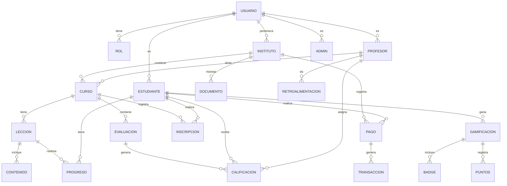

# 🗄️ FASE 5 — Diseño de Base de Datos

> **Proyecto**: Sistema de Gestión Educativa Integral  
> **Fase**: 5 — Arquitectura de Datos  
> **Versión**: 1.0  
> **Fecha**: 2026-05-15  
> **Autor**: Orquestación Automática Claude

---

## 📊 Diagrama Entidad-Relación (Mermaid)



---

## 📋 Diccionario de Datos

### **TABLA: usuarios**

| Campo | Tipo | Restricciones | Descripción |
|-------|------|----------------|------------|
| usuario_id | UUID | PK | Identificador único |
| email | VARCHAR(255) | UNIQUE, NOT NULL | Email del usuario |
| contraseña_hash | VARCHAR(255) | NOT NULL | Contraseña encriptada (bcrypt) |
| nombre_completo | VARCHAR(255) | NOT NULL | Nombre del usuario |
| fecha_creacion | TIMESTAMP | DEFAULT NOW() | Fecha de registro |
| fecha_actualizacion | TIMESTAMP | — | Última actualización |
| activo | BOOLEAN | DEFAULT TRUE | Usuario activo/inactivo |
| rol_id | UUID | FK → roles | Rol del usuario |

---

### **TABLA: estudiantes**

| Campo | Tipo | Restricciones | Descripción |
|-------|------|----------------|------------|
| estudiante_id | UUID | PK | Identificador único |
| usuario_id | UUID | FK → usuarios | Referencia al usuario |
| instituto_id | UUID | FK → institutos | Instituto que asiste |
| grado | INT | NOT NULL | Grado/año (1-12) |
| fecha_nacimiento | DATE | — | Fecha de nacimiento |
| riesgo_abandono | FLOAT | DEFAULT 0 | Score IA (0-100) |
| ultimo_acceso | TIMESTAMP | — | Último login en plataforma |
| puntos_totales | INT | DEFAULT 0 | Puntos gamificación acumulados |

---

### **TABLA: cursos**

| Campo | Tipo | Restricciones | Descripción |
|-------|------|----------------|------------|
| curso_id | UUID | PK | Identificador único |
| instituto_id | UUID | FK → institutos | Instituto que ofrece |
| nombre | VARCHAR(255) | NOT NULL | Ej: "Matemáticas Grado 10" |
| descripcion | TEXT | — | Descripción del curso |
| profesor_id | UUID | FK → profesores | Profesor responsable |
| fecha_inicio | DATE | NOT NULL | Inicio del semestre |
| fecha_fin | DATE | NOT NULL | Fin del semestre |
| contenido_personalizado | BOOLEAN | DEFAULT FALSE | ¿Usa IA adaptativa? |

---

### **TABLA: lecciones**

| Campo | Tipo | Restricciones | Descripción |
|-------|------|----------------|------------|
| leccion_id | UUID | PK | Identificador único |
| curso_id | UUID | FK → cursos | Curso al que pertenece |
| titulo | VARCHAR(255) | NOT NULL | Ej: "Ecuaciones Cuadráticas" |
| orden | INT | — | Orden en el módulo |
| contenido_html | LONGTEXT | — | Contenido interactivo (HTML) |
| video_url | VARCHAR(500) | — | URL video (YouTube/Vimeo) |
| duracion_minutos | INT | — | Tiempo estimado |
| requisitos | TEXT | — | Lecciones previas necesarias |

---

### **TABLA: calificaciones**

| Campo | Tipo | Restricciones | Descripción |
|-------|------|----------------|------------|
| calificacion_id | UUID | PK | Identificador único |
| estudiante_id | UUID | FK → estudiantes | Estudiante calificado |
| leccion_id | UUID | FK → lecciones | Lección evaluada |
| puntuacion | FLOAT | 0-100 | Nota del 0-100 |
| fecha_evaluacion | TIMESTAMP | DEFAULT NOW() | Cuándo se evaluó |
| retroalimentacion | TEXT | — | Comentario del profesor |
| profesor_id | UUID | FK → profesores | Profesor que calificó |

---

### **TABLA: pagos**

| Campo | Tipo | Restricciones | Descripción |
|-------|------|----------------|------------|
| pago_id | UUID | PK | Identificador único |
| estudiante_id | UUID | FK → estudiantes | Quien paga |
| monto | DECIMAL(10,2) | NOT NULL | Monto en USD |
| concepto | VARCHAR(255) | NOT NULL | Ej: "Matrícula Bimestre 2" |
| estado | ENUM | DEFAULT 'pendiente' | pendiente/pagado/fallido |
| fecha_debido | DATE | NOT NULL | Fecha de vencimiento |
| fecha_pago | DATE | — | Cuándo se pagó |
| stripe_transaction_id | VARCHAR(255) | UNIQUE | ID de transacción Stripe |
| recibo_url | VARCHAR(500) | — | PDF del recibo |

---

### **TABLA: gamificacion**

| Campo | Tipo | Restricciones | Descripción |
|-------|------|----------------|------------|
| gamificacion_id | UUID | PK | Identificador único |
| estudiante_id | UUID | FK → estudiantes | Estudiante |
| puntos | INT | DEFAULT 0 | Puntos acumulados |
| badge_id | VARCHAR(100) | — | IDs de badges ganados (JSON) |
| nivel | INT | DEFAULT 1 | Nivel (1-10) |
| fecha_ultima_actividad | TIMESTAMP | — | Cuándo ganó puntos |

---

### **TABLA: documentos**

| Campo | Tipo | Restricciones | Descripción |
|-------|------|----------------|------------|
| documento_id | UUID | PK | Identificador único |
| estudiante_id | UUID | FK → estudiantes | A quién le pertenece |
| tipo | VARCHAR(100) | NOT NULL | Ej: "solicitud_cambio_horario" |
| titulo | VARCHAR(255) | NOT NULL | Descripción del documento |
| archivo_url | VARCHAR(500) | — | Ubicación en S3 |
| firma_digital | VARCHAR(500) | — | ID de firma Docusign |
| estado | ENUM | DEFAULT 'pendiente' | pendiente/firmado/rechazado |
| fecha_creacion | TIMESTAMP | DEFAULT NOW() | Cuándo se creó |
| fecha_firma | TIMESTAMP | — | Cuándo se firmó |

---

## 🎓 NUEVAS TABLAS PARA GESTIÓN EDUCATIVA ⭐

### **TABLA: profesores** (Nueva)

| Campo | Tipo | Restricciones | Descripción |
|-------|------|----------------|------------|
| profesor_id | UUID | PK | Identificador único |
| usuario_id | UUID | FK → usuarios | Referencia al usuario |
| instituto_id | UUID | FK → institutos | Instituto donde trabaja |
| especialidad | VARCHAR(255) | NOT NULL | Ej: "Matemáticas", "Inglés" |
| titulo_academico | VARCHAR(255) | — | Ej: "Licenciado", "Magister" |
| numero_licencia | VARCHAR(100) | UNIQUE | Número de licencia profesional |
| fecha_contratacion | DATE | NOT NULL | Cuándo se contrató |
| tipo_contrato | ENUM | NOT NULL | tiempo_completo/medio_tiempo/honorarios |
| estado_contrato | ENUM | DEFAULT 'activo' | activo/suspendido/finalizado |
| salario_base | DECIMAL(10,2) | — | Salario mensual |
| fecha_evaluacion_anual | DATE | — | Próxima evaluación |

---

### **TABLA: secciones** (Nueva)

| Campo | Tipo | Restricciones | Descripción |
|-------|------|----------------|------------|
| seccion_id | UUID | PK | Identificador único |
| instituto_id | UUID | FK → institutos | Instituto |
| curso_id | UUID | FK → cursos | Curso base (Ej: "Matemáticas") |
| numero_seccion | VARCHAR(10) | NOT NULL | Ej: "10-A", "10-B" |
| profesor_id | UUID | FK → profesores | Profesor a cargo |
| capacidad_maxima | INT | DEFAULT 40 | Máximo de estudiantes |
| grado | INT | NOT NULL | Grado/año (1-12) |
| estado | ENUM | DEFAULT 'activa' | activa/cerrada/cancelada |
| fecha_inicio | DATE | NOT NULL | Inicio del período |
| fecha_fin | DATE | NOT NULL | Fin del período |

---

### **TABLA: horarios** (Nueva)

| Campo | Tipo | Restricciones | Descripción |
|-------|------|----------------|------------|
| horario_id | UUID | PK | Identificador único |
| seccion_id | UUID | FK → secciones | Sección que tiene este horario |
| dia_semana | INT | NOT NULL | 1=Lunes, 7=Domingo |
| hora_inicio | TIME | NOT NULL | Ej: 08:00 |
| hora_fin | TIME | NOT NULL | Ej: 09:00 |
| salon_id | VARCHAR(50) | — | Ej: "Sala 101", "Aula 5" |
| profesor_id | UUID | FK → profesores | Profesor en este horario |

---

### **TABLA: planes_matricula** (Nueva - CRÍTICA)

| Campo | Tipo | Restricciones | Descripción |
|-------|------|----------------|------------|
| plan_matricula_id | UUID | PK | Identificador único |
| instituto_id | UUID | FK → institutos | Instituto que ofrece |
| nombre | VARCHAR(100) | NOT NULL | Ej: "Plan Mensual", "Plan Anual" |
| descripcion | TEXT | — | Descripción del plan |
| cuota_base | DECIMAL(10,2) | NOT NULL | Monto de la cuota |
| numero_cuotas | INT | NOT NULL | Cantidad de pagos (1=anual, 12=mensual) |
| interes_mora | DECIMAL(5,2) | DEFAULT 0 | % de interés por mora |
| activo | BOOLEAN | DEFAULT TRUE | Plan disponible |
| fecha_inicio_vigencia | DATE | NOT NULL | Cuándo comienza a ofrecerse |
| fecha_fin_vigencia | DATE | — | Cuándo deja de ofrecerse |

---

### **TABLA: inscritos_plan** (Nueva)

| Campo | Tipo | Restricciones | Descripción |
|-------|------|----------------|------------|
| inscrito_plan_id | UUID | PK | Identificador único |
| estudiante_id | UUID | FK → estudiantes | Estudiante inscrito |
| plan_matricula_id | UUID | FK → planes_matricula | Plan elegido |
| fecha_inicio | DATE | NOT NULL | Cuándo se activa |
| fecha_fin | DATE | — | Cuándo finaliza |
| monto_total | DECIMAL(10,2) | NOT NULL | Total a pagar |
| cuota_pagada_hasta | INT | DEFAULT 0 | Cuota pagada (1-12) |
| deuda_acumulada | DECIMAL(10,2) | DEFAULT 0 | Deuda total |
| estado | ENUM | DEFAULT 'activa' | activa/cancelada/suspendida |

---

### **TABLA: becas_descuentos** (Nueva)

| Campo | Tipo | Restricciones | Descripción |
|-------|------|----------------|------------|
| beca_id | UUID | PK | Identificador único |
| instituto_id | UUID | FK → institutos | Instituto otorga |
| estudiante_id | UUID | FK → estudiantes | Estudiante beneficiado |
| tipo_beca | ENUM | NOT NULL | academica/economica/deportiva/hermano |
| porcentaje_descuento | DECIMAL(5,2) | NOT NULL | 0-100 % de descuento |
| monto_descuento | DECIMAL(10,2) | — | Monto fijo (alternativa) |
| fecha_inicio | DATE | NOT NULL | Cuándo comienza |
| fecha_fin | DATE | — | Cuándo termina |
| motivo | TEXT | — | Razón de la beca |
| requiere_renovacion | BOOLEAN | DEFAULT TRUE | Necesita aprobación anual |

---

### **TABLA: autorizaciones** (Nueva)

| Campo | Tipo | Restricciones | Descripción |
|-------|------|----------------|------------|
| autorizacion_id | UUID | PK | Identificador único |
| estudiante_id | UUID | FK → estudiantes | Estudiante |
| tipo_autorizacion | ENUM | NOT NULL | salida_institucion/actividad_extraescolar/uso_foto/cambio_horario |
| descripcion | TEXT | — | Detalles de lo solicitado |
| estado | ENUM | DEFAULT 'pendiente' | pendiente/aprobada/rechazada |
| fecha_solicitud | TIMESTAMP | DEFAULT NOW() | Cuándo se pidió |
| fecha_resolucion | TIMESTAMP | — | Cuándo se resolvió |
| padre_id | UUID | FK → usuarios | Padre que autoriza |
| documento_firma | VARCHAR(500) | — | URL de firma digital |
| motivo_rechazo | TEXT | — | Si fue rechazado |

---

### **TABLA: certificados_academicos** (Nueva)

| Campo | Tipo | Restricciones | Descripción |
|-------|------|----------------|------------|
| certificado_id | UUID | PK | Identificador único |
| estudiante_id | UUID | FK → estudiantes | Estudiante |
| instituto_id | UUID | FK → institutos | Instituto que emite |
| tipo | ENUM | NOT NULL | conducta/notas/egreso/asistencia |
| numero_folio | VARCHAR(50) | UNIQUE | Folio único (ej: CEL-2026-0001) |
| fecha_emision | DATE | DEFAULT CURRENT_DATE | Cuándo se emitió |
| periodo | VARCHAR(50) | NOT NULL | Ej: "2026-I", "2026 Completo" |
| contenido_json | JSONB | — | Datos del certificado (notas, etc) |
| pdf_url | VARCHAR(500) | — | URL del PDF generado |
| qr_validacion | VARCHAR(500) | — | QR para verificación en línea |
| estado | ENUM | DEFAULT 'generado' | generado/entregado/duplicado_solicitado |
| fecha_entrega | DATE | — | Cuándo se entregó |

---

### **TABLA: evaluaciones_docentes** (Nueva)

| Campo | Tipo | Restricciones | Descripción |
|-------|------|----------------|------------|
| evaluacion_id | UUID | PK | Identificador único |
| profesor_id | UUID | FK → profesores | Profesor evaluado |
| estudiante_id | UUID | FK → estudiantes | Estudiante que evalúa |
| puntuacion | FLOAT | NOT NULL, 1-5 | Calificación 1-5 estrellas |
| claridad_explicacion | INT | 1-5 | ¿Explica claramente? |
| atencion_estudiantes | INT | 1-5 | ¿Atiende dudas? |
| justicia_calificaciones | INT | 1-5 | ¿Califica justo? |
| comentario_libre | TEXT | — | Feedback abierto (anónimo) |
| anonimo | BOOLEAN | DEFAULT TRUE | Evaluación anónima |
| fecha_evaluacion | DATE | NOT NULL | Cuándo se evaluó |
| periodo | VARCHAR(50) | NOT NULL | Ej: "2026-I" |

---

## 💎 NUEVAS TABLAS PARA PILARES DISRUPTIVOS (Unicornio)

### **TABLA: transacciones_fintech** 💳

| Campo | Tipo | Restricciones | Descripción |
|-------|------|----------------|------------|
| transaccion_id | UUID | PK | Identificador único |
| padre_id | UUID | FK → usuarios | Padre que paga |
| instituto_id | UUID | FK → institutos | Instituto receptor |
| monto | DECIMAL(10,2) | NOT NULL | Cantidad pagada |
| divisa | VARCHAR(3) | DEFAULT 'USD' | Moneda (USD, CLP, MXN, etc) |
| tipo_pago | ENUM | NOT NULL | stripe/paypal/mercadopago/nativo |
| metodo_pago | ENUM | NOT NULL | tarjeta/transferencia/billetera |
| comision_plataforma | DECIMAL(10,2) | — | Comisión retenida (0.5-1%) |
| concepto | VARCHAR(255) | NOT NULL | Matrícula, cuota, extra, etc |
| estado | ENUM | DEFAULT 'pendiente' | pendiente/completada/fallida/revertida |
| fecha_transaccion | TIMESTAMP | DEFAULT NOW() | Cuándo se ejecutó |
| referencia_externa | VARCHAR(255) | — | ID de Stripe/PayPal |
| nota_rechazo | TEXT | — | Si falló, por qué |

---

### **TABLA: creditos_bnpl** 💰

| Campo | Tipo | Restricciones | Descripción |
|-------|------|----------------|------------|
| credito_id | UUID | PK | Identificador único |
| padre_id | UUID | FK → usuarios | Deudor |
| instituto_id | UUID | FK → institutos | Acreedor |
| monto_original | DECIMAL(10,2) | NOT NULL | Deuda inicial |
| monto_actual | DECIMAL(10,2) | — | Saldo pendiente |
| tasa_interes | FLOAT | DEFAULT 0.08 | Tasa anual (8% default bajo) |
| num_cuotas | INT | NOT NULL | Cuántas cuotas (3-12) |
| cuotas_pagadas | INT | DEFAULT 0 | Cuántas completadas |
| fecha_emision | DATE | NOT NULL | Cuándo se otorgó |
| fecha_vencimiento | DATE | NOT NULL | Cuándo vence |
| score_riesgo | FLOAT | — | IA score (0-100) del padre |
| estado | ENUM | DEFAULT 'activo' | activo/pagado_completo/en_mora/default |

---

### **TABLA: pasaportes_digitales** 📚

| Campo | Tipo | Restricciones | Descripción |
|-------|------|----------------|------------|
| pasaporte_id | UUID | PK | Identificador único |
| estudiante_id | UUID | FK → estudiantes | Propietario |
| hash_blockchain | VARCHAR(255) | UNIQUE | Hash blockchain (verificación) |
| perfil_academico_json | JSONB | NOT NULL | Calificaciones, cursos completados, nivel IA |
| perfil_psicopedagogico_json | JSONB | — | Estilo aprendizaje, motivadores, velocidad |
| perfil_medico_json | JSONB | — | Alergias, condiciones (si autorizado) |
| privacidad_settings | JSONB | DEFAULT '{}' | Qué campos son privados |
| fecha_creacion | TIMESTAMP | DEFAULT NOW() | Cuándo se generó |
| fecha_transferencia | TIMESTAMP | — | Última transferencia entre instituciones |
| institucion_actual_id | UUID | FK → institutos | Instituto actual |
| institucion_anterior_id | UUID | FK → institutos | Instituto anterior (si aplica) |

---

### **TABLA: transferencias_interinstitucionales** 🔄

| Campo | Tipo | Restricciones | Descripción |
|-------|------|----------------|------------|
| transferencia_id | UUID | PK | Identificador único |
| pasaporte_id | UUID | FK → pasaportes_digitales | Pasaporte transferido |
| institucion_origen_id | UUID | FK → institutos | Instituto de salida |
| institucion_destino_id | UUID | FK → institutos | Instituto de entrada |
| fecha_solicitud | TIMESTAMP | NOT NULL | Cuándo se solicitó |
| fecha_aprobacion | TIMESTAMP | — | Cuándo se aprobó |
| estado | ENUM | NOT NULL | solicitada/aprobada/rechazada/completada |
| autorizacion_padre | BOOLEAN | DEFAULT FALSE | ¿Padre autorizó? |
| campos_compartidos | VARCHAR[] | — | Array de campos del pasaporte compartidos |

---

### **TABLA: marketplace_productos** 🛒

| Campo | Tipo | Restricciones | Descripción |
|-------|------|----------------|------------|
| producto_id | UUID | PK | Identificador único |
| creator_id | UUID | FK → usuarios | Creador/editorial |
| nombre | VARCHAR(255) | NOT NULL | Ej: "Curso Álgebra Avanzado" |
| descripcion | TEXT | — | Descripción larga |
| tipo | ENUM | NOT NULL | curso/juego/evaluacion/plantilla/etc |
| precio | DECIMAL(10,2) | NOT NULL | Precio mensual/anual |
| modelo_precios | ENUM | NOT NULL | mensual/anual/licencia_perpetua |
| comision_plataforma | FLOAT | DEFAULT 0.25 | 25% plataforma, 75% creator |
| rating_promedio | FLOAT | — | Calificación 1-5 (desde reviews) |
| num_reviews | INT | DEFAULT 0 | Cantidad de reviews |
| num_descargas | INT | DEFAULT 0 | Descargas totales |
| estado | ENUM | DEFAULT 'borrador' | borrador/publicado/archivado |
| fecha_publicacion | TIMESTAMP | — | Cuándo se lanzó |
| metadata_json | JSONB | — | Datos adicionales (tags, requisitos, etc) |

---

### **TABLA: marketplace_ventas** 📊

| Campo | Tipo | Restricciones | Descripción |
|-------|------|----------------|------------|
| venta_id | UUID | PK | Identificador único |
| producto_id | UUID | FK → marketplace_productos | Producto vendido |
| institucion_id | UUID | FK → institutos | Compradora |
| creator_id | UUID | FK → usuarios | Creador (desnormalizado para analytics) |
| precio_unitario | DECIMAL(10,2) | NOT NULL | Precio en momento de venta |
| cantidad_licencias | INT | DEFAULT 1 | Cuántas licencias compradas |
| monto_total | DECIMAL(10,2) | NOT NULL | Monto total |
| comision_plataforma | DECIMAL(10,2) | NOT NULL | Comisión retenida (25%) |
| ingreso_creator | DECIMAL(10,2) | NOT NULL | Pago al creator (75%) |
| fecha_compra | TIMESTAMP | DEFAULT NOW() | Cuándo se compró |
| fecha_expiracion | TIMESTAMP | — | Cuándo caduca licencia (si aplica) |
| renovacion_automatica | BOOLEAN | DEFAULT TRUE | ¿Se renueva automáticamente? |
| estado | ENUM | DEFAULT 'activo' | activo/expirado/cancelado |

---

### **TABLA: agentes_ia_ejecuciones** 🤖

| Campo | Tipo | Restricciones | Descripción |
|-------|------|----------------|------------|
| ejecucion_id | UUID | PK | Identificador único |
| agente_tipo | ENUM | NOT NULL | coordinador_academico/gestor_deuda/monitor_experiencia |
| institucion_id | UUID | FK → institutos | Institución donde ejecuta |
| descripcion_accion | TEXT | NOT NULL | Qué hizo el agente |
| objetivos_detectados_json | JSONB | NOT NULL | Qué problemas detectó |
| propuesta_json | JSONB | NOT NULL | Qué propone el agente |
| responsable_aprobacion_id | UUID | FK → usuarios | Profesor/director que aprueba |
| aprobado | BOOLEAN | DEFAULT FALSE | ¿Fue aprobado por humano? |
| fecha_propuesta | TIMESTAMP | DEFAULT NOW() | Cuándo el agente hizo propuesta |
| fecha_aprobacion | TIMESTAMP | — | Cuándo se aprobó |
| fecha_ejecucion | TIMESTAMP | — | Cuándo se ejecutó (si aprobada) |
| resultado_json | JSONB | — | Resultado de ejecución |
| impacto_metricas_json | JSONB | — | Métricas post-ejecución |

---

### **TABLA: agentes_ia_logs** 📋

| Campo | Tipo | Restricciones | Descripción |
|-------|------|----------------|------------|
| log_id | UUID | PK | Identificador único |
| ejecucion_id | UUID | FK → agentes_ia_ejecuciones | Ejecución relacionada |
| agente_tipo | ENUM | NOT NULL | Tipo de agente |
| accion | VARCHAR(255) | NOT NULL | Ej: "detect_risk", "propose_intervention" |
| datos_entrada_json | JSONB | — | Input del agente |
| datos_salida_json | JSONB | — | Output del agente |
| modelo_ia_version | VARCHAR(50) | — | Ej: "gpt-4", "claude-3.5" |
| tiempo_procesamiento_ms | INT | — | Millisegundos de ejecución |
| costo_tokens | DECIMAL(10,4) | — | Costo en tokens (para billing) |
| error_flag | BOOLEAN | DEFAULT FALSE | ¿Hubo error? |
| error_mensaje | TEXT | — | Mensaje de error si aplica |
| fecha_log | TIMESTAMP | DEFAULT NOW() | Cuándo se registró |
| auditoria_usuario_id | UUID | — | Usuario que puede auditar esto |

---

### **TABLA: compartidos_logros** 🎉

| Campo | Tipo | Restricciones | Descripción |
|-------|------|----------------|------------|
| compartido_id | UUID | PK | Identificador único |
| estudiante_id | UUID | FK → estudiantes | Logro de quién |
| padre_id | UUID | FK → usuarios | Quién compartió |
| logro_tipo | VARCHAR(255) | NOT NULL | Ej: "modulo_completado", "badge_desbloqueado" |
| logro_data_json | JSONB | NOT NULL | Datos del logro (nombre, materia, puntaje, etc) |
| plataforma_destino | ENUM | NOT NULL | whatsapp/instagram/linkedin/twitter |
| mensaje_customizado | TEXT | — | Mensaje personalizado que escribió padre |
| url_compartido | VARCHAR(500) | — | Link al logro (para tracking) |
| fecha_compartido | TIMESTAMP | DEFAULT NOW() | Cuándo se compartió |
| alcance_estimado | INT | — | Estimación de personas que ven |
| clicks_generados | INT | DEFAULT 0 | Cuántos clicks al link |
| conversiones | INT | DEFAULT 0 | Cuántos visitantes = leads |
| institucion_origen_id | UUID | FK → institutos | Instituto del niño |

---

### **TABLA: referrals_conversiones** 🔗

| Campo | Tipo | Restricciones | Descripción |
|-------|------|----------------|------------|
| referral_id | UUID | PK | Identificador único |
| padre_referidor_id | UUID | FK → usuarios | Quién refiere |
| padre_referido_id | UUID | FK → usuarios | Quién fue referido |
| institucion_refiero_id | UUID | FK → institutos | Instituto de referidor |
| institucion_referida_id | UUID | FK → institutos | Instituto referido |
| fuente_referral | ENUM | NOT NULL | compartido_logro/word_of_mouth/evento |
| descuento_ofrecido | FLOAT | DEFAULT 0.10 | Descuento (10% default) |
| fecha_referral | TIMESTAMP | DEFAULT NOW() | Cuándo se refirió |
| fecha_conversion | TIMESTAMP | — | Cuándo se convirtió en cliente |
| convertido | BOOLEAN | DEFAULT FALSE | ¿Se convirtió? |
| comision_referidor | DECIMAL(10,2) | — | Dinero ganado referidor (si convierte) |
| estado | ENUM | DEFAULT 'pendiente' | pendiente/convertida/expirada/cancelada |

---

## 🔐 Esquema SQL (DDL)

```sql
-- Crear extensiones necesarias
CREATE EXTENSION IF NOT EXISTS "uuid-ossp";
CREATE EXTENSION IF NOT EXISTS "pgcrypto";

-- Tabla: usuarios
CREATE TABLE usuarios (
    usuario_id UUID PRIMARY KEY DEFAULT gen_random_uuid(),
    email VARCHAR(255) UNIQUE NOT NULL,
    contraseña_hash VARCHAR(255) NOT NULL,
    nombre_completo VARCHAR(255) NOT NULL,
    fecha_creacion TIMESTAMP DEFAULT CURRENT_TIMESTAMP,
    fecha_actualizacion TIMESTAMP,
    activo BOOLEAN DEFAULT TRUE,
    rol_id UUID NOT NULL,
    CONSTRAINT fk_rol FOREIGN KEY(rol_id) REFERENCES roles(rol_id)
);

-- Tabla: estudiantes
CREATE TABLE estudiantes (
    estudiante_id UUID PRIMARY KEY DEFAULT gen_random_uuid(),
    usuario_id UUID NOT NULL,
    instituto_id UUID NOT NULL,
    grado INT NOT NULL,
    fecha_nacimiento DATE,
    riesgo_abandono FLOAT DEFAULT 0,
    ultimo_acceso TIMESTAMP,
    puntos_totales INT DEFAULT 0,
    CONSTRAINT fk_usuario FOREIGN KEY(usuario_id) REFERENCES usuarios(usuario_id),
    CONSTRAINT fk_instituto FOREIGN KEY(instituto_id) REFERENCES institutos(instituto_id),
    CONSTRAINT chk_grado CHECK(grado >= 1 AND grado <= 12)
);

-- Tabla: cursos
CREATE TABLE cursos (
    curso_id UUID PRIMARY KEY DEFAULT gen_random_uuid(),
    instituto_id UUID NOT NULL,
    nombre VARCHAR(255) NOT NULL,
    descripcion TEXT,
    profesor_id UUID NOT NULL,
    fecha_inicio DATE NOT NULL,
    fecha_fin DATE NOT NULL,
    contenido_personalizado BOOLEAN DEFAULT FALSE,
    CONSTRAINT fk_instituto FOREIGN KEY(instituto_id) REFERENCES institutos(instituto_id),
    CONSTRAINT fk_profesor FOREIGN KEY(profesor_id) REFERENCES usuarios(usuario_id)
);

-- Tabla: calificaciones
CREATE TABLE calificaciones (
    calificacion_id UUID PRIMARY KEY DEFAULT gen_random_uuid(),
    estudiante_id UUID NOT NULL,
    leccion_id UUID NOT NULL,
    puntuacion FLOAT NOT NULL,
    fecha_evaluacion TIMESTAMP DEFAULT CURRENT_TIMESTAMP,
    retroalimentacion TEXT,
    profesor_id UUID NOT NULL,
    CONSTRAINT fk_estudiante FOREIGN KEY(estudiante_id) REFERENCES estudiantes(estudiante_id),
    CONSTRAINT fk_leccion FOREIGN KEY(leccion_id) REFERENCES lecciones(leccion_id),
    CONSTRAINT fk_profesor FOREIGN KEY(profesor_id) REFERENCES usuarios(usuario_id),
    CONSTRAINT chk_puntuacion CHECK(puntuacion >= 0 AND puntuacion <= 100)
);

-- Tabla: pagos (CRÍTICA para finanzas)
CREATE TABLE pagos (
    pago_id UUID PRIMARY KEY DEFAULT gen_random_uuid(),
    estudiante_id UUID NOT NULL,
    monto DECIMAL(10,2) NOT NULL,
    concepto VARCHAR(255) NOT NULL,
    estado VARCHAR(50) DEFAULT 'pendiente', -- pendiente/pagado/fallido
    fecha_debido DATE NOT NULL,
    fecha_pago DATE,
    stripe_transaction_id VARCHAR(255) UNIQUE,
    recibo_url VARCHAR(500),
    fecha_creacion TIMESTAMP DEFAULT CURRENT_TIMESTAMP,
    CONSTRAINT fk_estudiante FOREIGN KEY(estudiante_id) REFERENCES estudiantes(estudiante_id),
    CONSTRAINT chk_monto CHECK(monto > 0)
);

-- Crear índices para optimización
CREATE INDEX idx_estudiantes_instituto ON estudiantes(instituto_id);
CREATE INDEX idx_estudiantes_riesgo ON estudiantes(riesgo_abandono) WHERE riesgo_abandono > 70;
CREATE INDEX idx_calificaciones_estudiante ON calificaciones(estudiante_id);
CREATE INDEX idx_pagos_estado ON pagos(estado);
CREATE INDEX idx_pagos_fecha ON pagos(fecha_pago);
CREATE INDEX idx_usuarios_email ON usuarios(email);
```

---

## 🔒 Política de Seguridad de Datos

### Encriptación

- **En tránsito**: TLS 1.3 (HTTPS)
- **En reposo**: AES-256 (columnas sensibles)
- **Contraseñas**: bcrypt + salt

### Acceso a Datos

- **Row-Level Security (RLS)**: Cada usuario ve solo sus datos
- **Role-Based Access (RBAC)**: Admin > Profesor > Estudiante > Padre
- **Auditoría**: Todas las operaciones registradas en `audit_log`

---

## 📊 Migraciones y Versionado

```sql
-- migration_001_init_schema.sql (2026-05-01)
-- Crear tablas base

-- migration_002_add_gamification.sql (2026-05-10)
-- Agregar tabla gamificacion

-- migration_003_add_audit_log.sql (2026-05-15)
CREATE TABLE audit_log (
    log_id UUID PRIMARY KEY DEFAULT gen_random_uuid(),
    tabla VARCHAR(100),
    operacion VARCHAR(50), -- INSERT/UPDATE/DELETE
    usuario_id UUID,
    datos_antiguos JSONB,
    datos_nuevos JSONB,
    fecha TIMESTAMP DEFAULT CURRENT_TIMESTAMP
);
```

---

## 🤖 Procedimientos Almacenados Clave

```sql
-- Calcular riesgo de abandono (ejecuta cada 24h)
CREATE OR REPLACE FUNCTION calcular_riesgo_abandono()
RETURNS TABLE(estudiante_id UUID, riesgo_score FLOAT) AS $$
BEGIN
  RETURN QUERY
  SELECT 
    e.estudiante_id,
    -- Algoritmo IA simplificado
    LEAST(100, GREATEST(0,
      (EXTRACT(DAY FROM NOW() - e.ultimo_acceso) * 5) +  -- 5 puntos x día sin acceso
      ((100 - AVG(c.puntuacion)) * 0.5) +                -- Calificaciones bajas
      (CASE WHEN COUNT(p.pago_id) > 1 THEN 20 ELSE 0 END) -- Pagos atrasados
    )) AS risk_score
  FROM estudiantes e
  LEFT JOIN calificaciones c ON e.estudiante_id = c.estudiante_id
  LEFT JOIN pagos p ON e.estudiante_id = p.estudiante_id AND p.estado = 'pendiente'
  GROUP BY e.estudiante_id;
END;
$$ LANGUAGE plpgsql;

-- Generar reporte de calificaciones
CREATE OR REPLACE FUNCTION generar_reporte_calificaciones(
  p_grado INT,
  p_periodo VARCHAR(50)
)
RETURNS TABLE(estudiante_id UUID, nombre VARCHAR, promedio FLOAT) AS $$
BEGIN
  RETURN QUERY
  SELECT 
    e.estudiante_id,
    u.nombre_completo,
    AVG(c.puntuacion) as promedio
  FROM estudiantes e
  JOIN usuarios u ON e.usuario_id = u.usuario_id
  LEFT JOIN calificaciones c ON e.estudiante_id = c.estudiante_id
  WHERE e.grado = p_grado
  GROUP BY e.estudiante_id, u.nombre_completo
  ORDER BY promedio DESC;
END;
$$ LANGUAGE plpgsql;
```

---

## 🔄 Política de Respaldos

```bash
# Backup diario (automático con AWS)
- Tipo: Full backup cada 24h
- Retención: 30 días
- Ubicación: S3 Multi-region
- RPO (Recovery Point Objective): 1 hora
- RTO (Recovery Time Objective): 15 minutos

# Backup semanal (offline)
- Copia de datos para análisis histórico
- Almacenado en S3 Glacier (long-term)
```

---

## 📈 Crecimiento Esperado de Datos

```
Año 1 (2026):
- Usuarios: 50K (estudiantes + profesores)
- Registros: ~5M
- Tamaño DB: ~20 GB

Año 2 (2027):
- Usuarios: 500K
- Registros: ~50M
- Tamaño DB: ~200 GB

Año 5 (2030):
- Usuarios: 10M+
- Registros: ~1B+
- Tamaño DB: ~4 TB

Escalado con sharding horizontal en PostgreSQL
```

---

## ✅ Conclusión de Fase 5 — Arquitectura de Datos Unicornio

### Tablas Base (Educación)
- ✅ usuarios, estudiantes, cursos, lecciones, calificaciones, pagos, gamificacion, documentos
- ✅ profesores, secciones, horarios, planes_matricula, inscritos_plan, becas_descuentos, autorizaciones, certificados_academicos, evaluaciones_docentes

### Tablas Disruptivas (Unicornio) - NUEVAS
- ✅ **Fintech**: transacciones_fintech, creditos_bnpl (soporte para BNPL y pagos nativo/externo)
- ✅ **Pasaporte Digital**: pasaportes_digitales, transferencias_interinstitucionales (identidad blockchain portátil)
- ✅ **Marketplace**: marketplace_productos, marketplace_ventas (monetización de creadores, 25-30% comisión)
- ✅ **Agentes IA**: agentes_ia_ejecuciones, agentes_ia_logs (auditoría de automatización cognitiva)
- ✅ **Product-Led Growth**: compartidos_logros, referrals_conversiones (viralidad B2B2C)

### Total: 19 tablas educación + 10 tablas disruptivas = 29 tablas principales

Base de datos diseñada para:
- ✅ Crecimiento de 10K+ instituciones (10M+ usuarios en 2030)
- ✅ Compliance GDPR (RLS, encriptación AES-256)
- ✅ Blockchain-ready (hash para pasaportes)
- ✅ Fintech-ready (scoring, BNPL, transacciones)
- ✅ Marketplace-ready (comisiones, analytics creadores)
- ✅ IA-ready (logs de ejecución agentes, auditoría)
- ✅ Viralidad-ready (tracking de shares, conversiones)
- ✅ Performance (índices estratégicos, sharding horizontal)
- ✅ Seguridad (auditoría completa, encriptación)

### Escalado Esperado
- 2026: 5M registros, 20GB
- 2027: 50M registros, 200GB
- 2030: 1B+ registros, 4TB (sharding horizontal)

---

*Fase 5 completada (base): 2026-05-15*  
*Fase 5 **ORIENTADA** a Instituciones Educativas: 2026-05-16*  
*Fase 5 **ACTUALIZADA A UNICORNIO**: 2026-05-16*

**Cambios realizados en FASE 5**:
- ✅ 10 nuevas tablas para 5 pilares disruptivos
- ✅ Fintech Embebido: transacciones_fintech (0.5-1% comisión), creditos_bnpl (tasa 8%)
- ✅ Pasaporte Digital: pasaportes_digitales (blockchain), transferencias_interinstitucionales (1-click)
- ✅ Marketplace: marketplace_productos (25-30% comisión), marketplace_ventas (analytics)
- ✅ Agentes IA: agentes_ia_ejecuciones (human-in-the-loop), agentes_ia_logs (auditoría)
- ✅ Product-Led Growth: compartidos_logros (tracking viralidad), referrals_conversiones (CAC reduction)

**Próximo paso**: FASE 6 (UX/UI - Nuevos portales y wireframes para pilares disruptivos)

---
