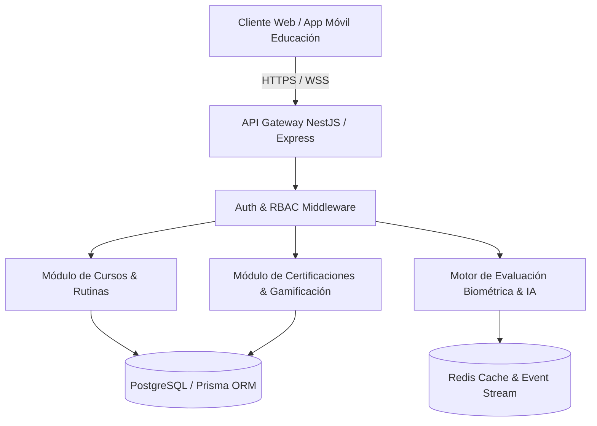

# FASE 7 — Especificación Técnica de Aplicación y Contratos API (Módulo Educación)

> **Proyecto**: GYMsos Operating System — Vertical Educación
> **Fase**: FASE 7 (Aplicación y Despliegue)
> **Versión**: 1.0
> **Fecha**: 2026-08-01
> **Autor**: Eduardo Sebastian Paipay Vega

---

## 🏛️ 1. Arquitectura del Sistema de Educación

La vertical de **Educación** de GYMsos funciona como la plataforma inteligente de aprendizaje continuo en ciencias del deporte, nutrición biométrica y gestión de centros deportivos. Se conecta directamente con la base de datos central de GYMsos y expone una arquitectura backend orientada a servicios RESTful y WebSockets para telemetría en tiempo real.



---

## 📡 2. Contrato OpenAPI 3.0 / Endpoints RESTful

### 2.1 Gestión de Cursos y Contenidos Inteligentes

#### `GET /api/v1/education/courses`
Obtiene la lista de cursos disponibles con filtros por nivel, especialidad y estado de recomendación por IA.

* **Headers**: `Authorization: Bearer <JWT_TOKEN>`
* **Query Params**:
  * `page` (integer, opcional, default: 1)
  * `limit` (integer, opcional, default: 20)
  * `category` (string, opcional, e.g., "biomecanica", "nutricion")
* **Response 200 OK**:
```json
{
  "success": true,
  "data": {
    "courses": [
      {
        "id": "crs_98741029",
        "title": "Certificación Avanzada en Biomecánica del Movimiento",
        "slug": "biomecanica-avanzada",
        "level": "ADVANCED",
        "durationHours": 40,
        "modulesCount": 8,
        "aiRecommendationScore": 0.96,
        "instructor": {
          "id": "usr_4412",
          "name": "Dr. Carlos Mendoza"
        }
      }
    ],
    "pagination": {
      "total": 45,
      "page": 1,
      "totalPages": 3
    }
  }
}
```

---

#### `POST /api/v1/education/enrollments`
Inscribe a un usuario en un curso o programa educativo.

* **Headers**: `Authorization: Bearer <JWT_TOKEN>`
* **Request Body**:
```json
{
  "courseId": "crs_98741029",
  "paymentMethodToken": "tok_stripe_881239",
  "corporateCode": "UNSCH_WELLNESS_2026"
}
```
* **Response 201 Created**:
```json
{
  "success": true,
  "data": {
    "enrollmentId": "enr_11029384",
    "status": "ACTIVE",
    "startDate": "2026-08-01T22:42:00Z",
    "accessUrl": "/app/education/learn/crs_98741029"
  }
}
```

---

### 2.2 Telemetría de Progreso y Evaluación Biométrica

#### `POST /api/v1/education/progress/telemetry`
Envía datos en tiempo real del progreso del estudiante y respuestas de micro-evaluaciones.

* **Headers**: `Authorization: Bearer <JWT_TOKEN>`
* **Request Body**:
```json
{
  "courseId": "crs_98741029",
  "moduleId": "mod_01",
  "lessonId": "les_04",
  "timeSpentSeconds": 1250,
  "completedScore": 95.0,
  "biometricFocusIndex": 0.88
}
```

---

## 🔒 3. Validación de Esquemas con Zod (Backend Spec)

```typescript
import { z } from 'zod';

export const CourseEnrollmentSchema = z.object({
  courseId: z.string().min(5, 'ID de curso inválido'),
  paymentMethodToken: z.string().optional(),
  corporateCode: z.string().max(30).optional()
});

export type CourseEnrollmentDTO = z.infer<typeof CourseEnrollmentSchema>;
```

---

## 🛠️ 4. Estrategia de Pruebas y Despliegue

1. **Pruebas Unitarias & Integración**: Cobertura > 85% utilizando Jest / Supertest.
2. **Contenedores**: Imagen Docker multi-stage optimizada (`node:20-alpine`).
3. **Monitoreo**: Métricas exponenciales recopiladas mediante Prometheus y Grafana.

---

*FASE 7 Especificación Técnica v1.0 — Vertical Educación GYMsos.*
