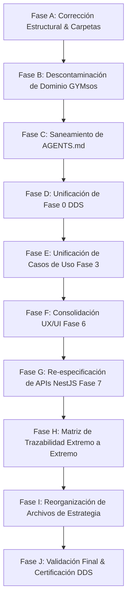

# 🗺️ PLAN MAESTRO DE SANEAMIENTO E IMPLEMENTACIÓN DDS
## Sistema Operativo Educativo — EDUCACION OS / Democra School

> **Rol del Emisor**: Auditor Senior DDS (Arquitectura Empresarial & Gobierno Documental)  
> **Ámbito de Aplicación**: Exclusivo para la carpeta `/EDUCACION` (Fuente Única de Verdad)  
> **Estado Operativo**: FASE DE PLANIFICACIÓN PREVIA (0 Modificaciones destructivas ejecutadas)  
> **Fecha**: 2026-08-01  
> **Versión**: 1.0 (Plan de Saneamiento en 10 Fases A - J)

---

## 📌 RESUMEN DEL PLAN DE SANEAMIENTO

El presente documento establece la secuencia metódica en **10 Fases Secuenciales (Fases A a J)** para eliminar las inconsistencias, descontaminar el vocabulario heredado de otros dominios (`GYMsos/Fitness`) y normalizar la estructura DDS del proyecto **EDUCACION OS**, preparando el repositorio para la futura generación de código e implementación.

---

## 📋 DETALLE DE LAS FASES DEL PLAN DE SANEAMIENTO

---

### 🔹 FASE A: CORRECCIÓN ESTRUCTURAL DE NOMENCLATURA DE CARPETAS
* **Objetivo**: Estandarizar la nomenclatura de todas las carpetas de Fase de `00` a `07` utilizando la convención `FASE_X_NOMBRE`.
* **Archivos y Carpetas Afectables**:
  * `EDUCACION/Fase 1 (Problemas)/` ➔ `EDUCACION/FASE_1_PROBLEMAS/`
  * `EDUCACION/Fase 2 (Valor Agregado)/` ➔ `EDUCACION/FASE_2_VALOR_AGREGADO/`
  * `EDUCACION/Fase 3 (RF -- CU)/` ➔ `EDUCACION/FASE_3_REQUISITOS_Y_CASOS_USO/`
  * `EDUCACION/Fase 4 (Plan de Negocio)/` ➔ `EDUCACION/FASE_4_PLAN_DE_NEGOCIO/`
  * `EDUCACION/Fase 5 (BD)/` ➔ `EDUCACION/FASE_5_BASE_DE_DATOS/`
  * `EDUCACION/Fase 7 (Aplicación)/` ➔ `EDUCACION/FASE_7_APLICACION_Y_APIS/`
* **Dependencias**: Ninguna.
* **Tiempo Estimado**: 30 minutos.
* **Riesgos**: Rotura temporal de hipervínculos markdown relativos (mitigado mediante actualización de links en la misma fase).
* **Prioridad**: 🔴 CRÍTICA (Bloqueante para ordenamiento).
* **Resultado Esperado**: Directorios de Fase organizados bajo un estándar único y predecible.

---

### 🔹 FASE B: DESCONTAMINACIÓN DE DOMINIO (PURGA DE RESIDUOS GYMSOS/FITNESS)
* **Objetivo**: Eliminar todo texto, encabezado o mención de la startup de gimnasios `GYMsos` en los documentos de ciberseguridad, roles y APIs.
* **Archivos Afectados**:
  * `EDUCACION/FASE_0_DDS/03_PLAN_MAESTRO_CIBERSEGURIDAD.md`
  * `EDUCACION/FASE_0_DDS/04_SISTEMA_ROLES_DINAMICOS.md`
  * `EDUCACION/FASE_7_APLICACION_Y_APIS/FASE_7_APLICACION_Y_APIS.md`
* **Dependencias**: Fase A.
* **Tiempo Estimado**: 45 minutos.
* **Riesgos**: Ninguno.
* **Prioridad**: 🔴 CRÍTICA (Garantiza el aislamiento estricto).
* **Resultado Esperado**: 0 ocurrencias de los términos `GYMsos`, `gimnasio`, `fitness` o `biomecánica` en la documentación técnica de Educación.

---

### 🔹 FASE C: SANEAMIENTO Y ALINEACIÓN DE AGENTS.MD
* **Objetivo**: Reescribir el manifiesto y guía técnica `EDUCACION/AGENTS.md` enfocándolo 100% en la visión de **Democra School / EDUCACION OS**.
* **Archivos Afectados**: `EDUCACION/AGENTS.md`.
* **Dependencias**: Fase B.
* **Tiempo Estimado**: 45 minutos.
* **Riesgos**: Ninguno.
* **Prioridad**: 🔴 CRÍTICA (Alinea la inteligencia de los agentes de IA al dominio educativo).
* **Resultado Esperado**: `AGENTS.md` declarando la visión de la infraestructura educativa inteligente.

---

### 🔹 FASE D: UNIFICACIÓN Y CONSOLIDACIÓN DE LA FASE 0 DDS
* **Objetivo**: Dejar `01_REQUERIMIENTOS_FUNCIONALES_EXHAUSTIVOS.md` como Fuente Única de Verdad para los 42 RFs y remover el archivo resumen superfluo `01_RF_EDUCACION_OS_42_RFS.md`.
* **Archivos Afectados**:
  * `EDUCACION/FASE_0_DDS/01_REQUERIMIENTOS_FUNCIONALES_EXHAUSTIVOS.md`
  * `EDUCACION/FASE_0_DDS/01_RF_EDUCACION_OS_42_RFS.md` (Eliminar o integrar).
* **Dependencias**: Fase C.
* **Tiempo Estimado**: 30 minutos.
* **Riesgos**: Ninguno.
* **Prioridad**: 🟠 ALTA.
* **Resultado Esperado**: Fase 0 unificada sin documentos redundantes.

---

### 🔹 FASE E: UNIFICACIÓN DE CASOS DE USO EN FASE 3
* **Objetivo**: Consolidar `FASE_3_REQUISITOS_CASOS_USO_EXPANDED.md` como la especificación oficial de Casos de Uso para los 42 RFs, removiendo la versión antigua `FASE_3_REQUISITOS_CASOS_USO.md`.
* **Archivos Afectados**: `EDUCACION/FASE_3_REQUISITOS_Y_CASOS_USO/`.
* **Dependencias**: Fase D.
* **Tiempo Estimado**: 30 minutos.
* **Riesgos**: Ninguno.
* **Prioridad**: 🟠 ALTA.
* **Resultado Esperado**: 1 solo archivo maestro de Casos de Uso perfectamente trazable con la Fase 0.

---

### 🔹 FASE F: CONSOLIDACIÓN Y FUSIÓN DE LA FASE 6 (UX / UI)
* **Objetivo**: Fusionar el contenido de `Fase 6 (UX - IX)` y `Fase 6 (UX -- UI)` dentro de una sola carpeta normalizada `EDUCACION/FASE_6_DISENO_UX_UI/`.
* **Archivos Afectados**:
  * `EDUCACION/Fase 6 (UX - IX)/FASE_6_DISEÑO_UX_UI.md`
  * `EDUCACION/Fase 6 (UX -- UI)/FASE_6_UX_UI.md`
* **Dependencias**: Fase E.
* **Tiempo Estimado**: 1 hora.
* **Riesgos**: Pérdida de secciones de wireframes al fusionar (mitigado mediante auditar el contenido fusionado antes de eliminar la carpeta redundante).
* **Prioridad**: 🔴 CRÍTICA.
* **Resultado Esperado**: Carpeta `FASE_6_DISENO_UX_UI/` conteniendo la especificación completa de Wireframes y UI Components para los 42 RFs.

---

### 🔹 FASE G: RE-ESPECIFICACIÓN TÉCNICA DE APIS NESTJS (FASE 7)
* **Objetivo**: Reescribir los contratos OpenAPI 3.0 y los DTOs Zod en `FASE_7_APLICACION_Y_APIS.md` para implementar los endpoints de los 42 RFs educativos (Aprendizaje Adaptativo, EWS Deserción, Parent Live Stream, DTL Digital Twin, etc.).
* **Archivos Afectados**: `EDUCACION/FASE_7_APLICACION_Y_APIS/FASE_7_APLICACION_Y_APIS.md`.
* **Dependencias**: Fase F.
* **Tiempo Estimado**: 2 horas.
* **Riesgos**: Ninguno.
* **Prioridad**: 🔴 CRÍTICA (Indispensable para el desarrollo backend).
* **Resultado Esperado**: Especificación de API OpenAPI 3.0 completa y 100% trazable con la Fase 0 y Fase 3.

---

### 🔹 FASE H: CONSTRUCCIÓN DE LA MATRIZ DE TRAZABILIDAD EXTREMO A EXTREMO
* **Objetivo**: Actualizar `05_DOCUMENTACION_STAKEHOLDERS_MATRIZ.md` conectando de forma ininterrumpida:
  $$\text{RF} \longrightarrow \text{CU} \longrightarrow \text{Actor} \longrightarrow \text{Tabla BD} \longrightarrow \text{Endpoint API} \longrightarrow \text{Pantalla UX}$$
* **Archivos Afectados**: `EDUCACION/FASE_0_DDS/05_DOCUMENTACION_STAKEHOLDERS_MATRIZ.md`.
* **Dependencias**: Fase G.
* **Tiempo Estimado**: 1 hora.
* **Riesgos**: Ninguno.
* **Prioridad**: 🟠 ALTA.
* **Resultado Esperado**: Trazabilidad completa sin eslabones perdidos.

---

### 🔹 FASE I: REORGANIZACIÓN DE ARCHIVOS DE ESTRATEGIA Y GOBERNANZA
* **Objetivo**: Mover los 7 archivos sueltos de la raíz de `EDUCACION/` hacia una nueva carpeta estructurada `EDUCACION/00_GOBERNANZA_Y_ESTRATEGIA/`.
* **Archivos Afectados**:
  * `ANALISIS_ESTRUCTURA_Y_ORIENTACION.md`
  * `CONSOLIDACION_1_2.md`
  * `DATA_MOAT_STRATEGY.md`
  * `INVESTOR_NARRATIVE_5MIN.md`
  * `PITCH_DECK_16_SLIDES.md`
  * `ROADMAP_12_MESES_DETALLADO.md`
  * `VISION_UNICORN_EDUCACION.md`
* **Dependencias**: Fase H.
* **Tiempo Estimado**: 30 minutos.
* **Riesgos**: Rotura de links en markdown (mitigado actualizando hipervínculos).
* **Prioridad**: 🟡 MEDIA.
* **Resultado Esperado**: Raíz del proyecto `/EDUCACION` limpia y profesional.

---

### 🔹 FASE J: VALIDACIÓN FINAL Y CERTIFICACIÓN DDS
* **Objetivo**: Ejecutar una segunda iteración completa de la auditoría de 15 pasadas para certificar que el repositorio cuenta con 0 hallazgos Críticos o Altos.
* **Archivos Afectados**: Todo el repositorio `/EDUCACION`.
* **Dependencias**: Fases A a I.
* **Tiempo Estimado**: 1 hora.
* **Riesgos**: Ninguno.
* **Prioridad**: 🔴 CRÍTICA.
* **Resultado Esperado**: Emisión del Certificado de Repositorio Saneado y Aprobado para Desarrollo DDS.

---

## ⏱️ CRONOGRAMA Y TIEMPO TOTAL ESTIMADO

| Fase | Descripción Corta | Tiempo Estimado | Prioridad |
|------|-------------------|-----------------|-----------|
| **Fase A** | Normalización de carpetas de Fase | 30 min | 🔴 Crítica |
| **Fase B** | Descontaminación de contexto GYMsos | 45 min | 🔴 Crítica |
| **Fase C** | Saneamiento de `AGENTS.md` | 45 min | 🔴 Crítica |
| **Fase D** | Unificación Fase 0 DDS | 30 min | 🟠 Alta |
| **Fase E** | Unificación Fase 3 CUs | 30 min | 🟠 Alta |
| **Fase F** | Consolidación Fase 6 UX/UI | 60 min | 🔴 Crítica |
| **Fase G** | Re-especificación APIs NestJS (Fase 7) | 120 min | 🔴 Crítica |
| **Fase H** | Matriz Trazabilidad End-to-End | 60 min | 🟠 Alta |
| **Fase I** | Reorganización Archivos Estrategia | 30 min | 🟡 Media |
| **Fase J** | Validación Final & Cierre de Loop | 60 min | 🔴 Crítica |
| **TOTAL** | **SANEAMIENTO COMPLETO REPOSITORIO** | **8.5 HORAS** | 🚀 **PROCESO LISTO PARA EJECUCIÓN** |

---

*Plan Maestro de Saneamiento DDS elaborado por el Auditor Senior DDS. Repositorio EDUCACION OS / Democra School.*
