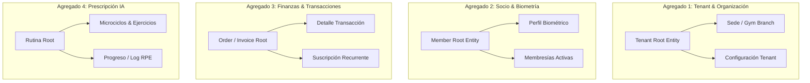

# FASE 0 — Metodología DDS: Etapa 2 — Diseño Conceptual de la Base de Datos (Pseudocódigo & DDD)

> **Proyecto**: GYMsos Operating System
> **Fase**: Fase 0 — Metodología DDS (Desarrollo Dirigido por Sistemas)
> **Etapa**: Etapa 2 — Diseño Conceptual de Base de Datos
> **Versión**: 1.0
> **Fecha**: 2026-08-01
> **Autor**: Eduardo Sebastian Paipay Vega

---

## 🏛️ 1. Enfoque Arquitectural y Convenciones de Nombres

El modelo conceptual de datos de **GYMsos** se estructura bajo los principios de **Domain-Driven Design (DDD)** y arquitectura **Multi-Tenant Aislada**. 

### 1.1 Convenciones de Nombres Globales
* **Tablas y Entidades**: Formato `snake_case` en plural (ej. `tenants`, `gym_memberships`, `audit_logs`).
* **Llaves Primarias (PK)**: `id` de tipo `UUIDv4` o `ULID` (Universally Unique Lexicographically Sortable Identifier) para garantizar ordenamiento temporal sin contención de secuencias en clusters.
* **Llaves Foráneas (FK)**: `<entidad_singular>_id` (ej. `tenant_id`, `member_id`).
* **Campos Booleanos**: Prefijo `is_` o `has_` (ej. `is_active`, `has_verified_email`).
* **Estampas de Tiempo**: Sufijo `_at` en formato UTC ISO-8601 (ej. `created_at`, `updated_at`, `deleted_at`).

---

## 🧩 2. Identificación de Agregados del Dominio (DDD)



---

## 📐 3. Especificación Conceptual en Pseudocódigo

### 3.1 Agregado 1: Tenant & Organización (Tablas Maestras)

```pseudocode
ENTIDAD_MAESTRA Tenant (
  IDENTIFICADOR id: ULID PRIMARIA,
  CAMPO legal_name: TEXTO NO NULO,
  CAMPO trade_name: TEXTO NO NULO,
  CAMPO tax_id: TEXTO UNICO NO NULO,
  CAMPO subdomain: TEXTO UNICO NO NULO,
  CAMPO status: ENUM('PENDING', 'ACTIVE', 'SUSPENDED') DEFAULT 'PENDING',
  
  OBJETO_DE_VALOR BrandingSettings (
    primary_color: HSL_STRING,
    logo_url: URL_STRING,
    custom_css: TEXTO
  ),
  
  AUDITORIA created_at, updated_at, deleted_at, version: ENTERO
)

ENTIDAD GymBranch (
  IDENTIFICADOR id: ULID PRIMARIA,
  RELACION tenant_id: REFERENCES Tenant(id) OBLIGATORIO,
  CAMPO branch_name: TEXTO NO NULO,
  CAMPO max_capacity: ENTERO NO NULO,
  CAMPO current_occupancy: ENTERO DEFAULT 0,

  OBJETO_DE_VALOR Address (
    street: TEXTO, city: TEXTO, country: TEXTO, geo_point: GEOMETRIA_POINT
  ),

  SOFT_DELETE deleted_at,
  VERSIONADO version
)
```

---

### 3.2 Agregado 2: Usuarios, Socios y Biometría

```pseudocode
ENTIDAD User (
  IDENTIFICADOR id: ULID PRIMARIA,
  RELACION tenant_id: REFERENCES Tenant(id) OBLIGATORIO,
  CAMPO email: TEXTO UNICO NO NULO,
  CAMPO password_hash: TEXTO NO NULO,
  CAMPO global_role: ENUM('SUPER_ADMIN', 'TENANT_OWNER', 'GYM_ADMIN', 'TRAINER', 'MEMBER'),
  
  AUDITORIA created_at, updated_at, deleted_at
)

ENTIDAD MemberProfile (
  IDENTIFICADOR id: ULID PRIMARIA,
  RELACION user_id: REFERENCES User(id) UNICO OBLIGATORIO,
  RELACION tenant_id: REFERENCES Tenant(id) OBLIGATORIO,
  CAMPO emergency_contact_phone: TEXTO,

  OBJETO_DE_VALOR BiometricMetrics (
    height_cm: DECIMAL,
    weight_kg: DECIMAL,
    body_fat_percentage: DECIMAL,
    medical_contraindications: ARRAY[TEXTO]
  ),

  CAMPO churn_risk_score: DECIMAL(3,2) DEFAULT 0.00,
  CAMPO churn_risk_level: ENUM('LOW', 'MEDIUM', 'HIGH') DEFAULT 'LOW',

  HISTORIAL biometric_history_log: LISTA_DE(BiometricMetricsSnapshots),
  AUDITORIA created_at, updated_at
)
```

---

### 3.3 Agregado 3: Membresías, Pagos y Transacciones

```pseudocode
ENTIDAD_TRANSACCIONAL MembershipSubscription (
  IDENTIFICADOR id: ULID PRIMARIA,
  RELACION tenant_id: REFERENCES Tenant(id) OBLIGATORIO,
  RELACION member_id: REFERENCES User(id) OBLIGATORIO,
  RELACION plan_id: REFERENCES PlanCatalog(id) OBLIGATORIO,

  CAMPO start_date: FECHA NO NULO,
  CAMPO end_date: FECHA NO NULO,
  CAMPO status: ENUM('ACTIVE', 'PAUSED', 'PAST_DUE', 'CANCELLED') DEFAULT 'ACTIVE',
  CAMPO auto_renew: BOOLEANO DEFAULT VERDADERO,

  HISTORIAL freeze_periods: LISTA_DE(
    start_freeze: FECHA, end_freeze: FECHA, reason: TEXTO
  ),

  AUDITORIA created_at, updated_at, deleted_at
)

ENTIDAD_TRANSACCIONAL Invoice (
  IDENTIFICADOR id: ULID PRIMARIA,
  RELACION tenant_id: REFERENCES Tenant(id) OBLIGATORIO,
  RELACION member_id: REFERENCES User(id) OBLIGATORIO,
  CAMPO invoice_number: TEXTO UNICO NO NULO,
  CAMPO total_amount: DECIMAL(10,2) NO NULO,
  CAMPO tax_amount: DECIMAL(10,2) NO NULO,
  CAMPO payment_gateway_ref: TEXTO,
  CAMPO status: ENUM('DRAFT', 'PAID', 'REFUNDED', 'FAILED') DEFAULT 'DRAFT',

  AUDITORIA created_at, updated_at
)
```

---

### 3.4 Agregado 4: Registro de Auditoría y Trazabilidad Global

```pseudocode
ENTIDAD_AUDITORIA AuditLog (
  IDENTIFICADOR id: ULID PRIMARIA,
  RELACION tenant_id: REFERENCES Tenant(id) OPCIONAL,
  RELACION actor_id: REFERENCES User(id) OBLIGATORIO,
  CAMPO action: TEXTO NO NULO, // ej: "MEMBERSHIP_PAUSED", "ROLE_UPDATED"
  CAMPO resource_name: TEXTO NO NULO,
  CAMPO resource_id: TEXTO NO NULO,
  
  OBJETO_DE_VALOR Changeset (
    before_state: JSON,
    after_state: JSON
  ),

  OBJETO_DE_VALOR NetworkContext (
    ip_address: INET,
    user_agent: TEXTO,
    geo_location: TEXTO
  ),

  CAMPO timestamp: TIMESTAMP_UTC NO NULO DEFAULT AHORA()
)
```

---

## 🔒 4. Estrategia de Soft Delete, Versionado e Índices

### 4.1 Estrategia de Soft Delete (Borrado Lógico)
* Todas las tablas maestras y transaccionales contienen la columna `deleted_at (TIMESTAMP_UTC, NULLABLE)`.
* Una fila con `deleted_at IS NULL` se considera activa.
* Las consultas globales aplican automáticamente la vista indexada o filtro RLS: `WHERE deleted_at IS NULL`.

### 4.2 Versionado Optimista (Concurrency Control)
* Se añade la columna `version INT DEFAULT 1` a los agregados críticos (`Tenant`, `MembershipSubscription`).
* Cada modificación incrementa `version = version + 1`. Si la versión en lectura difiere al guardar, se rechaza con conflicto concurrente (HTTP 409).

### 4.3 Estrategia de Índices
1. **Índices de Aislamiento Multi-Tenant (B-Tree Compuesto)**:
   * `CREATE INDEX idx_<tabla>_tenant_id ON <tabla>(tenant_id, id);`
2. **Índices de Búsqueda Biométrica y Acceso Rápido**:
   * `CREATE INDEX idx_access_qr ON access_tokens(token_hash) WHERE is_active = TRUE;`
3. **Índices de Churn y Analytics**:
   * `CREATE INDEX idx_members_churn ON member_profiles(tenant_id, churn_risk_level) WHERE deleted_at IS NULL;`

---

## 💡 5. Justificación de Decisiones de Diseño

1. **Uso de ULID en lugar de Auto-Incrementales**: Previene ataques de enumeración directa de IDs en la API y permite inserciones distribuidas de alto rendimiento sin colisiones.
2. **Despliegue de AuditLog Inmutable**: Los registros de auditoría no permiten `UPDATE` ni `DELETE` (Append-Only), garantizando trazabilidad legal.
3. **Persistencia de Objetos de Valor como JSONB / Structs**: Flexibilidad para métricas cambiantes de evaluación biométrica sin necesidad de alterar el esquema relacional en cada nueva versión de la IA.

---

*Fin de la Etapa 2 — Diseño Conceptual de Base de Datos Metodología DDS v1.0.*
